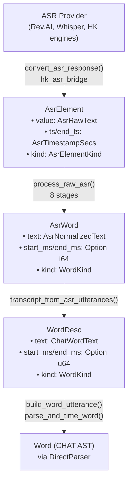
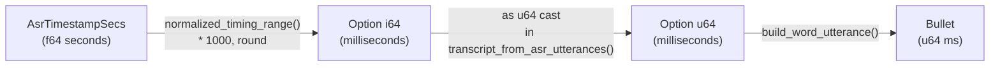
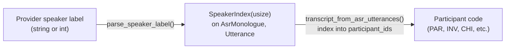
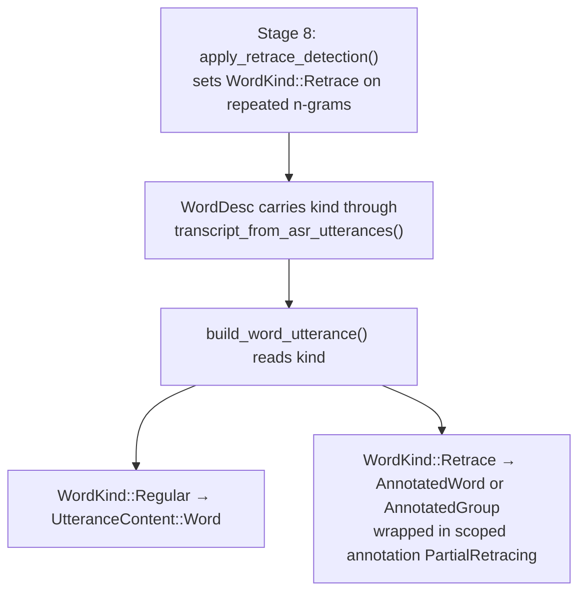

# ASR Token Pipeline

**Status:** Current
**Last updated:** 2026-03-18

This page documents the complete lifecycle of text tokens as they flow from
ASR providers through post-processing into the CHAT AST. Each stage has a
dedicated newtype that encodes what transformations the text has undergone.

## Type Progression



## Pipeline Stages

All stages run inside `process_raw_asr()` in `asr_postprocess/mod.rs`.

| # | Stage | Input | Output | What changes |
|---|-------|-------|--------|-------------|
| 1 | Compound merging | `Vec AsrElement` | `Vec AsrElement` | Adjacent compound pairs joined ("air"+"plane" to "airplane") |
| 2 | Timed word extraction | `Vec AsrElement` | `Vec AsrWord` | Seconds to ms, pause markers filtered, `AsrRawText` to `AsrNormalizedText` |
| 3 | Multi-word splitting | `Vec AsrWord` | `Vec AsrWord` | Space-containing tokens split, timestamps interpolated, hyphens joined |
| 4 | Number expansion | `Vec AsrWord` | `Vec AsrWord` | Digit strings to word form ("5" to "five") |
| 4b | Cantonese normalization | `Vec AsrWord` | `Vec AsrWord` | Simplified to HK traditional + domain replacements (lang=yue only) |
| 5 | Long turn splitting | `Vec AsrWord` | `Vec Vec AsrWord` | Chunks longer than 300 words split |
| 6 | Retokenization | `Vec AsrWord` | `Vec Utterance` | Split into utterances by punctuation boundaries |
| 7 | Disfluency replacement | `Vec Utterance` | `Vec Utterance` | Filled pauses marked ("um" to "&-um"), orthographic replacements applied |
| 8 | N-gram retrace detection | `Vec Utterance` | `Vec Utterance` | Repeated n-grams marked with `WordKind::Retrace` |

## Text Newtypes at Each Stage

| Type | On struct | Contains | Does NOT contain |
|------|-----------|----------|-----------------|
| `AsrRawText` | `AsrElement.value` | Raw provider output: digits, spaces, provider markers | Any normalization |
| `AsrNormalizedText` | `AsrWord.text` | Compound-merged, number-expanded, disfluency-marked text | CHAT syntax (not yet parsed) |
| `ChatWordText` | `WordDesc.text` | Same content as `AsrNormalizedText`, marks CHAT domain crossing | N/A — semantically identical, boundary marker |

All three use `#[serde(transparent)]`, `new()`, `as_str()`, `Display`, `AsRef str`.
`AsrNormalizedText` additionally provides `map()` for pipeline stage transformations
and `push_str()` for hyphen-joining.

## Timing Flow



`AsrTimestampSecs` wraps the raw `f64` seconds from ASR providers on `AsrElement`.
The internal `AsrWord` timing (`Option i64`) is deliberately NOT wrapped — these
are pipeline-internal values that never cross a module boundary.

## Speaker Flow



`SpeakerIndex` is a zero-based index into the recording's speaker list.
It lives on both `AsrMonologue` (raw) and `Utterance` (post-processed).
Conversion to CHAT participant codes happens in `build_chat.rs`.

## WordKind Lifecycle

`WordKind` is set during stage 8 (retrace detection) and consumed during
CHAT assembly:



Both single-word (`word [/]`) and multi-word (`<word word> [/]`) retraces
produce `UtteranceContent::Retrace`. The `Retrace` type carries the retrace
kind (`Partial`, `Full`, `Multiple`, `Reformulation`, `Uncertain`) and a
flag for whether the original was a group.

## AsrElementKind Enum

```rust
#[derive(Debug, Clone, Copy, PartialEq, Eq, Serialize, Deserialize, Default)]
#[serde(rename_all = "lowercase")]
pub enum AsrElementKind {
    #[default]
    Text,
    Punctuation,
}
```

Replaces the former `r#type: String` field. Serializes as `"text"` / `"punctuation"`
for JSON compatibility. The field is currently not read by the pipeline
(`extract_timed_words` uses content heuristics), but it preserves provider metadata
for debugging and potential future use.

## Reverse Direction: CHAT to NLP

The reverse flow (extracting words from CHAT for NLP processing) uses separate
provenance types defined in `text_types.rs`:

| Type | Source | Used for |
|------|--------|----------|
| `ChatRawText` | `Word::raw_text()` | AST preservation, display |
| `ChatCleanedText` | `Word::cleaned_text()` | NLP models, alignment, cache keys |
| `SpeakerCode` | `Utterance.speaker` | Per-speaker analysis keying |

These types are documented in
[Type-Driven Design](type-driven-design.md#2-provenance-newtypes).

## Code References

| Component | File |
|-----------|------|
| ASR types and newtypes | `asr_postprocess/asr_types.rs` |
| Pipeline orchestrator | `asr_postprocess/mod.rs` |
| Compound merging | `asr_postprocess/compounds.rs` |
| Disfluency and retrace | `asr_postprocess/cleanup.rs` |
| Number expansion | `asr_postprocess/num2text.rs` |
| Cantonese normalization | `asr_postprocess/cantonese.rs` |
| CHAT assembly | `build_chat.rs` |
| CHAT-direction newtypes | `text_types.rs` |
