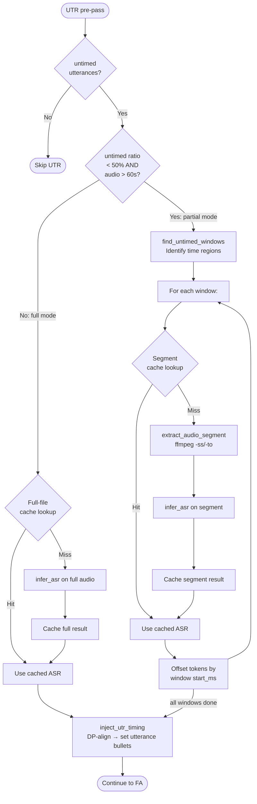

# Caching

**Status:** Current
**Last updated:** 2026-03-21 15:30

Batchalign uses two distinct cache layers. All caching is managed by the
Rust server — Python workers are cache-unaware.

## Analysis Cache (Tiered: moka + SQLite)

The `UtteranceCache` (`crates/batchalign-app/src/cache/`) stores per-utterance
NLP results so that re-processing a corpus skips utterances whose results are
already known.

### Architecture

- **`CacheBackend` trait** defines the storage contract (get, put, delete,
  both single and batched).
- **`TieredCacheBackend`** is the production implementation — an in-memory
  [moka](https://github.com/moka-rs/moka) hot layer wrapping a persistent
  `SqliteBackend` cold layer.
- **`SqliteBackend`** provides persistent storage via SQLite WAL mode for
  concurrent read/write safety.
- **`UtteranceCache`** is the public entry point, wrapping
  `Box<dyn CacheBackend>`.

### Tiered cache design

The hot layer absorbs repeated lookups and reduces SQLite round-trips under
concurrent workloads (e.g., parallel FA or transcribe processing multiple files
via `JoinSet` + `Semaphore`).

| Layer | Implementation | Capacity | Eviction |
|-------|---------------|----------|----------|
| **Hot** | `moka::future::Cache` | 10,000 entries (~5-20 MB) | 24h time-to-idle |
| **Cold** | `SqliteBackend` (WAL, 5-connection pool) | Unbounded (disk) | None (manual or `--override-cache`) |

**Read path:** check moka → on hit, verify task + engine_version match → on
mismatch or miss, fall through to SQLite → promote cold hits to moka.

**Write path:** write to SQLite first (authoritative), then insert into moka.
Write-through, not write-back — no data loss on crash.

**Delete path:** invalidate moka first, then delete from SQLite.

**Stats:** always delegated to SQLite (authoritative).

The moka key is the bare BLAKE3 hash string.  Task and engine_version are
stored inside the hot entry and checked on read, matching the SQLite schema
where `key` is the primary key.

### Database location

| Platform | Path |
|----------|------|
| macOS | `~/Library/Caches/batchalign3/cache.db` |
| Linux | `~/.cache/batchalign3/cache.db` |

### Cache key computation

Keys are **BLAKE3** content-addressed hashes (64-character hex strings),
computed by the `CacheKey` newtype in `batchalign-chat-ops/src/cache_key.rs`.
There is no constructor from arbitrary strings — keys can only be created
through the task-specific `cache_key()` functions, which hash input payloads
internally.

### Audio identity

The `AudioIdentity` newtype (`batchalign-chat-ops/src/fa/mod.rs`) identifies an
audio file for cache keying. It is computed from **filesystem metadata only**,
not from a content hash of the audio data.

**Format:** `"{resolved_path}|{mtime_secs}|{file_size}"`

Construction happens in `compute_audio_identity()` (`runner/util/media.rs`):

1. `tokio::fs::metadata(audio_path)` to get file metadata.
2. Extract `meta.len()` (file size in bytes).
3. Extract `meta.modified()` (mtime as seconds since Unix epoch).
4. Build `AudioIdentity::from_metadata(path, mtime_secs, size)`.

**Implications:**

- **Renaming or moving a file changes the identity** because the resolved path
  is part of the key. The same audio content at a different path produces a
  different identity.
- **Re-encoding audio changes the identity** because re-encoding changes both
  mtime and file size, even if the decoded PCM is identical.
- **Touching a file (updating mtime without changing content) changes the
  identity**, causing a cache miss.
- **Copying a file preserves content but changes mtime**, so the copy gets a
  different identity.
- **No content hashing is performed** -- this is a deliberate performance
  tradeoff. Computing BLAKE3 over multi-GB audio files would add significant
  latency. Filesystem metadata is available instantly.

### Cache task names

The `CacheTaskName` enum enumerates every NLP task with cached results:

| Variant | Wire string | Orchestrator |
|---------|-------------|-------------|
| `Morphosyntax` | `morphosyntax_v4` | `morphosyntax/` |
| `UtteranceSegmentation` | `utterance_segmentation` | `utseg.rs` |
| `Translation` | `translation` | `translate.rs` |
| `ForcedAlignment` | `forced_alignment` | `fa/` |
| `UtrAsr` | `utr_asr` | `runner/dispatch/fa_pipeline.rs` (UTR pre-pass) |

### Cache key composition per task

| Task | Key components |
|------|---------------|
| Morphosyntax | words + lang + MWT lexicon entries |
| Utseg | words + lang |
| Translation | text + src_lang + tgt_lang |
| Forced alignment | audio identity + time window + words + pauses + timing mode + engine |
| UTR ASR (full-file) | `"utr_asr"` + audio identity + lang |
| UTR ASR (segment) | `"utr_asr_segment"` + audio identity + start_ms + end_ms + lang |

### Cache invalidation by task

What user actions cause cache misses (force re-inference) for each task:

| Action | Morphosyntax | Utseg | Translation | FA | UTR full | UTR segment |
|--------|-------------|-------|-------------|-----|----------|-------------|
| Edit transcript words | Miss | Miss | Miss | Miss | Hit | Hit |
| Change language code | Miss | Miss | Miss | Miss | Miss | Miss |
| Re-record audio | Hit | Hit | Hit | Miss | Miss | Miss |
| Change FA engine | Hit | Hit | Hit | Miss | Hit | Hit |
| Change ASR engine | Hit | Hit | Hit | Hit | Hit\* | Hit\* |
| Upgrade model version | Miss | Miss | Miss | Miss | Miss | Miss |
| Use `--override-cache` | Skip | Skip | Skip | Skip | Skip | Skip |

\*UTR cache keys do not include engine name, but engine_version scoping at the
SQLite/moka layer catches model upgrades (the entry's stored engine_version must
match the current one).

**Key insight:** UTR cache keys are audio-only (no transcript text), so editing
the transcript does not invalidate ASR results -- this is correct because UTR
re-derives timing from the same audio. FA cache keys include transcript text, so
only groups whose words changed need to re-run forced alignment.

### Engine version scoping

Each cache entry is scoped to an **engine version** string (e.g., Stanza
version, `"google-translate"`, `"whisper-fa-large-v3"`). Upgrading a model
automatically invalidates stale entries because lookups require an exact
version match.

### Engine version strings

Engine version strings are reported by Python workers at startup via the
`capabilities` IPC response. The Rust server stores them in
`AppState::engine_versions` (a `BTreeMap<String, String>`) and looks up the
per-task version when constructing `PipelineServices`.

Source: `batchalign/worker/_handlers.py` (`_INFER_TASK_PROBES` + version
resolution logic), `batchalign/worker/_model_loading/` and
`batchalign/worker/_stanza_loading.py` (model loading).

| Task | Key | Typical engine_version | Source |
|------|-----|----------------------|--------|
| Morphosyntax | `morphosyntax` | `"1.9.2"` (Stanza `__version__`) | `_state.stanza_version` |
| Utseg | `utseg` | `"1.9.2"` (Stanza `__version__`) | `_state.utseg_version` |
| Translation | `translate` | `"googletrans-v1"` (Google) or `"googletrans-v1"` fallback | `TranslationBackend` check |
| FA | `fa` | `"whisper-fa-large-v2"` (Whisper), `"wave2vec-fa-mms-{torchaudio_version}"` (Wave2Vec), `"wav2vec-canto-v1"` (Cantonese) | `_state.fa_model_name` |
| ASR | `asr` | `"whisper"`, `"rev"`, `"tencent"`, `"aliyun"`, or `"funaudio"` | `_state.asr_engine.value` (AsrEngine enum) |
| Coref | `coref` | `"1.9.2"` (Stanza `__version__`) | `_state.stanza_version` |

The FA pipeline uses its own engine_version (from the `"fa"` key) for both FA
cache entries and UTR ASR cache entries. This means upgrading the FA model
invalidates UTR ASR cache entries too, even though UTR uses the ASR worker --
this is a design choice to keep the FA pipeline's PipelineServices consistent
across its sub-stages.

Fallback behavior: if the worker has not loaded a model (probe-only mode), the
default version from `_INFER_TASK_PROBES` is used (e.g., `"stanza"`,
`"whisper"`, `"googletrans-v1"`).

### Cache workflow in orchestrators

Every NLP orchestrator follows this pattern:

1. **Collect payloads** from the parsed CHAT AST.
2. **Compute cache keys** (BLAKE3 hash of payload content).
3. **Batch lookup** — hit entries are injected directly into the AST.
4. **Infer misses** — send uncached payloads to Python workers.
5. **Inject results** into the AST.
6. **Batch put** — persist new results for future reuse.

### Self-correcting cache purges

When post-serialization validation fails, the server deletes the cache entries
that produced the invalid output. This prevents stale or broken results from
being served on future runs. Validation failures also trigger bug reports to
`~/.batchalign3/bug-reports/`.

### Override

`--override-cache` bypasses cache lookups, forcing fresh inference for every
utterance. Use this when validating behavior changes or after model upgrades.

For a developer-facing guide on when `--override-cache` is actually needed after
code changes, see the [Cache Override Guide](cache-override-guide.md).

## UTR ASR Caching

UTR (Utterance Timing Recovery) ASR results are now cached, making repeat
alignment runs on the same audio instant. The cache operates in two modes:

**Full-file mode** caches the entire `AsrResponse` with key
`BLAKE3("utr_asr|{audio_identity}|{lang}")`. This is the default for
mostly-untimed files or short audio.

**Partial-window mode** activates when >50% of utterances are timed and the
audio exceeds 60 seconds. Each untimed window is extracted via ffmpeg and
cached independently with key
`BLAKE3("utr_asr_segment|{audio_identity}|{start_ms}|{end_ms}|{lang}")`.
This avoids processing already-timed regions on the first run. After the first
run, the full-file cache makes the distinction moot.

Both modes respect `CachePolicy` — `--override-cache` skips lookups but still
stores results for future use.

## What is NOT cached

- **Speaker diarization** — depends on full audio context.
- **Coreference** — document-level (not per-utterance); results depend on
  full document context.
- **OpenSMILE features** — fast enough to recompute.
- **AVQI scores** — fast enough to recompute.

## Cache Ownership History

Cache ownership moved from Python to Rust as part of the BA2→BA3 migration;
see the [migration book](../migration/index.md) for context.

## Media Conversion Cache

MP4 video files are converted to WAV for alignment and cached at
`~/.batchalign3/media_cache/` keyed by content fingerprint. MP3 and WAV
files are used directly (no conversion). Media resolution is handled by
`crates/batchalign-app/src/media.rs`.
