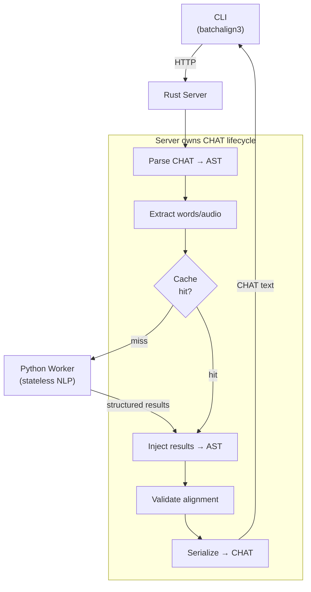
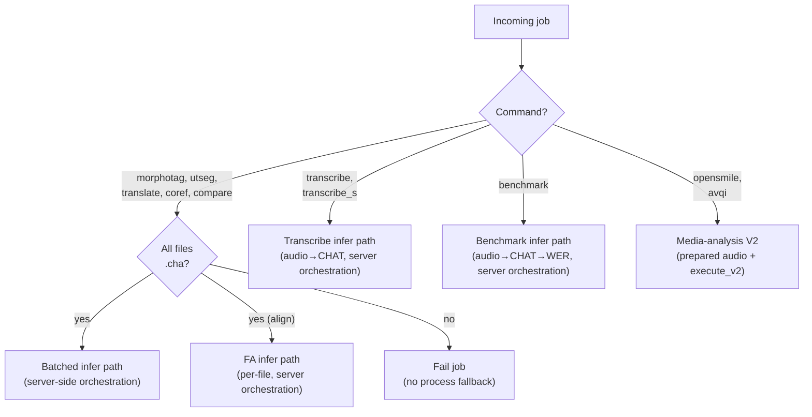

# CHAT Ownership Boundary: Server-Side Orchestration

**Status:** Current
**Last updated:** 2026-03-26 14:05 EDT

## Overview

The CHAT ownership boundary places all CHAT parsing, caching, injection, validation, and serialization in the Rust server. Python workers are stateless inference endpoints: they receive extracted data (words, audio chunks) and return raw model output. The server owns the full CHAT lifecycle.

This architecture eliminates duplicated logic between Python and Rust, enables unified caching at the server level, and makes workers interchangeable (any worker with the right model can serve any request).

## Before vs After

```
BEFORE (removed):
  Server → worker.process(chat_text) → Python parses CHAT, runs model,
           injects results, validates, serializes → returns CHAT text

AFTER (infer path):
  Server → parses CHAT → extracts payloads → checks cache →
           worker.execute_v2(task, prepared_batch) → Python runs model only →
           Server injects results → validates → serializes → CHAT text
```



## Dispatch Decision

The server requires the infer path for text-only commands. If a worker lacks the
required task in its `infer_tasks` capability list, the job fails with an
"upgrade required" error. Audio-dependent commands split into three groups:
`transcribe`, `transcribe_s`, and `benchmark` use dedicated server-owned
orchestrators; `opensmile` and `avqi` use Rust-owned prepared-audio V2 worker
requests; and the worker protocol no longer exposes a released per-file
`process` path.

**Precondition:** infer shapes that operate on existing CHAT still require that
**all input files are `.cha` files** (`all_chat` in `runner.rs`). If any
non-CHAT file is present for those commands, the job now fails instead of
silently falling back to a Python command-runtime path.

```rust
// runner/policy.rs — dispatch decision (simplified for illustration)
fn command_requires_infer(command: &str, all_chat: bool) -> bool {
    match command {
        "morphotag" | "utseg" | "translate" | "coref" | "compare" => true,
        "opensmile" | "avqi" => true,
        "align" => all_chat,
        _ => false,
    }
}

// Actual dispatch logic:
let all_chat = file_list.iter().all(|(_, _, has_chat)| *has_chat);
let infer_task = infer_task_for_command(&command);
let infer_supported = infer_task.is_some_and(|task| infer_tasks.contains(&task));
let use_infer = all_chat && infer_supported;

// Audio-input commands that bypass the all_chat gate:
let use_transcribe_infer = (command == "transcribe" || command == "transcribe_s")
    && infer_tasks.contains(&InferTask::Asr);
let use_benchmark_infer = command == "benchmark"
    && infer_tasks.contains(&InferTask::Asr);
let use_media_analysis_infer = (command == "opensmile" || command == "avqi")
    && infer_task.is_some_and(|task| infer_tasks.contains(&task));
```



## Wire Protocol

### Request
```json
{
  "op": "execute_v2",
  "request": {
    "request_id": "req-mor-0004",
    "task": "morphosyntax",
    "payload": {
      "kind": "morphosyntax",
      "data": { "lang": "eng", "payload_ref_id": "text-ref-0004", "item_count": 2 }
    },
    "attachments": [
      { "kind": "prepared_text", "id": "text-ref-0004", "path": "/tmp/text-ref-0004.json" }
    ]
  }
}
```

The worker does not advertise `transcribe`, `transcribe_s`, or `benchmark`
directly anymore. The Rust control plane synthesizes those commands when ASR is
available, because they are server-owned compositions rather than worker-owned
operations.

### Response
```json
{
  "op": "execute_v2",
  "response": {
    "request_id": "req-mor-0004",
    "outcome": { "kind": "success" },
    "result": {
      "kind": "morphosyntax_result",
      "data": {
        "items": [
          { "raw_sentences": [ ... ] },
          { "error": "model failed" }
        ]
      }
    }
  }
}
```

Prepared-text batch items and response items are positionally matched
(`items[i]` corresponds to batch element `i`).

## Engine Surface Areas

### Morphosyntax (`morphotag` command → `morphosyntax` infer task)

| Aspect | Detail |
|--------|--------|
| **Rust module** | `crates/batchalign-chat-ops/src/morphosyntax/`, `crates/batchalign-app/src/morphosyntax/` |
| **Granularity** | Per-utterance |
| **Cross-file batching** | Yes — all cache misses across files pooled into one prepared-text `execute_v2` batch |
| **Cache task** | `"morphosyntax"` |
| **Cache key** | `BLAKE3("{words}|{lang}|mwt")` |
| **Engine version** | Stanza version (e.g., `"1.9.2"`) |

**Batch item** (`MorphosyntaxBatchItem`):
```json
{ "words": ["the", "cat", "sat"], "lang": "eng" }
```

**Response item** (`MorphosyntaxResultItemV2`):
```json
{
  "raw_sentences": [[
      { "text": "the", "lemma": "the", "upos": "DET", "xpos": "DT",
        "feats": "Definite=Def|PronType=Art", "head": 2, "deprel": "det" },
      ...
  ]]
}
```

**Server orchestration**:
1. `parse_lenient(chat_text)` → ChatFile
2. `clear_morphosyntax(chat_file)` — strip existing %mor/%gra
3. `collect_payloads(chat_file)` → per-utterance `MorphosyntaxBatchItem` list
4. Cache lookup (batch) → partition hits/misses
5. `build_morphosyntax_request_v2(...)` + `dispatch_execute_v2_with_retry(...)` for misses
6. `inject_morphosyntax(chat_file, responses)` — add %mor/%gra tiers
7. `to_chat_string(chat_file)` → output

**Python worker** (`batchalign/worker/_text_v2.py` for `task="morphosyntax"`):
- Groups items by language
- Runs Stanza NLP (single `nlp()` call per language)
- Validates word alignment via `_validate_ud_words()`
- Returns typed per-item raw sentence payloads

---

### Utterance Segmentation (`utseg` command → `utseg` infer task)

| Aspect | Detail |
|--------|--------|
| **Rust module** | `crates/batchalign-chat-ops/src/utseg.rs`, `crates/batchalign-app/src/utseg.rs` |
| **Granularity** | Per-utterance |
| **Cross-file batching** | Yes |
| **Cache task** | `"utterance_segmentation"` |
| **Cache key** | `BLAKE3("{words}|{lang}")` (no `|mwt` suffix) |
| **Engine version** | Stanza version |

**Batch item** (`UtsegBatchItem`):
```json
{ "words": ["I", "went", "home", "the", "cat", "sat"], "text": "I went home the cat sat", "lang": "eng" }
```

**Response item** (`UtsegResultItemV2`):
```json
{ "trees": ["(ROOT (S I went home))", "(ROOT (S the cat sat))"] }
```

Rust computes assignment groups from those raw parse trees before splitting the
CHAT utterance.

**Server orchestration**:
1. Parse → collect payloads → cache check → infer misses
2. `build_utseg_request_v2(...)` + `dispatch_execute_v2_with_retry(...)` for misses
3. `apply_utseg_results(chat_file, payloads, responses)` — computes assignments and splits utterances by boundary groups

**Python worker** (`batchalign/worker/_text_v2.py` for `task="utseg"`):
- Builds Stanza constituency pipeline
- Returns raw constituency parse trees per item

---

### Translation (`translate` command → `translate` infer task)

| Aspect | Detail |
|--------|--------|
| **Rust module** | `crates/batchalign-chat-ops/src/translate.rs`, `crates/batchalign-app/src/translate.rs` |
| **Granularity** | Per-utterance |
| **Cross-file batching** | Yes |
| **Cache task** | `"translation"` |
| **Cache key** | `BLAKE3("{text}|{src_lang}|{tgt_lang}")`, default tgt_lang `"eng"` |
| **Engine version** | `"googletrans-v1"` or `"seamless-v1"` |

**Batch item** (`TranslateBatchItem`):
```json
{ "text": "le chat est assis" }
```

**Response item** (`TranslationResultItemV2`):
```json
{ "raw_translation": "the cat is sitting" }
```

**Server orchestration**:
1. Parse → extract translation strings → cache check → infer misses
2. `build_translate_request_v2(...)` + `dispatch_execute_v2_with_retry(...)` for misses
3. `inject_translation(utterance, text)` — Rust postprocesses and adds `%xtra` dependent tier

**Python worker** (`batchalign/worker/_text_v2.py` for `task="translate"`):
- Calls Google Translate (with 1.5s rate limiting) or Seamless
- Returns raw translated strings; shared normalization stays in Rust

---

### Coreference (`coref` command → `coref` infer task)

| Aspect | Detail |
|--------|--------|
| **Rust module** | `crates/batchalign-chat-ops/src/coref.rs`, `crates/batchalign-app/src/coref.rs` |
| **Granularity** | Per-document (all sentences in one item) |
| **Cross-file batching** | Yes (one item per document) |
| **Cache task** | None (no caching — full-document context dependency) |
| **Cache key** | N/A |
| **Engine version** | Stanza version |
| **Language gate** | English only |

**Batch item** (`CorefBatchItem`):
```json
{ "sentences": [["The", "cat", "sat"], ["It", "was", "happy"]] }
```

**Response item** (`CorefResultItemV2`):
```json
{
  "annotations": [
    {
      "sentence_idx": 0,
      "words": [[{ "chain_id": 1, "is_start": true, "is_end": false }], [], []]
    }
  ]
}
```

Annotations are sparse — only sentences with coref chains are returned. Rust
reconstructs CHAT bracket notation from these typed chain refs.

**Server orchestration**:
1. Parse → collect all sentences per file → build one CorefBatchItem per file
2. No cache check (document-level)
3. `build_coref_request_v2(...)` + `dispatch_execute_v2_with_retry(...)`
4. `raw_to_bracket_response()` + `apply_coref_results(chat_file, annotations)` — inject sparse `%xcoref`

**Python worker** (`batchalign/worker/_text_v2.py` for `task="coref"`):
- Builds Stanza coref pipeline (reused across documents)
- Extracts coref chains per word
- Returns sparse typed chain annotations

---

### Forced Alignment (`align` command → `fa` infer task)

| Aspect | Detail |
|--------|--------|
| **Rust module** | `crates/batchalign-chat-ops/src/fa/`, `crates/batchalign-app/src/fa/` |
| **Granularity** | Per-group (time-windowed utterance groups within a file) |
| **Cross-file batching** | **No** — each file has its own audio, dispatched sequentially |
| **Cache task** | `"forced_alignment"` |
| **Cache key** | `BLAKE3("{audio_identity}|{start}|{end}|{text}|{pauses_flag}|{engine}")` |
| **Engine version** | `"whisper-fa-{model}"` or `"wave2vec-fa-mms-{torchaudio_version}"` |
| **Audio access** | Worker reads prepared audio and prepared text artifacts owned by Rust |
| **Two engine types** | Whisper (token-level) and Wave2Vec (word-level) |

**Request** (`ForcedAlignmentRequestV2` payload):
```json
{
  "backend": "whisper",
  "payload_ref_id": "text-ref-0002",
  "audio_ref_id": "audio-ref-0002",
  "text_mode": "space_joined",
  "pauses": true
}
```

**Whisper response** (`FaRawResponse` with `tokens`):
```json
{
  "tokens": [
    { "text": "the", "time_s": 0.02 },
    { "text": " cat", "time_s": 0.48 },
    { "text": " sat", "time_s": 0.96 }
  ]
}
```

**Wave2Vec response** (`FaRawResponse` with `timings`):
```json
{
  "timings": [
    { "word": "the", "start_ms": 20, "end_ms": 340 },
    { "word": "cat", "start_ms": 480, "end_ms": 820 },
    { "word": "sat", "start_ms": 960, "end_ms": 1400 }
  ]
}
```

**Server orchestration** (`dispatch_fa_infer` → `process_fa` per file):
1. `parse_lenient(chat_text)` → ChatFile
2. `group_utterances(chat_file, max_group_ms, total_audio_ms)` → groups by time window
3. Compute cache keys per group, batch cache lookup
4. Build one typed FA `execute_v2` request per cache miss group
5. `parse_fa_response(json, words, audio_start_ms, pauses)` — indexed timings or deterministic token stitching map model output back to transcript words
6. Cache store per group
7. `apply_fa_results(chat_file, groups, timings, pauses)` — inject word-level timings, postprocess (end-time chaining, bounding), update utterance bullets, generate %wor tiers, enforce monotonicity (E362), strip E704 same-speaker overlaps

**Engine parameters by type:**

| Parameter | Whisper FA | Wave2Vec FA |
|-----------|-----------|------------|
| `pauses` | `true` | `false` |
| `max_group_ms` | 20,000 | 15,000 |
| Output | Token-level (seconds) | Word-level (milliseconds) |
| Runtime mapping | Deterministic token stitching | Indexed word-level transfer |
| Engine string | `"whisper_fa"` | `"wave2vec_fa"` |

**Audio identity** (for cache key): `"{path}|{mtime_epoch_secs}|{size_bytes}"` — fast, no file reading.

**Audio duration**: Obtained via `ffprobe` at the server level.

**Python worker** (`execute_v2(task="fa")`):
- Reads prepared audio/text artifacts
- Whisper: detokenizes words, runs cross-attention + DTW model, returns token timings
- Wave2Vec: runs torchaudio forced alignment, returns word timings
- Thread lock serializes model access

---

### ASR Post-Processing (`transcribe` command → `asr` infer task)

| Aspect | Detail |
|--------|--------|
| **Rust module** | `batchalign-chat-ops/src/asr_postprocess/` |
| **Granularity** | Per-monologue (speaker turns) |
| **Post-processing** | Compound merging, number expansion, Cantonese normalization, retokenization |
| **HK engines** | Tencent, Aliyun, FunASR — selected via `AsrEngine` enum |

After the Python worker returns a tagged raw ASR payload, the Rust server
first normalizes it into the shared internal timing/token domain and then
applies a 6-stage post-processing pipeline before CHAT assembly:

```
1. Compound merging (3,660 known compound pairs)
2. Timed word extraction (seconds → ms)
3. Multi-word splitting (timestamp interpolation)
4. Number expansion (digits → word form, 12 languages)
4b. Cantonese normalization (lang=yue only: simplified→HK trad + domain replacements)
5. Long turn splitting (>300 words)
6. Retokenization (punctuation-based utterance splitting)
```

Stage 4b uses `zhconv` (pure Rust, OpenCC + MediaWiki rulesets) + a 31-entry
Aho-Corasick replacement table for Cantonese-specific corrections. This
normalization is compiled into the Rust extension — no Python OpenCC dependency
needed. See [HK/Cantonese Engines](hk-cantonese-engines.md) for full details.

**Python worker** (`execute_v2(task="asr")`):
- Runs Python-hosted Whisper or HK engines (Tencent/Aliyun/FunASR)
- Returns typed raw ASR results (`monologue_asr_result` or `whisper_chunk_result`)
- All text normalization happens on the Rust side

---

## Crate Architecture

```
batchalign-chat-ops (shared crate)
├── morphosyntax.rs   — extract/inject/cache-key for morphosyntax
├── utseg.rs          — extract/inject/cache-key for utterance segmentation
├── translate.rs      — extract/inject/cache-key for translation
├── coref.rs          — extract/inject for coreference
├── fa/               — forced alignment (directory module)
│   ├── mod.rs        — grouping, types, cache key, apply results, monotonicity
│   ├── extraction.rs — collect_fa_words (uses for_each_leaf)
│   ├── injection.rs  — inject word timings (uses for_each_leaf_mut)
│   ├── postprocess.rs— timing postprocessing (uses both walkers)
│   └── dp_align.rs   — Hirschberg DP alignment for FA responses
├── asr_postprocess/  — ASR post-processing pipeline
│   ├── mod.rs        — process_raw_asr(), retokenization, types
│   ├── cantonese.rs  — Cantonese normalization (zhconv + Aho-Corasick)
│   ├── compounds.rs  — 3,660 compound word pairs
│   ├── num2text.rs   — Number expansion (12 languages)
│   └── num2chinese.rs— Chinese/Japanese number converter
├── dp_align.rs       — Hirschberg DP alignment (general)
├── parse.rs          — lenient/strict CHAT parsing
├── serialize.rs      — ChatFile → CHAT text
├── extract.rs        — NLP word extraction from AST (uses for_each_leaf)
├── inject.rs         — tier injection utilities
├── nlp/              — NLP types (UD, FA response types)
└── retokenize.rs     — token retokenization

batchalign-app
├── morphosyntax/     — server-side morphosyntax orchestrator
├── utseg.rs          — server-side utseg orchestrator
├── translate.rs      — server-side translate orchestrator
├── coref.rs          — server-side coref orchestrator
├── fa/               — server-side FA orchestrator (incremental, transport)
├── transcribe.rs     — server-side transcribe orchestrator
├── workflow/         — workflow-family registry, descriptors, traits
│   └── registry.rs   — command → WorkflowDescriptor mapping (source of truth)
└── runner/           — dispatch router
    ├── mod.rs        — spawn_job(), job lifecycle
    ├── policy.rs     — infer_task_for_command(), command_requires_infer()
    ├── dispatch/     — infer_batched, fa_pipeline, transcribe_pipeline, benchmark_pipeline, etc.
    └── util/         — helpers (worker count, media validation, file state, auto-tune)
```

## Capability Discovery

Workers advertise their infer capabilities via the `capabilities` IPC op:

```json
{
  "commands": [],
  "infer_tasks": ["morphosyntax", "utseg", "translate", "coref", "fa",
                   "asr", "opensmile", "avqi", "speaker"],
  "engine_versions": {
    "morphosyntax": "1.9.2",
    "utseg": "1.9.2",
    "translate": "googletrans-v1",
    "coref": "1.9.2",
    "fa": "whisper-fa-whisper-large-v2",
    "asr": "rev-v1"
  }
}
```

Rust now treats `infer_tasks + engine_versions` as the authoritative capability
contract and derives the released command surface from that set. The `commands`
field remains only as compatibility metadata on this older IPC op.

Engine versions drive cache invalidation: when a worker reports a new engine version, previously cached results for that task are automatically invalidated by the cache layer.

## Per-Command Options and Filtering

The server reads per-command options from the job's `options` map (populated by the CLI's `build_options()` in `args.rs`). These are threaded from `runner.rs` through the orchestrators.

### Option Threading Flow

```
CLI args.rs                    runner.rs                    orchestrator
  --retokenize    →  options["retokenize"]    →  process_morphosyntax_batch(retokenize)
  --skipmultilang →  options["skipmultilang"] →  process_morphosyntax_batch(skipmultilang)
  --override-cache→  options["override_cache"]→  all orchestrators
  --pauses        →  options["pauses"]        →  dispatch_fa_infer(pauses)
```

All options default to `false` when absent from the map.

### Per-File Filtering

The server applies several per-file checks **after parsing** each CHAT file. These run inside the orchestrators, not in the runner.

#### Dummy file passthrough (`@Options: dummy`)

All orchestrators check `is_dummy(chat_file)` immediately after parsing. Dummy files are returned unchanged — no inference, no cache lookup, no injection.

```rust
// Every orchestrator's process_*() function:
if is_dummy(&chat_file) {
    return Ok(to_chat_string(&chat_file));
}
```

#### Per-file language detection

The `@Languages` header in each CHAT file determines the language for that file, **not** the job-level `--lang` parameter. This matters for mixed-language corpora where different files declare different languages.

```rust
// morphosyntax/ — uses declared_languages() for per-file language
let primary = LanguageCode::new(lang);  // job-level --lang
let langs = declared_languages(&chat_file, &primary);  // reads @Languages header
// If @Languages: spa, the batch item gets lang="spa" even if --lang eng
```

The job-level `lang` parameter serves only as a fallback when a file has no `@Languages` header.

#### English-only gate (coref)

Coreference resolution only processes English files. The gate checks the **per-file** `@Languages` header, not the job-level lang:

```rust
// coref.rs
fn file_has_english(chat_file, fallback_lang) -> bool {
    let langs = declared_languages(chat_file, &fallback);
    langs.iter().any(|l| l.as_str() == "eng")
}
```

If a user submits `--lang eng` but a file declares `@Languages: spa`, the file is passed through unchanged.

#### Code-switching filter (`--skipmultilang`)

When `skipmultilang=true`, morphosyntax `collect_payloads()` skips utterances that have a `[- lang]` language marker differing from the primary language. This prevents sending code-switched utterances to Stanza with the wrong language model.

### Per-Command Option Summary

| Option | Commands | Effect |
|--------|----------|--------|
| `retokenize` | `morphotag` | Retokenize main tier to match UD tokenization; bypasses cache |
| `skipmultilang` | `morphotag` | Skip code-switched utterances (utterances with `[- lang]` markers) |
| `override_cache` | `morphotag`, `utseg`, `translate`, `align` | Bypass cache, recompute everything |
| `pauses` | `align` | Group words into pause-separated chunks |
| `lang` | all | Default language (overridden per-file by `@Languages` header) |

### Filtering Summary

| Filter | Applied to | Checked by |
|--------|-----------|------------|
| `@Options: dummy` | All commands | `is_dummy()` in every orchestrator |
| `@Languages` per-file | All infer commands | `declared_languages()` in orchestrator |
| English-only | `coref` | `file_has_english()` in coref orchestrator |
| `[- lang]` markers | `morphotag` (with `--skipmultilang`) | `collect_payloads()` in morphosyntax |

## Error Handling

Text-only commands **require** the infer path. If a worker doesn't advertise the required task in `infer_tasks`, the job fails with an informative "upgrade required" error. There is no fallback to the `process` path for these commands — the server must own CHAT parsing, caching, and serialization.

Audio-dependent commands now split two ways on the released surface:

- `transcribe`, `transcribe_s`, and `benchmark` use dedicated Rust-owned ASR orchestrators
- `opensmile` and `avqi` use Rust-owned prepared-audio requests over `execute_v2`

The low-level `speaker` infer task still exists for typed worker execution, but
there is no standalone CLI `speaker` command. That matches batchalign2, where
speaker diarization was part of `transcribe_s`. When `transcribe_s` needs
dedicated diarization, Rust now composes `execute_v2(task="speaker")` and
applies the raw segments through `batchalign-chat-ops::speaker`.

## Command → Task Mapping

| CLI Command | Infer Task | Worker Function | Dispatch Path | Cross-File | Cache |
|-------------|-----------|-----------------|--------------|-----------|-------|
| `morphotag` | `morphosyntax` | `execute_v2(task="morphosyntax")` via `_text_v2.py` | `dispatch_batched_infer` | Yes | Yes |
| `utseg` | `utseg` | `execute_v2(task="utseg")` via `_text_v2.py` | `dispatch_batched_infer` | Yes | Yes |
| `translate` | `translate` | `execute_v2(task="translate")` via `_text_v2.py` | `dispatch_batched_infer` | Yes | Yes |
| `coref` | `coref` | `execute_v2(task="coref")` via `_text_v2.py` | `dispatch_batched_infer` | Yes | No |
| `compare` | `morphosyntax` | `execute_v2(task="morphosyntax")` | `dispatch_batched_infer` | Yes | Yes |
| `align` | `fa` | `execute_v2(task="fa")` | `dispatch_fa_infer` | No (per-file) | Yes |
| `transcribe` | `asr` | `execute_v2(task="asr")` | `dispatch_transcribe_infer` | No (per-file) | No |
| `transcribe_s` | `asr` + optional `speaker` | `execute_v2(task="asr")` + optional `execute_v2(task="speaker")` | `dispatch_transcribe_infer` | No (per-file) | No |
| `benchmark` | `asr` | `execute_v2(task="asr")` | `dispatch_benchmark_infer` | No (per-file) | No |
| `opensmile` | `opensmile` | `execute_v2(task="opensmile")` | `dispatch_media_analysis_v2` | No (per-file) | No |
| `avqi` | `avqi` | `execute_v2(task="avqi")` | `dispatch_media_analysis_v2` | No (per-file) | No |
