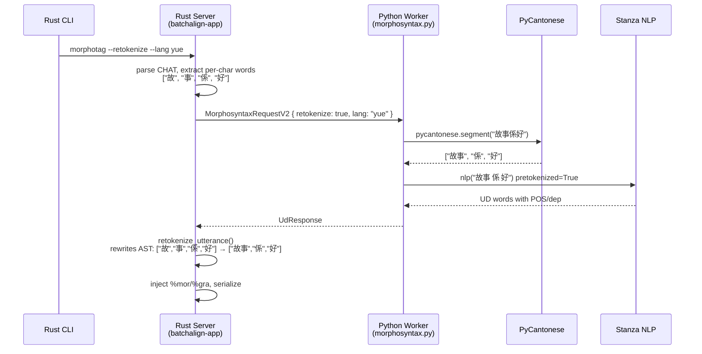
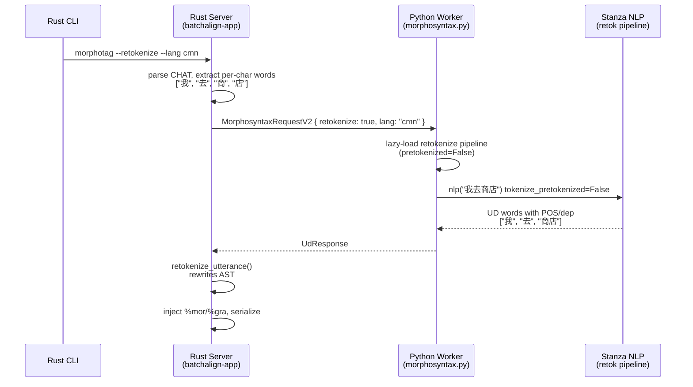
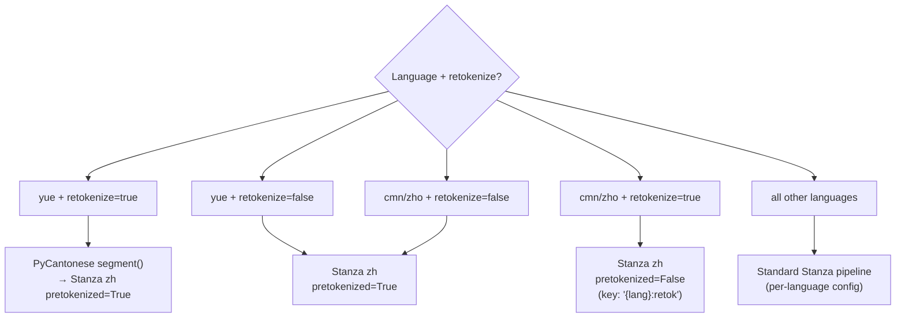

# CJK Word Segmentation — Architecture and Rationale

**Status:** Current
**Last updated:** 2026-03-23 10:54 EDT

## Why This Exists

CJK ASR engines output character-level tokens because Chinese characters are
the atomic unit of speech recognition. But Stanza POS/dependency models expect
word-level input — tagging individual characters produces meaningless results
(every character gets a POS tag as if it were an independent word).

The `--retokenize` flag on `morphotag` enables word segmentation before Stanza
inference, using language-specific segmenters.

## Design Decisions

### PyCantonese for Cantonese, Stanza for Mandarin

**Why not Stanza for both?** Stanza's `zh` tokenizer is trained on Mandarin
data (Chinese Treebank). Cantonese has distinct vocabulary, particles, and word
boundaries that differ from Mandarin. PyCantonese uses a Cantonese-specific
dictionary that handles these differences correctly.

**Why not PyCantonese for both?** PyCantonese is Cantonese-only. No equivalent
open-source dictionary-based segmenter exists for Mandarin with comparable
quality. Stanza's jointly-trained Chinese tokenizer is the best available option.

**Verified empirically:** PyCantonese correctly groups `佢哋` (they) and `鍾意`
(like) — Cantonese-specific compounds that Stanza's Mandarin-trained tokenizer
would miss. Stanza correctly groups `商店` (store) for Mandarin but splits
ambiguous compounds like `东西` (things → east + west). These findings come from
real model inference in `test_cjk_word_segmentation_claims.py`, not assumptions.

### `--retokenize` Only, Not Always-On

**Why:** Consistency across languages. `morphotag` never silently changes
tokenization for any language — the user must opt in with `--retokenize`. This
prevents surprise AST rewrites that could invalidate existing `%wor` bullets
or forced alignment timing.

**Mitigation:** A diagnostic warning is emitted when Cantonese input appears
to be per-character tokens without `--retokenize`, guiding users to the flag.

### Lazy Pipeline Loading

**Why:** The Stanza retokenize pipeline for Chinese uses `tokenize_pretokenized=False`,
which loads a neural tokenizer model (~200 MB). Loading this at startup wastes
RAM when retokenize is not requested. Instead, the retokenize pipeline is
loaded on first request and stored under key `"{lang}:retok"` in worker state.

### Wire Protocol Extension

The `retokenize` field was added to `MorphosyntaxRequestV2` with
`#[serde(default)]` in Rust and `retokenize: bool = False` in Python. This
ensures backward compatibility: workers that don't yet understand the field
ignore it (defaulting to `False`), and old Rust senders that don't include
it get the default behavior.

### Cache Key Differentiation

The cache key includes `|retok` when retokenize is active. Without this,
a non-retokenize cache entry (per-character %mor) would be incorrectly
returned for a retokenize request (word-level %mor), or vice versa.

## Data Flow

### Cantonese (`yue`) with `--retokenize`

### Mandarin (`cmn`/`zho`) with `--retokenize`

### Stanza Pipeline Selection

Which Stanza configuration is used for each (language, retokenize) combination:

## Key Source Files

| File | Role |
|------|------|
| `batchalign/inference/morphosyntax.py` | `_segment_cantonese()`, Mandarin retokenize pipeline selection |
| `batchalign/worker/_stanza_loading.py` | `load_stanza_retokenize_model()` for lazy Chinese pipeline |
| `crates/batchalign-types/src/worker_v2/requests.rs` | `MorphosyntaxRequestV2.retokenize` wire field |
| `crates/batchalign-chat-ops/src/retokenize/` | Rust AST rewrite module (language-agnostic) |
| `crates/batchalign-chat-ops/src/morphosyntax/cache.rs` | `cache_key()` with retokenize differentiation |
| `crates/batchalign-app/src/morphosyntax/mod.rs` | Per-char warning diagnostic |
