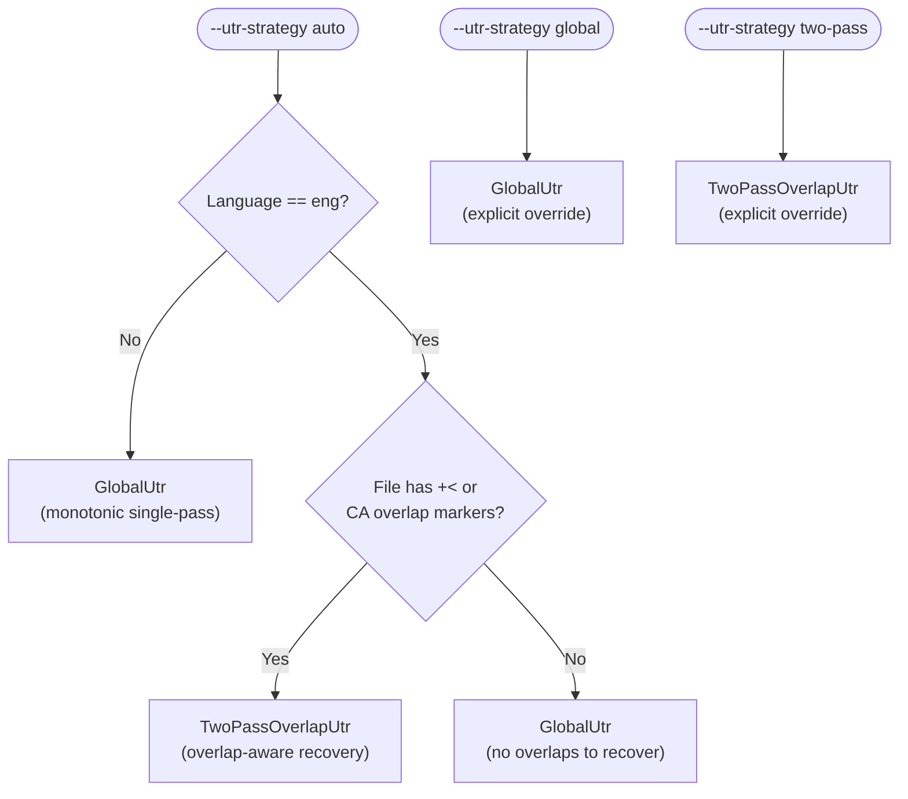
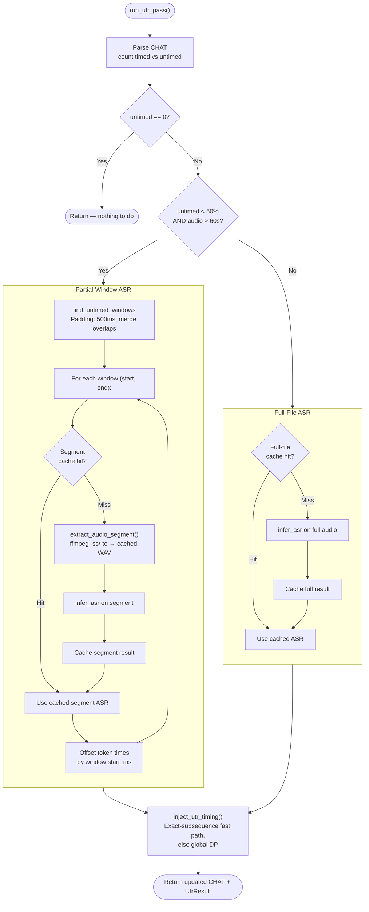
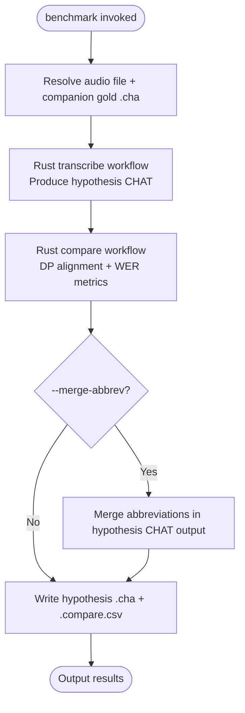
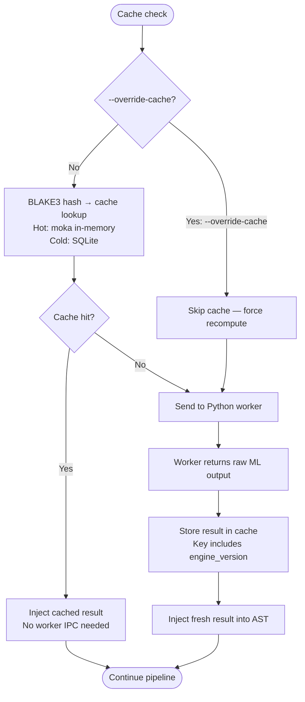
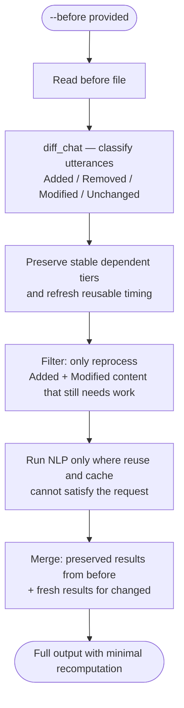

# Command Flowcharts

**Status:** Current
**Last modified:** 2026-03-26 01:21 EDT

Option-driven flowcharts for every batchalign processing command. Each
diagram shows how CLI flags route through different code paths at runtime.
For the higher-level dispatch sequence diagrams, see
[Command Lifecycles](command-lifecycles.md).

---

## align

The most complex command. CLI flags control FA engine selection, timing
mode, UTR pre-pass behavior, and incremental processing.

```mermaid
flowchart TD
    start([align invoked]) --> read[Read CHAT file]
    read --> resolve_audio[Resolve audio file]
    resolve_audio --> ensure_wav[ensure_wav — convert mp4→wav if needed]
    ensure_wav --> parse[parse_lenient → ChatFile]
    parse --> reuse_check{Complete reusable\n%wor timing?}
    reuse_check -->|Yes| reuse[Refresh main-tier bullets\nfrom %wor + optionally\nregenerate %wor]
    reuse_check -->|No| count[count_utterance_timing → timed, untimed]
    reuse --> done([Output .cha file])

    count --> utr_check{untimed > 0?}
    utr_check -->|No| skip_utr[Skip UTR — all timed]
    utr_check -->|Yes| utr_engine_check{--utr engine\nconfigured?}

    utr_engine_check -->|Yes: --utr| run_utr_pass["run_utr_pass()"]
    utr_engine_check -->|No: --no-utr| warn_interp[Log warning\nFall back to interpolation]

    run_utr_pass --> utr_done[Re-serialize CHAT\nwith recovered timing]
    utr_done --> group

    warn_interp --> group
    skip_utr --> group

    group[group_utterances → time windows]

    group --> before_check{--before path\nprovided?}
    before_check -->|Yes| incremental[process_fa_incremental\nDiff old vs new, copy stable %wor,\nreuse preserved groups]
    before_check -->|No| full[process_fa\nProcess all groups]

    incremental --> engine_select
    full --> engine_select

    engine_select{--fa-engine?}
    engine_select -->|whisper| whisper_fa[WhisperFa engine\nmax_group_ms=20000]
    engine_select -->|wav2vec| wav2vec_fa[Wave2Vec engine\nmax_group_ms=15000]

    whisper_fa --> pause_check{--pauses?}
    pause_check -->|Yes| with_pauses[FaTimingMode::WithPauses]
    pause_check -->|No| continuous_w[FaTimingMode::Continuous]

    wav2vec_fa --> continuous_wv[FaTimingMode::Continuous]

    with_pauses --> cache_check
    continuous_w --> cache_check
    continuous_wv --> cache_check

    cache_check[Cache lookup — BLAKE3 keys]
    cache_check --> worker_infer[execute_v2(task="fa") misses → Python FA worker\nprepared audio + prepared text]
    worker_infer --> dp_align_fa[DP-align model output → transcript words]
    dp_align_fa --> inject_fa[Inject word-level timings into AST]

    inject_fa --> retry_check{FA\nsucceeded?}
    retry_check -->|Yes| wor_check
    retry_check -->|No + retryable| fallback_check{Untimed utts\nnot recovered?}
    fallback_check -->|Yes + not tried| fallback_utr["Fallback: run_utr_pass()\n(at most once)"]
    fallback_utr --> retry_loop[Retry FA with\nrecovered timing]
    retry_loop --> cache_check
    fallback_check -->|No or already tried| backoff[Backoff + retry]
    backoff --> cache_check

    wor_check{--wor / --nowor?}
    wor_check -->|--wor| gen_wor[Generate %wor tier]
    wor_check -->|--nowor| skip_wor[Omit %wor tier]

    gen_wor --> merge_check
    skip_wor --> merge_check

    merge_check{--merge-abbrev?}
    merge_check -->|Yes| merge[merge_abbreviations transform]
    merge_check -->|No| validate

    merge --> validate[Post-validate → serialize CHAT output]
    validate --> done([Output .cha file])
```

### UTR Detail: Language-Aware Strategy Selection

When `--utr-strategy auto` (the default), the strategy is selected based on
both the **language** and the **file content**:



**Why non-English defaults to GlobalUtr:** The two-pass strategy depends on
accurate ASR token timestamps to recover overlap timing. Non-English ASR
produces noisier output (wider FA groups, less precise timestamps), causing
the overlap recovery pass to misalign words and *lose* timing coverage.
Experimental validation (2026-03-19) on 7 non-English files across 4 languages
(Hakka, Welsh, German, Serbian) confirmed that GlobalUtr matches or beats
TwoPassOverlapUtr for every non-English file tested. The language-aware gate
preserves English gains (+4.3pp SBCSAE, +3.8pp Jefferson) while eliminating
non-English regressions.

**Implementation:** `resolve_strategy()` in
`crates/batchalign-app/src/runner/dispatch/utr.rs`. The language gate is in
the app layer (policy), while `select_strategy()` in
`batchalign-chat-ops/src/fa/utr.rs` (library) remains language-agnostic.

### UTR Detail: `run_utr_pass()` internals

The UTR pre-pass and fallback share the same `run_utr_pass()` helper,
which chooses between full-file and partial-window ASR:



---

## transcribe

Creates CHAT from audio. The longest pipeline, with optional follow-up
commands chained automatically.

**Important:** Speaker labels from the ASR engine (e.g., Rev.AI monologue
speaker indices) are **always** used when present, matching batchalign2's
`process_generation()` which unconditionally reads `utterance["speaker"]`.
The `--diarization` CLI flag controls only whether a **dedicated** speaker
model (Pyannote/NeMo) runs as a separate pipeline stage — it does not
suppress labels the ASR engine already provides.

**Rev.AI `skip_postprocessing`:** For English (`en`) and French (`fr`),
Rev.AI is called with `skip_postprocessing=true`, matching BA2. This lets
BA3's own BERT utterance segmentation model handle sentence boundaries from
raw ASR output, rather than relying on Rev.AI's built-in punctuation which
produces giant monologue blobs. For all other languages, Rev.AI applies its
own post-processing.

```mermaid
flowchart TD
    start([transcribe invoked]) --> resolve[Resolve audio file]
    resolve --> ensure_wav[ensure_wav — convert if needed]

    ensure_wav --> diarize_check{--diarization?}
    diarize_check -->|"enabled"| transcribe_s[Command: transcribe_s\nASR + dedicated diarization stage]
    diarize_check -->|"auto/disabled"| transcribe_m[Command: transcribe\nASR only — speaker labels from ASR\nare still used when present]

    transcribe_s --> engine_check
    transcribe_m --> engine_check

    engine_check{--asr-engine?}
    engine_check -->|whisper| whisper[Whisper local ASR]
    engine_check -->|rev| rev_preflight["Rev.AI preflight\nPre-submit audio in parallel\nskip_postprocessing=true for en/fr"]
    engine_check -->|whisperx| whisperx[WhisperX ASR]
    engine_check -->|whisper_oai| whisper_oai[OpenAI Whisper ASR]

    rev_preflight --> rev_poll[Poll Rev.AI for results]
    rev_poll --> asr_tokens

    whisper --> asr_tokens
    whisperx --> asr_tokens
    whisper_oai --> asr_tokens

    asr_tokens["Raw ASR tokens\nword + start_s + end_s + optional speaker + confidence"]
    asr_tokens --> convert["convert_asr_response()\nALWAYS groups tokens by speaker label\nNo use_speaker_labels parameter"]
    convert --> dedicated_check{"--diarization enabled\nAND ASR lacks speaker labels?"}
    dedicated_check -->|No| postprocess
    dedicated_check -->|Yes| speaker_v2["execute_v2(task=speaker)\nprepared audio → raw diarization segments\nDefault: Pyannote — or NeMo via engine_overrides"]
    speaker_v2 --> postprocess

    subgraph postprocess ["Rust post-processing: process_raw_asr()"]
        direction TB
        p1[1. Compound merging] --> p2[2. Timed word extraction\nseconds → milliseconds]
        p2 --> p3[3. Multi-word splitting\ntimestamp interpolation]
        p3 --> p4[4. Number expansion\ndigits → word form]
        p4 --> p4check{lang=yue?}
        p4check -->|Yes| p4b["4b. Cantonese normalization\nzhconv + domain replacements"]
        p4check -->|No| p5
        p4b --> p5[5. Long-turn splitting\nchunk at >300 words]
        p5 --> p6[6. Retokenization\npunctuation-based utterance splitting]
    end

    postprocess --> build_chat["build_chat → ChatFile AST\nHeaders, participants, %wor tiers\nSpeaker codes from ASR labels: PAR, INV, CHI, ..."]
    build_chat --> speaker_apply{Dedicated speaker\nsegments present?}
    speaker_apply -->|Yes| reassign["reassign_speakers()\nRewrite utterance speakers +\n@Participants + @ID headers\nfrom raw diarization segments"]
    speaker_apply -->|No| utseg_check{"with_utseg?\ndefault: true"}
    reassign --> utseg_check

    utseg_check -->|Yes| run_utseg[process_utseg\nBERT-based re-segmentation]
    utseg_check -->|No| mor_check

    run_utseg --> mor_check{"with_morphosyntax?\ndefault: false"}
    mor_check -->|Yes| run_mor[process_morphosyntax\nPOS + lemma + depparse]
    mor_check -->|No| merge_check

    run_mor --> merge_check{--merge-abbrev?}
    merge_check -->|Yes| merge[merge_abbreviations]
    merge_check -->|No| output

    merge --> output[Serialize → .cha output]
    output --> done([Output .cha file])
```



---

## morphotag

Adds `%mor` and `%gra` tiers. Cross-file batching pools all utterances
into a single GPU batch call.

```mermaid
flowchart TD
    start([morphotag invoked]) --> parse[Parse all files → ASTs]
    parse --> clear[Clear existing %mor/%gra tiers]
    clear --> collect[collect_payloads\nPer-utterance word lists with language metadata]

    collect --> retok_check{--retokenize?}
    retok_check -->|Yes: --retokenize| stanza_retok[TokenizationMode::StanzaRetokenize\nStanza may split/merge words]
    retok_check -->|No: --keeptokens| preserve[TokenizationMode::Preserve\nKeep original tokenization]

    stanza_retok --> lang_check
    preserve --> lang_check

    lang_check{--skipmultilang?}
    lang_check -->|Yes| skip_non_primary[MultilingualPolicy::SkipNonPrimary\nSkip utterances in non-primary language]
    lang_check -->|No: --multilang| process_all[MultilingualPolicy::ProcessAll\nProcess all utterances regardless of language]

    skip_non_primary --> cache
    process_all --> cache

    cache[Cache lookup — BLAKE3 keys\nwords + lang + terminator + special forms + engine version]
    cache --> inject_hits[Inject cache hits immediately]
    inject_hits --> worker[execute_v2(task="morphosyntax") misses\nprepared_text batch → Stanza NLP pipeline]
    worker --> repartition[Repartition responses by file]
    repartition --> inject_results[inject_results → insert %mor/%gra tiers]

    inject_results --> before_check{--before path?}
    before_check -->|Yes| incremental[process_morphosyntax_incremental\nSkip NLP for unchanged utterances]
    before_check -->|No| full_inject[Process all utterances]

    incremental --> merge_check
    full_inject --> merge_check

    merge_check{--merge-abbrev?}
    merge_check -->|Yes| merge[merge_abbreviations]
    merge_check -->|No| validate

    merge --> validate[Alignment validation\n%mor word count must match main tier]
    validate --> done([Output .cha files])
```

---

## utseg

Utterance segmentation. Pools all utterances across files into a single
GPU batch.

```mermaid
flowchart TD
    start([utseg invoked]) --> parse[Parse all files → ASTs]
    parse --> collect[collect_payloads\nExtract word sequences per utterance]
    collect --> cache[Cache lookup — BLAKE3 keys\nwords + lang]
    cache --> worker[execute_v2(task="utseg") misses\nprepared_text batch → raw parse trees]
    worker --> apply[Apply segmentation\nSplit/merge utterances at predicted boundaries]
    apply --> merge_check{--merge-abbrev?}
    merge_check -->|Yes| merge[merge_abbreviations]
    merge_check -->|No| serialize
    merge --> serialize[Serialize → .cha output]
    serialize --> done([Output .cha files])
```

---

## translate

Translates utterances and injects `%xtra` tiers.

```mermaid
flowchart TD
    start([translate invoked]) --> parse[Parse all files → ASTs]
    parse --> collect[collect_payloads\nExtract utterance text + source/target language]
    collect --> cache[Cache lookup — BLAKE3 keys\ntext + src_lang + tgt_lang]
    cache --> worker[execute_v2(task="translate") misses\nprepared_text batch → raw translations]
    worker --> inject[inject %xtra tiers with translated text]
    inject --> merge_check{--merge-abbrev?}
    merge_check -->|Yes| merge[merge_abbreviations]
    merge_check -->|No| serialize
    merge --> serialize[Serialize → .cha output]
    serialize --> done([Output .cha files])
```

---

## coref

Coreference resolution. Document-level, sparse output, English-only.

```mermaid
flowchart TD
    start([coref invoked]) --> parse[Parse all files → ASTs]
    parse --> collect[collect_payloads\nExtract sentences — full document context]
    collect --> worker[execute_v2(task="coref")\nprepared_text batch → structured chain refs]
    worker --> inject[inject %xcoref tiers — sparse\nOnly utterances with coreferent mentions]
    inject --> merge_check{--merge-abbrev?}
    merge_check -->|Yes| merge[merge_abbreviations]
    merge_check -->|No| serialize
    merge --> serialize[Serialize → .cha output]
    serialize --> done([Output .cha files])

    style collect fill:#ffd,stroke:#aa0
    note1[No caching — full-document context\nmakes per-utterance keys meaningless]
    collect --- note1
```

---

## compare

Reference-projection workflow. The released command now emits the projected
reference transcript, and the benchmark/internal main-shaped path is a separate
materializer rather than the command contract.

```mermaid
flowchart TD
    start([compare invoked]) --> discover[Discover primary .cha files\nskip *.gold.cha companions]
    discover --> pair[Pair FILE.cha with FILE.gold.cha]
    pair --> found{Gold companion found?}
    found -->|No| fail[Report file error]
    found -->|Yes| morph[process_morphosyntax\nmain transcript only]
    pair --> parse_gold[parse_lenient raw gold\n→ gold AST]
    morph --> parse_main[parse_lenient morphotagged main\n→ main AST]
    parse_main --> bundle[compare()\nconform + local window search + local DP\nComparisonBundle: main view, gold view,\nstructural word matches, metrics]
    parse_gold --> bundle
    bundle --> released[GoldProjectedCompareMaterializer\nproject_gold_structurally()]
    bundle --> internal_main[MainAnnotatedCompareMaterializer (internal/benchmark)\ninject %xsrep / %xsmor on main]
    released --> safe{Exact structural match?}
    safe -->|Yes| copy[Copy %mor / %gra / %wor]
    safe -->|No, full gold coverage| mor_only[Project %mor only]
    safe -->|No, partial or unsafe| keep[Keep gold dependent tiers unchanged]
    copy --> goldannot[Inject %xsrep / %xsmor on gold]
    mor_only --> goldannot
    keep --> goldannot
    goldannot --> merge_check
    internal_main --> internal_done([Internal main-annotated view])
    merge_check -->|Yes| merge[merge_abbreviations]
    merge_check -->|No| metrics[Write .compare.csv]
    merge --> metrics
    metrics --> done([Output .cha + .compare.csv])
```

The public command now uses the projected-reference branch. The main-annotated
branch remains available only for internal consumers such as benchmark.

---

## opensmile

Acoustic feature extraction. Rust resolves media, prepares typed audio, and
sends a live V2 request to the Python worker.

```mermaid
flowchart TD
    start([opensmile invoked]) --> resolve[Resolve audio files]
    resolve --> prep[Rust audio prep\nprepare mono PCM artifact]
    prep --> feature_check{--feature-set?}
    feature_check -->|eGeMAPSv02| egemaps[eGeMAPSv02 features\n88 acoustic descriptors]
    feature_check -->|ComParE_2016| compare[ComParE_2016 features\n6,373 acoustic descriptors]
    feature_check -->|Custom| custom[Custom feature set name]

    egemaps --> worker
    compare --> worker
    custom --> worker

    worker[execute_v2(task=\"opensmile\") → Python worker\nExtracts acoustic features from prepared audio]
    worker --> output[Write CSV output\nContent-type: csv]
    output --> done([Output .csv files])
```

---

## avqi

Acoustic Voice Quality Index. Rust resolves paired audio, prepares typed PCM
artifacts, and sends a live V2 request. Requires paired continuous speech
(`.cs.wav`) and sustained vowel (`.sv.wav`) audio.

```mermaid
flowchart TD
    start([avqi invoked]) --> resolve[Resolve paired audio files\n.cs.wav + .sv.wav per speaker]
    resolve --> prep[Rust audio prep\nprepare CS + SV PCM artifacts]
    prep --> worker[execute_v2(task=\"avqi\") → Python worker\nparselmouth + torchaudio analysis]
    worker --> output[Write AVQI results\nHarmonics-to-noise ratio, jitter, shimmer, etc.]
    output --> done([Output results])
```

---

## benchmark

Composite workflow that runs transcribe, then compare, and materializes both
the hypothesis CHAT and the CSV metrics.



---

There is no standalone CLI `speaker` command in batchalign3, matching
batchalign2. User-facing diarization remains part of `transcribe_s`; the
low-level `speaker` worker task is documented in the worker-protocol V2 and
interface chapters instead of here.

---

## Cross-Cutting: Cache Behavior

All processing commands (except coref) follow this cache interaction
pattern. The cache policy is controlled by `--override-cache`.



---

## Cross-Cutting: Incremental Processing (--before)

Supported by `morphotag` and `align`. Compares old vs new CHAT to skip
unchanged content.


