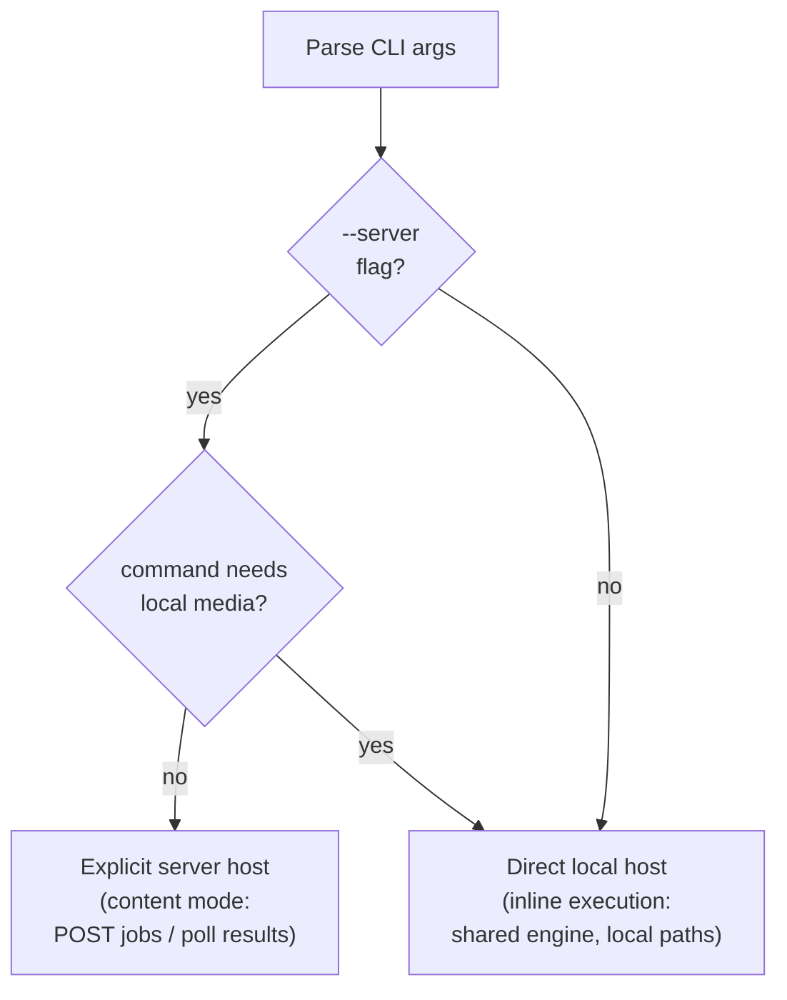

# Dispatch System

**Status:** Current
**Last modified:** 2026-03-26 18:12 EDT

The dispatch router lives in `crates/batchalign-cli/src/dispatch/mod.rs`.
The CLI never owns the ML runtime directly. It now routes processing commands
to either an explicit server host or the in-process direct host.

## Dispatch paths

### 1. Explicit server (`--server URL`)

When the user passes `--server` or sets `BATCHALIGN_SERVER`, the CLI uses
single-server HTTP dispatch.

- CHAT commands use content mode: file text is submitted over `POST /jobs`
- media-only commands can submit media names when the remote server can resolve
  them from `media_roots` or `media_mappings`
- multi-server fan-out is not part of the documented release surface

### 2. Direct local execution

If no explicit server is set, the CLI prepares a local paths-mode submission and
runs it inline through `DirectHost`.

In this path, the CLI and direct host stay in one process: there is no HTTP hop,
no queue, no registry discovery, and no persistent daemon requirement. The same
shared execution engine still runs the command recipe and worker orchestration.

### 3. Commands forced to local media access

`transcribe`, `transcribe_s`, `benchmark`, and `avqi` require client-local media
discovery or local audio access. If the user passes `--server` for one of these
commands, the CLI warns and falls back to direct local execution instead of
using the remote URL.

`benchmark` is still a composite Rust-owned workflow (`transcribe` followed by
`compare`), but it now follows the same direct-vs-server host selection rules
as the other audio-dependent commands.

## Current scope

This release documents only:

- one explicit remote server URL
- one direct local host
- one explicit server host that owns queueing, persistence, warmup, registry
  discovery, and dashboard state

It does not document public fleet or multi-server scheduling behavior.

## Worker transport

CLI-to-server transport is HTTP.

Server-to-worker transport is stdio JSON-lines IPC. The Python worker entry
point in `batchalign/worker/_main.py` still owns the process lifetime and
read/write loop, but Rust now owns the generic stdio op validation and dispatch
envelope through the `batchalign_core` PyO3 bridge. HTTP is not used between
the Rust server and Python workers. The current slim Python console-script vs
full Rust CLI split is a packaging/build concern, not a dispatch concern, and
should not be modeled here.
