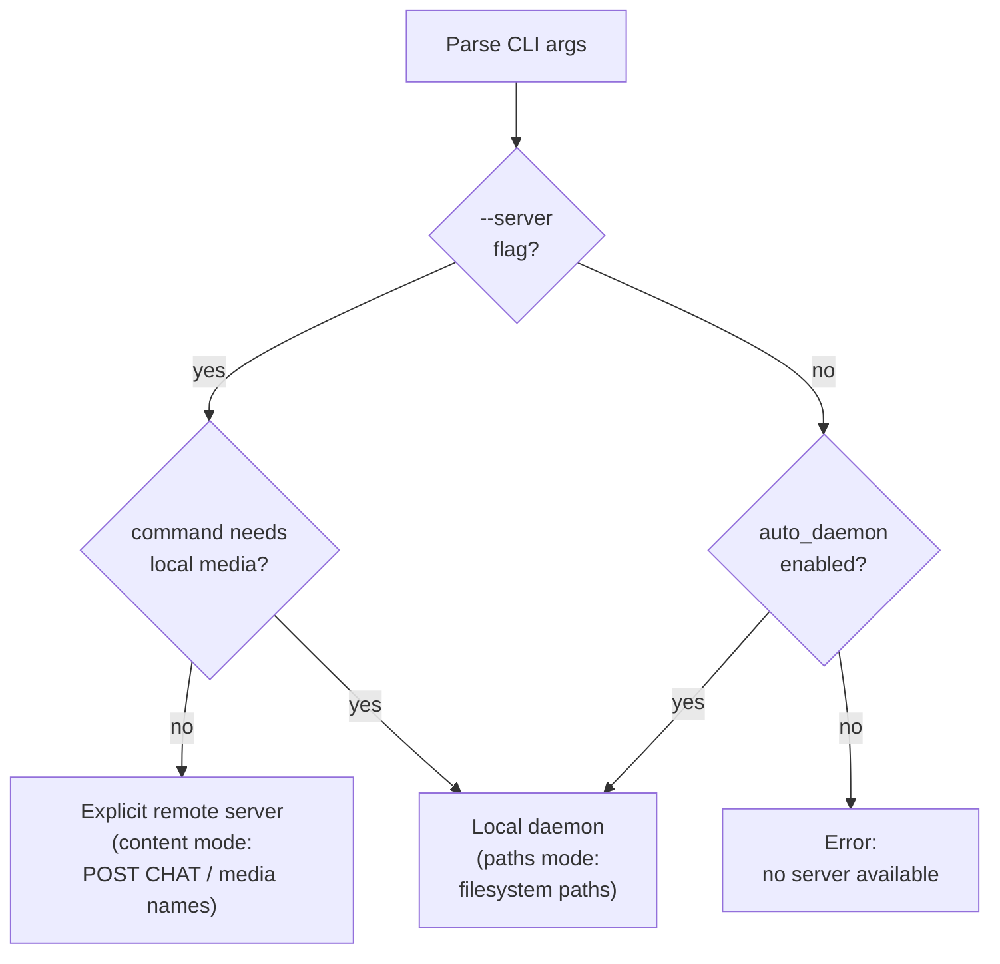

# Dispatch System

**Status:** Current
**Last updated:** 2026-03-17

The dispatch router lives in `crates/batchalign-cli/src/dispatch/mod.rs`.
The CLI never loads ML models directly. It always routes processing commands to
either an explicit server or a local daemon.



## Dispatch paths

### 1. Explicit server (`--server URL`)

When the user passes `--server` or sets `BATCHALIGN_SERVER`, the CLI uses
single-server HTTP dispatch.

- CHAT commands use content mode: file text is submitted over `POST /jobs`
- media-only commands can submit media names when the remote server can resolve
  them from `media_roots` or `media_mappings`
- multi-server fan-out is not part of the documented release surface

### 2. Local daemon (paths mode)

If no explicit server is set and `auto_daemon` is enabled in
`~/.batchalign3/server.yaml`, the CLI starts or reuses a local daemon and
submits jobs in paths mode.

In paths mode, the CLI sends canonical source/output paths and the daemon reads
and writes files directly on the shared local filesystem.

### 3. Commands forced to local media access

`transcribe`, `transcribe_s`, and `avqi` require local media discovery. If the
user passes `--server` for one of these commands, the CLI warns and falls back
to the local daemon path instead of using the remote URL.

`benchmark` can use either explicit remote dispatch or the local daemon,
depending on how the command is invoked and what capabilities the daemon
advertises.

### 4. No server available

If no explicit server is configured and local-daemon startup is unavailable,
dispatch exits with an actionable error such as:

```text
error: no server available. Use --server URL or enable auto_daemon in server.yaml.
```

## Current scope

This release documents only:

- one explicit remote server URL
- one local daemon profile
- one optional sidecar daemon profile for transcribe-heavy workloads

It does not document public fleet or multi-server scheduling behavior.

## Worker transport

CLI-to-server transport is HTTP.

Server-to-worker transport is stdio JSON-lines IPC. The Python worker entry
point in `batchalign/worker/_main.py` still owns the process lifetime and
read/write loop, but Rust now owns the generic stdio op validation and dispatch
envelope through the `batchalign_core` PyO3 bridge. HTTP is not used between
the Rust server and Python workers.
