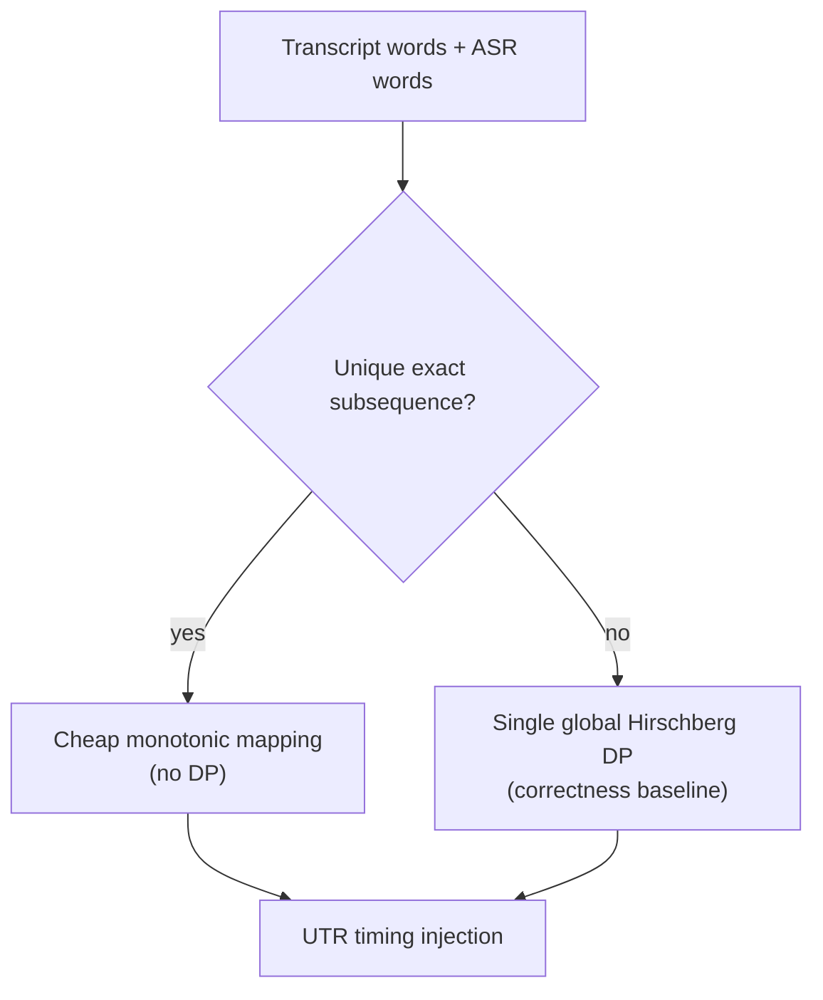

# Dynamic Programming in batchalign3

## Purpose

This document inventories all runtime uses of dynamic programming (DP) in
`batchalign3`, and distinguishes algorithmically necessary uses from
architecturally avoidable runtime remap uses.

## Runtime DP Inventory

| Area | Call site | DP algorithm | Notes |
|---|---|---|---|
| Whisper ASR timestamp extraction | `batchalign/inference/audio.py` | DTW (`_dynamic_time_warping`) | Used to map decoder tokens to audio frames from cross-attention matrices. |
| Whisper FA token timing | `batchalign/inference/fa.py` | DTW (`_dynamic_time_warping`) | Token jump times are extracted in Python and mapped in Rust. |
| Wave2Vec forced alignment | `batchalign/inference/fa.py` | CTC forced alignment (Viterbi-style DP) | `torchaudio.functional.forced_align` on emission matrix vs transcript. |
| FA word-level remapping | `crates/batchalign-chat-ops/src/fa/alignment.rs:apply_indexed_timings` | **None** | Indexed callback protocol maps timings 1:1 by index. |
| FA token-level remapping | `crates/batchalign-chat-ops/src/fa/alignment.rs:align_token_timings` | **None** | Deterministic token→word stitching only; unmatched words remain untimed (no DP skip/remap). |
| UTR timing recovery | `crates/batchalign-chat-ops/src/fa/utr.rs:inject_utr_timing` | Hirschberg edit-distance DP | Global alignment of all document words against all ASR tokens. Correctness-critical: per-utterance windowing caused token exhaustion on hand-edited transcripts. Matches old batchalign's proven approach. |
| Morphosyntax retokenize mapping | `crates/batchalign-chat-ops/src/retokenize/mapping.rs:build_word_token_mapping` | **None** | Deterministic span-join mapping first; length-aware monotonic fallback when text diverges (no DP). |
| WER evaluation | `batchalign-chat-ops/src/dp_align.rs` + `wer_conform.rs` (Rust) | Hirschberg edit-distance DP | Canonical use of DP for transcript comparison. Python `benchmark.py` is a thin wrapper around `batchalign_core.wer_compute()`. |
| Compare command | `crates/batchalign-chat-ops/src/compare.rs` via `dp_align::align` | Hirschberg edit-distance DP | Aligns main vs gold transcript words to compute WER and inject `%xsrep` tiers. Same algorithm as WER evaluation. |

## Necessity Assessment

### Clearly legitimate DP

- **WER evaluation / compare command**: comparing two independent word sequences
  is exactly edit distance territory. The compare command uses the same Hirschberg
  algorithm to align main vs gold transcripts for `%xsrep` annotation.
- **CTC forced alignment (`forced_align`)**: DP is intrinsic to the model family.
- **Whisper DTW path**: if cross-attention DTW is the chosen alignment method,
  DP is part of the method.

### Architecturally avoidable DP

- **FA remapping DP (word/token to transcript)** can be removed if callbacks
  return timings indexed to the exact word list supplied by Rust.
  - Current status: removed from runtime remapping paths (indexed or deterministic
    stitching only).
- **Retokenize char-level DP** is often overkill when deterministic structural
  mapping is available.
  - Current status: removed; fallback is length-aware monotonic mapping.

### Correctness-critical DP

- **UTR global ASR→transcript DP** is a correctness-critical runtime use of DP.
  UTR has to align two independent full-document word sequences: transcript
  words and ASR tokens. A local/windowed matcher can starve later utterances of
  tokens that earlier utterances consumed, which is exactly what happened in the
  407-style hand-edited transcript regression.
  - Current status: UTR uses a single global Hirschberg alignment. This is
    classified as a legitimate DP use (same category as WER/compare), not an
    avoidable runtime remap.
  - Important limitation: this is still a monotonic aligner. Dense overlap and
    text/audio reordering can still remain unmatched in heavily reworked
    hand-edited transcripts.



## Current status

- UTR uses a single global Hirschberg DP alignment of all document words
  against all ASR tokens. This is a correctness requirement — per-utterance
  windowing caused token starvation on real-world data. Timed utterances
  participate to anchor the alignment but their bullets are left unchanged.
  This fixes the 407-style failure class, not every possible hand-edited
  overlap/reordering case.
- Whisper FA callback emits indexed timings when deterministic stitching works.
- FA token-level remapping is deterministic-only (no DP).
- Retokenize mapping is deterministic-first with monotonic fallback (no DP).

Policy guard added: `batchalign/tests/test_dp_allowlist.py` fails CI if new
runtime DP callsites appear outside allowlisted surfaces. The allowlist permits:
- `pyo3/src/pyfunctions.rs` — PyO3 bridge (1 call)
- `crates/batchalign-chat-ops/src/benchmark.rs` — WER (1 call)
- `crates/batchalign-chat-ops/src/compare.rs` — transcript comparison (1 call)
- `crates/batchalign-chat-ops/src/fa/utr.rs` — UTR timing recovery (1 call)

## Algorithmic optimizations (dp_align.rs)

The Hirschberg implementation includes two optimizations beyond the
textbook algorithm:

**Prefix/suffix stripping.** Before entering the O(mn) DP core,
`align()` strips matching prefixes and suffixes in O(n). For the primary
use case (WER/transcript comparison where accuracy is 80-95%), this
reduces the effective DP problem size by 10-100x. Only the differing
middle portion enters Hirschberg recursion.

**Generic `Alignable` trait.** Both `String` (word-level) and `char`
(character-level) entry points share a single generic implementation.
Monomorphization ensures zero overhead while eliminating ~200 lines of
duplicated code (4 pairs of copy-pasted functions unified into 4 generic
functions).

## Known DP Failure Modes

1. **Crossing alignments / rapid overlaps**  
   Global monotonic aligners cannot represent crossing matches, so one side is
   dropped or mis-assigned.

2. **Repeated-token ambiguity**  
   Repeated words create many equal-cost paths; deterministic tie-breaks may pick
   semantically wrong matches.

3. **ASR drift and hallucinations**  
   Large payload/reference divergence causes sparse matches and low timing
   coverage.

4. **Tokenization or normalization mismatch**  
   Char-level DP may align surprising spans when punctuation/case/tokenization
   differ.

5. **Temporal validity vs textual order**  
   Correct per-utterance times can still violate CHAT monotonicity when transcript
   order diverges from audio order.

## Existing Mitigations in Code

- **Monotonicity enforcement (E362)**: `enforce_monotonicity()` strips timing from
  regressions after FA.
- **Same-speaker overlap enforcement (E704)**:
  `strip_e704_same_speaker_overlaps()` strips earlier conflicting timing.
- **Untimed fallback windows**: proportional boundary estimates keep FA from
  skipping all untimed utterances.
- **Retokenize diagnostics + safe fallback**: invalid token mappings keep original
  words and mark parse taint.

## Plausible Next Step: Trouble-Window Escalation

There is a plausible hybrid option between "always global DP" and "never global
DP":

1. run a cheap whole-file anchor pass,
2. identify local divergence regions where coverage or ordering collapses,
3. run heavier DP only inside those trouble windows, and
4. keep the current global-DP path as the fallback when the detector is not
   trustworthy.

That design is promising for performance, especially on mostly-clean files with
small hand-edited regions. It is **not** implemented today. The current global
Hirschberg path remains the correctness reference, because a bad trouble-window
detector would simply reintroduce the same token-starvation and misassignment
class under a new name.

## Regression gate

DP-related behavior is protected by golden and policy tests. A typical focused
run sequence is:

```bash
uv run pytest batchalign/tests/golden/test_dp_golden.py -m golden -v -n 0
```

If intentionally changing behavior, update only the relevant expected files via:

```bash
uv run pytest batchalign/tests/golden/test_dp_golden.py -m golden -v -n 0 --update-golden
```
