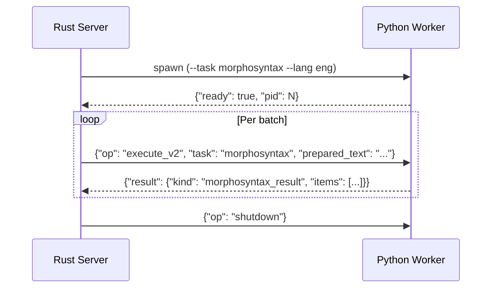

# Worker Interface

**Status:** Current
**Last modified:** 2026-03-21 07:16 EDT

## Architecture

The Rust server owns all orchestration: CHAT parsing, caching, payload
extraction, result injection, validation, and serialization. Python workers are
stateless ML inference endpoints spawned via stdio IPC. They load pre-trained
neural models, receive typed prepared-audio or prepared-text requests, call ML
libraries, and return raw model output. The intended steady state is that
Python remains a thin inference host while workflow policy and document
semantics stay Rust-owned.

`compare` is the clearest Rust-owned reference-projection workflow in this
model, and `benchmark` is a Rust-owned composite workflow that runs transcribe
then compare before materializing its outputs. The Python `benchmark.py`
module remains only a convenience wrapper over Rust WER helpers.

New command semantics should not be invented here. The workflow layer under
`crates/batchalign-app/src/workflow/` owns command shape, typed bundles, and
materialization. This page only describes the worker/provider boundary that
those workflows consume.



## Dispatch Model

### Infer Path (All NLP Tasks)

The server owns CHAT parsing, caching, payload extraction, result injection, and serialization. Workers are stateless inference endpoints — no CHAT text crosses IPC.

| Infer Task | Worker Computes | Server Handles |
|-----------|-----------------|----------------|
| `morphosyntax` | Stanza POS/DEP tagging → raw `to_dict()` | Parse, clear %mor/%gra, extract words, cache, UD→CHAT mapping, inject, validate |
| `utseg` | Stanza constituency → raw parse tree | Parse, extract, cache, compute assignments, apply splits |
| `translate` | Text translation → translated string | Parse, extract text, cache, inject %xtra |
| `coref` | Stanza coref chains → structured annotations | Parse, collect sentences, inject %xcoref (English only, no cache) |
| `fa` | Audio model → raw timings | Parse, group by time-window, cache, DP alignment, map timings to words, inject %wor+bullets |
| `asr` | Python-hosted Whisper/HK engines via `execute_v2`, or Rust-hosted Rev.AI → typed raw ASR payloads | Rust normalization, compound merging, number expansion, retokenization, CHAT assembly |

### Media V2

Live media analysis now also uses typed V2 requests with Rust-owned prepared
artifacts.

| Task | Worker Computes |
|------|-----------------|
| `opensmile` | Prepared audio → raw acoustic feature rows |
| `avqi` | Paired prepared waveforms → raw voice quality metrics |

For the infer path, dynamic task wiring is now also bootstrap-owned. Worker
startup registers the engine-backed runtime helpers consumed by
`worker/_execute_v2.py` and `worker/_infer.py`. Request-time dispatch no longer
branches on raw engine state for tasks such as
`morphosyntax`, `utseg`, `translate`, `fa`, and `asr`.

## Worker Modules

| Python Module | Purpose |
|---------------|---------|
| `worker/_main.py` | Worker CLI entry point and stdio startup |
| `worker/_model_loading/` | Task-level model-loading package (`bootstrap`, `translation`, `forced_alignment`, `asr`) |
| `worker/_stanza_loading.py` | Stanza configuration and ISO-code mapping |
| `worker/_execute_v2.py` | Typed V2 execute router for prepared-audio and prepared-text tasks |
| `worker/_text_v2.py` | Thin batched text-task V2 host; Rust now owns text-task batch-result shaping while Python stays the model-host boundary |
| `worker/_artifact_inputs_v2.py` | Thin Python wrapper over Rust-owned prepared-artifact lookup, descriptor validation, and file-slice reads |
| `worker/_asr_v2.py` | Thin Python wrapper over Rust-owned ASR executor control plane |
| `worker/_fa_v2.py` | Thin Python wrapper over Rust-owned forced-alignment executor control plane |
| `worker/_speaker_v2.py` | Thin Python wrapper over Rust-owned speaker prepared-audio executor control plane |
| `worker/_opensmile_v2.py` | Thin Python wrapper over Rust-owned openSMILE prepared-audio executor control plane |
| `worker/_avqi_v2.py` | Thin Python wrapper over Rust-owned AVQI prepared-audio executor control plane |
| `worker/_types_v2.py` | Pydantic models mirroring the V2 wire format |
| `worker/_protocol.py` | Stdio JSON-lines serving loop |
| `worker/_protocol_ops.py` | Thin Python wrapper over Rust-owned stdio op dispatch |
| `worker/_handlers.py` | Health, capabilities, and preflight handlers |
| `worker/_infer_hosts.py` | Bootstrap-owned batch-infer runtime hosts |
| `worker/_infer.py` | Thin request-time batch inference router |
| `worker/_types.py` | Pydantic models mirroring Rust wire format |

The Python API path is now intentionally narrow:

| Python Module | Purpose |
|---------------|---------|
| `pipeline_api.py` | Thin facade exposing `PipelineOperation`, provider adapters, `run_pipeline()`, and small compatibility wrappers over Rust-owned batch-infer request/response adapter logic |
| `batchalign_core.run_provider_pipeline()` | Rust-owned parsed-document execution loop |

That split is deliberate. Python still exposes a convenient direct API, but the
document-processing logic now lives on the Rust side. Python provides raw model
invocation only.

Incremental FA and morphosyntax processing do not change this design. Those
optimizations already live in the Rust server/runtime layer, so they should not
grow the Python API surface.

## Inference Modules

Each module is a pure inference function — no CHAT parsing, no text processing, no domain logic.

| Module | Input → Output |
|--------|----------------|
| `inference/morphosyntax.py` | words+lang → raw Stanza UD annotations |
| `inference/utseg.py` | words+lang → raw constituency parse tree |
| `inference/translate.py` | text+lang → translated text |
| `inference/coref.py` | sentences → coreference chains |
| `inference/fa.py` | audio+words → raw word-level timings |
| `inference/asr.py` | audio path or prepared waveform → raw ASR payloads (typed V2 wrappers over `monologues` or `whisper_chunks`) |
| `inference/speaker.py` | prepared waveform → raw speaker diarization segments (live via `execute_v2(task="speaker")`) |
| `inference/benchmark.py` | Thin Python-facing convenience wrapper over `batchalign_core.wer_metrics()` |
| `inference/opensmile.py` | prepared waveform → raw acoustic feature rows |
| `inference/avqi.py` | paired prepared waveforms → raw voice quality metrics |

## Capability Detection

At server startup, the Rust server spawns a **probe worker** — a temporary
Python worker whose sole job is to report infer capability facts:

1. **Infer tasks** — which inference backends are available (e.g., "can I
   `import torch, torchaudio`?" → FA is available). This uses import probes in
   `_capabilities()` from `batchalign/worker/_handlers.py`.

2. **Engine versions** — non-empty engine identifiers for every advertised infer
   task, used for cache/version gating.

The Rust server then runs these through `validate_infer_capability_gate()`,
which validates the engine-version table and derives the released command
surface from infer-task support. Server-owned commands such as `transcribe`,
`transcribe_s`, and `benchmark` are synthesized there from ASR availability.

```
Startup:
  Rust server spawns probe worker (command=morphotag, lang=eng)
  → Python: _capabilities()        → infer_tasks=[morphosyntax, utseg, fa, ...]
  → Python: _capabilities()        → engine_versions={morphosyntax: stanza, ...}
  → Rust: validate_infer_capability_gate(infer_tasks, engine_versions)
  → Rust synthesizes [transcribe, transcribe_s, benchmark] from ASR support
  → Final capabilities advertised via /health endpoint
```

### Infer Task Probes

Each `InferTask` has a set of Python imports that must succeed for it to be advertised:

| InferTask | Required Imports | Default Engine Version |
|-----------|-----------------|----------------------|
| `morphosyntax` | `stanza` | `"stanza"` |
| `utseg` | `stanza` | `"stanza"` |
| `coref` | `stanza` | `"stanza"` |
| `translate` | `googletrans` | `"googletrans-v1"` |
| `fa` | `torch`, `torchaudio` | `"whisper"` |
| `asr` | `whisper` or a configured Rev.AI key | `"whisper"` or `"rev"` |
| `opensmile` | `opensmile` | `"opensmile"` |
| `avqi` | `parselmouth`, `torchaudio` | `"praat"` |
| `speaker` | `pyannote.audio` | `"pyannote"` |

Rev.AI-backed server-mode transcription and Rev-backed UTR are also
synthesized on the Rust side. The worker infer-task table now represents "can
the system satisfy this infer task at all?", not only "can Python import a
local model package?" For ASR, that means either a Python-hosted engine such
as Whisper or the Rust-owned Rev.AI path with a configured legacy key.

> **Design note:** Infer tasks use **import probes** (can the dependency be
> imported?), not loaded model state (is a model warmed up?). This is critical
> because the probe worker only loads models for one command (`morphotag`), but
> Rust still needs enough information to derive the released command surface.
> The actual model loading happens when a real worker is spawned for a specific
> command.
>
> All dependencies in the table above are part of the base `batchalign3`
> package — a standard `uv tool install batchalign3` gives you every built-in
> engine family, including Cantonese/HK providers. The import probes exist as a
> safety net for environments where a dependency failed to install or was
> removed.

`speaker` in the table above is a worker infer task, not a standalone CLI
command. As in batchalign2, the user-facing diarization surface is
`transcribe_s` / `--diarize`.

### Checking Capabilities

Users can check what their server advertises:

```bash
curl http://localhost:8000/health | python3 -m json.tool
```

The `capabilities` field in the response lists all advertised commands. If a
command you expect is missing, the corresponding infer task likely failed its
import probe or did not report an engine version.

## HK/Cantonese Engines

Alternative inference providers for Hong Kong Cantonese (Tencent ASR, Aliyun
ASR, FunASR, Cantonese FA) are built-in modules activated via engine overrides
(`--engine-overrides '{"asr": "tencent"}'`). Each engine is a `(load, infer)`
function pair in `batchalign/inference/hk/`, dispatched via `AsrEngine` and
`FaEngine` enums. Python owns only the provider runtime boundary; shared ASR
projection and normalization now live in Rust helpers.

See [HK/Cantonese Engines](hk-cantonese-engines.md) for full architecture and
migration details.
