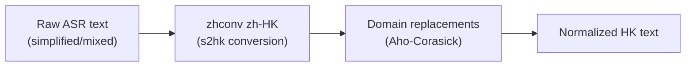

# HK/Cantonese Engines: Migration and Architecture

**Status:** Current
**Last updated:** 2026-03-17

## Overview

Batchalign includes built-in alternative ASR and forced alignment engines for
Hong Kong Cantonese, activated via `--engine-overrides`. These were originally
an external plugin package (`batchalign-hk-plugin`) and were folded into the
core repository in March 2026 as part of the broader effort to eliminate the
plugin system and consolidate all inference logic under Rust-owned
orchestration.

This page documents the migration history, architectural decisions, and the
Cantonese text normalization pipeline that was migrated from Python to Rust.

## Migration Timeline

```
Feb 2026   HK plugin assessed for pluginization (kept external)
Mar 9      Plugin system deleted, HK engines folded into batchalign/inference/hk/
Mar 9      Cantonese text normalization migrated from Python (OpenCC) to Rust (zhconv)
```

## Architecture

### Engine Registration

HK engines are registered directly in the worker's model loading and dispatch
code — no plugin discovery, no entry points, no dynamic registration.

```mermaid
flowchart LR
    cli["CLI\n--engine-overrides\n'{\"asr\": \"tencent\"}'"]
    server["Rust Server"]
    worker["Python Worker"]

    subgraph "Worker Model Loading"
        load["load_worker_task()"]
        select{"AsrEngine?"}
        whisper["load whisper"]
        tencent["load_tencent_asr()"]
        funaudio["load_funaudio_asr()"]
        aliyun["load_aliyun_asr()"]
    end

    cli --> server --> worker --> load --> select
    select -->|whisper| whisper
    select -->|tencent| tencent
    select -->|funaudio| funaudio
    select -->|aliyun| aliyun
```

Engine selection uses `AsrEngine` and `FaEngine` enums in `worker/_types.py`
(no boolean blindness, no string matching). Each engine is a `(load, infer)`
function pair in `batchalign/inference/hk/`.

The Python side now keeps only the unavoidable provider/runtime boundary for
Tencent, Aliyun, and FunASR:

- Python owns SDK/model loading and the transport call itself
- Rust owns the shared projection from raw provider output into monologues and
  timed-word payloads through `batchalign_core`

That split keeps the HK engines aligned with the rest of the project’s
direction: Python as a thin model host, Rust as the owner of shared shaping
and document-facing semantics.

### Available Engines

| Engine | Task | Module | Dependencies |
|--------|------|--------|-------------|
| `tencent` | ASR | `_tencent_asr.py`, `_tencent_api.py` | `pip install "batchalign3[hk-tencent]"` + credentials |
| `aliyun` | ASR | `_aliyun_asr.py` | `pip install "batchalign3[hk-aliyun]"` + credentials |
| `funaudio` | ASR | `_funaudio_asr.py`, `_funaudio_common.py` | `pip install "batchalign3[hk-funaudio]"` |
| `wav2vec_canto` | FA | `_cantonese_fa.py` | `pip install "batchalign3[hk-cantonese-fa]"` |

### Credential Configuration

Cloud-based engines (Tencent, Aliyun) still use the legacy `~/.batchalign.ini`
shape for credentials, but worker-launched server/CLI flows now resolve those
keys in Rust and inject them into the Python worker environment before startup.
Direct Python entrypoints can still fall back to `~/.batchalign.ini`:

```ini
[asr]
engine.tencent.id = <your-id>
engine.tencent.key = <your-key>
engine.tencent.region = <region>
engine.tencent.bucket = <cos-bucket>

engine.aliyun.ak_id = <access-key-id>
engine.aliyun.ak_secret = <access-key-secret>
engine.aliyun.ak_appkey = <appkey>
```

Credential validation uses `read_asr_config()` which raises `ConfigError` with
clear messaging for missing sections, missing keys, or empty values.

## Why the Plugin System Was Removed

The plugin system (`batchalign.plugins`, `PluginDescriptor`, `InferenceProvider`,
`discover_plugins()`) added indirection with no practical benefit:

1. **Only one plugin existed** — `batchalign-hk-plugin` was the sole user.
2. **Entry-point discovery is fragile** — installation order, environment
   isolation, and import errors created support burden.
3. **Enum dispatch is simpler** — `AsrEngine::Tencent` in Rust and
   `AsrEngine.TENCENT` in Python are type-safe, discoverable, and testable.
4. **Optional extras solve the dependency problem** — `pip install
   "batchalign3[hk-tencent]"` is equivalent to installing a separate package
   but without the discovery machinery.

The plugin system was deleted entirely: `plugins.py`, `PluginDescriptor`,
`InferenceProvider`, `discover_plugins()`, and all plugin test infrastructure.
Detailed design-history notes for that retired plugin system are preserved in
maintainer archives; this public page keeps only the current architecture and
the migration rationale.

## Cantonese Text Normalization: Python → Rust

### The Problem

Cantonese ASR engines (FunASR, Tencent, Aliyun) return text in simplified
Chinese or with Mainland character variants. For CHAT corpora, this text must
be normalized to Hong Kong Traditional Chinese with domain-specific corrections.

### Before (Python)

```python
# _common.py — 70 lines of normalization infrastructure
_CANTONESE_REPLACEMENTS = { "系": "係", "呀": "啊", ... }  # 31 entries
_CANTONESE_REPLACE_RE = re.compile("|".join(re.escape(k) for k in ...))

def normalize_cantonese_text(text: str) -> str:
    converted = _opencc_convert(text)  # OpenCC s2hk (C++ dependency)
    return _CANTONESE_REPLACE_RE.sub(lambda m: ..., converted)
```

Problems with the Python approach:

- **OpenCC is a C++ dependency** — complex build, platform-specific wheels,
  optional import with fallback to no-op
- **Fallback was silent** — if OpenCC wasn't installed, text passed through
  un-normalized without warning
- **Regex replacement is sequential** — no leftmost-longest matching guarantee
  for overlapping patterns

### After (Rust)

```
Rust: batchalign-chat-ops/src/asr_postprocess/cantonese.rs
├── zhconv crate (pure Rust, zh-HK variant)
│   └── Aho-Corasick automata from OpenCC + MediaWiki rulesets
│   └── 100-200 MB/s throughput
└── Domain replacement table (31 entries)
    └── Aho-Corasick with leftmost-longest matching
```



Improvements:

- **Pure Rust, no C++ dependency** — `zhconv` compiles Aho-Corasick automata
  from the same OpenCC and MediaWiki rulesets, runs at 100-200 MB/s
- **Always available** — no optional import, no silent fallback.
  Normalization is compiled into `batchalign_core.so`
- **Correct overlapping pattern handling** — Aho-Corasick with
  `LeftmostLongest` matching ensures multi-character patterns like "聯係"→"聯繫"
  take priority over single-character "系"→"係"
- **Integrated into ASR pipeline** — normalization runs as stage 4b in
  `process_raw_asr()`, after number expansion and before long turn splitting.
  This means normalization applies to all Cantonese ASR output automatically,
  not just when HK engine callers remember to call it

### Pipeline Integration

```
process_raw_asr() stages (lang="yue"):
1. Compound merging
2. Timed word extraction (seconds → ms)
3. Multi-word splitting (timestamp interpolation)
4. Number expansion (digits → word form)
4b. ★ Cantonese normalization (simplified→HK traditional + domain replacements)
5. Long turn splitting (>300 words)
6. Retokenization (punctuation-based utterance splitting)
```

### Domain Replacement Table

The 31-entry table corrects Cantonese-specific character variants that zhconv's
generic zh-HK conversion misses or gets wrong:

| Category | Examples |
|----------|---------|
| Multi-char (13) | 聯係→聯繫, 真系→真係, 中意→鍾意, 較剪→鉸剪 |
| Single-char (18) | 系→係, 呀→啊, 噶→㗎, 松→鬆, 吵→嘈 |

Multi-character entries are matched first (leftmost-longest) to prevent partial
matches. For example, "聯係" matches as a unit rather than "聯" + "係".

### PyO3 Exposure

Two functions are exposed to Python:

```python
import batchalign_core

# Full normalization: zhconv zh-HK + domain replacements
batchalign_core.normalize_cantonese("你真系好吵呀")  # → "你真係好嘈啊"

# Normalize + strip CJK punctuation + per-character split
batchalign_core.cantonese_char_tokens("真系呀，")  # → ["真", "係", "啊"]
```

Python `_common.py` delegates to these — zero normalization logic remains in
Python.

## Migration Outcomes and Current Safeguards

### 1. UTF-8-safe retokenization for CJK text

**Location:** `batchalign-chat-ops/src/asr_postprocess/mod.rs`

The retokenizer checked for sentence-ending punctuation by slicing the last
byte of a word:

```rust
// BEFORE (broken): assumes last character is 1 byte
let last = &word[word.len() - 1..];
// PANICS on CJK: "你" is 3 bytes, word.len()-1 splits mid-character
```

The current implementation uses proper character boundary detection:

```rust
// AFTER: finds the byte offset of the last character
fn ends_with_ending_punct(word: &str) -> bool {
    match word.chars().last() {
        Some(c) => {
            let mut buf = [0u8; 4];
            is_ending_punct(c.encode_utf8(&mut buf))
        }
        None => false,
    }
}

// Word splitting uses the same boundary logic:
let last_char_boundary = text.text.char_indices()
    .next_back()
    .map(|(i, _)| i)
    .unwrap_or(0);
```

Both `ends_with_ending_punct()` and the retokenize word-splitting logic use
`char_indices()` for proper UTF-8 handling.

### 2. Normalization is always available

**Before:** If OpenCC wasn't installed, `_opencc_convert()` silently returned
the input text unchanged. Users got un-normalized output with no warning.

**After:** Normalization is compiled into the Rust extension. There is no
optional dependency, no fallback path, and no way to get un-normalized output.
The `test_opencc_fallback_when_unavailable` scenario no longer exists because
normalization is part of the core extension.

### 3. HK engines use built-in dispatch, not plugin discovery

**Before:** `discover_plugins()` used `importlib.metadata.entry_points()` which
could fail silently (broken plugin = logged warning + skipped), load wrong
versions (environment isolation issues), or miss plugins entirely (installation
order).

**After:** Direct enum dispatch with compile-time exhaustiveness checking.
Missing engines fail at startup with clear error messages, not at runtime during
inference.

### 4. Provider timing normalization

The Tencent ASR API returns word timings as offsets within a segment
(`OffsetStartMs`, `OffsetEndMs`), not absolute times. The worker converts these
to absolute times as `segment.StartMs + word.OffsetStartMs`, with explicit test
coverage:

```python
# test_tencent_api.py — verifies absolute timing calculation
assert timed == [
    ("啊", 500, 600),    # segment StartMs=500 + offset 0-100
    ("係", 1000, 1200),  # segment StartMs=1000 + offset 0-200
    ("你", 1300, 1500),  # segment StartMs=1000 + offset 300-500
]
```

FunASR timestamps are normalized into start-time order before downstream
processing, with test coverage verifying the sort.

Tencent words with zero or negative duration (`end_ms <= start_ms`) are
filtered out in `timed_words()`:

```python
if abs_end <= abs_start:
    continue  # skip zero-duration words
```

## Test Coverage

### Rust Tests (batchalign-chat-ops)

| Test | What It Verifies |
|------|-----------------|
| `test_single_char_replacement` | 系→係, 呀→啊, 松→鬆, 吵→嘈 |
| `test_multi_char_replacement` | 真系→真係, 中意→鍾意, 較剪→鉸剪 |
| `test_multi_char_priority_over_single` | 聯係→聯繫 (not 聯+係), 系啊→係啊 (not 係+啊) |
| `test_zhconv_simplified_to_hk` | 联系→聯繫 (simplified → HK traditional) |
| `test_full_sentence` | 你真系好吵呀→你真係好嘈啊 |
| `test_idempotent_on_hk_text` | 你好→你好 (already-correct text unchanged) |
| `test_char_tokens_basic` | 真系呀，→["真","係","啊"] |
| `test_char_tokens_strips_all_cjk_punct` | 「你好」！→["你","好"] |
| `test_process_raw_asr_golden_cantonese` | Full pipeline: 你/真系/好/吵/呀→你/真係/好/嘈/啊 |
| `test_process_raw_asr_no_cantonese_for_eng` | 系 stays 系 when lang=eng |

### Python Tests (batchalign/tests/hk/)

133 passed, 18 skipped (integration tests skip when SDKs/credentials unavailable).

| Test File | Tests | Coverage |
|-----------|-------|---------|
| `test_common.py` | 45 | Normalization, config, timestamps, language codes |
| `test_funaudio.py` | 20 | Text cleaning, tokenization, timed word sorting |
| `test_tencent_api.py` | 17 | Model selection, monologues, timed words, normalization |
| `test_cantonese_fa.py` | 14 | Jyutping conversion, romanization, batch FA inference |
| `test_aliyun.py` | 11 | Sentence parsing, word extraction, error handling |
| `test_helpers.py` | 7 | Cross-engine smoke tests |
| `test_integration.py` | 19 | End-to-end with real models (auto-skips) |

### Test Doubles (No Mocks)

The test suite follows batchalign's **no unittest.mock policy**. Test doubles
are alternate implementations of protocols:

- `PyCantoneseFake` — deterministic jyutping lookup (7-character dictionary)
- `_FakeAudioFile` / `_FakeAudioChunk` — stand-ins for audio loading
- `_fake_infer_wave2vec_fa()` — deterministic FA: word i gets timing
  `(i*100, (i+1)*100)`
- `cantonese_fa_env` fixture — patches module-level state with fakes
- `monkeypatch.setattr()` replaces `unittest.mock.patch()` everywhere

## File Map

### Rust (`batchalign-chat-ops`)

```
crates/batchalign-chat-ops/src/asr_postprocess/
├── mod.rs          — Pipeline: process_raw_asr() with Cantonese stage 4b
├── cantonese.rs    — normalize_cantonese(), cantonese_char_tokens()
├── compounds.rs    — Compound word merging
├── num2text.rs     — Number expansion
└── num2chinese.rs  — Chinese/Japanese number converter
```

### Python (`batchalign/inference/hk/`)

```
batchalign/inference/hk/
├── __init__.py         — Engine registration
├── _common.py          — normalize_cantonese_text() (delegates to Rust),
│                         read_asr_config(), provider_lang_code()
├── _tencent_asr.py     — Tencent Cloud ASR load/infer
├── _tencent_api.py     — TencentRecognizer class
├── _aliyun_asr.py      — Aliyun NLS WebSocket ASR
├── _funaudio_asr.py    — FunASR/SenseVoice load/infer
├── _funaudio_common.py — FunAudioRecognizer class
├── _cantonese_fa.py    — Cantonese forced alignment (jyutping + Wave2Vec)
└── _asr_types.py       — Internal TypedDicts
```

### Tests (`batchalign/tests/hk/`)

```
batchalign/tests/hk/
├── conftest.py          — Shared fixtures and test doubles
├── test_common.py       — Normalization, config, timestamps
├── test_funaudio.py     — FunAudioRecognizer tests
├── test_tencent_api.py  — TencentRecognizer tests
├── test_cantonese_fa.py — Jyutping and FA tests
├── test_aliyun.py       — AliyunRunner tests
├── test_helpers.py      — Cross-engine smoke tests
├── test_integration.py  — End-to-end integration tests
└── fixtures/            — Audio clips (05b_clip.mp3, .wav, .cha)
```
