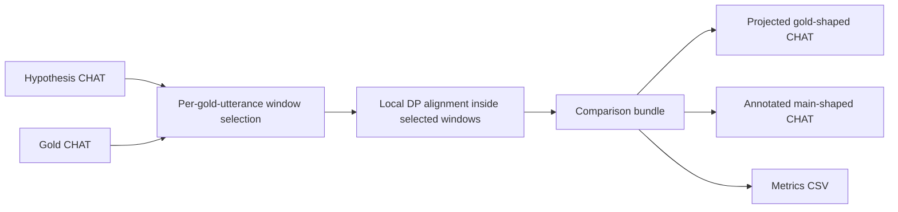
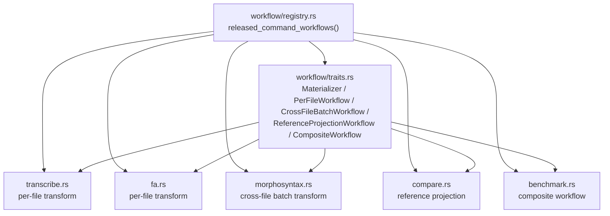
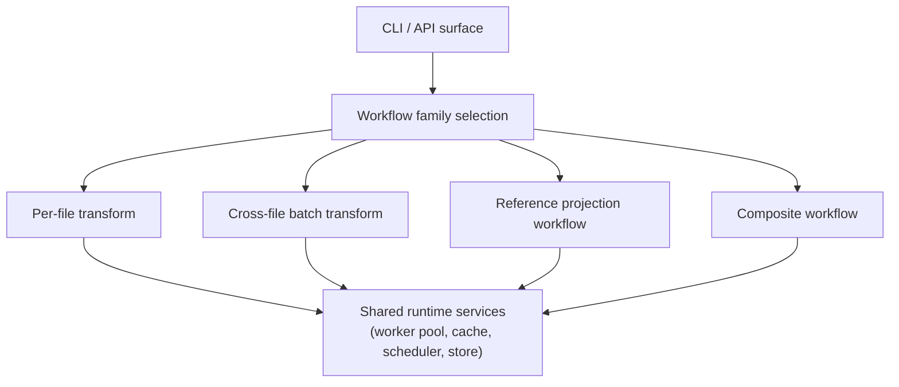
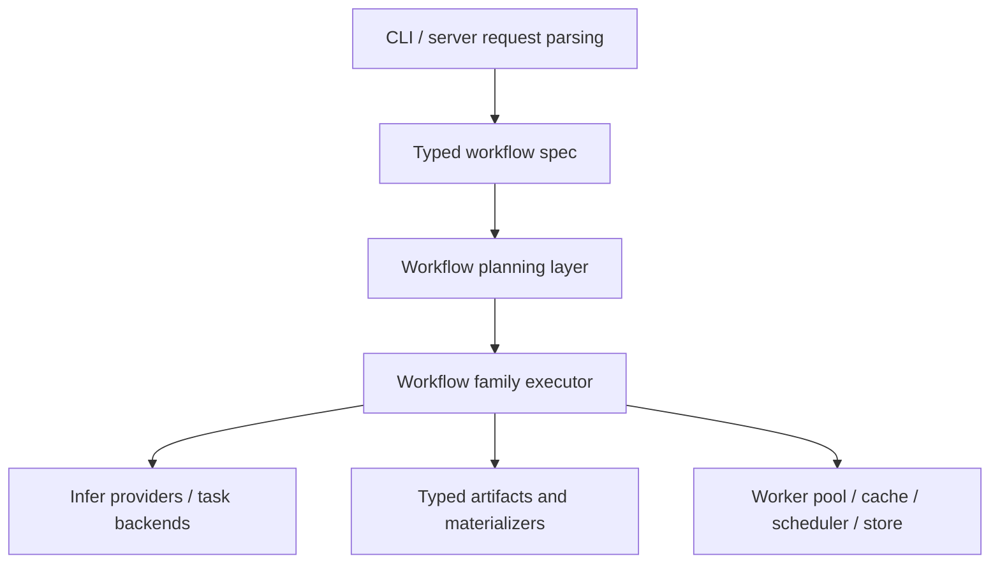
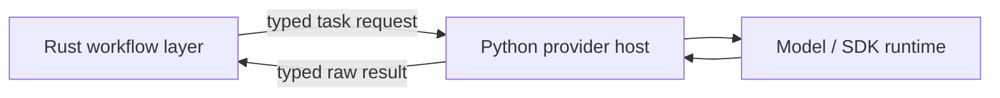

# Hybrid Workflow Architecture

**Status:** Implemented slice, with follow-up slices planned
**Last modified:** 2026-03-21 07:27 EDT

This page describes the architectural direction that is already in the tree and
the follow-up slices that should continue to evolve from it.

If you prefer reading code first, start at
[`crates/batchalign-app/src/workflow/mod.rs`](/Users/chen/batchalign3-rearch/crates/batchalign-app/src/workflow/mod.rs).
That file is now the entry map only. The split that matters is:

- [`crates/batchalign-app/src/workflow/traits.rs`](/Users/chen/batchalign3-rearch/crates/batchalign-app/src/workflow/traits.rs)
  for workflow families
- [`crates/batchalign-app/src/workflow/registry.rs`](/Users/chen/batchalign3-rearch/crates/batchalign-app/src/workflow/registry.rs)
  for the released command catalog

The goal is not to make batchalign3 "more like BA2." The goal is to recover the
parts of BA2 that made workflows easy to understand and extend, while keeping
the runtime and systems advantages that BA3 already has:

- persistent workers
- typed Rust-owned document semantics
- memory-aware concurrency
- cross-file batching
- explicit job lifecycle management

The motivating case is Houjun's `compare` redesign on `batchalign2-master`
(`1f224df346c2ec590d45afa31136a3b878db622b`), but the proposal is broader than
`compare`.

## Executive Summary

batchalign3 should move toward:

- typed workflow families instead of ad hoc per-command orchestration
- typed intermediate artifacts instead of "command returns whatever it returns"
- thin Python provider hosts instead of Python-owned workflow logic
- reusable family-specific execution harnesses instead of one universal command
  abstraction

The intended architecture is a hybrid:

- BA2 strength: visible workflow composition over meaningful artifacts
- BA3 strength: explicit runtime ownership, batching, and concurrency control

The missing layer today is a typed workflow system that sits between the CLI
surface and the runtime machinery.

The first concrete slice now exists under the registry and family traits in:

- [`crates/batchalign-app/src/workflow/mod.rs`](/Users/chen/batchalign3-rearch/crates/batchalign-app/src/workflow/mod.rs)
- [`crates/batchalign-app/src/workflow/traits.rs`](/Users/chen/batchalign3-rearch/crates/batchalign-app/src/workflow/traits.rs)
- [`crates/batchalign-app/src/workflow/registry.rs`](/Users/chen/batchalign3-rearch/crates/batchalign-app/src/workflow/registry.rs)
- [`crates/batchalign-app/src/workflow/transcribe.rs`](/Users/chen/batchalign3-rearch/crates/batchalign-app/src/workflow/transcribe.rs)
- [`crates/batchalign-app/src/workflow/fa.rs`](/Users/chen/batchalign3-rearch/crates/batchalign-app/src/workflow/fa.rs)
- [`crates/batchalign-app/src/workflow/morphosyntax.rs`](/Users/chen/batchalign3-rearch/crates/batchalign-app/src/workflow/morphosyntax.rs)
- [`crates/batchalign-app/src/workflow/compare.rs`](/Users/chen/batchalign3-rearch/crates/batchalign-app/src/workflow/compare.rs)
- [`crates/batchalign-app/src/workflow/benchmark.rs`](/Users/chen/batchalign3-rearch/crates/batchalign-app/src/workflow/benchmark.rs)

## The Stress Test: Houjun's New Compare

The new BA2 compare redesign is a useful architectural stress test because it is
not just "a better algorithm." It changes the shape of the workflow.

Old compare shape:

- main transcript is primary
- gold transcript is reference
- global alignment
- output modifies the main transcript

New compare shape:

- gold transcript becomes the structural scaffold
- each gold utterance selects a best matching hypothesis window
- local DP runs inside that window
- timing, morphology, and dependency can be projected from hypothesis onto gold
- output becomes a projected gold document plus metrics



The architectural lesson is that batchalign needs to represent:

- workflows with multiple primary inputs
- workflows that produce multiple output artifacts
- workflows where output shape is not identical to input shape
- workflows that compose inference, projection, and analysis

That is the harbinger of future work, not an isolated compare issue.

## Code-First Entry Point

The registry in `workflow/registry.rs` is the contributor-facing map from command
name to workflow family and worker capability:

- `released_command_workflows()` is the single list of released command
  descriptors.
- `CommandWorkflowDescriptor` records the command name, family, primary
  `InferTask`, and whether Rust composes the command from lower-level
  capabilities.
- `WorkflowFamily` names the runtime shape.
- `Materializer`, `PerFileWorkflow`, `CrossFileBatchWorkflow`,
  `ReferenceProjectionWorkflow`, and `CompositeWorkflow` describe the narrow
  execution seams.



The registry is the right place to answer two questions quickly:

1. Which released command belongs to which family?
2. Does the server own the command directly or compose it from lower-level
   worker capabilities?

That makes it the best starting point for contributors who want to understand
workflow shape before reading the surrounding orchestration code.

## Current BA3 Reality

Current BA3 is already better than BA2 in several important ways:

- Rust owns CHAT parsing, mutation, validation, and serialization.
- Python workers are mostly infer-task hosts.
- The runtime has explicit job lifecycle, worker pooling, memory gating, and
  persistent processes.
- Several commands already compose multiple steps:
  - transcribe -> utseg -> morphosyntax
  - align -> FA runtime + injection + validation
  - morphotag -> cross-file batch NLP + cache fan-out
  - benchmark = transcribe -> compare

But the implementation still has a structural problem:

- command routing is now centralized in the typed registry, but the CLI and
  runner still have to consume that registry explicitly
- dispatch families are formalized as thin typed workflow wrappers, but the
  shared harnesses are still intentionally conservative
- many workflows are still expressed as per-command orchestrator files that
  delegate into the typed workflow layer rather than being replaced wholesale

The result is that BA3 is currently a command-family system in practice, but not
yet in explicit architecture.

### What is stable for contributors now

These are the safe seams for new work:

- `PerFileWorkflow`
- `CrossFileBatchWorkflow`
- `ReferenceProjectionWorkflow`
- `CompositeWorkflow`
- `Materializer`

The current concrete exemplars are:

- `transcribe`: [`workflow/transcribe.rs`](/Users/chen/batchalign3-rearch/crates/batchalign-app/src/workflow/transcribe.rs)
- `align`: [`workflow/fa.rs`](/Users/chen/batchalign3-rearch/crates/batchalign-app/src/workflow/fa.rs)
- `morphotag`: [`workflow/morphosyntax.rs`](/Users/chen/batchalign3-rearch/crates/batchalign-app/src/workflow/morphosyntax.rs)
- `compare`: [`workflow/compare.rs`](/Users/chen/batchalign3-rearch/crates/batchalign-app/src/workflow/compare.rs)
- `benchmark`: [`workflow/benchmark.rs`](/Users/chen/batchalign3-rearch/crates/batchalign-app/src/workflow/benchmark.rs)

## The Right Target: Workflow Families

The next architecture should not start with one universal `Command` trait.
That would flatten genuinely different runtime shapes into the wrong abstraction.

Instead, batchalign3 should formalize a small number of workflow families.
The current registry already points released commands at those families.

### Family 1: Per-File Transform

One file goes in, one primary artifact comes out.

Examples:

- `align`
- `transcribe`
- `opensmile`
- `avqi`

`transcribe_s` lives beside `transcribe` in the same per-file family and is
surfaced as the diarized variant in the registry.

Current code paths:

- `align`: [`crates/batchalign-app/src/fa/mod.rs`](/Users/chen/batchalign3-rearch/crates/batchalign-app/src/fa/mod.rs) plus [`crates/batchalign-app/src/workflow/fa.rs`](/Users/chen/batchalign3-rearch/crates/batchalign-app/src/workflow/fa.rs)
- `transcribe`: [`crates/batchalign-app/src/transcribe.rs`](/Users/chen/batchalign3-rearch/crates/batchalign-app/src/transcribe.rs) plus [`crates/batchalign-app/src/workflow/transcribe.rs`](/Users/chen/batchalign3-rearch/crates/batchalign-app/src/workflow/transcribe.rs)

Common properties:

- file-local concurrency
- progress, retry, output writing, and failure classification are shared
- per-file runtime bundles are natural

### Family 2: Cross-File Batch Transform

Many files go in, payloads are pooled across files, results fan back out.

Examples:

- `morphotag`
- `utseg`
- `translate`
- `coref`

Current code paths:

- `morphotag`: [`crates/batchalign-app/src/morphosyntax/mod.rs`](/Users/chen/batchalign3-rearch/crates/batchalign-app/src/morphosyntax/mod.rs), [`crates/batchalign-app/src/morphosyntax/batch.rs`](/Users/chen/batchalign3-rearch/crates/batchalign-app/src/morphosyntax/batch.rs), and [`crates/batchalign-app/src/workflow/morphosyntax.rs`](/Users/chen/batchalign3-rearch/crates/batchalign-app/src/workflow/morphosyntax.rs)
- `utseg`: [`crates/batchalign-app/src/utseg.rs`](/Users/chen/batchalign3-rearch/crates/batchalign-app/src/utseg.rs)
- `translate`: [`crates/batchalign-app/src/translate.rs`](/Users/chen/batchalign3-rearch/crates/batchalign-app/src/translate.rs)
- `coref`: [`crates/batchalign-app/src/coref.rs`](/Users/chen/batchalign3-rearch/crates/batchalign-app/src/coref.rs)

Common properties:

- cross-file batching is the key optimization
- output remains per-file even though inference is pooled
- cache partitioning and fan-out are reusable

### Family 3: Reference Projection Workflow

Two artifacts are jointly primary, and the workflow produces a comparison bundle
that can be materialized in more than one form.

Examples:

- current `compare`
- Houjun-style gold-projected compare
- future forced normalization against a curated reference
- future "align model output back onto reviewed transcript" workflows

Current code paths:

- compare orchestration: [`crates/batchalign-app/src/compare.rs`](/Users/chen/batchalign3-rearch/crates/batchalign-app/src/compare.rs)
- compare artifacts and materializers: [`crates/batchalign-app/src/workflow/compare.rs`](/Users/chen/batchalign3-rearch/crates/batchalign-app/src/workflow/compare.rs)

Common properties:

- at least two documents matter structurally
- one intermediate alignment/projection bundle should support several outputs
- output may be main-shaped, gold-shaped, or both

### Family 4: Composite Workflow

One family composes other workflows rather than re-implementing their internals.

Examples:

- `benchmark` = transcribe + compare
- future compare variants that include preprocessing loops or analysis passes

Current code path:

- [`crates/batchalign-app/src/benchmark.rs`](/Users/chen/batchalign3-rearch/crates/batchalign-app/src/benchmark.rs)
- [`crates/batchalign-app/src/workflow/benchmark.rs`](/Users/chen/batchalign3-rearch/crates/batchalign-app/src/workflow/benchmark.rs)

Common properties:

- workflows compose typed sub-workflow outputs
- artifact reuse matters more than provider reuse alone



## Typed Intermediate Artifacts

The architectural mistake to avoid is "every command returns a final file."

The right unit for extensibility is the intermediate artifact bundle.

For `compare`, that likely means something like:

```rust
struct ComparisonBundle {
    main_view: ChatFileView,
    gold_view: ChatFileView,
    utterance_matches: Vec<UtteranceMatchBundle>,
    token_alignment: Vec<TokenMatch>,
    projected_annotations: Vec<ProjectedAnnotation>,
    metrics: CompareMetrics,
}
```

The important point is not the exact field list. The important point is that
comparison should become a typed internal artifact that can be materialized into:

- annotated main transcript
- projected gold transcript
- CSV metrics
- future debugging views or visualization exports

That pattern will generalize well beyond compare.

## Proposed Rust Architecture

### Layering



### Traits: Use Narrow Traits At The Right Seams

The implemented trait boundaries are:

- `Materializer<Artifacts>`
- `PerFileWorkflow`
- `CrossFileBatchWorkflow`
- `ReferenceProjectionWorkflow`
- `CompositeWorkflow`

The best trait boundaries are:

- workflow planning
- workflow family execution
- infer-provider/backend selection
- output materialization

The best trait boundary is not "one trait per command."

#### Workflow spec

This should describe a command or API workflow request in typed terms without
committing to one universal execution shape.

```rust
trait WorkflowSpec {
    type Plan;
    type Request;

    fn plan(request: Self::Request, ctx: &PlanContext) -> Result<Self::Plan, PlanError>;
}
```

#### Family executors

Each workflow family should have its own executor trait because the runtime
shape is materially different.

```rust
trait PerFileWorkflow {
    type Plan;
    type FileInput;
    type FileArtifact;

    async fn run_file(
        &self,
        plan: &Self::Plan,
        input: Self::FileInput,
        services: WorkflowServices<'_>,
    ) -> Result<Self::FileArtifact, WorkflowError>;
}

trait CrossFileBatchWorkflow {
    type Plan;
    type BatchInput;
    type BatchArtifact;

    async fn run_batch(
        &self,
        plan: &Self::Plan,
        input: Self::BatchInput,
        services: WorkflowServices<'_>,
    ) -> Result<Self::BatchArtifact, WorkflowError>;
}

trait ReferenceProjectionWorkflow {
    type Plan;
    type ProjectionBundle;

    async fn build_projection(
        &self,
        plan: &Self::Plan,
        services: WorkflowServices<'_>,
    ) -> Result<Self::ProjectionBundle, WorkflowError>;
}
```

This is intentionally family-oriented, not command-oriented.

#### Materializers

Materializers should turn bundles into user-facing outputs.

```rust
trait Materializer<Artifact> {
    type Output;

    fn materialize(&self, artifact: &Artifact) -> Result<Self::Output, MaterializeError>;
}
```

That is how compare can cleanly support more than one result shape without
smuggling policy through one hardcoded command path.

### Where GATs Help

GATs can be useful, but only in narrow places where borrowed views avoid large
clones of parsed documents or extracted payloads.

Two likely good uses:

- borrowed artifact views over `ChatFile`-derived structures
- borrowed batch partitions that expose file-local slices without copying

Sketch:

```rust
trait ArtifactView {
    type View<'a>
    where
        Self: 'a;

    fn view(&self) -> Self::View<'_>;
}
```

That is enough to support executor code that wants to inspect or materialize
artifacts without forcing eager deep copies.

GATs are not needed for the top-level architecture. They are an optimization and
API-cleanliness tool for borrowed views.

### What Rust Should Own

Rust should own:

- workflow planning
- document parsing and serialization
- cache policy
- batching policy
- alignment/projection logic
- runtime scheduling
- materialization policy
- release-facing command semantics

That includes sophisticated compare logic. If compare becomes a richer workflow,
its structural rules belong in Rust, not in Python worker code.

## Proposed Python Boundary

Python should be a provider host, not a workflow engine.

### Python responsibilities

- load ML libraries and SDKs
- run model inference
- return typed raw task results
- expose capability and engine-version facts

### Python should not own

- command semantics
- workflow branching
- document projection
- cache policy
- compare/reference workflow rules
- output materialization



### Practical consequence for PyO3

`pyo3` should keep shrinking until it is only:

- a narrow provider host
- a narrow direct-Python adapter for Rust-owned operations
- a type bridge for shared schemas

It should not keep:

- CLI entrypoint ownership
- server orchestration ownership
- wide application dependency fanout

That means:

- workflow logic should move into Rust crates
- provider-specific Python adapters should become thinner
- shared schemas should live in small Rust crates such as `batchalign-types`

## Compare As The First Real Consumer

The best first proving ground for this architecture is compare.

Compare now wants at least two explicit modes:

- `main-annotated`
- `gold-projected`

And it may later want:

- debug alignment artifacts
- utterance-window diagnostics
- richer per-POS or per-tier metrics

That is exactly the kind of pressure that workflow families plus typed
materializers are meant to absorb.

## Integration Guidance For Houjun's Future Work

If Houjun starts landing richer compare, analysis, or multi-stage workflows, the
architecture should guide implementation like this:

1. Add or refine a workflow family if the runtime shape is genuinely new.
2. Add typed bundle artifacts before deciding on final output materialization.
3. Keep provider/model logic behind typed task backends.
4. Keep document and projection rules in Rust.
5. Make CLI commands thin adapters over typed workflow specs.

That is how batchalign3 can become easier to extend without regressing into BA2's
stringly sequential pipeline shell.

## Recommended Near-Term Refactors

### 1. Formalize workflow-family modules

Promote the current dispatch families into explicit architecture:

- per-file executor
- cross-file batch executor
- reference-projection executor
- composite executor

### 2. Introduce typed bundle outputs

Start with compare because it is the clearest case.

### 3. Move command metadata into typed workflow specs

Stop scattering command metadata across CLI match arms and runner string tables.

### 4. Continue shrinking PyO3

Make the Python boundary provider-shaped instead of application-shaped.

### 5. Update docs as code changes land

The implementation should not outrun the architecture docs. This proposal is
only useful if future refactors keep the diagrams and invariants current.

## Bottom Line

Houjun is right to worry about architecture that can survive growth.

The answer is not to restore BA2 unchanged, and it is not to keep BA3's current
command-specific orchestration forever.

The right direction is:

- BA2-style workflow clarity
- BA3-style runtime ownership
- typed workflow families
- typed intermediate artifacts
- thin Python provider hosts

That gives batchalign3 a path toward more commands, more engines, more
cross-cutting workflows, and more sophisticated compare-style analyses without
letting architecture become the next bottleneck.

See [Workflow Architecture Execution Plan](../developer/workflow-architecture-execution-plan.md)
for the staged implementation program.
