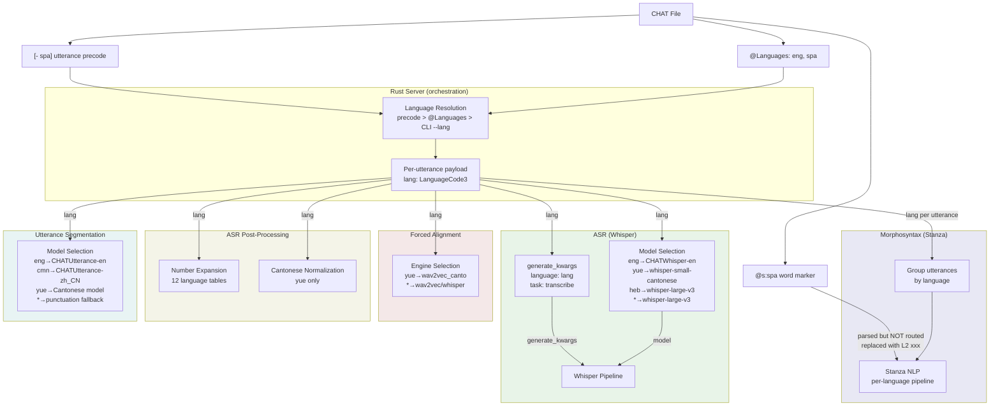
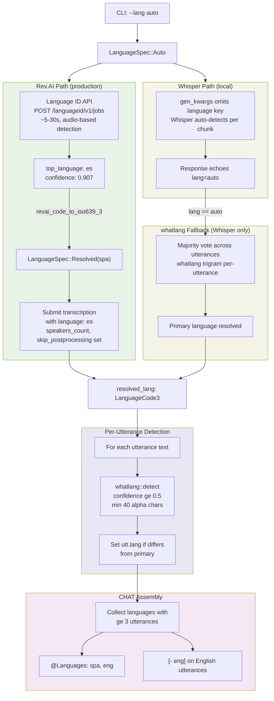
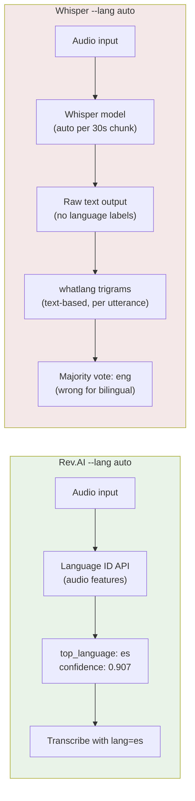

# Language Architecture

**Status:** Current
**Last updated:** 2026-03-28 16:15 EDT

How language information flows from CHAT headers through the entire
batchalign3 pipeline, where it affects processing, and where gaps exist.

## Language Parameter Flow (All Engines)



**Key:** Language flows to ALL engines via `generate_kwargs` (ASR), per-utterance
grouping (morphosyntax), engine selection (FA), and conditional gates (post-processing).
Word-level `@s` markers are parsed but not routed — replaced with `L2|xxx`.

## Auto-Detection: `--lang auto`

When the user passes `--lang auto`, the pipeline auto-detects the spoken
language(s) from audio content, generates correct CHAT language headers, and
inserts `[- lang]` code-switching precodes on utterances in secondary languages.

### Detection Flow



### Algorithm: Rev.AI Language Identification (Primary Language)

The Rev.AI Language Identification API is a purpose-built audio classifier
that identifies the dominant language from acoustic features. It is used as
a pre-pass before transcription when `--lang auto` with the Rev.AI backend.

**API:** `POST /languageid/v1/jobs` → poll → `GET /languageid/v1/jobs/{id}/result`

**Response:**
```json
{
  "top_language": "es",
  "language_confidences": [
    {"language": "es", "confidence": 0.907},
    {"language": "en", "confidence": 0.08}
  ]
}
```

**Properties:**
- **Accuracy:** Audio-based (phonetic features), not text-based. Handles
  code-switching correctly because it hears the dominant phonetic patterns.
  Far superior to text trigrams for bilingual audio.
- **Speed:** ~5-30 seconds. Runs before transcription submission.
- **Cost:** One additional API call per file (~$0.01-0.05). Negligible
  compared to transcription cost.
- **Coverage:** All Rev.AI-supported languages (~60+).

**Fallback chain:** If Language ID fails (network error, unsupported format),
falls back to submitting transcription with `language: "auto"` and using
whatlang on the transcript text.

### Algorithm: whatlang Trigram Detection (Per-Utterance + Whisper Fallback)

Per-utterance language detection uses the `whatlang` Rust crate, a trigram-based
statistical classifier. Used for two purposes:

1. **Per-utterance code-switching** — tag utterances in a secondary language
   with `[- lang]` precodes (all backends)
2. **Primary language fallback** — when Rev.AI Language ID is unavailable
   (Whisper backend, or Language ID failure), majority-vote across utterances

**Properties:**
- **Speed:** O(n) in text length, no ML model, no network call. Negligible
  cost — typically < 1ms per utterance, < 50ms total for 200 utterances.
- **Accuracy:** Reliable for monolingual utterances > 40 characters.
  Unreliable for code-switched utterances (mixed-language text confuses
  trigram profiles). Not used for primary detection with Rev.AI backend.
- **Coverage:** 69 languages with ISO 639-3 mappings.

**Thresholds:**
| Parameter | Value | Rationale |
|-----------|-------|-----------|
| `MIN_CHARS_FOR_DETECTION` | 40 | Below this, trigrams are too sparse. Raised from 20 to reduce false positives on short bilingual utterances. |
| `UTTERANCE_CONFIDENCE_THRESHOLD` | 0.5 | Per-utterance: moderate bar to avoid false code-switch markers |
| `MIN_UTTERANCES_FOR_SECONDARY` | 3 | A language must appear in >= 3 utterances to be listed in `@Languages`. Prevents false positives from trigram confusion on isolated short utterances. |

**Known limitation:** whatlang struggles with code-switched utterances
(e.g., "Me dice que trabaja en furniture I mean..."). Such utterances may
be classified as either language depending on which trigrams dominate. This
is inherent to character n-gram classifiers and is why Rev.AI Language ID
(audio-based) is preferred for primary language detection.

### Two-Stage Language Resolution

Language resolution happens in two stages:

**Stage 1: Primary language (whole-file level)**

Determines the dominant language for `@Languages` header and `@ID` lines.

| ASR Engine | How primary is determined |
|------------|--------------------------|
| Rev.AI (auto) | **Rev.AI Language Identification API** — separate audio-based pre-pass (~5-30s). Returns `top_language` with confidence. Far more accurate than text trigrams for code-switched audio. |
| Whisper (auto) | whatlang majority vote across utterances (fallback to `"eng"` if undetectable) |
| Any (explicit) | User-specified `--lang spa` used directly |

The Rev.AI Language ID pre-pass also enables the transcription job to be
submitted with a concrete language code instead of `"auto"`, which improves
ASR quality (Rev.AI can optimize for the known language) and enables
language-specific settings like `speakers_count` and `skip_postprocessing`.

**Stage 2: Per-utterance language (code-switching detection)**

Only runs when `--lang auto`. For each post-processed utterance:
1. Concatenate all word texts into a single string
2. Run `whatlang::detect()` — returns `(Lang, confidence)` or `None`
3. If confidence >= 0.5 and text has >= 40 alpha characters, set `utt.lang = Some(iso639_3_code)`
4. If `utt.lang` differs from the primary language, a `[- lang]` precode is emitted

### CHAT Output: `[- lang]` Precode Insertion

The `[- lang]` precode is a standard CHAT annotation indicating that an
utterance is in a different language than the file's primary language.

**Example output for a Spanish-primary bilingual file:**

```
@Languages:	spa, eng
@Participants:	PAR Participant Participant, INV Investigator Investigator
@ID:	spa|corpus_name|PAR|||||Participant|||
@ID:	spa|corpus_name|INV|||||Participant|||
@Media:	herring03, audio
*PAR:	sí porque ella no quería . 12500_14200
*INV:	[- eng] six to eight weeks yeah . 41672_42727
*PAR:	bueno ya le dije que no . 43000_45100
```

**Implementation:** In `build_chat.rs`, when assembling word-level utterances,
the `UtteranceDesc.lang` field is checked against `langs[0]` (primary). If
different, `TierContent.language_code` is set to `LanguageCode::new(utt_lang)`,
which the talkbank-model serializer renders as `[- lang]` before the first word.

### Multi-Language `@Languages` Header

When auto-detecting, the `@Languages` header lists all detected languages
ordered by frequency:

1. Primary language always first (from Rev.AI detection or whatlang primary)
2. Secondary languages in descending frequency order
3. Languages detected in fewer utterances still appear (no minimum threshold)

The `collect_detected_languages()` function tallies per-utterance detections
and produces the ordered list.

## Language Information in CHAT

CHAT encodes language at three levels:

| Level | Syntax | Example | Scope |
|-------|--------|---------|-------|
| File | `@Languages: eng, spa` | Primary + secondary languages | All utterances |
| Utterance | `[- spa]` precode | Override language for one utterance | One utterance |
| Word | `@s:spa` marker | Mark one word as different language | One word |

### Resolution Order

For each utterance, the effective language is:
1. Utterance precode `[- lang]` if present
2. First language from `@Languages` header
3. Batch-level `primary_lang` (from CLI or server request)

For each word, the effective language is:
1. `@s:lang` marker if present
2. Utterance-level language (above)

## Where Language Affects Processing

### Morphosyntax (per-utterance routing — IMPLEMENTED)

Utterances are grouped by language and routed to language-specific Stanza
models. A file with `@Languages: eng, spa` and `[- spa]` precodes on some
utterances will use the English Stanza model for unmarked utterances and
the Spanish model for `[- spa]` utterances.

**Word-level `@s` markers are NOT routed.** Words marked `@s:spa` in an
English utterance still go through the English Stanza model. The Rust
post-processor replaces their morphosyntax with `L2|xxx` (a conservative
placeholder). This is documented and intentional — routing individual
words to different Stanza models mid-sentence would produce inconsistent
dependency parses.

### ASR (model selection AND inference hint — BOTH IMPLEMENTED)

**Model selection:** The language code determines which Whisper model loads:

| Language | Model |
|----------|-------|
| English | `talkbank/CHATWhisper-en` (fine-tuned) |
| Cantonese | `alvanlii/whisper-small-cantonese` |
| Hebrew | `ivrit-ai/whisper-large-v3` |
| All others | `openai/whisper-large-v3` |

**Inference hint:** The language code IS passed to Whisper's `language`
parameter via `generate_kwargs` at inference time (`types.py:gen_kwargs()`
line 197). This constrains Whisper's decoder to the correct language.
Identical to batchalign2-master (Jan 9 commit, `infer_asr.py` line 184).

Exception: Cantonese uses a different config without `language`/`task`
keys (the Cantonese fine-tuned model handles this internally).

### Utterance Segmentation (language-specific models — IMPLEMENTED)

| Language | Model |
|----------|-------|
| English | `talkbank/CHATUtterance-en` |
| Mandarin | `talkbank/CHATUtterance-zh_CN` |
| Cantonese | `PolyU-AngelChanLab/Cantonese-Utterance-Segmentation` |
| All others | Punctuation-based fallback |

### Forced Alignment (engine selection — IMPLEMENTED)

FA engine selection is language-aware:
- Default: wav2vec FA
- Cantonese: `wav2vec_canto` (uses jyutping romanization)
- HK engines: Tencent/Aliyun/FunASR for Cantonese/Mandarin

### ASR Post-Processing (language-gated — IMPLEMENTED)

| Stage | Language gate | What it does |
|-------|-------------|-------------|
| Number expansion | 12 specific languages | `42` → `forty two` (English) / `四十二` (Chinese) |
| Cantonese normalization | `yue` only | Simplified → HK Traditional + domain replacements |
| Compound merging | Language-independent | `ice` + `cream` → `ice+cream` |

### Translation (source/target — IMPLEMENTED)

Source language from `@Languages`, target language from CLI `--target-lang`.

## Stanza Capability Registry

Per-language processor availability (tokenize, pos, lemma, depparse, mwt,
constituency, coref) is determined **dynamically** from Stanza's
`resources.json`, NOT hardcoded. See the
[dedicated registry page](stanza-capability-registry.md) for the full
architecture, data flow diagram, and source file inventory.

### Architecture

```
Stanza resources.json (authoritative, per-install)
  → Python: _stanza_capabilities.py reads at worker startup
    → StanzaCapabilityTable (per-language processor booleans)
      → Serialized in WorkerCapabilities.stanza_capabilities
        → Rust: StanzaRegistry (stored in WorkerPool)
          → Submission validation (POST /jobs rejects unsupported lang)
          → Dispatch routing (only request available processors)
          → Utseg config (constituency only if available)
```

### Key files

| File | Role |
|------|------|
| `batchalign/worker/_stanza_capabilities.py` | Reads resources.json, builds table |
| `crates/batchalign-app/src/stanza_registry.rs` | Rust registry with typed queries |
| `crates/batchalign-app/src/routes/jobs/mod.rs` | Calls `validate_language_with_registry()` |
| `crates/batchalign-app/src/morphosyntax/batch.rs` | Language filter queries registry |
| `batchalign/worker/_stanza_loading.py` | Utseg uses table for constituency/MWT |
| `scripts/generate_stanza_language_table.py` | Regenerates Rust fallback tables |

### Per-command processor requirements

| Command | Required | Optional |
|---------|----------|----------|
| morphotag | tokenize + pos + lemma + depparse | mwt (if available) |
| utseg | tokenize + pos | constituency (if available — else sentence-boundary fallback) |
| translate | (uses googletrans, not Stanza) | — |
| coref | (English-only, uses Stanza) | — |
| align/transcribe | (uses ASR, not Stanza directly) | — |

### Graceful degradation

- **No MWT:** Morphotag works, just without contraction expansion
- **No constituency:** Utseg falls back to sentence-boundary segmentation
- **No depparse:** Morphotag rejected at submission
- **Unknown language:** Rejected at submission with clear error listing supported languages

### Fallback behavior

Hardcoded fallback tables (`STANZA_SUPPORTED_ISO3` in `request.rs`,
`SUPPORTED_STANZA_CODES` in `stanza_languages.rs`) are used ONLY when the
registry hasn't been populated (before first worker spawn). Once a worker
reports capabilities, the registry is authoritative.

Regenerate fallback tables after Stanza upgrades:
```bash
uv run scripts/generate_stanza_language_table.py
```

## Language Gaps and Improvement Opportunities

### ~~Gap 1: ASR Language Hint~~ — NOT A GAP

**Status:** Already implemented. `gen_kwargs()` in `types.py` line 197
passes `"language": lang` to Whisper's `generate_kwargs`. Verified
identical to batchalign2-master (Jan 9 commit, `infer_asr.py` line 184).

The Welsh 9.6s and German 23s median timing errors are genuine ASR
quality problems, not caused by missing language parameters. See
`docs/asr-investigation-todo.md` for the investigation plan.

### ~~Gap 2: Per-Utterance Morphosyntax Language Routing~~ — IMPLEMENTED

**Status:** Already implemented in BA3. An improvement over BA2.

BA3 extracts per-utterance language from `[- lang]` precodes (Rust
`payloads.rs`), groups batch items by language (Python `morphosyntax.py`),
and loads Stanza pipelines on-demand per language (Python `_infer_hosts.py`).
BA2 parsed the precode but **never routed** — all utterances used the
primary language pipeline.

See [algorithms-and-language.md](../migration/algorithms-and-language.md)
for the full comparison.

### Gap 2b: Per-Word Language Routing (LOW PRIORITY)

**Current:** `@s:lang` markers are parsed but not routed to per-word models.
**Proposed:** Route individual words to language-specific Stanza models.
**Impact:** Would improve morphosyntax on code-switched utterances.
**Risk:** Inconsistent dependency parses when mixing models mid-sentence.
**Status:** Intentionally deferred — `L2|xxx` placeholder is safer.

### Gap 3: Per-Utterance ASR Engine Selection (MEDIUM)

**Current:** ASR engine is per-job (all utterances use the same engine).
**Proposed:** Switch engines per utterance based on `[- lang]` precodes.
**Impact:** Would improve ASR on multilingual files (e.g., bilingual
interview where interviewer speaks English and participant speaks Spanish).
**Where:** Would require worker architecture changes (multiple ASR models
loaded simultaneously).

### Gap 4: Language-Specific FA Models (LOW)

**Current:** wav2vec FA for all languages except Cantonese.
**Proposed:** Language-specific FA models (e.g., German wav2vec).
**Impact:** Unclear — FA quality depends more on audio quality than language.
**Status:** Not investigated.

### Gap 5: Language-Specific Text Normalization (MEDIUM)

**Current:** Only Cantonese has language-specific post-processing.
**Proposed:** German compound handling, Welsh mutation handling, etc.
**Impact:** Would improve ASR → CHAT text matching for specific languages.
**Where:** `asr_postprocess/` module — add per-language normalization stages.

## Accuracy and Limitations of `--lang auto`

### Rev.AI vs Whisper: Detection Accuracy

Tested on Miami-Bangor bilingual corpus (herring03.cha — Spanish-primary
with heavy English code-switching, 30-minute audio, 900 utterances in
ground truth):

| Metric | Ground Truth | Rev.AI (Language ID) | Whisper (whatlang) |
|--------|-------------|---------------------|-------------------|
| `@Languages` | `spa, eng` | `spa, eng` (correct) | `eng, spa` (inverted) |
| Primary language | spa | spa (correct) | eng (wrong) |
| `[- eng]` markers | 415 | 9 | 0 |
| `[- spa]` markers | 0 | 0 | 5 |
| False positive langs | — | none | `nor` (1 utterance) |
| Total utterances | 900 | 305 | 790 |

### Why Rev.AI Gets Primary Language Right

Rev.AI's Language Identification API uses a dedicated audio-based classifier
trained on phonetic features. It hears that the dominant phonetic patterns
are Spanish regardless of how many English words are mixed in. This is
fundamentally more accurate than text-based detection for bilingual audio.

### Why Whisper Gets Primary Language Wrong

Whisper's auto-detection works per 30-second chunk internally, but the
HuggingFace pipeline does not expose which language was detected per chunk.
The pipeline returns raw text with `lang="auto"` echoed back. We fall back
to whatlang trigram detection on the text output.

whatlang fails on code-switched text because:
- Spanish utterances containing English words (e.g., "Me dice que trabaja
  en furniture I mean...") generate English trigrams that tip classification
- Short Spanish utterances (< 40 alphabetic characters) are skipped entirely,
  defaulting to the (wrong) primary
- Result: majority vote classifies more utterances as English than Spanish



### Limitation: Per-Utterance Precode Coverage

Both engines produce far fewer `[- lang]` code-switching precodes than
human-annotated ground truth (9 vs 415 for Rev.AI, 0 vs 415 for Whisper).
This is because:

1. **Short utterances are undetectable.** whatlang needs >= 40 alphabetic
   characters for reliable trigram detection. Many code-switched utterances
   in the ground truth are short ("yeah", "okay", "six to eight weeks").
   These are below the detection threshold and default to the primary language.

2. **Mixed-language utterances are ambiguous.** An utterance with both
   Spanish and English words may be classified as either language by
   trigrams. The ground truth was annotated by a human who could hear
   phonetic cues and understand discourse context.

3. **No word-level detection.** The system only detects language per
   utterance, not per word. Ground truth `[- eng]` markers sometimes
   appear on utterances where only a few words are English — these
   are classified by overall utterance language, not per-word switching.

**This is an inherent limitation of text-based trigram detection** and cannot
be fixed by tuning thresholds. Significant improvement would require either:
- A sentence-level neural language classifier (fine-tuned on code-switched data)
- Whisper's internal per-chunk language token (not currently exposed by HuggingFace)
- A dedicated code-switching detection model

### Limitation: Explicit Language Mode Has No Vetting

When the user passes `--lang eng` explicitly:
- No language detection runs at all
- No `[- lang]` code-switching precodes are generated
- If the audio is actually Spanish, the output will have `@Languages: eng`
  and English NLP models will process Spanish text (producing wrong morphosyntax)

The system trusts the user's explicit language specification completely.
A future enhancement could optionally run Language ID even in explicit mode
to warn about language mismatches.

### Limitation: `@ID` Header Language

When `--lang auto` detects the primary language, all `@ID` headers use that
single language code. In the ground truth, `@ID` headers can have
per-speaker language codes (e.g., one speaker English-primary, another
Spanish-primary). The current system does not support per-speaker primary
language — all participants get the same `@ID` language.

### Cost Analysis

| Component | Rev.AI | Whisper |
|-----------|--------|---------|
| Language ID pre-pass | ~$0.01-0.05, 5-30s | N/A (no equivalent) |
| Primary detection | Audio-based (accurate) | whatlang trigrams (inaccurate on bilingual) |
| Per-utterance [- lang] | whatlang (same for both) | whatlang (same for both) |
| Total additional cost | One extra API call per file | Zero (but worse accuracy) |

## Reference Chapters

Detailed documentation on specific aspects:

- [Multilingual Support](../reference/multilingual.md) — boundary definitions
- [Language-Specific Processing](../reference/language-specific-processing.md) — per-stage divergence
- [Language Code Resolution](../reference/language-code-resolution.md) — ISO mapping
- [Language Data Model](../reference/language-handling.md) — complete data model
- [L2 & Language Switching](../reference/l2-handling.md) — code-switching
- [Per-Utterance Language Routing](../reference/per-utterance-language-routing.md)
- [Per-Word Language Routing](../reference/per-word-language-routing.md)
- [Cantonese Language Support](../reference/languages/cantonese.md) — comprehensive Cantonese reference
