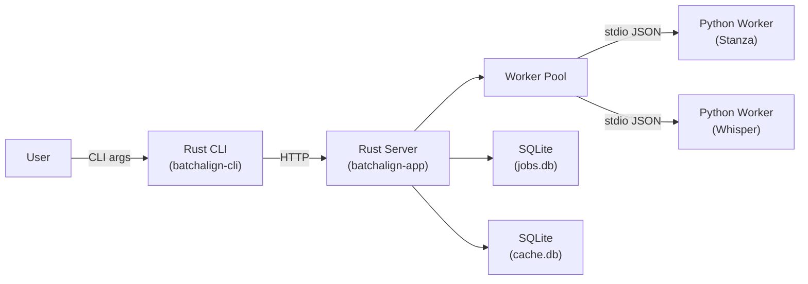

# Data Flow Overview

**Status:** Current
**Last updated:** 2026-03-18

This document traces the complete data flow for every batchalign command,
from CLI invocation through the Rust server to Python ML inference and back.



## Architecture

Batchalign3 is a Rust-primary system. The Rust CLI is always an HTTP client
that dispatches work to a Rust server (local daemon or remote). The server
owns CHAT parsing, caching, validation, and serialization. Python workers are
stateless ML inference endpoints that never see CHAT text.

The production data flow for all commands:

```
Rust CLI (dispatch/mod.rs)
  --> HTTP POST /jobs to Rust server
  --> Server runner (runner/mod.rs) spawns async job task
  --> Dispatch routing selects one of five shapes:
      1. dispatch_batched_infer()      — text-only commands
      2. dispatch_fa_infer()           — forced alignment
      3. dispatch_transcribe_infer()   — transcription from audio
      4. dispatch_benchmark_infer()    — transcription + WER benchmarking
      5. process_one_file()            — worker-owned media analysis
  --> Per-command orchestrator runs the pipeline:
      parse → cache check → typed worker IPC → inject → validate → serialize
  --> CLI polls /jobs/{id}/results and writes output files
```

Python workers receive structured payloads (words, audio paths) over stdio
JSON-lines IPC and return raw ML output (UD annotations, word timings, ASR
tokens). Workers have zero CHAT awareness.

There is also a secondary **Python API path** (`pipeline_api.py`) for direct
invocation without the server. Python provides raw provider callbacks, while
Rust still owns the parsed-document operation loop. See
[Python/Rust Interface](python-rust-interface.md) for details on both paths.

---

For end-to-end sequence diagrams showing the full job lifecycle across
all components, see [Command Lifecycles](command-lifecycles.md).

## CLI Dispatch

The CLI dispatch router (`crates/batchalign-cli/src/dispatch/mod.rs`) resolves
where to send work:

1. **Explicit `--server URL`** — single-server dispatch. CHAT text is POSTed
   to the server, results are downloaded. Audio-dependent commands
   (`transcribe`, `transcribe_s`, `benchmark`, `avqi`) fall back to the local
   daemon because the remote server cannot access local audio.
2. **Auto-daemon** (if `auto_daemon` is enabled in `server.yaml`) —
   paths-mode dispatch to a local daemon that reads/writes files directly.
3. **Error** — no server available.

### Two transport modes

| Mode | When | How files move |
|------|------|---------------|
| **Content mode** | Explicit `--server` (remote) | CLI reads `.cha` files, POSTs text in request body, downloads result text |
| **Paths mode** | Local daemon | CLI sends filesystem paths, daemon reads/writes directly |

### File discovery

The CLI (`crates/batchalign-cli/src/discover.rs`) walks input directories,
filters by extension (`.cha` for text commands, `.wav`/`.mp3` for audio
commands), sorts files largest-first to avoid stragglers, and skips dummy
CHAT files (`@Options: dummy`).

---

## Server Job Runner

The job runner (`crates/batchalign-app/src/runner/mod.rs`) receives submitted
jobs and routes them through five dispatch shapes based on command type.

### Dispatch routing

Two functions control routing:

- **`infer_task_for_command()`** maps each command to an `InferTask` enum
  variant (e.g., `"morphotag"` → `InferTask::Morphosyntax`)
- **`command_requires_infer()`** determines whether the command must use
  the server-side infer path (where Rust owns CHAT parse/cache/inject)

Before the runner enters one of those command-family modules, it now builds a
typed dispatch plan from the persisted `CommandOptions` plus any runtime-only
flags. The async dispatch functions consume those plans instead of re-reading
store-owned option state directly.

```
infer_task_for_command():
  morphotag  → Morphosyntax     transcribe → Asr
  utseg      → Utseg            opensmile  → Opensmile
  translate  → Translate        avqi       → Avqi
  coref      → Coref
  align      → Fa               compare    → Morphosyntax
```

`benchmark` deliberately bypasses `infer_task_for_command()`. It is a
Rust-owned composition path that reuses the worker ASR capability internally.
The low-level `speaker` infer task still exists, but not as a standalone CLI
command; diarization remains part of `transcribe_s`, matching batchalign2.
When diarization is requested and ASR did not already supply speaker labels,
`dispatch_transcribe_infer` now composes the low-level `speaker` task and
applies the returned segments in Rust.

Commands that **always require infer**: `morphotag`, `utseg`, `translate`,
`coref`, `compare`, `opensmile`, and `avqi`. The `align` command requires
infer only when all inputs are CHAT files (not raw audio).

### Five dispatch shapes

| Shape | Commands | Strategy |
|-------|----------|----------|
| `dispatch_batched_infer` | morphotag, utseg, translate, coref, compare | Pool utterances across files into cross-file batches for worker `execute_v2` using one prepared-text artifact per task |
| `dispatch_fa_infer` | align | Per-file processing with per-group batching inside each file (each file has its own audio) |
| `dispatch_transcribe_infer` | transcribe, transcribe_s | Per-file audio → ASR → optional speaker diarization → post-processing → CHAT assembly → optional utseg/morphotag pipeline |
| `dispatch_benchmark_infer` | benchmark | Per-file audio → Rust transcribe pipeline → Rust compare pipeline → hypothesis CHAT + CSV metrics |
| `dispatch_media_analysis_v2` | opensmile, avqi | Per-file Rust-owned prepared-audio requests over worker `execute_v2` |
| `process_one_file` | legacy compatibility only | Per-file worker IPC retained for non-release compatibility code, not for the current CLI surface |

---

## Per-Command Data Flow

### transcribe

**Orchestrator:** `crates/batchalign-app/src/transcribe.rs`
**Worker:** `batchalign/worker/_execute_v2.py`
**ASR engines:** `rev` (default), `whisper`, `whisperx`, `whisper-oai`

```
audio file
  → Rust Rev.AI client OR worker execute_v2(task="asr")
    → Python: run ASR model/SDK → typed raw ASR result
  → Rust: convert_asr_response() — ALWAYS groups tokens by speaker label
    (no use_speaker_labels param; matches BA2 process_generation())
  → optional: dedicated diarization (--diarization enabled AND ASR lacks labels)
    → execute_v2(task="speaker") → Pyannote/NeMo segments
  → Rust: process_raw_asr() (batchalign-chat-ops/src/asr_postprocess/)
    1. compound merging (adjacent subword tokens)
    2. timed word extraction (seconds → milliseconds)
    3. multi-word splitting (timestamp interpolation)
    4. number expansion (digits → spelled-out words)
    4b. Cantonese normalization (lang=yue: simplified → HK traditional)
    5. long-turn splitting (chunk at >300 words)
    6. retokenization (punctuation-based utterance splitting)
  → Rust: build_chat() → ChatFile AST with headers, utterances, %wor tiers
  → optional: reassign_speakers() if dedicated diarization segments present
  → optional: process_utseg() → re-segment utterances (default: on)
  → optional: process_morphosyntax() → add %mor/%gra tiers (default: off)
  → validate → serialize → CHAT text out
```

**Rev.AI settings:** For Rev.AI-backed transcription, `skip_postprocessing=true`
is sent for English and French (matching BA2), letting BA3's own utseg BERT
model handle segmentation. `speakers_count` is sent for English and Spanish.

**Rev.AI preflight:** For Rev.AI-backed transcription and Rev-backed UTR, the
Rust server can pre-submit all audio files in parallel before the per-file
dispatch loop, reducing wall-clock time 2-5x for large batches without
widening the Python worker protocol.

---

### align

**Orchestrator:** `crates/batchalign-app/src/fa.rs`
**Worker:** `batchalign/inference/fa.py`
**FA engines:** `whisper` (default), `wave2vec`

```
CHAT text + audio file
  → Rust: parse_lenient() → ChatFile AST
  → Rust: pre-validate to MainTierValid
  → Rust: group_utterances() → FA windows (max 20s Whisper / 15s Wave2Vec)
  → per group: check cache (BLAKE3 hash of words + audio identity + timestamps)
  → cache misses → worker execute_v2(task="fa", prepared_audio + prepared_text)
    → Python: read prepared artifacts, run FA model → raw timings
  → Rust: parse_fa_response() → DP-align model output to transcript words
  → Rust: apply_fa_results() → inject timings + postprocess + %wor + E362/E704 checks
  → Rust: validate → serialize → CHAT text out (with word-level timing + %wor)
```

---

### morphotag

**Orchestrator:** `crates/batchalign-app/src/morphosyntax.rs`
**Worker:** `batchalign/worker/_text_v2.py` (uses `batchalign/inference/morphosyntax.py`)

```
CHAT text
  → Rust: parse_lenient() → ChatFile AST
  → Rust: pre-validate to MainTierValid
  → Rust: clear existing %mor/%gra
  → Rust: collect_payloads() → per-utterance word lists with language metadata
  → per utterance: check cache (BLAKE3 hash of words + lang + terminator)
  → cache misses → worker execute_v2(task="morphosyntax", prepared_text batch)
    → Python: read prepared text, run Stanza pipeline(tokenize, pos, lemma, depparse) → typed raw UD batch
  → Rust: inject_results() → insert %mor/%gra tiers into AST
  → Rust: persist cache entries for new results
  → Rust: validate alignment → serialize → CHAT text out (with %mor + %gra)
```

---

### utseg

**Orchestrator:** `crates/batchalign-app/src/utseg.rs`
**Worker:** `batchalign/worker/_text_v2.py` (uses `batchalign/inference/utseg.py`)

```
CHAT text
  → Rust: parse_lenient() → ChatFile AST
  → Rust: pre-validate to StructurallyComplete
  → Rust: collect_utseg_payloads() → per-utterance word lists
  → per utterance: check cache (BLAKE3 hash of words + lang)
  → cache misses → worker execute_v2(task="utseg", prepared_text batch)
    → Python: run Stanza constituency parser → raw parse trees
  → Rust: apply_utseg_results() → compute assignments and split utterances at group boundaries
  → Rust: validate → serialize → CHAT text out (re-segmented)
```

---

### translate

**Orchestrator:** `crates/batchalign-app/src/translate.rs`
**Worker:** `batchalign/worker/_text_v2.py` (uses `batchalign/inference/translate.py`)
**Backends:** Google Translate (default), Seamless M4T

```
CHAT text
  → Rust: parse_lenient() → ChatFile AST
  → Rust: collect_translate_payloads() → per-utterance text
  → per utterance: check cache (BLAKE3 hash of text + src_lang + tgt_lang)
  → cache misses → worker execute_v2(task="translate", prepared_text batch)
    → Python: run translation model → raw translated text
  → Rust: apply_translate_results() → postprocess and inject %xtra dependent tiers
  → Rust: validate → serialize → CHAT text out (with %xtra)
```

---

### coref

**Orchestrator:** `crates/batchalign-app/src/coref.rs`
**Worker:** `batchalign/worker/_text_v2.py` (uses `batchalign/inference/coref.py`)

```
CHAT text
  → Rust: parse_lenient() → ChatFile AST
  → Rust: check language — non-English files pass through unchanged
  → Rust: collect_coref_payloads() → document-level sentence list
  → worker execute_v2(task="coref", prepared_text batch) — one item per document
    → Python: Stanza coref pipeline → structured chain refs
  → Rust: raw_to_bracket_response() + apply_coref_results() → inject sparse %xcoref tiers
  → Rust: validate → serialize → CHAT text out (with %xcoref)
```

Coref is **document-level** (not per-utterance) and has **no caching**
because results depend on full document context.

---

### compare

**Orchestrator:** `crates/batchalign-app/src/compare.rs`

```
main CHAT text + gold CHAT text (FILE.gold.cha)
  → Rust: run morphosyntax pipeline on main text (reuses process_morphosyntax())
  → Rust: parse gold file
  → Rust: DP-align main vs gold words
  → Rust: inject %xsrep comparison tiers
  → serialize annotated CHAT + CSV metrics
```

---

### opensmile

**Worker:** `batchalign/inference/opensmile.py`

```
audio file
  → worker process(command="opensmile")
    → Python: opensmile feature extraction → pandas DataFrame
  → results written as CSV (*.opensmile.csv)
```

No CHAT involvement. Pure audio analysis.

---

### avqi

**Worker:** `batchalign/inference/avqi.py`

```
paired audio files: *.cs.wav (continuous speech) + *.sv.wav (sustained vowel)
  → worker process(command="avqi")
    → Python: parselmouth/Praat analysis → CPPS, HNR, Shimmer, etc.
    → AVQI = regression formula over extracted features
  → dict result
```

No CHAT involvement. Requires local daemon (paired-file discovery).

---

### benchmark

**Orchestrator:** `crates/batchalign-app/src/benchmark.rs`
**Dispatch:** `crates/batchalign-app/src/runner/dispatch/benchmark_pipeline.rs`
**Scoring core:** `batchalign_core.wer_compute()` / `batchalign-chat-ops`

```
audio file + gold CHAT file
  → Rust transcribe pipeline → hypothesis CHAT text
  → Rust compare pipeline
    → word normalization + Hirschberg DP alignment + WER computation
  → outputs: hypothesis .cha + .compare.csv
```

WER computation (`wer_conform` + `wer_compute`) and benchmark command
orchestration are both Rust-owned. The remaining Python `benchmark.py` module
is only a package-level convenience wrapper, not part of the production worker
path.

---

## Caching

All caching is managed by the Rust server in `crates/batchalign-app/src/cache/`.
Python workers are cache-unaware — they receive payloads and return results.

### Per-Utterance SQLite Cache

The `UtteranceCache` uses SQLite WAL mode with BLAKE3 content-addressed keys.
Each NLP task has a separate cache namespace:

| Task | Cache Key Components | Engine Version |
|------|---------------------|---------------|
| `morphosyntax` | words + lang + terminator + special forms | Stanza version |
| `utseg` | words + lang | Stanza version |
| `translation` | text + src_lang + tgt_lang | `google-translate` or `seamless-m4t-medium` |
| `forced_alignment` | words + audio identity + time window + timing mode | FA engine version |
| `asr` (UTR) | audio identity + lang + speakers | ASR engine version |

Cache entries are invalidated when the engine version changes. The
`--override-cache` flag bypasses cache lookups.

### Media Format Cache

MP4 video files are converted to WAV and cached at
`~/.batchalign3/media_cache/` keyed by content fingerprint. MP3 and WAV
files are used directly. Media conversion is handled by the server
(`crates/batchalign-app/src/media.rs`).

### What is NOT cached

- ASR output (too large and variable for per-utterance caching)
- Speaker diarization (depends on full audio context)
- Coreference (document-level, not per-utterance)
- OpenSMILE features (fast enough)
- AVQI scores (fast enough)

---

## Pre-Serialization Validation

Before writing CHAT output, the server runs validation gates:

1. **Pre-validation** — checks input quality against a required
   `ValidityLevel` (e.g., `MainTierValid` for morphotag, `StructurallyComplete`
   for utseg). Rejects malformed input early.
2. **Alignment validation** — checks that %mor/%gra/%wor tier word counts
   match the main tier.
3. **Semantic validation** — full CHAT validation covering E362 (non-monotonic
   timestamps), E701/E704 (temporal constraints), header correctness. Only
   blocks on `severity="error"`, not warnings.

Validation failures trigger bug reports to `~/.batchalign3/bug-reports/` and
self-correcting cache purges (deleting stale entries that produced invalid
output).

---

## Key source files

| File | Role |
|------|------|
| `crates/batchalign-cli/src/dispatch/mod.rs` | CLI dispatch router |
| `crates/batchalign-app/src/runner/mod.rs` | Job runner, dispatch shape selection |
| `crates/batchalign-app/src/runner/dispatch/` | Three dispatch shapes (batched infer, FA infer, transcribe infer, per-file process) |
| `crates/batchalign-app/src/morphosyntax.rs` | Morphosyntax orchestrator |
| `crates/batchalign-app/src/utseg.rs` | Utseg orchestrator |
| `crates/batchalign-app/src/translate.rs` | Translation orchestrator |
| `crates/batchalign-app/src/coref.rs` | Coreference orchestrator |
| `crates/batchalign-app/src/fa.rs` | Forced alignment orchestrator |
| `crates/batchalign-app/src/transcribe.rs` | Transcribe orchestrator |
| `crates/batchalign-app/src/compare.rs` | Compare orchestrator |
| `crates/batchalign-app/src/cache/` | BLAKE3 + SQLite utterance cache |
| `batchalign/worker/` | Python worker: IPC, model loading, inference routing |
| `batchalign/inference/` | Python inference modules (one per NLP task) |
