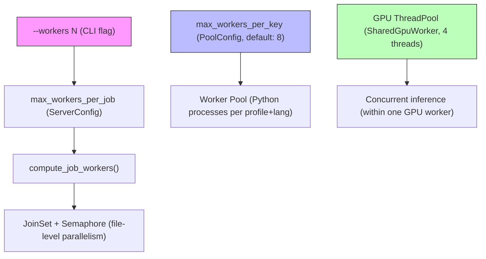
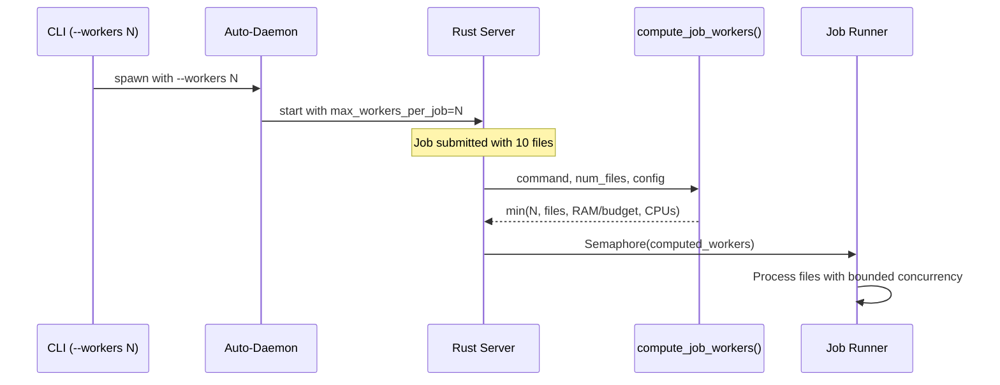

# Parallelism Architecture

**Status:** Current
**Last updated:** 2026-03-19

## Three layers of parallelism

batchalign3 has three independent parallelism controls:

### Layer 1: File parallelism (user-facing)

**What it controls:** How many files are processed concurrently within a single job.

**User control:** `--workers N` CLI flag, or `max_workers_per_job` in `server.yaml`.

**Default behavior:**
- GPU-heavy commands (`transcribe`, `align`, `benchmark`): **1 file** (prevents OOM)
- CPU-only commands (`morphotag`, `utseg`, `translate`): auto-tuned by `compute_job_workers()` based on available RAM and CPU cores

**Implementation:** `runner/dispatch/` uses a `JoinSet` with a `Semaphore(num_workers)` to cap concurrent file processing tasks.

### Layer 2: Worker pool (operator-facing)

**What it controls:** How many Python worker processes exist per (profile, language, engine) key.

**User control:** `max_workers_per_key` in `server.yaml` (not a CLI flag -- this is an operator concern).

**Default:** 8 per key. GPU profile: 1 process (concurrent via threads). Stanza profile: auto-tuned. IO profile: 1 process.

**Implementation:** `worker/pool/mod.rs` manages worker lifecycle. Workers are spawned lazily and cached.

### Layer 3: GPU thread pool (internal)

**What it controls:** How many concurrent inference requests run inside one GPU worker process.

**User control:** None (internal implementation detail).

**Default:** 4 threads in `SharedGpuWorker`'s `ThreadPoolExecutor`.

**Implementation:** `worker/pool/shared_gpu.rs` -- the GPU worker process hosts a thread pool that handles concurrent FA, ASR, and speaker inference requests without spawning separate processes.

## Why GPU commands default to 1 worker

Each GPU-heavy inference (Whisper ASR, Whisper FA, Wave2Vec) loads 2-5 GB of model weights into GPU/MPS memory. Processing multiple files concurrently means multiple inference requests running simultaneously, all sharing the same GPU memory pool.

On a 64 GB developer machine with MPS:
- 1 concurrent file: ~5 GB GPU memory -- safe
- 4 concurrent files: ~5 GB GPU x 4 threads = ~20 GB GPU pressure -- risky
- 8 concurrent files (old default): ~40 GB GPU pressure -- **kernel OOM crash**

The server's auto-tuner estimated available RAM but did not account for GPU memory pressure. Setting GPU commands to default to 1 file prevents this class of crash entirely.

Operators with dedicated GPU hardware (e.g., net with M3 Ultra 256 GB) can safely increase this via `--workers N` or `server.yaml`.
