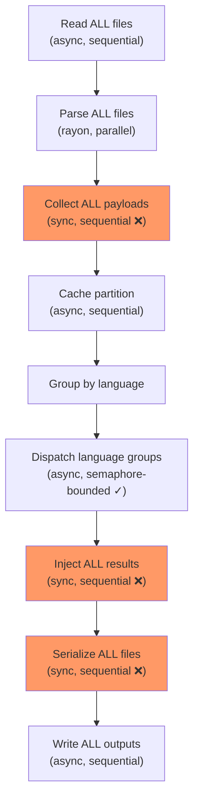
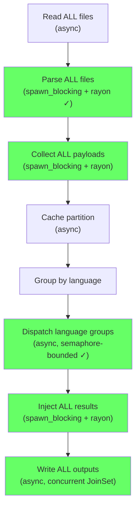
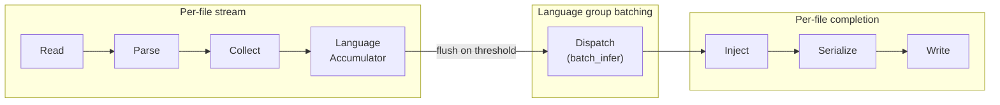

# Pipeline Parallelism: Current Architecture and Future Direction

**Status:** Current
**Last modified:** 2026-03-28 21:42 EDT

## The Problem

The batchalign3 job pipeline has two classes of performance bug:

1. **CPU-bound work on the tokio async runtime** — tree-sitter parsing,
   DP alignment, AST injection, CHAT serialization, and validation all
   run directly on the async executor. This blocks heartbeats, progress
   updates, health checks, and WebSocket broadcasts. A 500-file
   morphotag batch appears "hung" even when the CPU is at 100% doing
   useful work.

2. **All-or-nothing sequential gates** — all files must complete one
   stage before any file enters the next. Parse ALL 500 files, THEN
   collect ALL payloads, THEN dispatch ALL language groups, THEN inject
   ALL results, THEN write ALL outputs. No partial progress flows.

## Current Architecture: Batch-All-Then-Dispatch

**What works well:**
- Language group dispatch is properly parallelized with bounded semaphore
- Within each language group, items are chunked across multiple workers
- Parsing was parallelized with rayon (2026-03-28)

**What blocks the async runtime (14 bottlenecks identified):**

| Operation | Location | Est. Cost/File | Total (500 files) |
|-----------|----------|---------------|-------------------|
| `collect_payloads()` | batch.rs | 50-200ms | 25-100s |
| `inject_results()` | batch.rs | 200-1000ms | 100-500s |
| `validate_mor_alignment()` | batch.rs | 10-50ms | 5-25s |
| `extract_strings()` | batch.rs | 20-100ms | 10-50s |
| `to_chat_string()` | batch.rs | 50-200ms | 25-100s |
| `apply_merge_abbrev()` | infer_batched.rs | 50-200ms | 25-100s |
| FA `parse_lenient()` | fa_pipeline.rs | 100-500ms | per-file |
| FA `group_utterances()` | fa/mod.rs | 50-300ms | per-file |
| FA `apply_fa_results()` | fa/mod.rs | 200-1000ms | per-file |
| FA postprocessing | fa/mod.rs | 50-200ms | per-file |
| FA `to_chat_string()` | fa/mod.rs | 50-200ms | per-file |
| Utseg injection | utseg.rs | 50-200ms | per-file |
| Translate injection | translate.rs | 20-100ms | per-file |
| Coref injection | coref.rs | 100-500ms | per-file |

## Surgical Fix: spawn_blocking + rayon (Shipped / In Progress)

Wrap CPU-bound operations in `tokio::task::spawn_blocking` and
parallelize independent per-file work with `rayon::par_iter`. Same
architecture, same test surface, same error handling.

**What this solves:**
- Async runtime stays responsive during CPU work
- Heartbeats, progress updates, and health checks work
- Per-file injection/serialization runs on all CPU cores
- 8-core machine: 500-file injection drops from ~4 min to ~30s

**What this does NOT solve:**
- First file still can't complete until ALL language groups finish
- Progress is still batch-level, not per-file-streaming
- Memory: all 500 parsed ASTs in memory simultaneously
- A crash after injection but before write loses all work

## Future: Streaming Pipeline Architecture

When the codebase is stable and no batch reruns are active, consider
a streaming redesign where files flow independently through stages.

### Pros of streaming

- **Latency:** First files complete in seconds, not after the entire
  batch. Brian sees results appearing immediately.
- **Observability is free:** Per-file progress is natural — each file
  moves through stages independently. No need for the
  `BatchInferProgress` workaround.
- **Memory:** Only files currently in-flight are in memory, not all
  500 parsed ASTs simultaneously. For a 500-file batch, peak memory
  drops from O(all files) to O(window size).
- **Resilience:** A crash mid-batch preserves already-written files.
  Currently, a crash after 499/500 files inject but before write
  loses everything.
- **Composability:** Each stage is a typed async channel. Adding new
  stages (post-validation, caching, metrics) is just adding a channel
  consumer.

### Cons of streaming

- **Batching efficiency loss:** The current design pools ALL utterances
  from ALL files into one giant `batch_infer` per language. A streaming
  design needs smaller batches — either fixed-size windows or
  language-group accumulators that flush on a threshold. Smaller
  batches = more worker round-trips = potentially lower GPU utilization.

- **Cross-file language grouping complexity:** File A's French
  utterances and file B's French utterances must go to the same worker
  call. A streaming design needs an accumulator that collects across
  files before dispatching — essentially reinventing the current batch
  but with more machinery and nondeterministic batch boundaries.

- **Cache partitioning changes:** The current design checks cache for
  ALL utterances upfront, then dispatches only misses. Streaming would
  interleave cache checks with dispatch, changing the optimization
  profile (likely acceptable, possibly even better for cache-heavy
  reruns).

- **Testing complexity:** The current sequential design is easy to
  test — deterministic input order, deterministic output. Streaming
  pipelines have nondeterministic interleaving that makes snapshot
  tests harder.

- **Error propagation:** Errors must flow backward from the accumulator
  to per-file completion. A language group failure must mark specific
  files as failed, not the whole batch.

- **Risk surface:** This is a rewrite of the core processing engine.
  Every command (morphotag, utseg, translate, coref, align, transcribe)
  would need to adapt. High surface area for regressions.

### The batching efficiency question

The key tension: streaming wants small, frequent dispatches; GPU
throughput wants large, infrequent batches. The resolution is a
**windowed accumulator** that collects utterances from N files (e.g.,
50) per language, then dispatches when the window fills OR a timeout
expires. This gives:

- Window of 50 files × ~20 utterances = ~1000 items per dispatch
  (vs current: all 500 files × 20 = 10,000 items)
- 10x more dispatches but each still large enough for GPU efficiency
- First results after ~50 files instead of after ~500

The efficiency loss is likely 10-20% on raw inference time, but total
wall time improves because injection and serialization overlap with
inference for later files.

## Decision

**Now:** Surgical spawn_blocking + rayon fixes. Ships today, no
architectural risk, 80% of the benefit.

**Later:** Streaming pipeline when:
- No active batch reruns depend on the current architecture
- The typed path provenance and capability registry are stable
- We have time for a multi-week refactor with comprehensive testing
- The Temporal backend provides crash recovery that makes the
  resilience argument less urgent

## Source Files

| File | Current Role |
|------|-------------|
| `runner/dispatch/infer_batched.rs` | Batch dispatcher: read → delegate → write |
| `morphosyntax/batch.rs` | Morphotag batch: parse → collect → cache → dispatch → inject |
| `morphosyntax/worker.rs` | Per-language-group worker dispatch with chunking |
| `fa/mod.rs` | FA per-file processing (7 CPU-bound stages) |
| `runner/dispatch/fa_pipeline.rs` | FA orchestrator with JoinSet concurrency |
| `runner/dispatch/transcribe_pipeline.rs` | Transcribe per-file with optional morphotag |
| `utseg.rs`, `translate.rs`, `coref.rs` | Other batched text commands |
