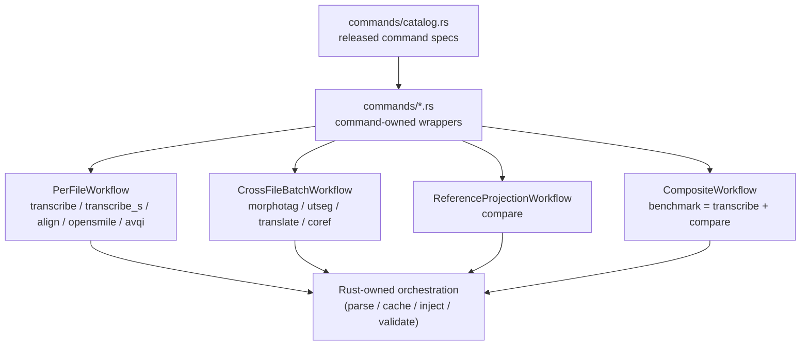

# Pipeline System

**Status:** Current
**Last updated:** 2026-03-26 14:05 EDT

The pipeline system processes CHAT files through command-owned modules backed by
a shared, typed execution kernel. The concrete workflow families are still
explicit in code — per-file transform, cross-file batch transform, reference
projection, and composite workflow — but they are now an internal runtime
shape, not the primary contributor-facing ownership model. The families share
the same end state — typed materialization plus validation — but not the same
internal stage sequence.
Per-file transforms often look like `parse → cache → infer → inject → validate
→ serialize`, while `compare` is `pair → morphotag main → parse raw gold →
compare bundle → materialize`.

If you are adding new command semantics, start in
`crates/batchalign-app/src/commands/` and
`crates/batchalign-app/src/commands/catalog.rs`. From there, jump to
`command_family.rs` when you need the released-command family metadata and to
`text_batch.rs` when you need the shared text-family helpers reused by the
runner kernel. The command module should own the public entrypoint, metadata,
and materialization choice; `runner/` should stay focused on job lifecycle,
queueing, and shared dispatch machinery.

## Core Data Model

**`ChatFile`** is the typed Rust AST (from `talkbank-model`) representing a
parsed CHAT file. On the server path, orchestrators operate directly on
`ChatFile` using functions from `batchalign-chat-ops`. On the Python API
path, `ParsedChat` (a PyO3 `#[pyclass]`) wraps a `ChatFile` and exposes
mutation methods.

**Commands** define processing tasks. Available commands: `transcribe`
(ASR), `align` (forced alignment), `morphotag` (morphosyntax), `utseg`
(utterance segmentation), `translate`, `coref`, `compare`, `opensmile`,
`avqi`, and `benchmark`.

The low-level `speaker` infer task still exists for typed worker execution, but
it is not a standalone CLI command. This matches batchalign2, where diarization
was part of `transcribe_s`.



## Command Classification

Commands are classified by input/output type and workflow family:

- **Generation**: Creates CHAT from media (e.g., `transcribe`). Builds a
  `ChatFile` from ASR output via `build_chat()`.
- **Per-file processing**: Transforms existing CHAT in-place (e.g.,
  `align`, `translate`). Parses, mutates, serializes.
- **Cross-file batch processing**: Pools utterances across files in one GPU
  batch (e.g., `morphotag`, `utseg`, `coref`).
- **Reference projection**: Compares a main transcript against a gold
  companion and materializes a released projected-reference view plus any
  internal alternate views
  from a typed compare bundle.
- **Composite**: Chains existing workflows without reimplementing them (e.g.,
  `benchmark = transcribe + compare`).
- **Analysis**: Produces metrics or non-CHAT output (e.g., `opensmile`,
  `avqi`). Returns structured results.

The command-owned catalog also places `transcribe_s` in the per-file family as
the diarized transcribe variant.

## Processing Lifecycle

Every CHAT-mutating command follows this pattern:

1. **Parse**: `parse_lenient()` produces a `ChatFile` AST.
2. **Pre-validate**: Check input quality against a command-specific
   `ValidityLevel` (e.g., `MainTierValid` for morphotag).
3. **Collect payloads**: Extract per-utterance data from the AST
   (word lists, text, language metadata).
4. **Cache check**: Hash payloads with BLAKE3. Partition into hits and
   misses.
5. **Infer**: Send misses to Python workers via typed worker IPC
   (`execute_v2` on the live infer surfaces). Workers return raw ML output.
6. **Inject**: Insert results (cache hits + infer results) into the AST.
7. **Cache put**: Persist new results for future reuse.
8. **Post-validate**: Alignment checks + semantic validation.
9. **Serialize**: `to_chat_string()` produces final CHAT output.

For generation commands (`transcribe`), step 1 is replaced by ASR inference
followed by `build_chat()` to construct the initial AST.

ReferenceProjection workflows intentionally diverge from the generic infer/inject
loop:

1. pair each primary transcript with `FILE.gold.cha`
2. morphotag the main transcript only
3. parse the morphotagged main and raw gold into `ChatFile` ASTs
4. build a `ComparisonBundle` with main/gold compare views, structural word
   matches, and metrics
5. materialize the released main output or an internal AST-first gold projection

## Pre-Serialization Validation

The server runs validation gates before writing CHAT output:

1. **Pre-validation** — rejects malformed input early based on the
   command's required `ValidityLevel`.
2. **Alignment validation** — checks tier word counts (MOR/GRA/WOR must
   match the main tier). ParseHealth-aware: utterances flagged as
   unparseable are excluded.
3. **Semantic validation** — full CHAT validation (E362 monotonicity,
   E701/E704 temporal, header correctness). Only blocks on errors, not
   warnings.

Validation failures trigger bug reports to `~/.batchalign3/bug-reports/`
and self-correcting cache purges (deleting entries that produced invalid
output).

## Batched Inference

Text-only commands (`morphotag`, `utseg`, `translate`, `coref`) use
`dispatch_batched_infer()` to pool utterances across multiple files into a
single worker `execute_v2` request backed by one prepared-text artifact. This
improves throughput and model reuse compared to per-file dispatch without
re-expanding the Python control plane. `compare` is separate now because it
needs both a main transcript and a gold companion per file.

The morphosyntax orchestrator uses three phases for cache interaction:

1. `collect_payloads()` — extract per-utterance payloads with positions
2. `inject_from_cache()` — inject cached %mor/%gra strings
3. `inject_results()` — inject freshly inferred results

All cache logic is in Rust. Python workers receive only structured NLP
payloads and return raw model output.

## Multi-Step Pipelines

The `transcribe` command can chain multiple steps:

```
ASR inference → post-processing → CHAT assembly → utseg → morphosyntax
```

Each step is a separate workflow call (`process_transcribe` →
`process_utseg` → `process_morphosyntax`). Between steps, CHAT text is
serialized and re-parsed, which is not wasteful — each step operates on a
different version of the file. `benchmark` follows the same composition style
at the workflow level by chaining transcribe then compare, while `compare`
itself remains a reference-projection workflow with gold- and main-shaped
materializers.

## Worker Concurrency

Worker parallelism is capped based on available memory, not scaled linearly.
Each worker loads ~4-12 GB of ML models. The server now combines:

- `HostExecutionPolicy` for tier-aware bootstrap mode and file-parallel clamps
- host-memory admission planning for granted worker counts
- target-aware worker reuse keyed by actual `WorkerTarget`

On large hosts this favors profile reuse; on small hosts it favors task
bootstrap so a laptop does not speculatively preload a whole profile. See
[Worker Memory Architecture](worker-memory-architecture.md) for the pool
structure, warmup behavior, and host-policy details.

## Key Patterns

- **Times** throughout the pipeline are in **milliseconds**.
- **Language codes** use 3-letter ISO 639-3 format (`"eng"`, `"spa"`, `"jpn"`).
- **Files are sorted largest-first** before dispatch to avoid stragglers.
- **Heavy imports** (`stanza`, `torch`) are lazy — CLI startup must stay fast.
