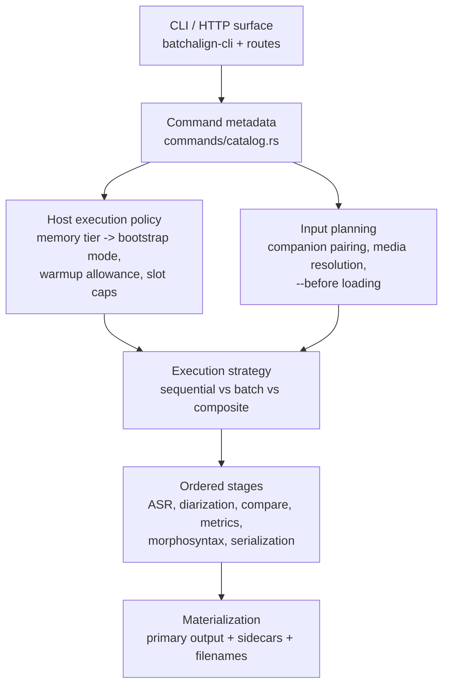
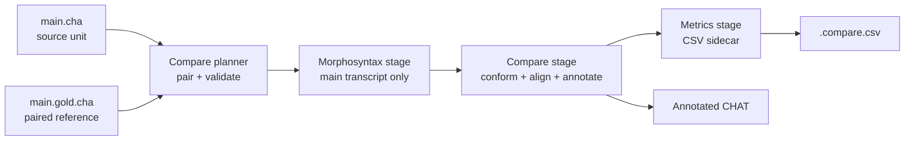
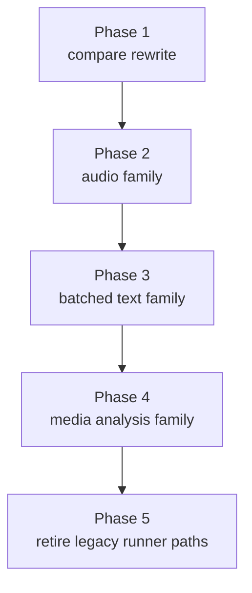
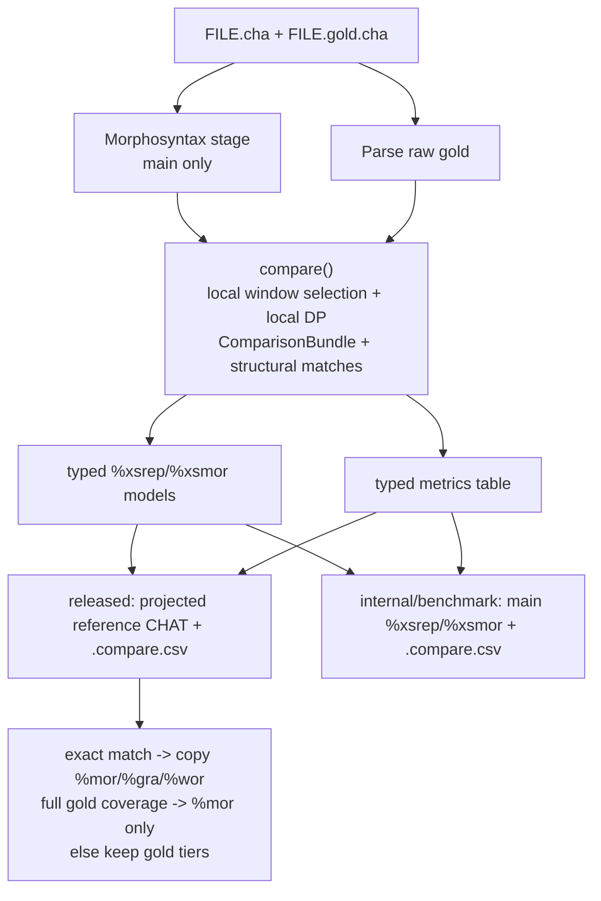

# Recipe-Driven Command Architecture

**Status:** Draft
**Last updated:** 2026-03-26 14:05 EDT

This document is the replacement architecture decision for
`command-trait-proposal.md`. That proposal correctly identifies real pain, but
it collapses too many distinct seams into one trait. The better direction is a
recipe-driven architecture that keeps command identity, input planning,
execution strategy, stage ordering, and materialization separate but typed.

## Verdict

The command-trait proposal should **not** become the primary organizing model
for batchalign3.

## Current implementation note

The spike has now landed the contributor-facing part of this architecture:

- released commands live under `crates/batchalign-app/src/commands/`
- `crates/batchalign-app/src/command_family.rs` keeps the small family enum as
  metadata only
- `crates/batchalign-app/src/text_batch.rs` keeps reusable cross-file text
  helper types
- `compare.rs`, `benchmark.rs`, `transcribe/`, `fa/`, and `morphosyntax/` now
  own the orchestration that previously sat behind thin workflow wrappers
- `CommandKernelPlan` resolves command metadata against a typed
  `HostExecutionPolicy`

That host policy is where the current resource-sensitive behavior is made
explicit:

- **large/fleet hosts** prefer `WorkerBootstrapMode::Profile` so related models
  share one long-lived worker process
- **small hosts** prefer `WorkerBootstrapMode::Task` so a weak laptop can load
  only the task it is actually about to run
- constrained hosts clamp eligible file-parallel command plans to one file at a
  time instead of relying on incidental semaphore folklore
- startup warmup is a **host decision**, with per-command metadata only marking
  whether a command is eligible

Keep these ideas:

- move released-command metadata toward typed, compile-time declarations
- shrink the number of files touched when adding a command
- preserve additive migration instead of demanding a flag-day rewrite

Reject these ideas:

- one `Command::execute()` method as the place where planning, dispatch,
  batching, orchestration, and materialization all happen
- deriving runtime ownership from `InferTask` alone
- flattening all command families into one contributor-facing abstraction
- treating compare as just another command implementation detail instead of as a
  workflow shape with paired inputs and multi-output materialization

The current codebase already points at the right replacement:

- `crates/batchalign-app/src/pipeline/plan.rs` has a real ordered stage-plan
  runner
- `crates/batchalign-app/src/commands/catalog.rs` already distinguishes command
  families and runtime ownership
- `crates/batchalign-app/src/compare.rs` already has typed artifact and
  materializer seams
- `~/batchalign2-master` still contains the strongest mental model for compare:
  command as an ordered recipe, with explicit per-file pairing and analysis

## Why the command-trait proposal is not enough

The proposal treats registration sprawl as the main problem. It is a problem,
but it is not the most important one.

The real architectural problem is that batchalign3 currently has **five**
separate concerns intertwined:

1. released command identity and CLI metadata
2. input discovery and pairing
3. execution strategy
4. stage ordering and progress reporting
5. output materialization

The proposal reduces registration churn by moving these concerns behind one
trait, but that does not actually make them clearer. It just hides them.

The monolithic trait erases this chain. That is exactly the wrong direction for
commands like `transcribe`, `benchmark`, and the compare rewrite from
`batchalign2-master`, where correctness depends on explicit sequencing.

## Ruthlessly nitpicking review of `command-trait-proposal.md`

### 1. It confuses registration with architecture

The proposal is strongest when it says “11 files is too many.” It is weakest
when it assumes the answer must therefore be “one trait.”

Registration can be unified without forcing planning, execution, and
materialization into the same contributor-facing seam.

### 2. It deletes workflow-family information at exactly the wrong level

The current system still has explicit families, but now as metadata in
`crates/batchalign-app/src/command_family.rs`:

- `PerFileTransform`
- `CrossFileBatchTransform`
- `ReferenceProjection`
- `Composite`

That split is semantically meaningful. `compare` is not just another command
with a different constant; it is a different workflow shape. `benchmark` is not
just “compare with audio”; it is composition. A single `execute()` method makes
those differences easier to ignore and harder to inspect.

### 3. It under-models runtime ownership

The command-owned catalog does not only record `InferTask`; it also records
`RunnerDispatchKind` plus the command's explicit performance profile.

That matters because batching, per-file audio handling, benchmark composition,
and media-analysis dispatch are not implementation trivia. They drive memory
behavior, progress reporting, file concurrency, and failure modes.

If an architecture cannot say “this command owns a batched stage but still runs
as a sequential per-work-unit recipe,” it is not modeling the real system. The
same applies to host policy: if the architecture cannot say “this command wants
profile reuse on a large server but task-only bootstrap on a small laptop,” it
is still hiding correctness-relevant resource behavior.

### 4. `Vec<InputFile>` is too weak for the important cases

The proposal’s `InputFile { companion: Option<PathBuf> }` is an escape hatch,
not a real input model.

That is inadequate for:

- compare pairs
- benchmark units
- align units with audio + transcript + derived timing context
- media-analysis commands that need different audio roles
- incremental `--before` processing

Those are not optional decorations on a generic file. They are different work
unit types.

### 5. `materialize(output)` throws away critical context

Compare from `batchalign2-master` does not merely produce some output blob. It
produces:

- annotated CHAT based on the main transcript
- a `.compare.csv` sidecar keyed to the same source unit

Filename derivation, sidecar naming, and output policy depend on source-unit
context. A materializer that receives only `Output` is missing the information
it needs.

### 6. It treats batching as an internal detail when it is actually a policy

For `morphotag`, `utseg`, `translate`, and `coref`, batching affects:

- worker payload shape
- progress behavior
- memory use
- scheduling
- retry boundaries

That should be explicit in the architecture. “The command can decide inside
`execute()`” is not explicit enough.

### 7. It is fighting the strongest recent success in the codebase

`crates/batchalign-app/src/pipeline/transcribe.rs` already has the right
instinct: an ordered stage plan with visible dependencies and progress mapping.

Recent transcribe parity work and Cantonese fixes made sequencing more
important, not less. The new architecture should generalize that explicit stage
model. It should not bury it under a generic async trait method.

### 8. It would make the compare rewrite harder, not easier

The compare target semantics in `~/batchalign2-master` demand a workflow that
has:

- typed paired inputs
- deterministic conform/alignment rules
- per-utterance comparison state
- metrics sidecars
- explicit gold-file planning

Those requirements argue for richer work-unit planning, not for a thinner
command trait.

## Requirements the replacement architecture must satisfy

The new architecture has to satisfy both current BA3 reality and the
`batchalign2-master` compare rewrite target.

### Current BA3 constraints

- keep Rust as the orchestration owner
- keep Python as the stateless ML worker boundary
- preserve the transcribe stage plan and its explicit ordering
- preserve Cantonese-sensitive postprocessing and language resolution seams
- preserve additive migration while old and new runtimes coexist

### BA2 compare constraints that must return

- compare is an ordered recipe:
  `morphosyntax -> compare -> compare_analysis`
- gold pairing is planned up front, not discovered ad hoc halfway through
- per-utterance comparison state is part of the workflow model
- analysis output is a first-class sidecar, not an afterthought

## Proposed architecture

The replacement architecture is a **recipe runner** with six first-class
concepts.

### 1. `CommandSpec`

`CommandSpec` owns only the released surface:

- stable command identity
- CLI/profile metadata
- input contract
- output policy
- high-level execution family

It does **not** own every orchestration detail.

### 2. `WorkPlanner`

`WorkPlanner` converts discovered filesystem inputs into typed work units.

Candidate work-unit types:

- `ChatWorkUnit`
- `AudioWorkUnit`
- `CompareWorkUnit`
- `BenchmarkWorkUnit`
- `MediaAnalysisWorkUnit`

Planner responsibilities:

- companion pairing
- media resolution
- `--before` loading
- source-relative output naming context

### 3. `ExecutionMode`

Execution strategy must be explicit:

- `SequentialPerUnit`
- `BatchedStage`
- `ReferenceProjection`
- `Composite`

This is the replacement for smuggling runtime ownership through `InferTask`.

### 4. `Recipe`

A recipe is an ordered list of typed stages with dependencies. The default
mental model is sequential, because that is the model contributors can reason
about and the one this compare reset is trying to recover.

Stages may batch internally, but the recipe must say so.

### 5. `Stage`

A stage is a small typed unit with:

- input type
- output type
- progress mapping
- capability requirements

Examples:

- `AsrInferStage`
- `SpeakerDiarizationStage`
- `AsrPostprocessStage`
- `BuildChatStage`
- `MorphosyntaxStage`
- `CompareAlignStage`
- `CompareMetricsStage`
- `SerializeChatStage`

### 6. `Materializer`

`Materializer` receives both stage output and source-unit context.

That makes it capable of:

- primary output naming
- sidecar naming
- multi-output commands
- future compare variants without inventing filename hacks

## Recommended Rust shape

The spike should introduce a parallel namespace under
`crates/batchalign-app/src/recipe_runner/`.

Recommended modules:

- `command_spec.rs`
- `work_unit.rs`
- `planner.rs`
- `recipe.rs`
- `stage.rs`
- `materialize.rs`
- `catalog.rs`

The existing `pipeline/plan.rs` should be treated as the immediate precedent,
not as dead code to be replaced.

## Migration strategy

This rewrite should proceed by command family, not by random individual
commands.

1. **Compare first**
   - replace obsolete BA3 compare
   - model paired inputs and sidecar output correctly
   - prove the planner/materializer seams

2. **Audio family next**
   - `transcribe`
   - `transcribe_s`
   - `benchmark`
   - `align`

3. **Batched text family**
   - `morphotag`
   - `utseg`
   - `translate`
   - `coref`

4. **Media-analysis family**
   - `opensmile`
   - `avqi`

## Current spike status

The spike now proves the architecture in code, not just in prose:

- `crates/batchalign-app/src/recipe_runner/` exists with typed command specs,
  recipes, work units, planners, materialization rules, and a live runtime
  adapter layer
- compare now carries POS through alignment, emits `%xsmor`, and writes
  per-POS metrics rows in `.compare.csv`
- compare now uses a BA2-style per-utterance local-window heuristic instead of
  only one global DP pass, and the bundle carries both main-anchored and
  gold-anchored comparison views
- the compare workflow now has a real AST-first gold-projected materializer:
  the bundle carries structural word-match metadata, exact structural matches
  can copy `%mor` / `%gra` / `%wor`, and partial matches only project `%mor`
  when the gold utterance stays structurally valid
- compare now materializes `%xsrep` / `%xsmor` and `.compare.csv` through typed
  serializer-owned models with newtyped string boundaries instead of raw string
  glue
- compare and benchmark pairing now come from typed planner logic rather than
  ad hoc filename derivation inside dispatch code
- transcribe, benchmark, align, batched text commands, and media-analysis
  commands now derive result filenames from recipe-runner output metadata rather
  than each dispatcher hand-rolling its own naming policy
- `commands/catalog.rs` now delegates released-command result naming to the
  recipe-runner catalog, so metadata and runtime are no longer drifting apart

### Current compare flow in the spike

This is enough to validate the architecture as a serious replacement direction.
It is **not** yet enough to retire the old runner surfaces entirely.

## Retirement criteria and next migration decision

The migration path should now be:

1. keep the legacy dispatch entrypoints alive, but treat them as temporary
   adapters over recipe-runner planning and materialization
2. keep compare and benchmark on explicit, separate materializers
   - compare now uses the projected-reference materializer
   - benchmark keeps its own main-annotated materializer instead of inheriting
     compare's command contract
   - treat deeper partial `%gra` / `%wor` projection as a later model-level
     follow-up, not a blocker for the recipe-runner architecture itself
3. run targeted parity and Cantonese-sensitive validation on the adapter-backed
   commands before retiring any old filename/dispatch helpers
4. only then collapse more of the legacy registry/dispatch plumbing into the
   recipe-runner runtime

In other words: **the recipe runner should replace hidden policy first, then
replace execution ownership second.** That sequencing keeps the spike honest and
avoids breaking the very transcribe and Cantonese behavior this rewrite is
supposed to protect.

## What survives from the old proposal

These ideas remain good and should be carried into the recipe runner:

- typed command catalog rather than stringly registration
- additive migration
- compile-time command identity
- avoiding duplicated CLI/profile metadata tables

## What is explicitly superseded

The spike should treat the following as superseded by the recipe-runner model:

- `Command::execute()` as the universal orchestration seam
- `InputFile` as the universal input type
- `materialize(output)` without source context
- deriving dispatch shape from command constants alone

## Sources verified for this document

- `book/src/architecture/command-trait-proposal.md`
- `crates/batchalign-app/src/pipeline/plan.rs`
- `crates/batchalign-app/src/command_family.rs`
- `crates/batchalign-app/src/commands/catalog.rs`
- `crates/batchalign-app/src/compare.rs`
- `crates/batchalign-app/src/pipeline/transcribe.rs`
- `crates/batchalign-app/src/runner/dispatch/compare_pipeline.rs`
- `crates/batchalign-app/src/runner/dispatch/benchmark_pipeline.rs`
- `~/batchalign2-master/batchalign/cli/dispatch.py`
- `~/batchalign2-master/batchalign/pipelines/pipeline.py`
- `~/batchalign2-master/batchalign/pipelines/analysis/compare.py`
