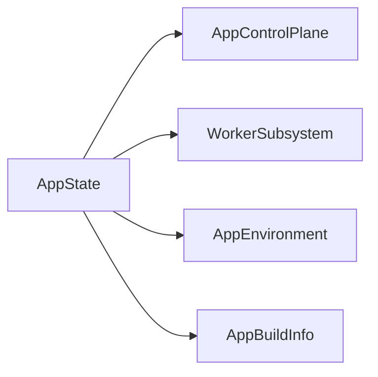
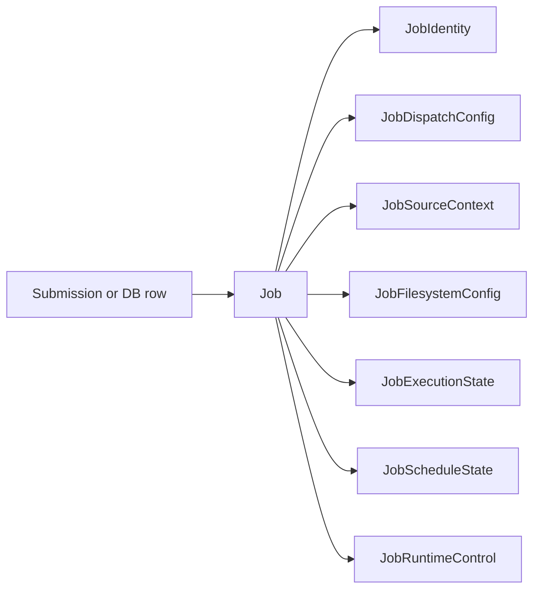

# Wide Struct Audit

**Status:** Current
**Last verified:** 2026-03-13

This page records the struct-shape rule used in `batchalign3`.

A large field count is not automatically wrong. The smell is:

- many fields with weak cohesion
- several related booleans
- repeated prefixes that imply missing sub-structs
- parallel vectors or stringly runtime fields
- interior runtime code reading many unrelated fields from the same value

The repo therefore treats **10 or more named fields** as an audit threshold,
not as an automatic ban.

## Categories

Wide structs fall into four categories.

### 1. Boundary shim

These exist at the CLI, JSON, or clap boundary.

They may stay wide if they are converted immediately into typed policies or
sub-structs before entering the core runtime.

Examples:

- `GlobalOpts`
- `AlignArgs`
- `TranscribeArgs`
- `BenchmarkArgs`

### 2. Transport record

These mirror a DB row, HTTP response, or worker-facing transport shape.

They may also stay wide, but they should not become the internal runtime shape.

Examples:

- `JobRow`
- `NewJobRecord`
- `JobSubmission`
- `JobInfo`
- `HealthResponse`

### 3. Real aggregate

Some structs are large because the domain aggregate is genuinely large.

That is acceptable when the fields all answer one question and callers usually
consume the value as a whole rather than spelunking through unrelated subsets.

Examples:

- `FileStatus`
- `AttemptRecord`

### 4. Refactor target

These are the dangerous ones.

They mix several responsibilities, carry policy and state together, or make
every caller know too much about the whole subsystem.

Current refactor targets:

- none of the current interior root-state owners cross the audit threshold

## Current Hotspots

### Server route state is grouped by boundary

`crates/batchalign-app/src/state.rs` keeps route-visible server state shallow:

- `AppControlPlane`
- `WorkerSubsystem`
- `AppEnvironment`
- `AppBuildInfo`

That is the expected shape for owned root state:

- one small root aggregate
- named sub-aggregates for real seams
- no caches or runner-only data threaded through every handler

### Job runtime state is grouped by concern

`crates/batchalign-app/src/store/job.rs` is grouped as:

- `JobIdentity`
- `JobDispatchConfig`
- `JobSourceContext`
- `JobFilesystemConfig`
- `JobExecutionState`
- `JobScheduleState`
- `JobRuntimeControl`

That is the shape this audit wants for interior runtime objects: one small root
aggregate with explicit sub-objects along real ownership seams.

The matching runner-facing projection still exists and remains useful:

- `RunnerJobIdentity`
- `RunnerDispatchConfig`
- `RunnerFilesystemConfig`

The next store-level issue is not `Job` field count. It is that the coordinator
API around `JobStore.jobs` is still narrower than the ownership model wants.

### CLI option bags are acceptable only at the edge

`GlobalOpts`, `AlignArgs`, `TranscribeArgs`, and `BenchmarkArgs` are all wide
and boolean-heavy. They are tolerated because clap needs a flat boundary type.

The rule is strict:

- parse into clap structs once
- convert immediately into typed policies and domain values
- do not thread those clap bags into runtime code

### API and DB rows should not leak inward

`JobRow`, `NewJobRecord`, `JobSubmission`, `JobInfo`, `JobListItem`, and
`HealthResponse` are wide because they describe serialization boundaries.

That is acceptable as long as the interior runtime does not start using those
transport shapes as its core model.

### State owners should stay shallow

The current interior root-state owners now follow the same grouping rule:

- progress summary
- viewport and selection
- summaries and recent errors
- interaction-only flags

The remaining wide-struct pressure is mostly at the boundary:

- clap argument bags
- HTTP response records
- SQL row models

## Design Rules

1. Treat 10 or more named fields as an audit trigger.
2. Treat 3 or more related boolean fields as a smell even below that threshold.
3. Boundary shims may be wide, but interior runtime structs should be grouped by
   one coherent axis.
4. Prefer named sub-structs over repeated field prefixes.
5. Replace parallel vectors with per-item records when possible.
6. If a wide struct is intentionally kept, document why and cap its field growth
   in the audit test.

## Fleet Implication

Fleet mode will amplify every wide-struct mistake.

Distributed queueing, claiming, and retry logic want typed projections such as:

- submission payload
- scheduler view
- runner snapshot
- API response model

They do not want one raw struct threaded through every layer.

That is why wide-struct cleanup is not cosmetic. It is a prerequisite for any
serious fleet return.
