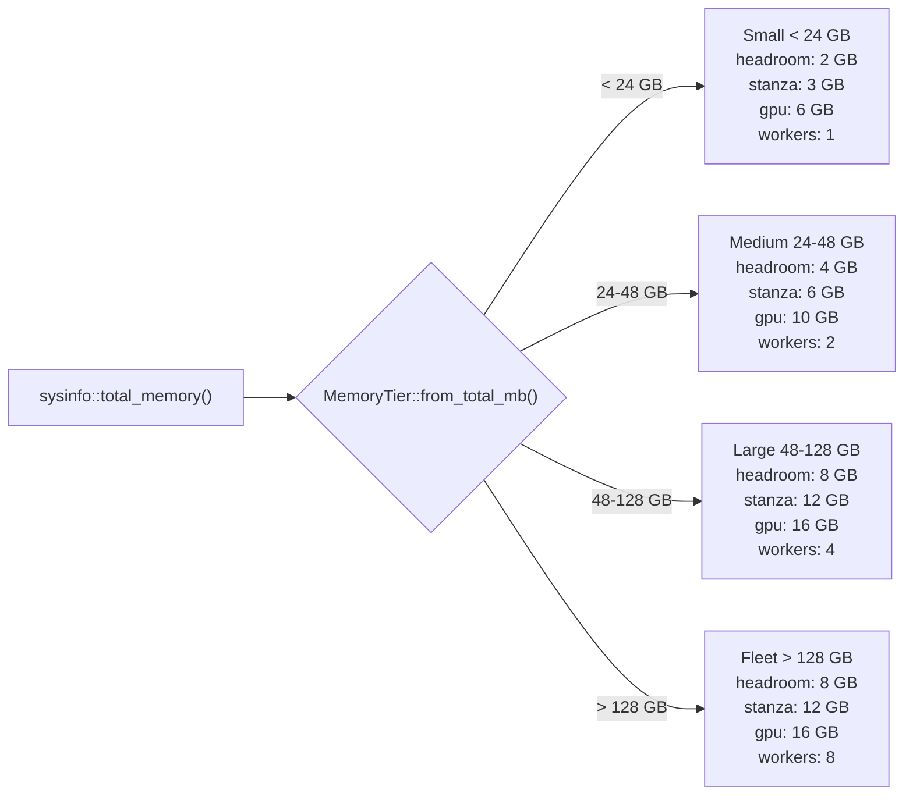
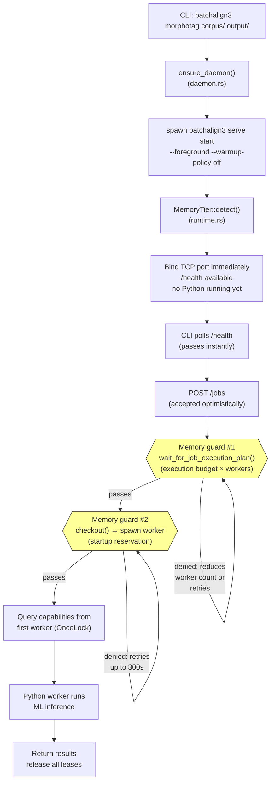
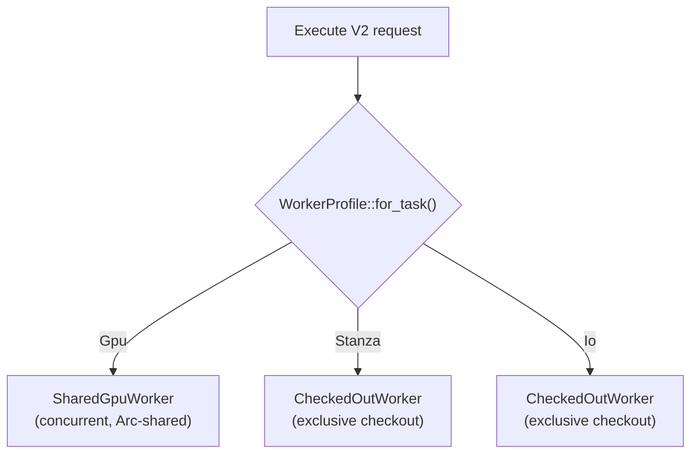
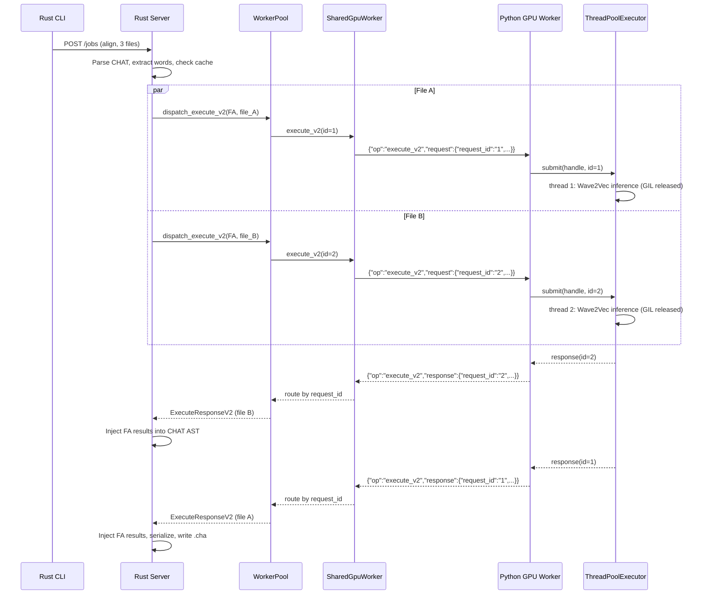
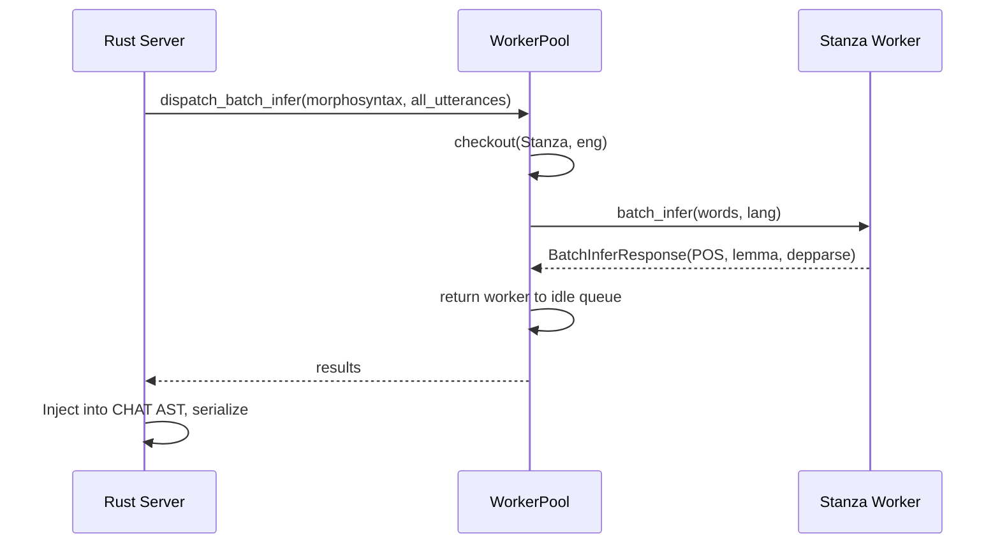
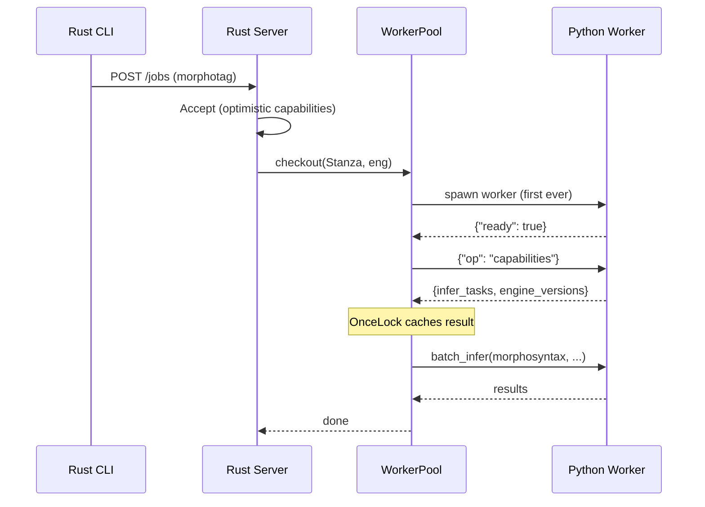

# Worker Memory Architecture

**Status:** Current
**Last updated:** 2026-03-26 16:08 EDT

Developer reference for the host-memory coordinator, worker pool, and warmup
internals. For user-facing configuration, see
[Worker Tuning](../user-guide/worker-tuning.md).

## RAM-tier adaptive budgets

All memory budgets are scaled automatically based on total system RAM. The
server detects the tier once at startup and logs it. No user configuration
is needed — it just works on machines from 16 GB laptops to 256 GB servers.



The Large and Fleet tiers reproduce the original fixed constants from
`runtime_constants.toml` exactly — fleet machines see zero behavior change.
The TOML constants remain as the Large/Fleet baseline; the tier system
scales them down for smaller machines.

**Source:** `types/runtime.rs` — `MemoryTier::from_total_mb()` (pure, testable)
and `MemoryTier::detect()` (reads sysinfo).

### Why small machines need smaller budgets

The original constants were tuned for 64-256 GB fleet machines where multiple
concurrent workers are the norm. On a 16 GB laptop:

- **Stanza startup 12 GB** exceeds available memory (~9 GB on macOS) → daemon
  can never start
- **Host headroom 8 GB** leaves no room for any worker at all
- **GPU startup 16 GB** exceeds total system RAM

The Small tier reduces these to match actual model sizes: Stanza uses ~2-3 GB
RSS, Whisper float32 ~4-5 GB. The reduced headroom (2 GB) still prevents
OOM while allowing the single-worker model to function.

## Memory check flow: server startup to job execution

This diagram shows every point where memory is checked or reserved, from
daemon spawn through job completion. Each gate that can block is marked.



**Key improvement:** No Python process runs until the first job arrives. The
daemon starts in &lt;1 second and uses zero memory at idle. Memory guards only
fire when actual work is requested, using tier-scaled budgets (Small tier:
3 GB Stanza, 2 GB headroom → `9000 − 3000 = 6000 ≥ 2000` passes on 16 GB).

## Job worker planning

`compute_job_workers()` in `runner/util/auto_tune.rs` decides per-job file
parallelism:

```
requested_workers = min(num_files, by_cpu)
                  clamped to category cap
```

This is now only a **requested** count. The actual granted worker count comes
from `HostMemoryCoordinator::wait_for_job_execution_plan()`, which applies
host-wide memory reservations and preserves `memory_gate_mb` as machine reserve.

If `config.max_workers_per_job > 0`, it overrides auto-tuning (still capped).

For single-file jobs, the function short-circuits to 1.

## Host-memory coordinator

A machine-local JSON ledger under a locked file coordinates all participating
local batchalign3 processes on the same host.

### Lease types

- `WorkerStartup` — held while a heavy worker/model load is in progress
- `JobExecution` — held for the duration of one job's active execution window
- `MlTestExclusive` — machine-wide lock for real-model test fixtures

### Startup reservations

Worker startup reservations are derived from the detected `MemoryTier`
(see [RAM-tier adaptive budgets](#ram-tier-adaptive-budgets)):

| Profile | Small | Medium | Large/Fleet |
|---------|-------|--------|-------------|
| GPU | 6 GB | 10 GB | 16 GB |
| Stanza | 3 GB | 6 GB | 12 GB |
| IO | 2 GB | 3 GB | 4 GB |

These are intentionally larger than the steady-state per-command execution
budgets because the model-loading spike is what repeatedly crashed shared
machines. On small machines, the budgets are reduced to match actual model
sizes (Stanza ~2-3 GB, Whisper float32 ~4-5 GB).

### Job execution planning

For a requested worker count, the coordinator:

1. samples current OS-visible available memory,
2. subtracts active local reservations already recorded in the ledger,
3. keeps `memory_gate_mb` as free headroom,
4. grants the largest worker count that still fits,
5. or returns a capacity error so the runner can re-queue the job.

This replaced the old standalone `memory_gate()` plus the flat 12 GB/job slot
heuristic.

## Worker pool

### Worker profiles

Each InferTask maps to one of three `WorkerProfile` variants via
`WorkerProfile::for_task()`. The profile determines the concurrency model and
max worker count:

| Profile | InferTasks | Concurrency model | max_workers |
|---------|------------|-------------------|-------------|
| `Gpu` | ASR, FA, Speaker | ThreadPoolExecutor inside one process (PyTorch releases GIL) | 1 per (lang, overrides) |
| `Stanza` | Morphosyntax, Utseg, Coref | Sequential per process, multiple processes for CPU parallelism | Auto-tuned |
| `Io` | Translate, OpenSMILE, AVQI | Sequential per process | 1 |



### End-to-end request flow

The full lifecycle of a GPU-profile request (e.g., forced alignment):



For a Stanza-profile request (e.g., morphotag), the flow uses exclusive
checkout instead:



The GPU profile is still the key memory optimization on large hosts: ASR, FA,
and Speaker models load in a single process instead of three separate
processes. For a mixed workload this means ~1.5 GB instead of ~4.5 GB, because
the models share a single Python interpreter, CUDA context, and
ThreadPoolExecutor.

That is no longer the only bootstrap shape. The current host execution policy
resolves memory tier into a concrete worker bootstrap mode:

- **Large/Fleet hosts** use `WorkerBootstrapMode::Profile` so related commands
  can reuse one long-lived worker process
- **Small hosts** use `WorkerBootstrapMode::Task` so a weak laptop can load only
  the task it is actually about to run

This keeps profile reuse as an optimization, not as an always-on hidden cost.

### TCP daemon ownership and registry discovery

`workers.json` now carries explicit ownership metadata for TCP daemons:

- **external** — started outside the current Rust server lifecycle; reusable
  across server restarts and preserved on routine shutdown
- **server_owned** — spawned by the current Rust server (for example by warmup);
  tagged with a `server_instance_id` plus server PID and retired by that same
  server instance on shutdown

Registry discovery applies that model directly:

- accept external daemons
- accept daemons owned by the current server instance
- skip daemons owned by a different live server
- reap stale foreign server-owned daemons whose owning server PID is gone

This fixes the old zombie/kill-all whackamole by giving the registry a real
lifecycle model instead of treating every entry as implicitly persistent or
implicitly disposable.

### Structure

```
WorkerPool
├── config: PoolConfig
├── groups: Arc<Mutex<HashMap<WorkerKey, Arc<WorkerGroup>>>>  (task/profile keyed sequential workers)
├── gpu_workers: Arc<tokio::sync::Mutex<HashMap<GpuWorkerKey, Arc<SharedGpuWorker>>>>
├── cancel: CancellationToken
└── warmup_status: AtomicU8 (WarmupStatus enum)

WorkerKey = (WorkerTarget, LanguageCode3, String)   // (target, lang, engine_overrides)
GpuWorkerKey = (WorkerTarget, LanguageCode3, String)

WorkerGroup (per (target, lang, engine_overrides) key — task/profile sequential workers)
├── idle: std::sync::Mutex<VecDeque<WorkerHandle>>
├── available: Semaphore (permits = idle count)
├── total: AtomicUsize (idle + checked-out)
└── bootstrap: AsyncMutex<()> (serializes spawns per key)

SharedGpuWorker (per (target, lang, engine_overrides) — GPU task/profile, concurrent dispatch)
├── stdin: tokio::sync::Mutex<ChildStdin>   (serialized writes)
├── pending: Mutex<HashMap<String, oneshot::Sender<ExecuteResponseV2>>>  (request_id routing)
├── control: tokio::sync::Mutex<Option<oneshot::Sender>>  (sequential ops)
├── reader_task: JoinHandle<()>  (background stdout reader)
├── pid: WorkerPid
└── config: WorkerConfig
```

### Checkout flow

`checkout()` is the core worker acquisition path for sequential worker targets.
GPU targets use `SharedGpuWorker` with concurrent `execute_v2()` calls instead
— there is no exclusive checkout for GPU tasks.

1. Try `semaphore.try_acquire()` — if a permit exists, pop from idle queue
2. If no permits, try `try_spawn_into_group()` — atomically claim a slot via
   `compare_exchange` on `total`, then spawn under the bootstrap lock
3. If at capacity, `semaphore.acquire().await` — async wait for a worker return
4. Wrap the popped `WorkerHandle` in `CheckedOutWorker` (RAII guard)

`CheckedOutWorker::drop()` returns the worker to the idle queue and releases
a semaphore permit. If the worker was `take()`n (dead), `total` is decremented
instead.

The idle queue uses `std::sync::Mutex` (not tokio), held only for microsecond
push/pop operations — never across `.await`.

### Bootstrap serialization

The `bootstrap` `AsyncMutex` on each `WorkerGroup` prevents a burst of
concurrent requests from launching multiple heavy Python workers for the same
key simultaneously. Only one spawn per key proceeds at a time, smoothing
model-loading spikes without reducing steady-state concurrency. This is
in-process protection; the host-memory coordinator extends the same idea across
multiple local servers and tests.

## runtime_constants.toml

Single source of truth consumed by both Rust (`include_str!` at compile time)
and Python (`read` at import time). Key sections:

- `[cmd2task]` — maps CLI command names to infer task names
- `[worker_caps]` — hard maximums: `max_gpu_workers`, `max_process_workers`,
  `max_thread_workers` (all 8)
- `[memory]` — `default_base_mb` (4000), `loading_overhead` (1.5)
- `[worker_startup_mb]` — cross-process startup reservations for GPU/Stanza/IO
- `[command_base_mb.process]` — per-command budgets for process workers (GIL)
- `[command_base_mb.threaded]` — per-command budgets for thread workers

When a model changes size, update the corresponding `command_base_mb` entry.
No code changes are needed — the TOML value propagates automatically.

## sysinfo macOS limitation

`sysinfo::available_memory()` on macOS returns only free + purgeable pages.
It excludes "inactive" pages (file-backed pages the kernel could reclaim under
pressure). This means the auto-tuner undercounts available memory on macOS,
leading to conservative worker counts. This is intentional — better to
undercount than OOM.

## Warmup internals

### WarmupStatus state machine

```
NotStarted → InProgress → Complete
```

Tracked via `AtomicU8` on the pool. Reported in the `/health` response as
`"warmup_status": "not_started" | "in_progress" | "complete"`.

### Synchronous vs background warmup

Two entry points in `server.rs`:

- **`prepare_workers()`** — probes capabilities, then runs warmup synchronously
  (all commands spawn concurrently within a `JoinSet`, but the function blocks
  until all finish). Used by tests and the `create_app()` path.

- **`prepare_workers_background()`** — probes capabilities, then spawns warmup
  in a `tokio::spawn` background task. The function returns immediately after
  probing. Used by `create_app_with_runtime()` (the server startup path) so
  the HTTP port binds without waiting for models.

### Concurrent warmup

Within `pool.warmup()`, each command spawns as a separate `JoinSet` task. This
still uses **profile targets only**: persistent TCP daemons advertise profile
capabilities in the registry, so task bootstrap is reserved for local stdio
workers. Each warmup task:

1. Resolves the profile target for the command via `WorkerProfile::for_command()`
2. Gets or creates the `WorkerGroup` (sequential targets) or `SharedGpuWorker`
   (concurrent GPU targets)
3. Claims a slot via atomic `compare_exchange`
4. Acquires the bootstrap lock (serializes per-key, but different keys proceed
   in parallel)
5. Spawns `WorkerHandle::spawn()` with the appropriate config
6. Pushes the handle to the idle queue and releases a semaphore permit

In the current production startup path, host policy still keeps warmup disabled
by default, so real servers stay lazy/on-demand unless a test-echo or test
harness path explicitly enables worker warmup.

### Lazy capability detection (no startup probe)

The server starts with **no Python process at all**. Capabilities are detected
lazily when the first worker spawns for a real job. The `OnceLock` on the pool
ensures detection runs only once, even under concurrent dispatch.

There is now one important exception: if startup discovers healthy TCP daemons
already listed in `workers.json`, the pool seeds its capability snapshot from
that discovery pass. Because sequential TCP daemons accept one connection at a
time, discovery now probes capabilities on the **same socket** it already opened
for the health check instead of racing a second connection.



Previously, a dedicated probe worker was spawned at startup, queried once,
then either killed (wasting 2-3 GB) or donated to the pool. The lazy approach
eliminates this entirely — the daemon starts in &lt;1 second with zero memory
footprint. The first job pays the model-loading cost, which is unavoidable.

### No-duplicate guarantee

If a job arrives for `(fa, eng)` while warmup is still spawning that same
worker, the job's `checkout()` call will wait on the semaphore. When the
warmup spawn finishes, it adds a permit and the job acquires it — no duplicate
spawn. This falls out naturally from the semaphore + bootstrap lock design.

## File processing order

Files within a job are currently processed in submission order. Workers are
dispatched via a `JoinSet` with a `Semaphore(num_workers)` limiting concurrency.

A potential future improvement: sort files largest-first before dispatch so
the longest files start processing immediately, reducing straggler effects.
The discovery layer already sorts by file size, but this could be made
explicit in the dispatch path.

## Debugging memory issues

### Startup log

The server logs its detected tier at startup:

```
Starting server on 0.0.0.0:8001...
Memory tier: Small (<24 GB) (total: 16 GB, headroom: 2 GB, stanza: 3 GB, gpu: 6 GB)
```

If the tier seems wrong, check `sysinfo::total_memory()` vs actual RAM.

### Common failures and fixes

| Symptom | Cause | Fix |
|---------|-------|-----|
| Daemon hangs at "Starting local daemon..." | Capability probe blocked by memory guard | Tier system auto-fixes this; if still failing, set `memory_gate_mb: 0` in `server.yaml` |
| "timed out waiting for host-memory capacity" | Worker startup reservation exceeds available RAM minus headroom | Check the tier log; reduce `memory_gate_mb` in `server.yaml` if needed |
| Worker spawn succeeds but OOM kills the process | Actual model RSS exceeds the tier budget | Report to team — the tier budgets may need adjustment |
| "insufficient memory to spawn worker" | Pre-spawn check (`BATCHALIGN_SPAWN_MIN_MEMORY_MB`) failed | Override: `BATCHALIGN_SPAWN_MIN_MEMORY_MB=2048` |

### Manual overrides

In `~/.batchalign3/server.yaml`:

```yaml
# Reduce host headroom (default: tier-dependent, 2-8 GB)
memory_gate_mb: 2048

# Disable host headroom checks entirely (dangerous on shared machines)
memory_gate_mb: 0

# Limit concurrent workers
max_workers_per_job: 1
max_total_workers: 1
```

### Diagnostic commands

```bash
# Check detected tier and current memory state
batchalign3 serve start --foreground -v 2>&1 | head -5

# Check health endpoint for live memory state
curl -s http://127.0.0.1:8001/health | python3 -m json.tool | grep -E 'memory|tier|worker'

# Check host-memory ledger (cross-process reservations)
cat /tmp/batchalign3-host-memory-*.json 2>/dev/null | python3 -m json.tool
```

See also:
- [Pipeline System](pipeline-system.md) — dispatch shapes and command lifecycle
- [Worker Tuning](../user-guide/worker-tuning.md) — user-facing configuration
