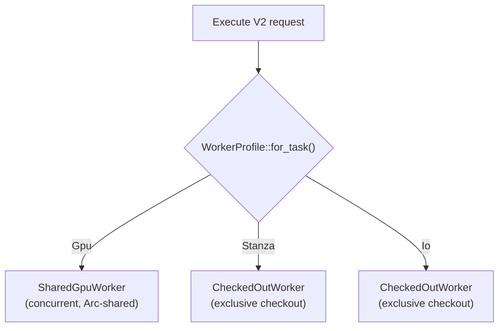
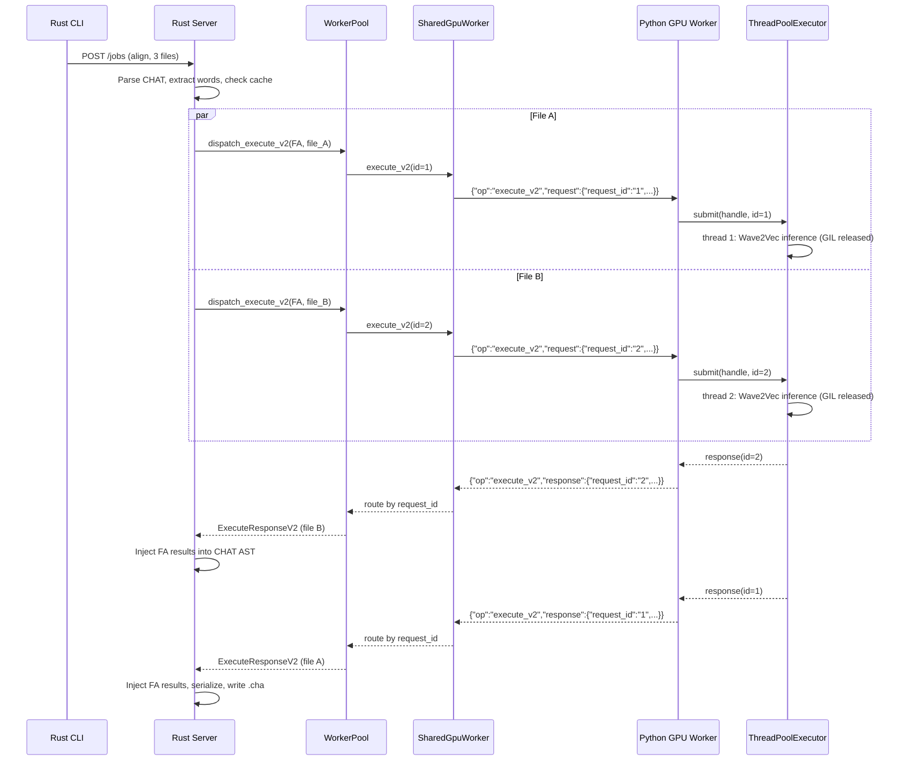
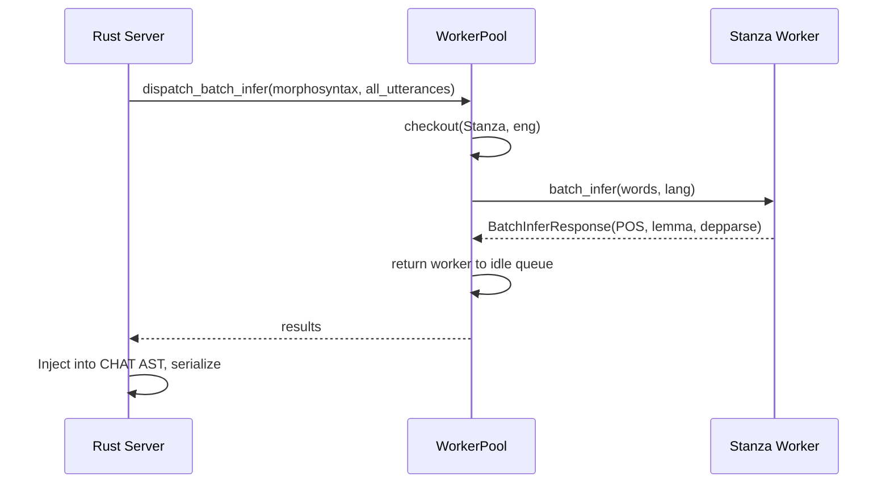

# Worker Memory Architecture

**Status:** Current
**Last updated:** 2026-03-21 13:17 EDT

Developer reference for the host-memory coordinator, worker pool, and warmup
internals. For user-facing configuration, see
[Worker Tuning](../user-guide/worker-tuning.md).

## Job worker planning

`compute_job_workers()` in `runner/util/auto_tune.rs` decides per-job file
parallelism:

```
requested_workers = min(num_files, by_cpu)
                  clamped to category cap
```

This is now only a **requested** count. The actual granted worker count comes
from `HostMemoryCoordinator::wait_for_job_execution_plan()`, which applies
host-wide memory reservations and preserves `memory_gate_mb` as machine reserve.

If `config.max_workers_per_job > 0`, it overrides auto-tuning (still capped).

For single-file jobs, the function short-circuits to 1.

## Host-memory coordinator

A machine-local JSON ledger under a locked file coordinates all participating
local batchalign3 processes on the same host.

### Lease types

- `WorkerStartup` — held while a heavy worker/model load is in progress
- `JobExecution` — held for the duration of one job's active execution window
- `MlTestExclusive` — machine-wide lock for real-model test fixtures

### Startup reservations

Worker startup reservations are explicit profile-level constants from
`runtime_constants.toml`:

- GPU: 16000 MB
- Stanza: 12000 MB
- IO: 4000 MB

These are intentionally larger than the steady-state per-command execution
budgets because the model-loading spike is what repeatedly crashed shared
machines.

### Job execution planning

For a requested worker count, the coordinator:

1. samples current OS-visible available memory,
2. subtracts active local reservations already recorded in the ledger,
3. keeps `memory_gate_mb` as free headroom,
4. grants the largest worker count that still fits,
5. or returns a capacity error so the runner can re-queue the job.

This replaced the old standalone `memory_gate()` plus the flat 12 GB/job slot
heuristic.

## Worker pool

### Worker profiles

Each InferTask maps to one of three `WorkerProfile` variants via
`WorkerProfile::for_task()`. The profile determines the concurrency model and
max worker count:

| Profile | InferTasks | Concurrency model | max_workers |
|---------|------------|-------------------|-------------|
| `Gpu` | ASR, FA, Speaker | ThreadPoolExecutor inside one process (PyTorch releases GIL) | 1 per (lang, overrides) |
| `Stanza` | Morphosyntax, Utseg, Coref | Sequential per process, multiple processes for CPU parallelism | Auto-tuned |
| `Io` | Translate, OpenSMILE, AVQI | Sequential per process | 1 |



### End-to-end request flow

The full lifecycle of a GPU-profile request (e.g., forced alignment):



For a Stanza-profile request (e.g., morphotag), the flow uses exclusive
checkout instead:



The GPU profile is the key memory optimization: ASR, FA, and Speaker models
load in a single process instead of three separate processes. For a mixed
workload this means ~1.5 GB instead of ~4.5 GB, because the models share a
single Python interpreter, CUDA context, and ThreadPoolExecutor.

### Structure

```
WorkerPool
├── config: PoolConfig
├── groups: Arc<Mutex<HashMap<WorkerKey, Arc<WorkerGroup>>>>  (Stanza, IO profiles)
├── gpu_workers: Arc<tokio::sync::Mutex<HashMap<GpuWorkerKey, Arc<SharedGpuWorker>>>>
├── cancel: CancellationToken
└── warmup_status: AtomicU8 (WarmupStatus enum)

WorkerKey = (WorkerProfile, LanguageCode3, String)  // (profile, lang, engine_overrides)
GpuWorkerKey = (LanguageCode3, String)              // (lang, engine_overrides)

WorkerGroup (per (profile, lang, engine_overrides) key — Stanza and IO profiles)
├── idle: std::sync::Mutex<VecDeque<WorkerHandle>>
├── available: Semaphore (permits = idle count)
├── total: AtomicUsize (idle + checked-out)
└── bootstrap: AsyncMutex<()> (serializes spawns per key)

SharedGpuWorker (per (lang, engine_overrides) — GPU profile, concurrent dispatch)
├── stdin: tokio::sync::Mutex<ChildStdin>   (serialized writes)
├── pending: Mutex<HashMap<String, oneshot::Sender<ExecuteResponseV2>>>  (request_id routing)
├── control: tokio::sync::Mutex<Option<oneshot::Sender>>  (sequential ops)
├── reader_task: JoinHandle<()>  (background stdout reader)
├── pid: WorkerPid
└── config: WorkerConfig
```

### Checkout flow

`checkout()` is the core worker acquisition path for Stanza and IO profiles.
GPU profile workers use `SharedGpuWorker` with concurrent `execute_v2()` calls
instead — there is no exclusive checkout for GPU tasks.

1. Try `semaphore.try_acquire()` — if a permit exists, pop from idle queue
2. If no permits, try `try_spawn_into_group()` — atomically claim a slot via
   `compare_exchange` on `total`, then spawn under the bootstrap lock
3. If at capacity, `semaphore.acquire().await` — async wait for a worker return
4. Wrap the popped `WorkerHandle` in `CheckedOutWorker` (RAII guard)

`CheckedOutWorker::drop()` returns the worker to the idle queue and releases
a semaphore permit. If the worker was `take()`n (dead), `total` is decremented
instead.

The idle queue uses `std::sync::Mutex` (not tokio), held only for microsecond
push/pop operations — never across `.await`.

### Bootstrap serialization

The `bootstrap` `AsyncMutex` on each `WorkerGroup` prevents a burst of
concurrent requests from launching multiple heavy Python workers for the same
key simultaneously. Only one spawn per key proceeds at a time, smoothing
model-loading spikes without reducing steady-state concurrency. This is
in-process protection; the host-memory coordinator extends the same idea across
multiple local servers and tests.

## runtime_constants.toml

Single source of truth consumed by both Rust (`include_str!` at compile time)
and Python (`read` at import time). Key sections:

- `[cmd2task]` — maps CLI command names to infer task names
- `[worker_caps]` — hard maximums: `max_gpu_workers`, `max_process_workers`,
  `max_thread_workers` (all 8)
- `[memory]` — `default_base_mb` (4000), `loading_overhead` (1.5)
- `[worker_startup_mb]` — cross-process startup reservations for GPU/Stanza/IO
- `[command_base_mb.process]` — per-command budgets for process workers (GIL)
- `[command_base_mb.threaded]` — per-command budgets for thread workers

When a model changes size, update the corresponding `command_base_mb` entry.
No code changes are needed — the TOML value propagates automatically.

## sysinfo macOS limitation

`sysinfo::available_memory()` on macOS returns only free + purgeable pages.
It excludes "inactive" pages (file-backed pages the kernel could reclaim under
pressure). This means the auto-tuner undercounts available memory on macOS,
leading to conservative worker counts. This is intentional — better to
undercount than OOM.

## Warmup internals

### WarmupStatus state machine

```
NotStarted → InProgress → Complete
```

Tracked via `AtomicU8` on the pool. Reported in the `/health` response as
`"warmup_status": "not_started" | "in_progress" | "complete"`.

### Synchronous vs background warmup

Two entry points in `server.rs`:

- **`prepare_workers()`** — probes capabilities, then runs warmup synchronously
  (all commands spawn concurrently within a `JoinSet`, but the function blocks
  until all finish). Used by tests and the `create_app()` path.

- **`prepare_workers_background()`** — probes capabilities, then spawns warmup
  in a `tokio::spawn` background task. The function returns immediately after
  probing. Used by `create_app_with_runtime()` (the server startup path) so
  the HTTP port binds without waiting for models.

### Concurrent warmup

Within `pool.warmup()`, each command spawns as a separate `JoinSet` task. This
means `morphotag`, `align`, and `transcribe` can still warm in parallel, but
each heavy spawn must first acquire a host-wide startup lease. Each task:

1. Resolves the `WorkerProfile` for the command via `WorkerProfile::for_command()`
2. Gets or creates the `WorkerGroup` (Stanza/IO) or `SharedGpuWorker` (GPU)
3. Claims a slot via atomic `compare_exchange`
4. Acquires the bootstrap lock (serializes per-key, but different keys proceed
   in parallel)
5. Spawns `WorkerHandle::spawn()` with the appropriate config
6. Pushes the handle to the idle queue and releases a semaphore permit

### Probe worker

`detect_capabilities()` spawns a temporary "probe" worker to discover what
commands the Python environment supports. It queries `capabilities()` via the
worker protocol, then shuts down the probe. This runs before warmup so the
server knows which warmup commands to skip.

### No-duplicate guarantee

If a job arrives for `(fa, eng)` while warmup is still spawning that same
worker, the job's `checkout()` call will wait on the semaphore. When the
warmup spawn finishes, it adds a permit and the job acquires it — no duplicate
spawn. This falls out naturally from the semaphore + bootstrap lock design.

## File processing order

Files within a job are currently processed in submission order. Workers are
dispatched via a `JoinSet` with a `Semaphore(num_workers)` limiting concurrency.

A potential future improvement: sort files largest-first before dispatch so
the longest files start processing immediately, reducing straggler effects.
The discovery layer already sorts by file size, but this could be made
explicit in the dispatch path.

See also:
- [Pipeline System](pipeline-system.md) — dispatch shapes and command lifecycle
- [Worker Tuning](../user-guide/worker-tuning.md) — user-facing configuration
