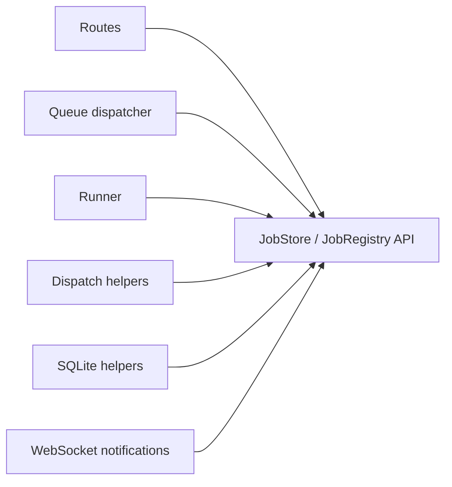
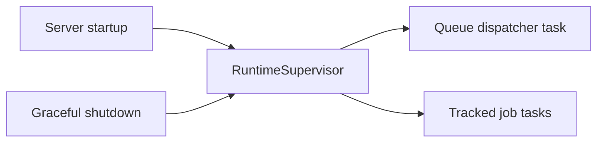
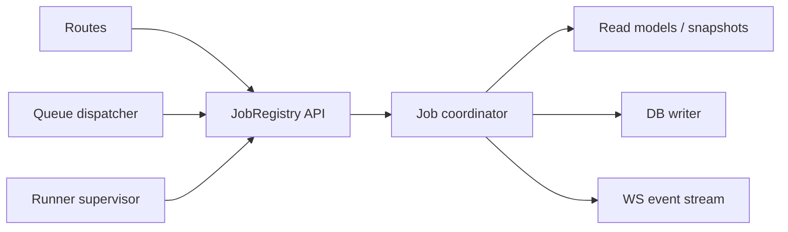
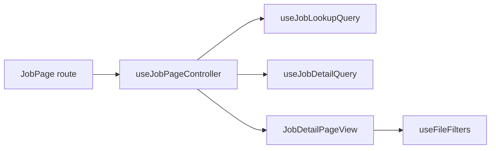

# Architecture Audit

**Status:** Current
**Last updated:** 2026-03-16

This page records the current internal architecture audit for `batchalign3`.
It is intentionally focused on present structure and next refactor targets,
not on migration history.

Longer-horizon optimization and redesign ideas that are not active refactors
should go on the [Performance and Re-Architecture Backlog](performance-and-rearchitecture-backlog.md)
rather than accumulate inline here.

This audit material is temporary developer-facing content. Keep it focused on
the current structure and active refactor fronts rather than letting it turn
into a historical planning archive.

## Scope

This audit covers:

- Rust control-plane code in `crates/`
- Python worker and pipeline boundary code in `batchalign/`
- PyO3 bridge code in `pyo3/`
- React/TypeScript dashboard code in `frontend/`
- developer-facing docs and diagrams in this book

The primary current focus is mutex usage and state ownership.
Wide struct shape is the next standing audit axis because several remaining
control-plane types are still too flat.
Test-seam quality is another standing audit axis: explicit fakeable boundaries
are preferred over monkeypatch-heavy tests because monkeypatch usually signals
that the production seam is still too implicit.

The next major active redesign is now specified in
[Worker Protocol V2](worker-protocol-v2.md). That work replaces the current
stdio JSON-lines worker contract with a typed control plane plus prepared
artifact descriptors so Python can shrink toward a pure model-host role.
Forced alignment is now the first live migration on that path: Rust builds V2
FA requests with prepared text and prepared audio artifacts, the stdio worker
now exposes a typed `execute_v2` op for live FA execution, and both full-file
FA and incremental FA route through the same Rust-side transport adapter. That
means the remaining V1 protocol surface is already shrinking around the tasks
that have not been migrated yet instead of staying entangled with FA.
ASR now shares that live V2 path, and speaker diarization has joined it too:
speaker requests are now typed `execute_v2(task="speaker")` envelopes with
Rust-prepared audio as the primary transport, and the old legacy
`batch_infer(task="speaker")` route is no longer part of the live worker
dispatch table. `opensmile` and `avqi` have now joined that same typed V2
family rather than staying behind ad hoc legacy batch dispatch.
`transcribe_s` now composes that low-level speaker task when ASR does not
already provide usable speaker labels, and the resulting speaker/header rewrite
now lives in `batchalign-chat-ops::speaker` rather than only in the PyO3 shim.
The Python cutover is complete. Python is now a pure stateless ML model server
(~9,800 lines excluding tests). All domain logic lives in Rust.

## Current Theme

`batchalign3` already has several strong boundaries:

- the worker pool uses owned worker values instead of `Arc<Mutex<WorkerHandle>>`
- the worker pool now also serializes per-key Python bootstrap so bursty demand
  does not fan out into simultaneous heavy worker startup for the same target
- the Python side is mostly a stateless inference boundary
- the PyO3 `ParsedChat` callback mutators now use clone-on-write staging so
  callback/progress failures cannot partially commit AST mutations
- the dashboard uses generated API types from Rust
- the book already explains major architecture seams in detail
- the Python worker protocol now has typed seams that can be tested without
  patching module globals

The main remaining problem is that some subsystems still use shared mutable
state as the *shape* of the architecture instead of as a narrow local
implementation detail.

## External Audit Reconciliation

The five external audit reports under the workspace `analysis/` directory were
useful, but they are not all still live findings.

- **Stale or already-corrected claims:**
  - `talkbank-tools` does already have both `cargo-fuzz` targets and live
    `proptest` usage, so the blanket "no fuzz/property testing" claim is stale.
  - CLI boolean conflict handling is now clap-enforced rather than driven by
    silent precedence.
  - Cantonese normalization/speaker rewrite ownership is already centered in
    Rust chat-op code rather than being trapped in a Python-only postprocess.
  - the old standalone `talkbank-lsp-server` binary surface is gone; `chatter
    lsp` is now the only supported LSP entrypoint.
- **Findings fixed in this final sweep:**
  - CLI engine selection now stays typed across the CLI → dispatch → runner
    path, and invalid `--engine-overrides` JSON now hard-fails instead of
    degrading to an empty map.
  - Stanza fallback mapping no longer truncates unknown ISO-639-3 codes to
    `iso3[:2]`.
  - the worker stdio boundary now tolerates bounded stray stdout noise without
    accepting protocol-shaped malformed JSON as valid.
  - Worker Protocol V2 result DTOs now reject non-finite metrics and reversed
    timing ranges, and malformed host output is classified as `runtime_failure`
    instead of being mislabeled as caller `invalid_payload`.
  - the worker pool now serializes same-key Python bootstrap to smooth model
    startup bursts.
  - PyO3 `ParsedChat` callback mutations and morphosyntax cache injection now
    stage on a cloned AST and commit only on success, so callback/progress or
    cache-entry failures do not partially mutate the long-lived handle.
- **Still valid, but intentionally deferred or still being completed:**
  - the full transport replacement for newline-delimited stdio JSON remains the
    Worker Protocol V2 migration path, not a late-sweep rewrite to land
    piecemeal.
  - deeper PyO3 thinning is still desirable, but it should continue by moving
    specific reusable logic into normal Rust crates rather than by doing a
    broad last-minute bridge rewrite.
  - Jan 9 parity work still matters, but the remaining gap is targeted
    semantic-equivalence coverage and behavior confirmation rather than raw CLI
    option parsing.



That pattern is most visible in the server-side job store.

## Mutex Audit

### `talkbank-tools`

The remaining mutex usage in `talkbank-tools` is comparatively low risk.

- `talkbank-model/src/errors/collectors.rs` uses a local collector mutex inside
  `ErrorCollector`. That is an internal storage detail, not a coordination
  boundary.
- `talkbank-transform/src/lock_helpers.rs` is a utility wrapper around poisoned
  `std::sync::Mutex` handling, but it is not the architectural center of the
  system.
- The more dangerous shared-state paths in `talkbank-tools` were already
  reduced in the earlier dashboard, validation, and LSP refactors.

The next concurrency work should therefore concentrate on `batchalign3`.

### `batchalign3`: High-Risk Hotspots

#### 1. `JobStore.jobs` is the main concurrency hotspot

`crates/batchalign-app/src/store/mod.rs` now wraps the in-memory job map in a
dedicated `JobRegistry` component instead of keeping an `Arc<Mutex<_>>` field
directly on `JobStore`. The important improvement is that query code no longer
open-codes that lock directly. The raw map lock now lives behind
`JobRegistry`, and the surrounding store/query layer speaks in terms of named
operations such as:

- `insert_checked`
- `list_items`
- `request_cancellation`
- `claim_ready_queued_jobs`
- `release_runner_claim`
- `runner_snapshot`

Lower-level per-job helpers like `project_job` and `update_job` still exist,
but they are now registry-local implementation seams rather than generic
collection access methods hanging off `JobStore`. Query modules now work
through named registry methods that return typed summary/file projections for
WebSocket publishing instead of borrowing raw `Job` values just to serialize
them. That API is now used throughout:

- `store/queries/`
- `runner/mod.rs`
- `runner/dispatch/`
- `runner/util/file_status.rs`

That is a real structural improvement because "take the mutex and poke fields"
is no longer the default control-plane pattern. But the registry is still the
central mutable state boundary for submission, dispatch, lease renewal,
progress, cancellation, and completion.

The most obvious lock-across-I/O paths in `submit`, `cancel`, and `delete`
were already shortened, which reduced the worst contention spikes. The latest
step also means query modules describe transitions through registry-owned and
store-owned named methods instead of spelling out lock choreography
themselves. The remaining problem is now architectural at a higher level: the
server still coordinates through one shared registry rather than a narrower
coordinator API or actor boundary.

The `Job` value itself is no longer a flat 30+ field bag. It is now grouped
into typed sub-structs for identity, dispatch, source context, filesystem
layout, execution state, schedule state, and runtime control. That reduces
field-bag coupling, but it does not yet solve the bigger ownership problem
around the shared jobs map.

The latest step also split runner access by responsibility:

- immutable `RunnerJobSnapshot` projections for dispatch-time reads
- named `JobStore` execution methods for job-level mutable transitions
- typed `QueuePoll` / `LeaseRenewalOutcome` values on the queue heartbeat seam
- shared file-status helpers for per-file state changes
- typed `JobListItem` / `FileStatusEntry` notification projections returned
  from the registry instead of raw borrowed job references
- `Job`-owned execution transitions for requeue, running, failure, and
  finalization
- `Job`-owned recovery transitions that canonicalize interrupted runtime state
  and persist the reconciled status back to SQLite
- `Job`-owned local queue-lease transitions so dispatch claim/renew/release no
  longer open-code lease field mutation in the store query layer
- `Job`-owned file lifecycle transitions so per-file status mutation is moving
  out of `store/queries/file_state.rs`
- a runner-side `FileRunTracker` so dispatch modules stop hand-sequencing file
  processing, retry, and completion mutations one store call at a time
- explicit `FileTaskOutcome` reporting from supervised file tasks so the
  runner no longer re-reads shared file state just to infer whether a task
  reached its terminal write path
- setup/preflight failures routed through that same lifecycle helper instead of
  living as a special raw `start attempt + set error` sequence in `runner/mod.rs`
- a typed `FileStage` vocabulary for runner-owned lifecycle labels instead of
  open-coded stage strings throughout the dispatch layer
- the shared internal `ProgressUpdate` channel now also carries `FileStage`
  rather than free-form labels, so FA/transcribe internals and the runner use
  one typed progress vocabulary end to end
- the REST/dashboard contract now exposes `progress_stage` as the stable client
  code and derives `progress_label` from that stage instead of treating the
  display string as the source of truth
- a `JobRegistry` API so query modules no longer reach for `jobs.lock().await`
  directly
- a dedicated `JobRegistry` component so the shared map is no longer just an
  interior store field
- a dedicated `OperationalCounterStore` component so health counters are no
  longer another ad hoc `Arc<Mutex<_>>`

That removes a large amount of open-coded runner-side lock choreography even
though the store is still mutex-backed internally.

This is the highest-priority mutex refactor target in the repository.

## Python Boundary Audit

The Python side is now closer to the intended steady state: a thin inference
host plus a very small provider-adapter facade.

- `batchalign/worker/_protocol.py` is now only the stdio loop
- `batchalign/worker/_protocol_ops.py` is now a thin Python wrapper over
  Rust-owned op decoding, validation, and dispatch
- `batchalign/worker/_infer_hosts.py` now owns bootstrap-time dynamic task
  wiring for engine-backed batch inference
- `batchalign/pipeline_api.py` is now the entire direct Python pipeline facade:
  provider adapters, `PipelineOperation`, compatibility wrappers, and
  `run_pipeline()`
- `pyo3/src/provider_pipeline.rs` now owns the direct Python pipeline loop plus
  the batch-infer request/response adapter logic on the Rust side

The immediate design win is that the old process-path seam is gone from the
worker protocol entirely. Python no longer carries a fallback request shape for
released commands, so the stdio boundary is now infer/execute-only instead of a
mix of command runtime and model host concerns.

The next design win is that request-time worker dispatch is thinner. Engine
selection for translation, FA, ASR, morphosyntax, and utseg is now resolved
during bootstrap and installed into the worker-side runtime hosts consumed by
`execute_v2` and the shrinking compatibility layer. That means the live request
paths no longer need to branch on raw engine state for those tasks on every
request.

The remaining Python work should keep pushing in the same direction:

- keep engine-specific code in the inference modules
- keep direct Python APIs as provider adapters, not document orchestrators
- move document semantics and orchestration back into Rust whenever new logic
  appears

The latest ASR boundary pass pushed that design further:

- Python ASR no longer flattens provider results into one shared token schema
- worker ASR now returns typed raw V2 results (`monologue_asr_result` or
  `whisper_chunk_result`)
- Rust normalizes those payloads into the shared internal ASR response domain
  used by transcription and UTR
- all Python-hosted ASR now runs through the live `execute_v2` boundary
- local Whisper ASR uses Rust-owned prepared audio
- Tencent, FunASR, and Aliyun now use typed provider-media V2 requests instead
  of the legacy `batch_infer(task="asr")` payload shape
- FunASR, Tencent, and Aliyun provider projection now also live in Rust helper
  functions, so Python no longer owns the shared cleanup/timestamp loops or
  sentence-fallback tokenization for those engines
- the Whisper timestamp workaround is now bound to each loaded model instance
  instead of globally mutating `WhisperForConditionalGeneration`

That is the right direction because the shared normalization rule is a control-
plane concern, not a provider-host concern.

The latest step also clarified worker ownership:

- batch inference now checks out task-targeted workers such as
  `infer:morphosyntax` and `infer:asr` instead of pretending those are command
  workers like `morphotag` or `transcribe`
- Python capability probing now reports infer tasks and engine versions as the
  authoritative worker contract
- Rust derives the released command surface from that infer-task set instead of
  trusting a second Python command advertisement list

That is a better fit for the long-term goal that Python is a model host, not a
command-runtime mirror.

One small follow-on improvement already landed: HK config validation no longer
needs to monkeypatch `config_read()`. `read_asr_config()` now accepts an
explicit `ConfigParser` for tests and higher-level helper code that already has
configuration in hand.

The lazy-audio tests also no longer monkeypatch the module-level audio loader.
`ASRAudioFile` now accepts an explicit loader dependency for focused unit tests
that need deterministic chunk reads.

The Cantonese FA tests now follow the same rule through `CantoneseFaHost`,
which means the active `batchalign/tests/` monkeypatch debt is effectively
gone.

Incremental morphosyntax and FA processing do not need their own Python API
surface. Those flows already live in the Rust server/runtime layer, so they are
not a reason to keep document orchestration in Python.

The same is true for partially implemented incremental ASR ideas. They may
change cache keys, preflight policy, or diffing strategy on the Rust side, but
they are not a reason to widen the Python worker contract again.

The main Rev.AI transport leak is now gone: the Rust server owns Rev-backed
transcription, benchmark ASR, preflight submission, and Rev-backed UTR timing
recovery. The remaining Python boundary is much closer to the intended
"model host only" shape.

That does not mean runtime substitution is forbidden. It means the default
expectation is now clear: prefer an explicit fakeable seam first, then use
monkeypatch only when the production boundary is already as narrow as it
should be.

#### 2. Worker-pool mutexes are mostly acceptable

`crates/batchalign-app/src/worker/pool/mod.rs` uses:

- `std::sync::Mutex<VecDeque<WorkerHandle>>` for idle workers
- `std::sync::Mutex<HashMap<WorkerKey, Arc<WorkerGroup>>>` for the group map

These are narrow, synchronous critical sections around queue push/pop and group
lookup. The current architecture docs correctly describe why these are
different from the job-store mutex.

The worker pool still wants structural cleanup because the module is large, but
the mutex choice itself is not the primary problem there.

### `batchalign3`: Low-Risk Owned-State Patterns

Task supervision now has an explicit owner.

`crates/batchalign-app/src/runtime_supervisor.rs` owns:

- the queue-dispatch loop task
- the tracked per-job task set
- shutdown waiting with a concrete deadline

`AppState` and the queue dispatcher now hold a `RuntimeSupervisor` handle
instead of sharing raw task collections behind mutexes.

Route-facing server state is also now grouped by boundary:

- `AppControlPlane`
- `WorkerSubsystem`
- `AppEnvironment`
- `AppBuildInfo`

That keeps queueing, worker capability data, filesystem roots, and build
identity out of one flat service bag while still letting handlers share one
`Arc<AppState>`.



The CLI TUI now follows the preferred state shape:

- one owner for UI state
- channel-delivered progress events
- a reducer that applies those events

`crates/batchalign-cli/src/tui/mod.rs` now keeps `AppState` on the blocking
render thread and receives `TuiUpdate` values over an unbounded channel from
the polling-side `ProgressSink` adapter.

```mermaid
flowchart LR
    poll["Poll loop"] --> sink["TuiProgress"]
    sink --> queue["Unbounded TuiUpdate queue"]
    queue --> runtime["TuiRuntime"]
    runtime --> state["AppState"]
    state --> draw["ratatui draw"]

Per-file runner work now has the same kind of explicit supervision boundary.
The runner no longer treats "force unfinished files to terminal state" as the
primary way to discover panics or early exits. Spawned file tasks now report
whether they actually left their file in a terminal state, and the runner turns
abnormal exits into immediate file failures before the fallback sweep runs.
The first durable file attempt now also begins before per-file setup, so input
reads, media resolution, conversion, and other early setup failures are no
longer invisible in attempt history. The compare path likewise closes the
pre-opened attempt for skipped `.gold.cha` companions instead of leaving that
attempt hanging open. The remaining pre-dispatch media validation path now uses
its own `file_setup` work unit instead of failing files with no attempt record
at all.
```

## Recommended State Shape

The server should move toward a coordinator-owned job runtime.



The key change is that most code should stop reasoning in terms of the raw jobs
map at all. The new helper seam is a good midpoint, but the end state is still
one level higher: named registry/coordinator operations rather than generic
collection access.

## Parameter and Type Audit

`batchalign3` already has strong standing guidance in
`architecture/type-driven-design.md` and `architecture/parameter-design.md`.
The remaining problem is enforcement consistency at routing and orchestration
boundaries.

Current parameter-count hotspots include:

- `crates/batchalign-cli/src/dispatch/mod.rs`
- `crates/batchalign-cli/src/dispatch/helpers.rs`
- `crates/batchalign-cli/src/dispatch/paths.rs`
- `crates/batchalign-cli/src/dispatch/single.rs`
- `crates/batchalign-app/src/runner/mod.rs`
- `crates/batchalign-app/src/runner/dispatch/process.rs`
- `crates/batchalign-app/src/runner/dispatch/compare_pipeline.rs`
- `crates/batchalign-app/src/runner/dispatch/fa_pipeline.rs`
- `crates/batchalign-app/src/runner/dispatch/transcribe_pipeline.rs`
- `crates/batchalign-app/src/runner/dispatch/infer_batched.rs`
- `crates/batchalign-app/src/runner/dispatch/utr.rs`

The store-side persistence seam is in better shape now:

- `PersistedJobUpdate`
- `PersistedFileUpdate`
- `AttemptStartRecord`
- `AttemptFinishRecord`

That means `store/queries/db_helpers.rs` is no longer one of the main
parameter-soup hotspots. The remaining pressure is higher up in the dispatch
and runner orchestration layers.

The design rule should remain strict:

- parse primitive values at the boundary and convert immediately
- use newtypes when parameter names are needed to explain a `String` or number
- group co-traveling values into parameter structs
- replace behavior-selecting booleans with enums or policy types
- treat `#[allow(clippy::too_many_arguments)]` as a temporary audit marker, not
  a stable design choice

## Wide Struct Audit

The repo now treats 10 or more named fields as an audit threshold.

That threshold is not a ban. It is a review trigger captured in
`architecture/wide-structs.md` and enforced by the Rust audit test in
`crates/batchalign-cli/tests/wide_struct_audit.rs`.

Current high-signal hotspots are:

- `GlobalOpts` in `crates/batchalign-cli/src/args/global_opts.rs`
- `AlignArgs` and `TranscribeArgs` in `crates/batchalign-cli/src/args/commands.rs`
- `HealthResponse` and related HTTP transport records in `crates/batchalign-app/src/types/response.rs`

The important distinction is that the remaining wide shapes are mostly
boundary-facing records. The interior root-state bags in the server and TUI are
now grouped below the audit threshold.

The rule is:

- wide clap, DB, and API boundary structs may exist
- wide interior runtime structs are refactor targets
- any intentionally wide struct needs an explicit audit classification and a
  growth cap

## Split Targets

These files are split targets because they are both numerically large and
conceptually overloaded.

### Rust

#### `crates/batchalign-chat-ops/src/nlp/mapping/mod.rs`

This file is far beyond the repo's own preferred file-size guidance and mixes:

- sentence-level `%mor` assembly
- chunk-index mapping
- `%gra` relation generation
- validation rules
- language-conditioned normalization behavior
- an extensive inline test suite

It should become a directory with separate modules for sentence mapping,
relation mapping, language-specific rules, validation, and tests.

#### `crates/batchalign-app/src/runner/mod.rs`

This file mixes:

- job spawn and lease heartbeat setup
- memory-gate handling
- infer capability gating
- per-job concurrency policy
- completion/failure orchestration
- command-family branching

It should become a thinner orchestration layer over:

- runner supervisor
- lease management
- preflight and gating
- completion/failure handling
- command-family dispatch

#### `crates/batchalign-cli/src/args/commands.rs`

This file is the same kind of monolithic argument surface that was already
split in `talkbank-tools`. It should be reorganized by command family:

- processing commands
- server and daemon commands
- jobs and logs commands
- cache and utility commands
- shared engine enums

#### `crates/batchalign-cli/src/daemon.rs`

This module currently owns too many daemon concerns at once:

- profile selection
- state-file naming
- lock-file lifecycle
- stale-binary detection
- startup polling
- sidecar-python selection
- stop/status operations

It should be split into daemon state, lifecycle, process spawning, and profile
selection.

#### `crates/batchalign-app/src/worker/handle.rs`

This file is a likely next split target because it mixes:

- spawn configuration
- child-process lifecycle
- stdio transport protocol
- ready handshake
- request/response decoding
- shutdown behavior

That is one transport boundary with too many sub-concepts in one file.

### Python

#### `batchalign/worker/_main.py`

This file used to be the Python equivalent of a large server bootstrap module. It owned:

- command-to-task interpretation
- model-loading policy
- Stanza configuration
- translation-engine loading
- FA/ASR engine loading
- process entry wiring

That split is now underway:

- `worker/_main.py` is the CLI/stdio entrypoint
- `worker/_model_loading/` now splits bootstrap, translation, FA, and ASR loader policy
- `worker/_stanza_loading.py` owns Stanza configuration and ISO-code mapping

The next Python step is to keep shrinking those modules so the worker becomes
as close as possible to a pure inference host with minimal orchestration logic.
That is the intended end-state: Python loads models and serves inference, while
Rust owns orchestration, CHAT/document semantics, retries, and workflow policy.

#### `batchalign/pipeline_api.py`

This file is now intentionally narrow. It combines only:

- one small operation record
- provider invoker abstractions
- concrete local and batch-infer invokers
- one Rust-forwarding `run_pipeline()` entry point

That is an acceptable consolidation because all document semantics now live in
Rust (`pyo3/src/provider_pipeline.rs`). The file should stay small and should
not regain parsed-document orchestration logic.

#### `batchalign/inference/audio.py`

This file is cohesive at the domain level but still bundles several internal
subsystems:

- file I/O compatibility layer
- audio metadata model
- lazy audio container
- caching policy
- token timestamp extraction glue

It is a reasonable candidate for a split into `io`, `lazy_audio`, and
Whisper-specific helpers.

### React and TypeScript

#### `frontend/src/app.tsx`

This file used to act as:

- route table
- fleet discovery bootstrap
- WebSocket lifecycle root
- live query-cache patching layer
- global store synchronization point

That split is now underway:

- `app.tsx` is reduced to a composition root
- route composition moved into `frontend/src/AppRoutes.tsx`
- fleet discovery and WebSocket/query/store synchronization moved into
  `frontend/src/hooks/useFleetDashboardSync.ts`
- message application moved into
  `frontend/src/liveSync/handleDashboardMessage.ts`

The next frontend pressure point used to be `JobPage.tsx`, but that page is now
split along the same controller/view seam as the app root.

#### `frontend/src/pages/JobPage.tsx`

That split is now in place:

- `pages/JobPage.tsx` is a route shell
- `hooks/useJobPageController.ts` owns job-to-server resolution, data loading,
  and cache selection
- `hooks/useJobDetailQuery.ts` owns the stable per-server detail cache entry
- `components/JobDetailPageView.tsx` owns file-filter orchestration and
  detailed rendering



The important improvement is that detailed job payloads no longer live in one
global Zustand slot. Summary rows still live in Zustand because they drive
fleet-level filtering and aggregate counters, but detailed job records now live
in React Query under `(server, jobId)` keys so the WebSocket patch layer and
the detail route share one cache.

The next frontend pressure point is now `FileTable.tsx`.

#### `frontend/src/components/FileTable.tsx`

This file combines grouping, directory-collapse state, row expansion state, and
table rendering. It is less urgent than `app.tsx` or `JobPage.tsx`, but it
would benefit from extracting grouping and directory-state logic into hooks or
utility modules.

## Docs and Diagram Audit

The book already has unusually strong architecture coverage. The main problem is
not missing documentation volume. The problem is missing *current-priority*
documentation.

The existing architecture pages explain:

- the worker pool
- the async runtime
- command lifecycles
- the Rust/Python boundary

What they do not currently provide is one page that says:

- which parts are working well
- which parts are the current refactor priorities
- where mutex use is acceptable
- where mutex use signals an ownership problem

This page fills that gap.

Two specific doc adjustments should follow in later refactors:

- the developer guide should gain a boundary-vocabulary page similar to the one
  added in `talkbank-tools`, so terms like coordinator, supervisor, store,
  queue backend, and worker handle are used consistently
- the parameter-design pages should be expanded with a cross-referenceable
  hotspot list so large signatures are visible before they become normal

## Recommended Order

1. Refactor `batchalign-app` job state so the shared registry helper layer can
   collapse into a smaller coordinator API instead of staying the dominant
   coordination mechanism.
2. Split the large Rust control-plane files: runner, args, daemon, worker
   handle, and mapping.
3. Audit and reduce remaining wide routing/orchestration function signatures.
4. Do the same architecture audit pass through Python worker/bootstrap code in
   `batchalign/`, with module split proposals and boundary docs kept in sync.
5. Do the same architecture audit pass through the React/TypeScript frontend in
   `frontend/`, especially file-table state shape and the detail-page live-sync
   boundary.
6. Split Python worker bootstrap and pipeline boundary modules.
7. Keep shrinking frontend page/controller tangles after the `app.tsx` and
   `JobPage.tsx` splits.
8. After those steps, return to the editor/server contract generation work in
   `talkbank-tools`.
