# Debugging Transcribe Pipelines

**Status:** Current
**Last updated:** 2026-03-19

This is a running log of transcribe pipeline failures, their root causes, and
how to diagnose them. It serves as a practical guide for the next person who
sees a transcribe job fail on net.

## Quick Reference: Debug a Failed Transcribe Job

### Step 1: Check the dashboard

Go to `http://net:8001/dashboard/jobs/<job-id>`. Look at the error category
and message for each failed file.

| Error category | Meaning | Next step |
|---------------|---------|-----------|
| `validation` | CHAT validation or Pydantic type error | Check the error message for details |
| `system` | Worker crash, timeout, or OOM | Check server logs |
| `worker` | Python worker protocol error | Check worker stderr in server logs |

### Step 2: Check the API for full error details

```bash
curl -s http://net:8001/jobs/<job-id> | python3 -c "
import sys, json
d = json.load(sys.stdin)
for f in d['file_statuses']:
    if f['status'] == 'error':
        print(f'--- {f[\"filename\"]} ---')
        print(f'Category: {f.get(\"error_category\", \"?\")}')
        print(f'Error: {f[\"error\"]}')
        print()
"
```

### Step 3: Re-run with `--debug-dir`

```bash
batchalign3 --no-open-dashboard --debug-dir /tmp/debug \
  transcribe <input-dir> -o <output-dir> \
  --lang <lang> --engine-overrides '{"asr":"whisper"}' -v
```

This produces intermediate artifacts at every pipeline stage:

```
/tmp/debug/
  <stem>_asr_response.json       # Raw ASR tokens + timestamps
  <stem>_post_asr.cha            # CHAT after assembly (before utseg)
  <stem>_pre_utseg.cha           # CHAT entering utseg
  <stem>_post_utseg.cha          # CHAT after utseg
  <stem>_pre_morphosyntax.cha    # CHAT entering morphosyntax
```

### Step 4: Validate the intermediate CHAT offline

```bash
# Copy the debug artifact locally
scp macw@net:/tmp/debug/<stem>_post_asr.cha /tmp/

# Validate it with the talkbank-tools validator
cd ~/talkbank/talkbank-tools
cargo run --release -p talkbank-cli -- validate /tmp/<stem>_post_asr.cha
```

### Step 5: Check server logs (without `--debug-dir`)

Even without `--debug-dir`, the server logs the full CHAT text at `warn!`
level when utseg pre-validation fails. On net:

```bash
ssh macw@net
# Server logs go to journalctl or the daemon's stdout capture
# (depends on how the server was started)
```

## Known Failure Modes

### 1. Whisper inverted timestamps

**Symptom:** `WhisperChunkSpanV2: end_s must be >= start_s`

**Root cause:** Whisper hallucination on long audio (30+ minutes). The
attention mechanism drifts and produces chunks where end < start.

**Example:** Job `696870c7-02b`, maria16.wav: `start_s=2020.0, end_s=2017.0`.
Also maria27.wav: `start_s=4965.44, end_s=0.0`.

**Fix:** (Shipped 2026-03-19) `inference/asr.py` now swaps inverted timestamps
and logs a warning. Downstream DP alignment handles garbled timing gracefully.

**Detection:** Error message contains `end_s must be >= start_s`.

### 2. `@Languages: auto` sentinel leaking into CHAT

**Symptom:** Validation error E519 (`Language code 'auto' should be 3
characters`). Or utseg pre-validation fails because the CHAT has parse errors.

**Root cause:** `--lang auto` was passed through as a raw string all the way to
`build_chat()`, which put it in the `@Languages` header. The validator rejected
it.

**Fix:** (Shipped 2026-03-19) `stage_build_chat` in `pipeline/transcribe.rs`
now resolves `"auto"` to the ASR-detected language from `AsrResponse.lang`
before building the CHAT. Additionally, `LanguageCode3` now validates on
construction and rejects non-ISO values. `LanguageSpec` enum distinguishes
`Auto` from `Resolved(LanguageCode3)` at the type level.

**Detection:** Error message contains `Language code 'auto'` or E519.

### 3. Utseg pre-validation rejects internally-generated CHAT

**Symptom:** `utseg pre-validation failed: [L0] File has N parse error(s)`

**Root cause:** `build_chat()` or `to_chat_string()` produced CHAT that doesn't
roundtrip cleanly through the parser. This is a bug in our code, not bad user
input.

**Diagnosis:**
- With `--debug-dir`: inspect `<stem>_post_asr.cha` — this is the exact CHAT
  that failed validation
- Without `--debug-dir`: server logs contain the full CHAT at `warn!` level
- Run `cargo run -p talkbank-cli -- validate <file>` to find the exact error

**Current behavior:** Hard error — no output written. This is wrong for the
transcribe pipeline (see `book/src/developer/chat-validation-failures.md`).

**Future fix:** Catch validation error, log it, skip utseg, emit pre-utseg
CHAT as the output.

### 4. Stanza timeout/OOM on very long files

**Symptom:** `internal error. Try restarting the job.` (system error category)

**Root cause:** Stanza constituency parsing (utseg) or POS tagging
(morphosyntax) crashes or times out on files with hundreds of utterances.

**Example:** Job `2a6d7a97-31c`, maria18.wav: 853-line CHAT file (498 MB WAV,
~45 minutes audio). Stanza crashed during utseg inference.

**Workaround:** Increase timeout with `--timeout 3600` (1 hour). For very long
files, skip utseg entirely.

**Detection:** Error category is `system`, no validation error details.

### 5. Worker not ready at job start

**Symptom:** `communication error with the processing engine`

**Root cause:** The first file in the job was dispatched before the Python
worker finished loading models. The worker spawn takes 10-30 seconds for
Whisper model loading.

**Example:** Job `2a6d7a97-31c`, maria16.wav was dispatched immediately at job
start.

**Detection:** Error category is `system`, error mentions "communication error".
Usually only affects the first file in a job.

**Workaround:** Retry the failed file or the whole job. The worker is ready by
the time the retry happens.

## Transcribe Pipeline Stages

```mermaid
flowchart TB
    A["1. ASR Inference<br>(Whisper/Rev.AI)"] --> B["2. ASR Post-Processing<br>(compounds, numbers, disfluency)"]
    B --> C["3. Build CHAT<br>(utterances → AST → serialize)"]
    C --> D["4. Utseg<br>(Stanza constituency → re-segment)"]
    D --> E["5. Morphosyntax<br>(Stanza UD → POS/lemma/depparse)"]
    E --> F["6. Serialize + Write"]

    A -.->|"dump_asr_response"| DA["_asr_response.json"]
    C -.->|"dump_post_asr_chat"| DC["_post_asr.cha"]
    D -.->|"dump_pre/post_utseg"| DD["_pre_utseg.cha<br>_post_utseg.cha"]
    E -.->|"dump_pre_morphosyntax"| DE["_pre_morphosyntax.cha"]

    style DA fill:#1a1a2e,stroke:#444
    style DC fill:#1a1a2e,stroke:#444
    style DD fill:#1a1a2e,stroke:#444
    style DE fill:#1a1a2e,stroke:#444
```



Stages 4 and 5 are optional (enabled by default for transcribe). Each stage
has a pre-validation gate that can reject the file (currently a hard error —
see known issue #3 above).

## Debug Artifact Reference

| Artifact | Written by | Contains |
|----------|-----------|----------|
| `_asr_response.json` | `stage_asr_infer` | Raw tokens, timestamps, speaker labels, detected language |
| `_post_asr.cha` | `stage_build_chat` | CHAT after assembly — before utseg |
| `_pre_utseg.cha` | `stage_run_utseg` | CHAT entering utseg (same as _post_asr unless future stages insert) |
| `_post_utseg.cha` | `stage_run_utseg` | CHAT after utterance re-segmentation |
| `_pre_morphosyntax.cha` | `stage_run_morphosyntax` | CHAT entering morphosyntax |

All artifacts are written by `DebugDumper` (`runner/debug_dumper.rs`). When
`--debug-dir` is not set, all dump calls are zero-cost no-ops.

## Historical Incidents

| Date | Job | Files | Error | Root Cause | Resolution |
|------|-----|-------|-------|-----------|------------|
| 2026-03-19 | `696870c7` | maria16, maria27 | Inverted timestamps | Whisper hallucination on long audio | Timestamp clamping in `asr.py` |
| 2026-03-19 | `696870c7` | maria18, sastre02 | L0 parse error in utseg | `@Languages: auto` leaked into CHAT | Auto→detected resolution in `stage_build_chat` |
| 2026-03-19 | `696870c7` | sastre03, sastre09, sastre11 | System error | Unknown — worker crash/timeout | Not yet diagnosed |
| 2026-03-19 | `2a6d7a97` | maria16 | Communication error | Worker not ready at job start | Retryable |
| 2026-03-19 | `2a6d7a97` | maria18 | System error | Stanza timeout on 853-line file | Timeout/file-size limit needed |
