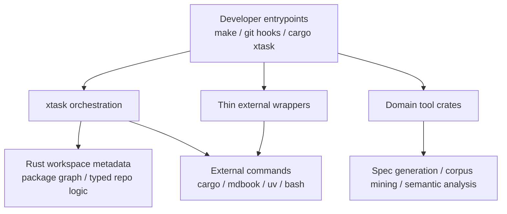

# Tooling Architecture

**Last modified:** 2026-03-21 08:20 EDT

This page defines the intended shape of project automation for the pre-release
refactor. The goal is not "rewrite every script in Rust." The goal is to stop
letting project automation sprawl across shell, Python, Node, Rust bins, and
one-off helpers without a clear boundary model.

## Current Direction

`batchalign3` now has a first `xtask` slice:

- [`xtask`](/Users/chen/batchalign3-rearch/xtask/src/main.rs) owns the
  dependency-aware `affected-rust` selection logic.
- Local entrypoints such as [`Makefile`](/Users/chen/batchalign3-rearch/Makefile)
  and [`pre-push.sh`](/Users/chen/batchalign3-rearch/scripts/pre-push.sh) now
  call `cargo xtask affected-rust ...`.

That change is intentionally small. It proves the boundary without turning
`xtask` into a new junk drawer.

## Tooling Layers

The intended split is:

- `xtask`
  For repo-local orchestration and typed project automation.
- Thin scripts
  For shelling out to ecosystem tools where Rust is not the point.
- Domain tool crates
  For long-lived semantic tooling that understands project artifacts and should
  be tested and versioned like normal code.

## What Belongs In `xtask`

Use `xtask` when the task:

- understands Rust workspace/package structure
- needs typed access to project metadata or artifact graphs
- orchestrates several project-local checks with policy
- would otherwise become brittle string-hacking in shell or Python
- is developer automation rather than product/runtime logic

Good candidates:

- affected-package / affected-check selection
- local `check` / `clippy` / `test` orchestration
- local CI presets
- drift checks that reason about project manifests or generated artifacts
- install smoke tests for `uv tool install batchalign3`
- packaging verification and compatibility policy checks
- slim local `maturin develop` profiles that avoid rebuilding optional bridges

## What Should Stay Outside `xtask`

Keep a task outside `xtask` when the external ecosystem is the real owner:

- dashboard/frontend build steps
- Python packaging/build steps that fundamentally run through `uv`/`maturin`
- Node-based code generation tightly coupled to frontend or JS tooling
- thin shell wrappers whose entire job is "invoke one external command"

Examples that should remain external for now:

- [`build_react_dashboard.sh`](/Users/chen/batchalign3-rearch/scripts/build_react_dashboard.sh)
- [`generate_dashboard_api_types.sh`](/Users/chen/batchalign3-rearch/scripts/generate_dashboard_api_types.sh)
- [`generate_ipc_types.sh`](/Users/chen/batchalign3-rearch/scripts/generate_ipc_types.sh)

`xtask` may still orchestrate these, but it should not absorb their internal
ecosystem logic just for the sake of saying everything is Rust.

## What Should Become First-Class Rust Tools

Some current "scripts" are not really scripts. They are semantic tools and
should eventually be first-class Rust crates or bins instead of ad hoc glue.

Likely examples across the repos:

- corpus mining and benchmark fixture generation
- schema / protocol / workflow validation tools
- install and packaging smoke tests that need typed artifact inspection
- deeper affected-test selection once it depends on project dependency graphs,
  test metadata, or workflow families

For `talkbank-tools`, the existing `spec/tools` workspace is already close to
the right model: it is not just automation glue, it is domain tooling.

## Rules

Use these rules going forward:

1. `xtask` is for orchestration and repository policy, not domain runtime code.
2. Product semantics should not hide in shell pipelines.
3. If a tool manipulates project/domain data structures, prefer Rust over
   string-hacking in shell or Python.
4. If a tool mainly delegates to `uv`, `mdbook`, `npm`, or `bash`, keep it
   thin and external.
5. Do not keep two full implementations of the same automation flow in
   different languages. Keep one source of truth and use wrappers only for
   compatibility.
6. If a task grows tests, typed config, and its own semantic rules, it should
   probably be a normal Rust tool crate, not a script and not `xtask`.

## Batchalign3 Inventory

Current `batchalign3` tooling should move toward this split:

- `xtask`
  - `affected-rust`
  - future local verification orchestration
  - future packaging/install smoke tests
- thin external wrappers
  - dashboard build
  - Python type generation
  - API drift checks that still rely on external generators
- possible future Rust tool crates
  - benchmark/corpus harnesses
  - semantic install validation
  - richer dependency-aware test selection

## Cross-Repo Follow-Up

`talkbank-tools` should likely adopt the same orchestration pattern, but not by
copy-pasting `batchalign3` blindly.

The likely end state is:

- each repo gets a small `xtask` for repo-local automation
- long-lived semantic tools remain proper tool crates
- shell/Python/Node are kept where they are the right ecosystem boundary

That keeps the project away from both extremes:

- "everything is a shell script"
- "everything must be forced into xtask"
