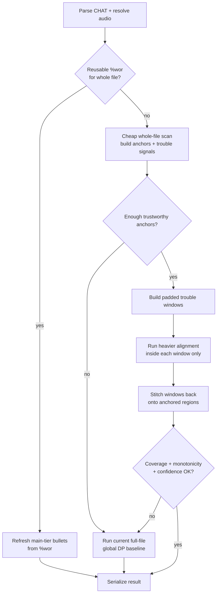
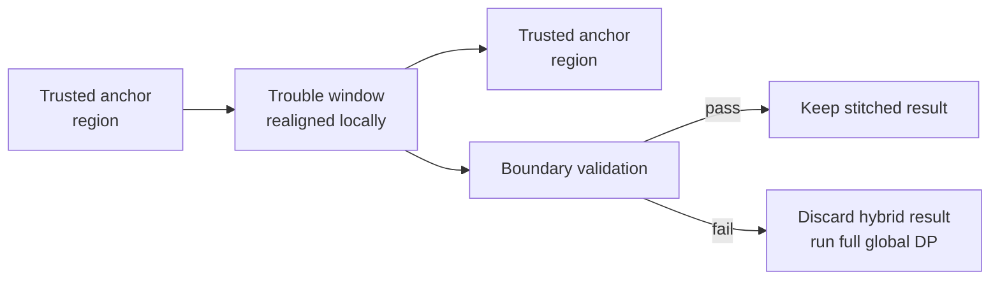

# Trouble-Window Alignment Plan

**Status:** In progress
**Last updated:** 2026-03-14

This page describes a future hybrid alignment strategy for `align`:

- stay cheap on normal files
- preserve already-good timing where possible
- identify local trouble regions
- run heavier alignment only where needed
- keep a full-file global-DP fallback as the correctness reference

The motivating workflow is a file that is already partly or mostly aligned, but
has local hand-edited transcript regions that should be repaired without
reprocessing the entire file as if it were fresh raw input.

## Goals

The design should work well for these common cases:

1. **Already aligned file rerun**
   The file already has complete reusable `%wor` timing. `align` should skip
   FA entirely and just refresh derived surfaces.

2. **Mostly good file with local text edits**
   Most utterances and word timings are still good, but a few local regions were
   edited by hand. `align` should preserve the stable regions and only realign
   the changed neighborhoods.

3. **Utterance-bulleted file without `%wor`**
   The file has good utterance bullets but no durable word-tier timing. `align`
   should reuse those utterance anchors when possible and avoid needless
   whole-file work.

4. **Difficult file with overlap or strong transcript/audio divergence**
   If local heuristics are not trustworthy, the system must fall back cleanly to
   the current full-file global baseline.

## Current Baseline

Today the implemented strategy is:

- reusable `%wor` → cheap refresh path, no FA
- **per-utterance `%wor` reuse on plain reruns** → when the whole-file check
  fails (some utterances edited), detect which utterances still have clean
  `%wor`, refresh those, and only send stale groups through FA workers
- `align --before` unchanged / speaker-only-changed utterances → copy `%wor`
  from the before file, refresh main-tier timing, and reuse preserved groups
- `align --before` timing-only edits → restore timing from the old file's
  `%wor` instead of forcing a full-file rerun
- untimed utterances + unique exact ASR subsequence → cheap UTR path
- otherwise → one global Hirschberg alignment for UTR

That baseline is intentionally conservative. The trouble-window design below is
an optimization layer above it, not a replacement for it.

## Proposed Pipeline



## Phase 1: Cheap Whole-File Scan

The first pass should gather evidence, not commit to expensive alignment yet.

### Inputs the scan can use

- existing utterance bullets
- existing `%wor` timing
- transcript word sequence
- ASR word sequence from the UTR pre-pass
- diff information when rerunning on a previously aligned file

### Trustworthy anchor sources

- exact transcript↔ASR runs with unique monotonic matches
- unchanged transcript regions whose `%wor` still aligns cleanly to the main tier
- timed utterances that remain structurally consistent after a text diff
- long lexical runs without ambiguity or repeated-token uncertainty

### Trouble signals

- main↔`%wor` mismatch rows
- missing `%wor` timing in a locally edited span
- repeated-token ambiguity
- large unmatched transcript or ASR runs
- local order inversion or monotonicity collapse
- unusually sparse or low-confidence ASR agreement
- overlap-heavy regions where monotonic alignment is suspicious

## Phase 2: Build Trouble Windows

Trouble windows should be small, typed, and explainable.

### Window construction rules

1. start from contiguous mismatch or low-confidence runs
2. expand outward to the nearest trustworthy anchors
3. add padding on both sides so local alignment has context
4. merge overlapping or near-adjacent windows
5. if windows cover too much of the file, abandon the hybrid path and fall back
   to full global DP

### Window classes

- **Text edit window**
  Existing `%wor` proves the surrounding region is stable, but the edited
  transcript span no longer matches it.

- **ASR disagreement window**
  Transcript and ASR stop agreeing locally even though the surrounding file has
  strong anchors.

- **Overlap / reorder suspicion window**
  The file still looks mostly stable, but local ordering assumptions appear to
  break down.

## Phase 3: Run Heavy Alignment Locally

Inside each trouble window, the system can use the same heavier machinery that
would be too expensive or too aggressive to run on the whole file.

Candidate local strategies:

- local Hirschberg DP over the transcript/ASR slices
- local FA rerun for only the affected utterance/audio span
- local `%wor` regeneration when a transcript edit invalidates only one short
  region

The first implementation should stay conservative:

- one local algorithm at a time
- clear typed inputs and outputs
- explicit diagnostics for why a window was escalated

## Phase 4: Stitch Back

The stitch step is where correctness can be lost if the architecture is sloppy.

### Safe stitch rules

- anchor regions are immutable during a hybrid pass
- local windows may rewrite timing only inside their owned span
- stitched output must remain monotonic at the window boundaries
- boundary utterances should be revalidated after insertion
- if stitching creates contradictions, discard the hybrid result and fall back
  to the global baseline



## Best Fit for Hand-Edited Rerun Workflows

The most promising version for hand-edited reruns is **diff-first reuse**:

1. parse the current file
2. align main tier back to the existing `%wor`
3. classify regions as:
   - stable and reusable
   - locally changed
   - globally inconsistent
4. preserve stable regions
5. realign only the changed ones

That gives the best operator experience when someone edits a few utterances in
an already aligned file and wants `align` to repair only those local regions.

In practice, this likely means:

- `%wor` is the first anchor source to trust
- existing utterance bullets are the second anchor source
- full-file ASR/global DP is the safety net, not the default for reruns

## Explicit Fallback Conditions

The hybrid path should abort and use the current full-file global baseline when:

- there are too few trustworthy anchors
- trouble windows cover most of the file
- boundary stitching fails
- the file is overlap-heavy enough that monotonic local windows are not
  trustworthy
- diagnostic confidence is too low to explain why the hybrid result is correct

## Instrumentation Requirements

This design is only practical if the pipeline can explain itself.

The following artifacts should be captured for debugging and replay:

- anchor map
- trouble-signal map
- constructed window list with reasons
- local alignment inputs/outputs per window
- stitch decisions and boundary validation results

Those artifacts should be file-scoped and diffable so a bad hybrid run can be
compared directly against the full global baseline.

## Suggested Implementation Order

1. **Whole-file reuse first**
   Already implemented for complete reusable `%wor`.

2. **Diff-first local reuse**
   Detect changed regions relative to `%wor` and preserve unchanged ones.
   Per-utterance `%wor` preservation is now implemented in both the
   `align --before` incremental path and the plain rerun path (via
   `find_reusable_utterance_indices` + 3-tier group partition). The remaining
   step is explicit trouble-window planning for more granular sub-group reuse.

3. **Windowed local DP**
   Run Hirschberg only in explicit trouble windows.

4. **Windowed local FA rerun**
   Restrict worker/audio work to the affected time spans.

5. **Richer overlap-aware handling**
   Only after the stitched-window baseline is explainable and well-tested.

## Pipeline Architecture Impact

This design changes `align` from a mostly straight pipeline into a planner plus
executor.

### Current shape

```text
parse -> UTR -> FA -> inject -> validate
```

### Hybrid shape

```text
parse -> analyze -> plan -> reuse/local-execute -> stitch -> verify -> maybe-global-fallback -> validate
```

### Likely Rust-side types

- `AnchorRegion`
- `TroubleSignal`
- `TroubleWindow`
- `AlignExecutionPlan`
- `WindowExecutionResult`
- `StitchResult`
- `HybridAlignSummary`

The important architectural constraint is that the planning step should be
explicit and typed. This should not become a large pile of ad hoc conditionals
inside `process_fa()`.

## Progress and Dashboard Impact

The current shared progress model is a good start, but hybrid alignment will
need richer command-specific detail than one flat stage label.

### Likely progress stages

- `analyzing`
- `planning_windows`
- `reusing_existing_timing`
- `aligning_window`
- `stitching`
- `verifying`
- `global_fallback`

### Useful per-file detail fields

- total trouble windows
- completed trouble windows
- stable regions reused
- whether fallback to full global DP occurred
- rough ratio of reused timing vs recomputed timing

### UI implications

- the TUI should show that a file is in a hybrid run, not just "aligning"
- the web dashboard should show whether the file was mostly reused, locally
  repaired, or forced onto the full global fallback
- progress should move forward by meaningful work units, not jump backward when
  a hybrid attempt escalates to the full fallback path

This suggests keeping the shared `progress_stage` field for coarse file state,
but adding command-specific structured progress detail for `align`.
