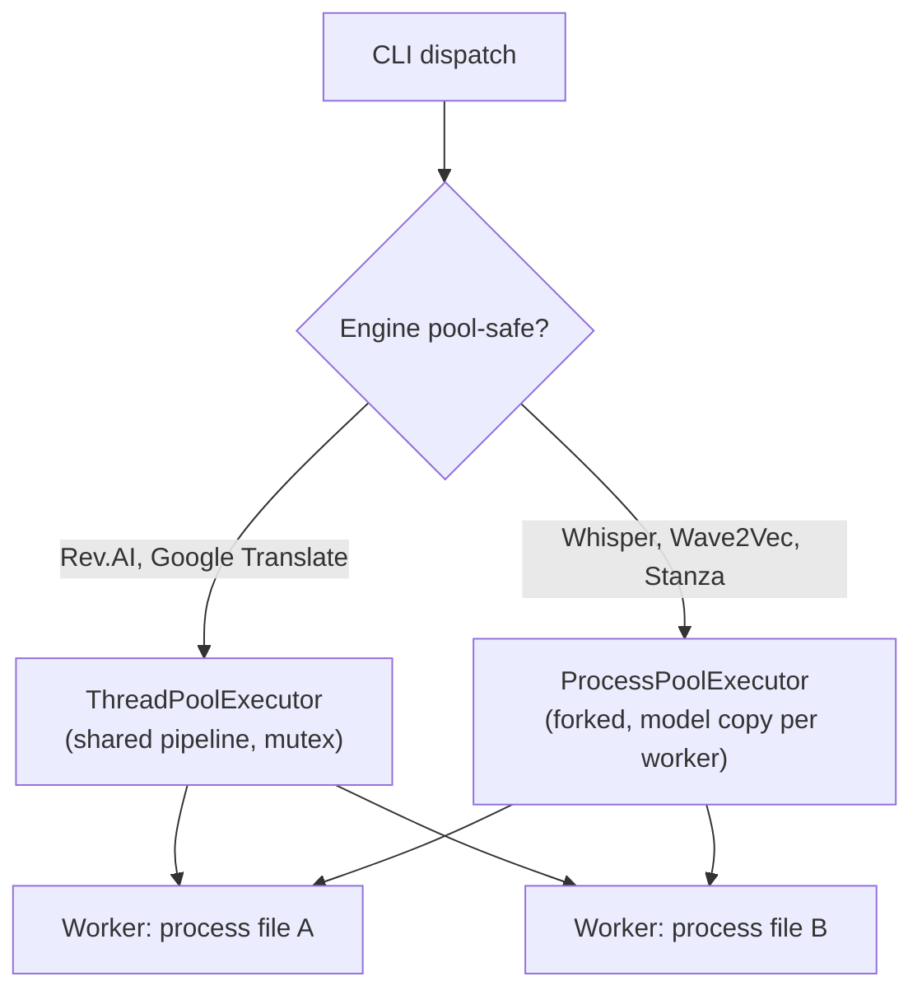
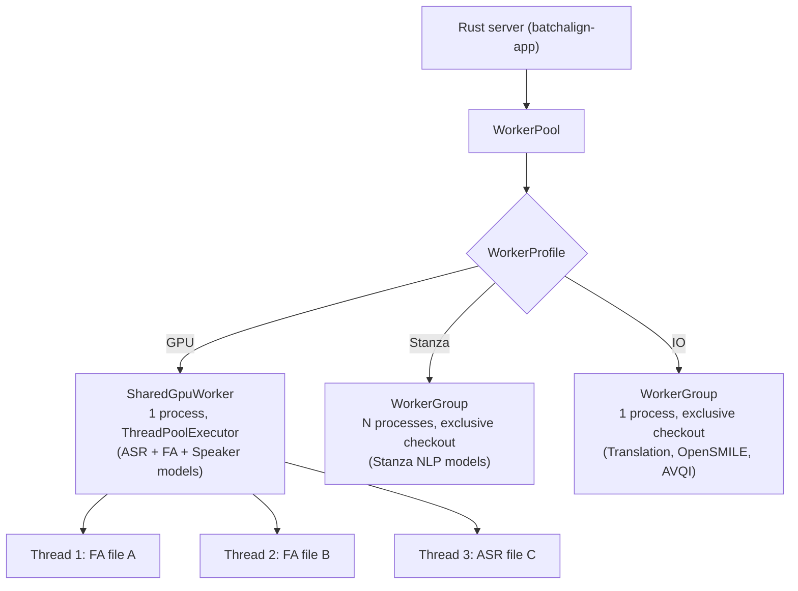

# Developer Architecture Migration (batchalign2 -> batchalign3)

**Status:** Current
**Last updated:** 2026-03-18

Comparison anchors for this page:

- Jan 9 2026 `batchalign2-master`
  `84ad500b09e52a82aca982c41a8ccd46b01f4f2c` for core / non-HK behavior
- Jan 9 2026 `BatchalignHK`
  `84ad500b09e52a82aca982c41a8ccd46b01f4f2c` for HK / Cantonese behavior
- later released `batchalign2` master-branch point
  `e8f8bfada6170aa0558a638e5b73bf2c3675fe6d` (2026-02-09) where needed
- current `batchalign3`

This page excludes transient unreleased migration-branch states.

See also:

- [BA2 Architecture Reference](ba2-architecture-reference.md) for the frozen Jan
  9 baseline architecture
- [Hybrid Workflow Architecture](../architecture/hybrid-workflow-architecture.md)
  for the proposed BA3 direction informed by BA2 strengths and newer compare
  workflow pressure

## Comparison discipline for contributors

Contributor-facing parity and regression checks should anchor to the correct
Jan 9 preserved baseline:

- core / non-HK: Jan 9 `batchalign2-master`
- HK / Cantonese: Jan 9 `BatchalignHK`

- The later Feb 9 BA2 point is secondary context only.
- later Python operational installs are deployment references, not migration
  baselines.

Use the repo-local comparison tools accordingly:

- `scripts/stock_batchalign_harness.py` for curated `benchmark` cases
- `scripts/compare_stock_batchalign.py` for raw side-by-side output diffs

Both should be pointed at the historically correct executable explicitly pinned
to `84ad500...`.

- For HK material, that means `batchalignhk`, not stock `batchalign`.
- Preserved Jan 9 legacy runners should keep their native CLI shape:
  `command inputfolder outputfolder`.
- When older legacy `benchmark` runs emit `.asr.cha`/`.wer.txt`/`.diff` rather
  than modern `.compare.csv`, the curated harness should normalize them by
  rescoring the emitted `.asr.cha` through current `batchalign3 compare`.

## 1) Core architecture shift

### batchalign2 mental model

- Python-centric runtime and pipeline composition.
- CHAT parsing/manipulation through ad-hoc string transforms and parallel arrays.
- Every command flattened structured data to strings for engine calls, then
  attempted to reconstruct structure from engine output — an architecturally
  lossy round-trip that produced silent drift whenever tokenizers disagreed.

### current batchalign3 mental model

- Rust-first CHAT core (parser, validator, AST, serializer).
- Python and the Rust control plane integrate via explicit typed contracts.
- identity-preserving data flow (word IDs, utterance/index metadata, spans).
- service-oriented operations (daemon/server/job lifecycle).

The key contributor shift is: **preserve structure, do not reconstruct it later
from flattened strings**.

## 1.1) Durable engineering deltas

The durable contributor-facing changes since the Jan 9 BA2 baseline are:

- data structures moved from Python object/string surgery toward typed Rust AST
  ownership and explicit worker payloads;
- command internals moved away from array-position repair and flatten-then-fix
  workflows toward stable IDs, explicit indices, chunk maps, and AST walks;
- orchestration moved from monolithic local dispatch toward daemon/server/job
  routing with explicit boundaries;
- morphosyntax, FA, and related passes now favor deterministic provenance
  mapping over runtime remap heuristics;
- regression defense is stronger: more golden cases, tighter invariants, and
  explicit policy against reintroducing runtime DP remap paths.

See [comparison states](index.md#comparison-states-and-policy) for the
Jan 9 BA2 → Feb 9 BA2 → BA3 framing. Feb 9 BA2 already gained cache,
dispatch, and morphotag/alignment cleanup; BA3 moves orchestration, typed
contracts, and CHAT ownership into Rust.

## 2) Concurrency and worker model

### batchalign2 model

batchalign2-master (anchored at `84ad500b`) uses Python's `concurrent.futures`
directly:



Key characteristics:

- **Pool-safe engines** (Rev.AI, Google Translate): `ThreadPoolExecutor` — one
  pipeline loaded in the main process, threads share models via a mutex.
  Memory-efficient but limited to API-backed or thread-safe engines.
- **Pool-unsafe engines** (Whisper, Wave2Vec, Stanza, Pyannote): `ProcessPoolExecutor`
  — each worker is a forked subprocess with its own model copies. N workers = N×
  model memory.
- **Adaptive worker capping**: monitors RSS peaks and throttles new submissions
  when available memory drops below a reserve (10% of system RAM).
- **File sorting**: largest files dispatched first to prevent straggler effects.
- **No persistent workers**: executors are job-scoped — all workers die after
  each job completes. Next job reloads models from scratch.
- **Optional shared-models mode** (`--shared-models`): uses `fork()` to inherit
  parent's loaded models. Linux-only, disabled on macOS+MPS, crash-prone.

Memory characteristics (from BA2 benchmarks):

| Workload | Per-worker peak | Workers | Total |
|----------|----------------|---------|-------|
| `align` (Whisper+Wave2Vec) | 3.0–4.2 GB | 4 | ~16 GB |
| `morphotag` (Stanza) | 1.1–2.5 GB | 4 | ~10 GB |

### batchalign3 model

batchalign3 uses a Rust control plane with persistent Python worker
subprocesses:



Key differences from BA2:

| Dimension | BA2 | BA3 |
|-----------|-----|-----|
| **Worker lifetime** | Job-scoped (die after each job) | Persistent (idle timeout 10 min) |
| **Model loading** | Fresh per worker per job | Load once at startup, reused |
| **GPU model sharing** | Fork-based (crash-prone) or none | ThreadPoolExecutor inside one process (GIL-release) |
| **CPU parallelism** | ProcessPoolExecutor (N copies) | Stanza profile: N persistent subprocesses |
| **Concurrency control** | Adaptive RSS monitoring | Auto-tuned + memory gate + per-profile limits |
| **Worker health** | None | Health checks every 30s, auto-restart |
| **Warmup** | None (cold start every job) | Concurrent background warmup at server start |
| **File ordering** | Largest-first sorting | Submission order (largest-first planned) |

Memory comparison (mixed English workload — align + morphotag):

| System | GPU workers | Stanza workers | Total |
|--------|------------|----------------|-------|
| BA2 (4 process workers) | 4 × ~4 GB = ~16 GB | 4 × ~2.5 GB = ~10 GB | ~26 GB |
| BA3 (profiles) | 1 × ~5 GB (shared) | 2 × ~2 GB = ~4 GB | ~9 GB |

The ~3× memory reduction comes from two sources:
1. GPU profile shares ASR, FA, and Speaker models in one process (vs 3 separate)
2. Persistent workers eliminate per-job model reloading overhead

## 3) Codebase crosswalk for contributors

| Legacy concern (BA2) | Current concern (BA3) |
|---|---|
| `batchalign/cli/cli.py` command wiring | Rust CLI argument tree + command router (`crates/batchalign-cli`) |
| local dispatch in `batchalign/cli/dispatch.py` | server + local-daemon dispatch + job APIs (`crates/batchalign-app`) |
| Python CHAT parser/generator modules | Rust CHAT crates + serializer/validator path in core |
| ad-hoc alignment remap glue | contract-driven UTR/FA handlers with deterministic fallback policies |
| monolithic Python command pipelines | task-local Python inference + Rust orchestration/injection/postprocess |
| provider-specific modifications in forks | in-tree provider modules under `batchalign/inference/` plus `batchalign.pipeline_api` for Rust-owned CHAT-aware operations |

Baseline anchors used for this crosswalk:

- BA2 CLI commands: `batchalign/cli/cli.py` @ `84ad500`
- BA2 dispatch/runtime bridge: `batchalign/cli/dispatch.py` @ `84ad500`
- BA2 morphosyntax surface: `batchalign/pipelines/morphosyntax/ud.py` @ `84ad500`
- later released BA2 master-branch CLI/dispatch: `batchalign/cli/{cli,dispatch}.py`
  @ `e8f8bfa`
- BA3 Rust CLI args/command tree: `crates/batchalign-cli/src/args/mod.rs`

## 3.1) Data-structure shift: what changed and why it matters

The largest durable implementation change is the move from reconstructive
pipelines to identity-preserving pipelines. This matters more than the
language change from Python to Rust: BA2's correctness failures came from
losing structure and trying to recover it, not from Python being slow.

In BA2, major stages frequently crossed these boundaries:

- parse text into Python objects,
- flatten or normalize text for engine calls,
- run external NLP/ASR,
- rebuild higher-level structure from token strings afterward.

In BA3, the preferred pattern is:

- parse CHAT once into a typed structure,
- extract explicit payloads for inference,
- return typed or schema-constrained results,
- inject back into the original structure without losing provenance.

That change directly explains many correctness improvements in morphotag,
retokenization, timing writeback, and validation.

In practical contributor terms:

- prefer stable identifiers over "find the same token again later",
- prefer explicit index maps over positional guesswork,
- prefer AST iteration over flatten/split/reparse loops,
- prefer narrow deterministic fallback over broad DP recovery on flattened text.

This is not abstract guidance. Current morphotag/alignment code now enforces it
in concrete ways:

- `%gra` construction validates root/head/chunk invariants before writeback,
- special-form handling is explicit (`@c`, `@s`, `xbxxx`) instead of being
  recovered indirectly from placeholder strings,
- retokenization rebuilds AST content directly rather than patching flattened
  string output,
- UTR and FA use explicit IDs/indices where available before any fallback.

## 3.2) Command-by-command orchestration shift

The same principle shows up across the command surface:

- `transcribe`:
  - Jan 9 / Feb 9 BA2: Python owned ASR output processing, retokenization, and
    CHAT construction in one pipeline
  - current BA3:
    Python worker: raw ASR only
    Rust: post-process tokens, assemble CHAT, optionally run `utseg` and
    `morphotag`
- `translate`:
  - Jan 9 / Feb 9 BA2: Python translated utterance text and wrote translation
    tiers through Python-side CHAT generation
  - current BA3:
    Python worker: raw text translation only
    Rust: extract text payloads and inject translated results back into CHAT
- `utseg`:
  - Jan 9 / Feb 9 BA2: Python owned constituency parsing, phrase extraction,
    DP reconciliation, and utterance rebuilding
  - current BA3:
    Python worker: constituency trees
    Rust: assignment computation and CHAT mutation
- `coref`:
  - Jan 9 / Feb 9 BA2: Python already ran document-level coref, detokenized the
    document, and DP-remapped chains back onto forms
  - current BA3:
    Python worker: structured chain data
    Rust: document-level payload collection, sparse `%xcoref` injection, and
    validation
- `benchmark`:
  - Jan 9 / Feb 9 BA2: Python command path around ASR + gold transcript + WER
    output files
  - current BA3:
    Rust: typed command options and per-file infer dispatch
    Rust core: WER computation exposed through `batchalign_core`
    Python package: optional convenience wrapper only, not worker infer logic
- `opensmile` / `avqi`:
  - Jan 9 / Feb 9 BA2: Python feature-analysis commands with local library calls
  - current BA3:
    Rust: typed command options and prepared-audio V2 dispatch
    Python worker: pure analysis tasks with structured request/response payloads

This is the durable architectural pattern to preserve:

- inference workers should do inference,
- orchestration and CHAT ownership should stay on the Rust side.

## 3.3) Utility-command control-plane shift

The utility command story also changed in code-meaningful ways:

- `setup`:
  - Jan 9 / Feb 9 BA2: Python Click flow writing `~/.batchalign.ini`
  - current BA3: Rust-owned prompt/validation/write path preserving the same
    compatibility file
- `models`:
  - Jan 9 / Feb 9 BA2: Python command tree directly exposed training runtime
  - current BA3: Rust CLI still delegates to the Python training module; this
    is a control-plane wrapper change, not a training-stack rewrite
- `version`:
  - Jan 9 / Feb 9 BA2: root-command version metadata
  - current BA3: explicit subcommand plus build-hash reporting, useful for
    support and stale-binary diagnosis
- `cache`:
  - Feb 9 BA2 introduced Python cache stats/clear/warm around Python-side cache
    state
  - current BA3 redefines that command around the Rust runtime cache boundary:
    SQLite analysis cache plus media cache inspection/clearing
- `bench`:
  - Feb 9 BA2 introduced a Python repeated-dispatch timing helper
  - current BA3 keeps the same basic purpose but moves dispatch/control into
    Rust typed options and structured benchmark output
- `serve`, `jobs`, `logs`, `openapi`:
  - These are the clearest BA3-only utility additions.
  - They exist because the runtime model itself changed: once jobs, server
    health, logs, and API schema became first-class control-plane concerns, the
    CLI needed explicit ops commands instead of assuming one-shot local runs.

User-facing command/history detail belongs in [user-migration.md](user-migration.md).
This page keeps the developer-facing architectural consequence: the control
plane is now explicit, typed, and operationally observable.

## 4) Concurrency and orchestration differences

Batchalign3 makes concurrency explicit at architecture boundaries:

- command routing to local/remote execution backends,
- queueable jobs with durable status and logs,
- explicit server health, job status, and observable daemon/server boundaries.

BA2 had no concurrency model: it spawned one process per file, loaded all
models fresh each time, and had no mechanism to share state across runs.
In BA3, contributors should model command execution as staged orchestration
across explicit runtime boundaries.

This requires contributors to design for:

- idempotent work units,
- resumable/observable processing stages,
- strict input/output schema validation between boundaries.

## 4.1) Performance model shift

The durable performance improvement story is architectural:

- repeated one-file/one-process startup is no longer the only execution model;
- the daemon/server path keeps heavyweight engines warm across runs;
- cache misses can be batched across files instead of paying per-file setup
  overhead repeatedly;
- cache ownership and job state are explicit rather than incidental.

This is the kind of performance change that should remain in the migration book.
Short-lived benchmark spikes or temporary regressions should not.

## 5) Data model and API boundary implications

For recent DP-migration work, no additional core CHAT AST augmentation was
required because existing model identity/timing surfaces were sufficient.

Guideline for future work:

- do not enlarge the core AST for editor-only derived views,
- expose sidecar APIs for high-churn UI metadata,
- keep AST focused on durable linguistic source-of-truth structures.

Related rule for migration documentation: explain changes in algorithm choice,
data structures, and public behavior; do not preserve branch-by-branch
implementation churn.

## 6) Testing posture for contributors

Migration-era quality now depends on layered tests:

- contract tests for the direct Python pipeline facade
  (`batchalign/tests/test_pipeline_api.py` — operation records, provider
  adapters, and Rust-owned pipeline execution),
- golden tests for edge corpora (repeat/retrace/overlap/multilingual),
- no-DP-runtime allowlist tests
  (`batchalign/tests/test_dp_allowlist.py` — Rust PyO3 call sites, chat-ops
  call sites, Python inference zero-DP),
- Stanza configuration parity checks
  (`batchalign/tests/pipelines/morphosyntax/test_stanza_config_parity.py` —
  MWT exclusion parity, Japanese processor parity, English gum package parity).

## 7) Python API migration

### BA2 Python API that no longer exists

BA2 exposed a rich Python API: `Document`, `CHATFile`, `BatchalignPipeline`,
and 23+ individual engine classes (`WhisperEngine`, `StanzaEngine`, etc.).
BA3 replaced this with a Rust-owned AST (`ParsedChat`) and typed pipeline
execution.

**External usage was minimal.** A pre-release audit found ~2,400 monthly
PyPI downloads (all CLI usage — no downstream packages depend on batchalign),
4 external repos on GitHub (1 genuine dependent, 3 tutorial copies), and zero
academic papers referencing the Python API. All known external usage falls in
Tiers 1-2 (file I/O and pipeline execution). Nobody uses subscript access,
engine classes, or document mutation. Full audit with code patterns:
`docs/ba2-python-api-usage-findings.md`.

### BA3 equivalents for each BA2 pattern

**Reading and writing CHAT files:**

```python
# BA2
from batchalign import CHATFile
chat = CHATFile(path="input.cha")
doc = chat.doc
chat.write("output.cha")

# BA3
from pathlib import Path
import batchalign_core
text = Path("input.cha").read_text("utf-8")
parsed = batchalign_core.ParsedChat.parse(text)
Path("output.cha").write_text(parsed.serialize(), "utf-8")
```

**Creating a document from text:**

```python
# BA2
from batchalign import Document
doc = Document.new("hello world .", media_path="audio.wav", lang="eng")

# BA3
import json, batchalign_core
transcript = json.dumps({"lines": [
    {"speaker": "PAR", "text": "hello world ."}
]})
chat_text = batchalign_core.build_chat(transcript)
parsed = batchalign_core.ParsedChat.parse(chat_text)
```

**Running pipeline operations:**

```python
# BA2
from batchalign import BatchalignPipeline
nlp = BatchalignPipeline.new("morphosyntax", lang="eng")
result = nlp("input.cha")

# BA3 — via CLI (simplest)
import subprocess
subprocess.run(["batchalign3", "morphotag", "input.cha", "-o", "output/"])

# BA3 — via Python API (for programmatic use)
from batchalign.pipeline_api import run_pipeline, PipelineOperation, LocalProviderInvoker
output = run_pipeline(chat_text, lang="eng",
    operations=[PipelineOperation("morphosyntax")],
    provider=LocalProviderInvoker({"morphosyntax": my_callback}))
```

**Validation:**

```python
# BA2
errors = doc.validate()

# BA3
parsed = batchalign_core.ParsedChat.parse(chat_text)
errors = parsed.validate()          # list[str]
structured = parsed.validate_structured()  # JSON
```

### The compat shim (`batchalign.compat`)

A compatibility layer wraps BA3's API in BA2-style classes for the transition
period. It emits `DeprecationWarning` on import.

```python
from batchalign.compat import CHATFile, Document, BatchalignPipeline

# These work as before:
chat = CHATFile(path="input.cha")
chat.write("output.cha")
nlp = BatchalignPipeline.new("morphosyntax", lang="eng")
```

**Shim limitations:**
- Individual engine classes (`WhisperEngine`, `StanzaEngine`) are not
  provided — use CLI commands instead
- `BatchalignPipeline` delegates to the `batchalign3` CLI subprocess
  rather than running in-process
- `TextGridFile` is not shimmed

**Behavioral differences:**
- The CLI may start a background daemon that keeps models warm — see
  [Persistent State](persistent-state.md)
- Results are cached in SQLite — re-processing identical input is instant
- First run downloads ML models (~2 GB)

### What's genuinely lost

Two capabilities have no BA3 equivalent:

- **Engine composition** (`BatchalignPipeline.new("asr,morphosyntax,fa")`
  with specific engine instances): BA3 uses the CLI command surface for
  pipeline composition. The Python API provides single-operation execution
  via `run_pipeline()`. Multi-step pipelines run as sequential CLI commands.

- **Direct AST mutation** (`doc[0][0].text = "modified"`): BA2's Python
  objects were mutable. BA3's CHAT AST is Rust-owned; subscript access via
  the compat shim is read-only. Mutation requires serialize → edit →
  re-parse, or new Rust PyO3 surface area. Zero external users do this.

Neither limitation affects any known external user. See the
[full usage audit](../../docs/ba2-python-api-usage-findings.md) for evidence.

## 8) Onboarding plan for legacy contributors

1. Start with the command/runtime crosswalk plus the current HK engine and
   extension-layer chapters.
2. Pick one existing BA2 customization and re-implement it as either a built-in
   engine module or a `batchalign.pipeline_api` operation/provider integration, not a long-lived
   source fork.
3. Add/extend golden cases before behavior changes.
4. For alignment/morphology changes, route through core AST/validator contracts
   and keep side effects deterministic and observable.
