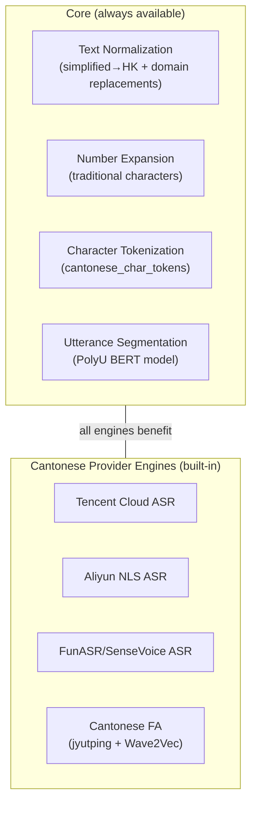

# Cantonese Processing

**Status:** Consolidated — see [Cantonese Language Support](languages/cantonese.md)
**Last updated:** 2026-03-23 12:10 EDT

> This page has been consolidated into the comprehensive
> [Cantonese Language Support](languages/cantonese.md) page.
> The content below is preserved for reference but may be outdated.

Cantonese (`yue`) has the most extensive language-specific processing in
batchalign3. This page covers the **core pipeline** behavior — for the
HK-specific ASR/FA engines (Tencent, Aliyun, FunASR), see
[HK/Cantonese Engines](../architecture/hk-cantonese-engines.md).

## What's in Core vs. Cantonese Provider Engines



The core normalization runs on **all** ASR output when `lang=yue`, regardless
of which engine produced it. You get correct Cantonese text even with just
`--asr-engine whisper` or Rev.AI — there is no separate HK install tier.

## Text Normalization Pipeline

Two-stage normalization in `batchalign-chat-ops/src/asr_postprocess/cantonese.rs`:

### Stage 1: Simplified → HK Traditional (`zhconv`)

Uses the `zhconv` crate — pure Rust Aho-Corasick automata compiled from
OpenCC and MediaWiki rulesets. Variant: `ZhHK` (Hong Kong Traditional).

Performance: 100-200 MB/s. No C++ dependency (unlike Python's OpenCC).

Examples:
- 联系 → 聯繫 (simplified → traditional)
- 说 → 說
- 为 → 為

### Stage 2: Domain Replacement Table (31 entries)

After zhconv, a second Aho-Corasick pass applies Cantonese-specific
character corrections. Uses **leftmost-longest matching** to handle
overlapping patterns correctly.

**Multi-character entries (13)** — matched before single-character to prevent
partial matches:

| From | To | Meaning |
|------|----|---------|
| 聯繫 | 聯繫 | contact (identity — prevents 繫→係) |
| 聯係 | 聯繫 | contact |
| 系啊 | 係啊 | is + particle |
| 真系 | 真係 | really is |
| 唔系 | 唔係 | is not |
| 中意 | 鍾意 | to like |
| 遊水 | 游水 | to swim |
| 羣組 | 群組 | group |
| 古仔 | 故仔 | story |
| 較剪 | 鉸剪 | scissors |
| 衝涼 | 沖涼 | to shower |
| 分鍾 | 分鐘 | minute |
| 重復 | 重複 | to repeat |

**Single-character entries (18):**

| From | To | Notes |
|------|----|-------|
| 系 | 係 | "to be" (Cantonese) |
| 繫 | 係 | variant → standard |
| 呀 | 啊 | sentence-final particle |
| 噶 | 㗎 | particle |
| 咧 | 呢 | particle |
| 嗬 | 喎 | particle |
| 只 | 隻 | classifier |
| 咯 | 囉 | particle |
| 嚇 | 吓 | to scare |
| 啫 | 咋 | particle |
| 哇 | 嘩 | exclamation |
| 着 | 著 | to wear/touch |
| 嘞 | 喇 | particle |
| 啵 | 噃 | particle |
| 甕 | 㧬 | to push |
| 牀 | 床 | bed |
| 松 | 鬆 | loose |
| 吵 | 嘈 | noisy |

### Origin

This replacement table was originally written by Chuqiao Song in batchalign2
(`replace_cantonese_words()`) for the Tencent ASR engine using Python's
`OpenCC('s2hk')`. It was removed from the later Python rewrite line when
Houjun Liu cleaned up the Tencent code in May 2025. We rebuilt it in Rust for batchalign3 and
made it a universal pipeline stage.

### Full Sentence Example

```
Input:  你真系好吵呀
Stage 1 (zhconv): 你真系好吵呀  (no change — already traditional-ish)
Stage 2 (domain): 你真係好嘈啊  (系→係, 吵→嘈, 呀→啊)
```

## Character Tokenization

`cantonese_char_tokens()` normalizes text and splits into per-character tokens,
stripping CJK punctuation. Used by FunASR Cantonese for character-level
timestamp alignment.

```rust
cantonese_char_tokens("真系呀，") → ["真", "係", "啊"]
```

The function:
1. Applies full normalization (zhconv + domain replacements)
2. Filters out CJK punctuation and whitespace
3. Returns one `String` per character

### CJK Punctuation Set

Characters stripped during tokenization:

| Char | Unicode | Name |
|------|---------|------|
| 　 | U+3000 | Ideographic space |
| 、 | U+3001 | Ideographic comma |
| 。 | U+3002 | Ideographic period |
| ， | U+FF0C | Fullwidth comma |
| ！ | U+FF01 | Fullwidth exclamation |
| ？ | U+FF1F | Fullwidth question mark |
| 「 | U+300C | Left corner bracket |
| 」 | U+300D | Right corner bracket |
| ： | U+FF1A | Fullwidth colon |
| ； | U+FF1B | Fullwidth semicolon |
| (space) | U+0020 | ASCII space, tab, newline |

## Number Expansion

Cantonese uses **traditional** Chinese characters for number expansion:

| Input | Output |
|-------|--------|
| 5 | 五 |
| 42 | 四十二 |
| 10000 | 一萬 (not 一万) |

This is handled by `num2chinese(n, ChineseScript::Traditional)` in Stage 4,
before the Cantonese normalization in Stage 4b.

See [Number Expansion](number-expansion.md).

## Utterance Segmentation

Cantonese uses the PolyU BERT model for utterance boundary detection:

| Model | Source |
|-------|--------|
| `PolyU-AngelChanLab/Cantonese-Utterance-Segmentation` | Hong Kong Polytechnic University |

When this model is not available, the pipeline falls back to punctuation-based
splitting.

See [Utterance Segmentation](utterance-segmentation.md).

## Cantonese Forced Alignment (HK Engines)

The standard FA engines (Whisper, Wave2Vec) work on Cantonese but produce
sub-optimal results because they were trained on alphabetic languages.

The built-in HK/Cantonese engine layer provides a Cantonese-specific FA
pipeline:

1. **Normalize** text (zhconv + domain replacements)
2. **Romanize**: convert Chinese characters to tone-stripped jyutping
   (e.g., 你好 → "nei'hou") using `pycantonese`
3. **Align**: run Wave2Vec MMS FA on the romanized text
4. **Map back**: assign character-level timestamps from the aligned jyutping

This is necessary because Wave2Vec MMS was trained on romanized text and
cannot directly align Chinese characters.

See [HK/Cantonese Engines](../architecture/hk-cantonese-engines.md) for full
details on the jyutping pipeline and HK-specific ASR engines.

## Morphosyntax

Cantonese maps to Stanza's Chinese (`zh`) model:

| Code | Stanza |
|------|--------|
| yue | zh |

There are **no Cantonese-specific Stanza workarounds** in the morphosyntax
pipeline. Stanza's Chinese model handles Cantonese morphosyntax acceptably.

The MWT processor is **not loaded** for Chinese/Cantonese (CJK languages
don't have multi-word token contractions).

## PyO3 API

Two functions are exposed to Python via `batchalign_core`:

```python
import batchalign_core

# Full normalization (zhconv + domain replacements)
batchalign_core.normalize_cantonese("你真系好吵呀")
# → "你真係好嘈啊"

# Normalize + split into character tokens (stripping CJK punct)
batchalign_core.cantonese_char_tokens("真系呀，")
# → ["真", "係", "啊"]
```

Python HK engines call these functions — no OpenCC Python dependency needed.

## Source Files

| File | Purpose |
|------|---------|
| `batchalign-chat-ops/src/asr_postprocess/cantonese.rs` | Core normalization + char tokenization |
| `batchalign-chat-ops/src/asr_postprocess/mod.rs:134-137` | Pipeline integration (Stage 4b) |
| `pyo3/src/pyfunctions.rs:471-477` | PyO3 bridge |
| `batchalign/inference/hk/_common.py` | Python delegation to Rust |
| `batchalign/inference/hk/_cantonese_fa.py` | Jyutping FA provider |

## Test Coverage

### Rust (`cantonese.rs`)
- Single-character replacement (系→係, 呀→啊, 松→鬆, 吵→嘈)
- Multi-character replacement (真系→真係, 中意→鍾意, 較剪→鉸剪)
- Multi-char priority over single (聯係→聯繫, not 聯+係)
- zhconv simplified→HK (联系→聯繫)
- Full sentence (你真系好吵呀→你真係好嘈啊)
- Idempotent on correct HK text
- Character tokenization: basic, strip CJK punct, empty, punct-only

### Pipeline (`mod.rs`)
- `test_process_raw_asr_golden_cantonese`: full pipeline with yue
- `test_process_raw_asr_no_cantonese_for_eng`: normalization skipped for eng

### Python (`test_common.py`, `test_helpers.py`, `test_integration.py`)
- 66+ tests covering normalize, char_tokens, domain replacements

## Word Segmentation

Cantonese ASR engines (FunASR/SenseVoice) typically output per-character tokens.
The `--retokenize` flag on `morphotag` uses PyCantonese's `segment()` function
to group characters into words before POS tagging.

This is distinct from the character tokenization (`cantonese_char_tokens()`)
described above, which is an ASR-level operation for timestamp alignment.

See [Chinese/Cantonese Word Segmentation](chinese-word-segmentation.md) for
full details and examples.
