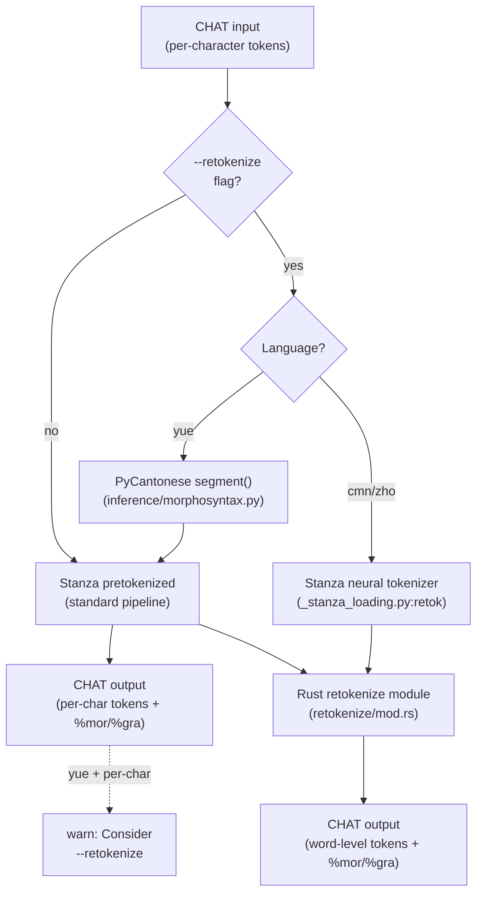

# Chinese/Cantonese Word Segmentation

**Status:** Current
**Last updated:** 2026-03-23 10:54 EDT

## Problem

CJK ASR engines (FunASR/SenseVoice for Cantonese, Paraformer for Mandarin)
output character-level tokens without word boundaries. Each Chinese character
becomes a separate word on the main tier:

```
*CHI:	故 事 係 好 .
```

This makes word-level analysis (word count, POS tagging, MLU) unreliable —
every character gets tagged as an independent word.

Tencent ASR is the exception: it returns pre-segmented words with proper
boundaries. If you use Tencent ASR, word segmentation is already handled.

## Solution: `--retokenize` on `morphotag`

The `--retokenize` flag on `morphotag` enables word segmentation before POS
tagging. The segmentation method depends on the language:

| Language | Code | Segmentation Engine | How It Works |
|----------|------|---------------------|-------------|
| Cantonese | `yue` | PyCantonese `segment()` | Dictionary-based Cantonese word segmentation |
| Mandarin | `cmn`, `zho` | Stanza neural tokenizer | Jointly-trained Chinese tokenization model |

### Cantonese Example

```bash
batchalign3 morphotag --retokenize corpus/ -o output/ --lang yue
```

Before (per-character):
```
*CHI:	故 事 係 好 .
%mor:	n|故 n|事 v|係 adj|好 .
```

After retokenize (word-level):
```
*CHI:	故事 係 好 .
%mor:	n|故事 v|係 adj|好 .
```

### Mandarin Example

```bash
batchalign3 morphotag --retokenize corpus/ -o output/ --lang cmn
```

## Default Behavior

Without `--retokenize`, existing tokenization is preserved — `morphotag` never
silently changes word boundaries. This is consistent across all languages.

When Cantonese input appears to be per-character tokens (>80% single-CJK-character
words), a warning is emitted:

```
warn: Cantonese input appears to be per-character tokens (42/50 single-CJK words).
      Consider --retokenize for word-level analysis.
```

## Which ASR Engines Produce What

| Engine | Word Segmentation | Recommendation |
|--------|-------------------|----------------|
| Tencent Cloud ASR | Per-character tokens (verified 2026-03-23: 25 words, 0 multi-char) | Use `--retokenize` |
| FunASR / SenseVoice | Per-character tokens (verified) | Use `--retokenize` |
| Paraformer (Mandarin) | Per-character tokens (reported, not yet verified) | Use `--retokenize` |
| Whisper | Variable (often per-character for CJK) | Use `--retokenize` |

## Known Limitations

### Mandarin word segmentation is imperfect

Stanza's Chinese tokenizer (used for Mandarin `--retokenize`) handles common
compounds correctly (e.g., `商店` "store") but may split ambiguous compounds
where individual characters have independent meanings (e.g., `东西` "things"
may be split into `东` "east" + `西` "west"). This is a known limitation of
statistical Chinese word segmentation.

For word count and MLU analysis, the segmentation is substantially better than
per-character tokenization but should not be treated as ground truth.

### Cantonese segmentation depends on PyCantonese's dictionary

PyCantonese uses a dictionary-based segmenter. Words not in its dictionary
will not be grouped. Common Cantonese words like `佢哋` (they), `鍾意` (like),
and `故事` (story) are handled correctly.

## Pipeline Flow

The following diagram shows how `--retokenize` routes through the morphotag
pipeline for CJK languages:



## Cache Behavior

Retokenize results are cached separately from non-retokenize results. The
cache key includes a `|retok` suffix when `--retokenize` is active, so
switching between modes does not produce stale cache hits.
