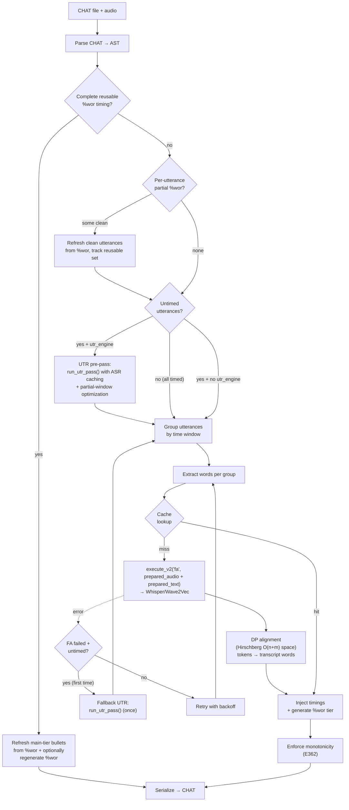
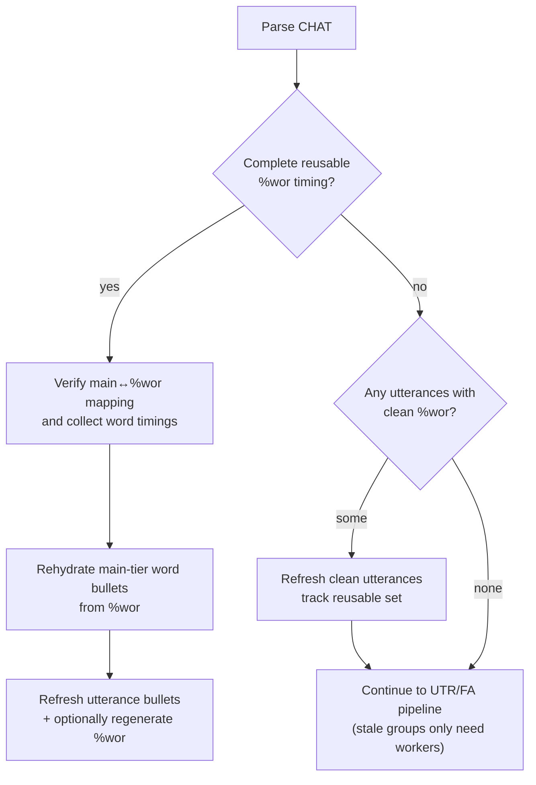
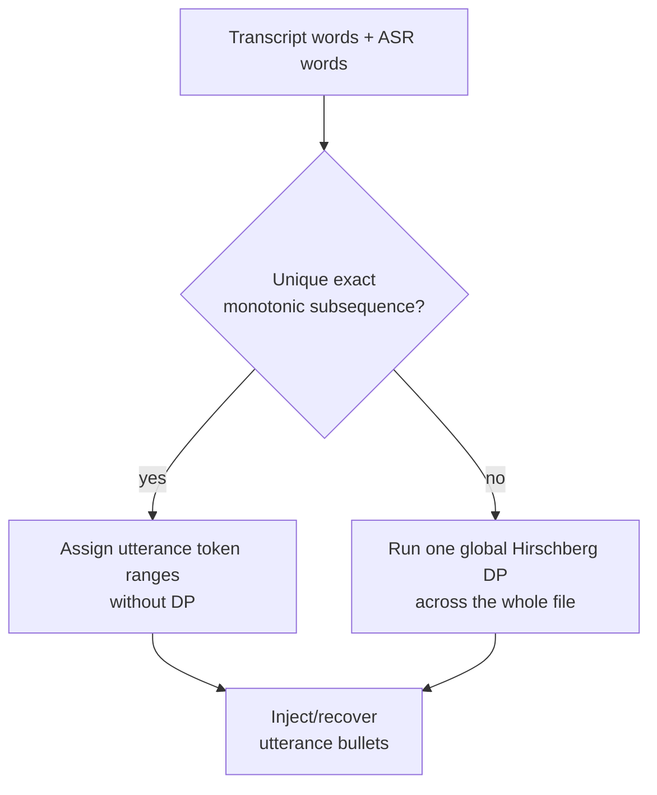
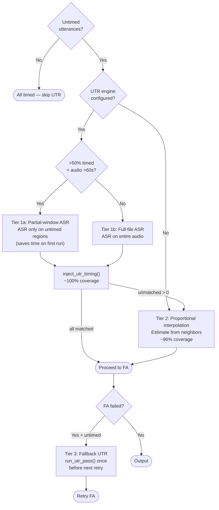
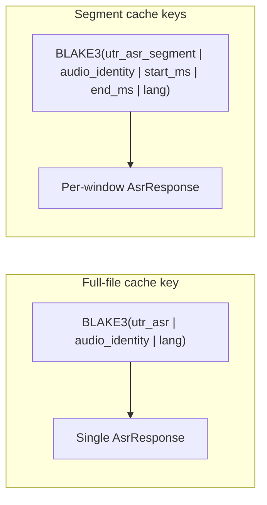

# Forced Alignment Design

**Status:** Current
**Last updated:** 2026-03-27 11:18 EDT

## Overview

The `align` command adds word-level timestamps to CHAT files. Given a transcript
and an audio file, it determines exactly where each word appears in the recording.



## Prerequisites

Before alignment can begin, two steps must succeed:

1. **Media resolution** — The server locates the audio file for the CHAT
   file from server-visible local paths, either alongside it (paths mode),
   through a shared `source_dir`, via local `media_mappings`, or via an
   explicit `--media-dir`. See
   [Media Conversion](media-conversion.md#media-resolution).
2. **Media conversion** — If the audio is in a container format that
   `soundfile` cannot read (MP4, M4A, WebM, WMA), it is automatically
   converted to 16 kHz mono WAV via ffmpeg and cached at
   `~/.batchalign3/media_cache/`. See [ensure_wav](media-conversion.md#ensure_wav--conversion-cache).

Both steps happen in the Rust server before any Python worker is invoked.

## Pipeline: UTR then FA

Alignment runs as a two-step pipeline:

1. **UTR (Utterance Timing Recovery)** — Assigns utterance-level timing boundaries.
2. **FA (Forced Alignment)** — Assigns word-level timing within those boundaries.

### Step 0: Cheap reuse for already word-timed files

Before UTR or FA grouping, `align` now checks whether the parsed file already
contains a complete reusable `%wor` tier. This is the cheapest safe rerun path
for files that have already been aligned once and are being passed through
`align` again.

The important detail is that this check is **not** based only on
`main`-tier `Word.inline_bullet`. After a CHAT parse roundtrip, main-tier word
timing may be represented as `InternalBullet` tokens while `%wor` carries the
durable first-class timing bullets. The server therefore:

1. verifies that every alignable main-tier word has a clean main↔`%wor`
   positional mapping,
2. verifies that every mapped `%wor` word has a timing bullet,
3. copies those timings back onto main-tier words,
4. removes parsed `InternalBullet` tokens, and
5. refreshes utterance bullets and optionally regenerates `%wor`.

If that verifier succeeds, `align` skips FA entirely for the file.

When the whole-file check fails, a per-utterance check
(`find_reusable_utterance_indices`) identifies which utterances still have
clean `%wor`. Those are refreshed in place; the rest proceed through normal
FA grouping. During the group partition step, groups where **all** utterances
are in the reusable set have their timings collected directly from the
refreshed main tier (no cache lookup or worker call needed).



### Step 1: UTR (detect-and-skip)

UTR is implemented as a pre-pass in `process_one_fa_file`
(`crates/batchalign-app/src/runner/dispatch/fa_pipeline.rs`). The core algorithm
lives in `crates/batchalign-chat-ops/src/fa/utr.rs`.

**Detection:** `count_utterance_timing()` counts timed vs untimed utterances.
If all utterances are timed, UTR is skipped entirely (the common case for
production CHAT files from CLAN).

**Recovery:** When untimed utterances exist and a UTR engine is configured
(`--utr`, the default), the `run_utr_pass()` helper:

1. Checks the **ASR cache** for a prior result (key includes audio identity + lang).
   On hit, skips inference entirely — repeat runs are instant.
2. Chooses **partial-window** or **full-file** mode:
   - **Partial-window** (when >50% timed and audio >60s): `find_untimed_windows()`
     identifies time regions covering only the untimed utterances (with 500ms
     padding). Each window is extracted via `extract_audio_segment()` (ffmpeg
     `-ss`/`-to` → cached WAV) and ASR runs only on those segments. Token
     timestamps are offset by the window start time. Each segment's result is
     cached independently.
   - **Full-file** (mostly-untimed or short audio): ASR runs on the full audio
     and the result is cached as a single entry.
3. Converts ASR response tokens to `AsrTimingToken` (text + start_ms + end_ms).
4. Calls `inject_utr_timing()`. That function first tries a cheap exact
   monotonic subsequence match for the whole document word list against the ASR
   word list. If that match is unique, timing assignment is linear-time and no
   DP is needed. If the match is missing or ambiguous, UTR falls back to a
   **single global Hirschberg DP alignment** of all document words (timed +
   untimed) against all ASR tokens, using **fuzzy matching** (Jaro-Winkler
   similarity at threshold 0.85 by default) to tolerate ASR substitutions
   like "gonna"/"gona" and "mhm"/"mmhm". Timed utterances participate in
   the alignment to anchor their neighbors but their bullets are left
   unchanged. For each untimed utterance, the min/max matched ASR token
   indices determine the utterance bullet's time span. The global alignment
   avoids the token-exhaustion problem that per-utterance windowed approaches
   suffer from. It is still a monotonic aligner, so dense overlap /
   text-audio reordering remains a known limitation.

   **Configurable via:** `--utr-fuzzy <threshold>` (default 0.85; set to 1.0
   for exact-only matching).
5. Re-serializes the CHAT with recovered bullets.



**Current debugging hook:** When `$BATCHALIGN_DEBUG_DIR` is set, UTR writes the
pre-injection CHAT and the ASR timing tokens that fed `inject_utr_timing()`.
That is enough to reproduce token-starvation failures offline. It is not yet a
full stage-by-stage trace: normalized word lists, DP match pairs, unmatched
utterance reports, interpolation windows, and post-monotonicity stripping still
need richer tracing support.

**Fallback UTR:** When the initial UTR pre-pass fails (ASR error) or is skipped
(`--no-utr`) and FA subsequently fails with a retryable error, the retry handler
attempts UTR once before the next retry. This recovers files where bad
interpolated timing caused FA failure. The `utr_fallback_attempted` flag ensures
at most one extra ASR call across all retries.

**No engine fallback:** When no UTR engine is configured (`--no-utr`), untimed
utterances fall back to proportional interpolation (see
[Proportional FA Estimation](../architecture/proportional-fa-estimation.md)).

UTR injects **utterance-level bullets only** — it does not set word-level
timing. FA handles word-level alignment after UTR provides the boundaries.

### Step 2: FA

FA takes the utterance boundaries (from UTR or from the original CHAT) and
groups them into ~20-second segments. For each segment, it extracts the
corresponding audio chunk and runs the FA model (Whisper cross-attention DTW or
Wave2Vec CTC alignment) to get precise word-level timestamps.

The FA model returns timestamps **relative to the chunk start** (0-based). These
must be converted to absolute timestamps by adding the group's `audio_start_ms`
offset before injection into the AST.

### Post-processing

After FA injects raw word timings into the AST, three post-processing steps run
**in this order** for each utterance:

1. **`postprocess_utterance_timings`** — Chains word end times and bounds by the
   existing utterance bullet (from UTR or original CHAT).
2. **`update_utterance_bullet`** — Recomputes the utterance bullet from the now-
   correct chained word timings.
3. **`add_wor_tier`** — Generates the `%wor` dependent tier from word timings.

The order matters. Postprocess runs first so it can use the **UTR bullet** for
bounding (which captures the actual speech extent from ASR). If update_bullet
ran first, it would recompute the bullet from raw onset-only timings (where
`end = start`), producing a bullet too tight for proper bounding.

#### Word end times (non-pauses mode)

Whisper FA returns onset times only — each token has a start time but no end
time. In non-pauses mode (the default), the pipeline assigns end times by
chaining: each word's end = next word's start.

The **last word** of each utterance has no next word to chain to. Its end is
extended to the utterance bullet end (from UTR or original CHAT). If no bullet
exists, a fallback of `start + 500ms` is used (matching Python master's
behavior).

## What is fast today vs later

Today the implemented fast paths are:

- skip FA entirely when `%wor` already provides complete reusable word timing
- **per-utterance partial `%wor` reuse on plain reruns** — when the whole-file
  check fails (e.g. a user edited a few utterances), detect which utterances
  still have clean `%wor`, refresh those, and only send stale FA groups through
  workers. Groups where all utterances are reusable are preserved without cache
  lookup or worker call (3-tier partition: reused → cached → miss).
- skip UTR when every utterance already has timing
- use a unique exact-subsequence UTR match when the transcript and ASR word
  streams line up without ambiguity

The next possible optimization is more selective escalation inside UTR:
identify local divergence regions ("trouble windows") and run global DP only
there. That is **not** implemented yet. The current global-DP path remains the
correctness baseline for difficult files.

## Why Two Steps

FA models (both Whisper and Wave2Vec) work best on short audio segments. Feeding
a 30-minute recording directly into the model produces poor alignment because
the attention/emission matrix gets too large and diluted. Chunking is necessary.

To chunk correctly, you need to know where each utterance sits in the audio.
That is what UTR provides. For already-timed input, the existing bullets serve
the same purpose.

## Untimed Utterance Handling

Four tiers of coverage for untimed utterances, in order of preference:



1. **UTR with partial-window (default, mostly-timed files):** When >50% of
   utterances are timed and audio exceeds 60 seconds, ASR runs only on the
   untimed windows. Each window is extracted via ffmpeg and cached independently.
   First run saves time proportional to the untimed fraction; repeat runs hit
   cache.
2. **UTR full-file (default, mostly-untimed files):** ASR runs on the full
   audio. The result is cached for instant repeat runs.
3. **Proportional interpolation:** When UTR is disabled (`--no-utr`) or when
   UTR's ASR inference fails, the grouping algorithm interpolates untimed
   utterances between neighboring timed utterances by word count, with a
   2-second buffer. Achieves ~96% coverage.
4. **Fallback UTR:** When FA fails with a retryable error and untimed
   utterances were not recovered, UTR is attempted once before the next retry.
   This can recover files where bad interpolated timing caused the FA failure.
5. **Skip:** When `total_audio_ms` is unavailable and no timed neighbors exist,
   untimed utterances are excluded from FA grouping.

This is **smarter than ba2's skip logic**: ba2 skipped UTR for the entire file
if *any* utterance had timing (potentially missing untimed ones). ba3 skips
UTR only if *all* utterances are timed, and when UTR can't match a specific
utterance, proportional interpolation provides a fallback.

## Engine Selection

| Engine | Model | Response format | Default? |
|--------|-------|-----------------|----------|
| `whisper_fa` | Whisper large-v2 cross-attention DTW | `TokenLevel` (token text + onset seconds) | Yes |
| `wav2vec_fa` | MMS_FA CTC forced alignment | `WordLevel` (word text + start/end ms) | No |

Both return chunk-relative timestamps. The Rust orchestration (`parse_fa_response`)
handles offset addition for both formats.

## Offset Handling

This is the most critical correctness invariant in the pipeline.

Every FA model receives an audio chunk extracted from position `audio_start_ms`
to `audio_end_ms` in the full recording. The model returns timestamps relative
to the chunk start (time 0 = `audio_start_ms` in the full recording).

Before injecting timestamps into the CHAT AST, the offset must be added:

- **TokenLevel** (Whisper): `absolute_ms = time_s * 1000 + audio_start_ms`
- **WordLevel** (Wave2Vec): `absolute_ms = start_ms + audio_start_ms`

Failing to add the offset produces timestamps that are internally consistent
(words are correctly spaced relative to each other) but placed at the wrong
absolute position in the recording.

## Caching

Two independent cache layers affect alignment:

### UTR ASR cache

UTR ASR results are cached in the analysis cache (`CacheTaskName::UtrAsr`).
Two cache key schemes are used:



Full-file keys are used for mostly-untimed files. Segment keys are used when
partial-window mode activates (>50% timed, audio >60s). Once the full-file
result is cached (after the first run), subsequent runs always hit the cache
regardless of which mode was used initially.

`--override-cache` bypasses lookups but still stores results for future use.

### FA cache

FA caches raw model responses per-group (keyed by audio chunk fingerprint + text
\+ pauses flag). The `--override-cache` flag bypasses this cache.

Both caches use the same SQLite database (the analysis cache — see [Filesystem Paths](../reference/filesystem-paths.md#analysis-cache-sqlite)).

### What invalidates alignment cache?

| Change | UTR cache | FA cache |
|--------|-----------|----------|
| Edit transcript text | Stays cached (audio unchanged) | Groups with changed words re-run |
| Re-record audio | Re-runs (audio identity changed) | Re-runs (audio identity changed) |
| Change `--fa-engine` | Stays cached (engine not in UTR key) | Misses (engine is part of FA key) |
| Change `--lang` | Re-runs (lang is part of UTR key) | Re-runs (lang is part of FA key) |
| Second run, nothing changed | Hits cache | Hits cache — instant output |

**Audio identity** is computed from the file's path, modification time, and size — not
a content hash. If you move or rename the audio file, the cache will miss even if the
content is identical. Conversely, overwriting a file in place with different content
will miss only if the modification time or size changes (which the OS updates on write).

## Known Pitfalls

### Whisper pipeline chunking

The HuggingFace Whisper pipeline processes long audio in 25-second chunks with
3-second overlap (`chunk_length_s=25, stride_length_s=3`). The pipeline is
responsible for converting chunk-relative timestamps to absolute. However, this
conversion has been unreliable in some configurations — notably when `batch_size`
is passed to the pipeline constructor. The `batch_size` parameter was removed
from the constructor to avoid this issue (inference uses `batch_size=1`
regardless).

### Untimed input vs timed input

For **timed input** (production CHAT from CLAN): UTR is skipped, FA uses the
existing bullets directly. This path is well-tested and reliable.

For **untimed input** (raw transcripts without timing): UTR must first discover
where each utterance lives in the audio. This depends on Whisper ASR producing
correct absolute timestamps, which depends on the HF pipeline's chunking
working correctly. This path is more fragile.

## Design Rationale

We evaluated simpler alternatives:

- **Single-pass full-audio FA**: Would avoid the UTR dependency, but FA models
  degrade on long audio. Not viable for recordings over ~30 seconds.
- **Lightweight boundary detection (VAD + text alignment)**: Would be cheaper
  than full Whisper ASR for UTR, but more complex to implement and less
  accurate. The current design works correctly for production data (which is
  already timed), and UTR only runs on the uncommon untimed case.
- **Single Whisper pass for both timing and alignment**: Would halve compute
  time, but Whisper ASR output has different characteristics than Whisper FA
  output (ASR may hallucinate or miss words; FA is constrained to the known
  transcript).

The current two-step design (UTR for boundaries, FA for word timing) is the
standard approach in the field. It works correctly when both steps produce valid
absolute timestamps.

## Monotonicity Invariant

CHAT requires that utterance-level timing bullets increase monotonically through
the file (E362).  CLAN players seek into the audio by bullet position; a
regression means the player would seek backwards, which is undefined behavior.

### The fundamental limitation

The alignment engine is a **monotonic matcher**: it assumes that words appearing
later in the transcript also appear later in the audio.  This assumption holds
for most CHAT files, but breaks down when the transcript's text order diverges
from the audio's temporal order.

The most common cause is **overlapping speech** annotated with `&*` markers.
CHAT convention embeds one speaker's words inside another's utterance:

```
*PAR:  I'm hoping to play here &*INV:yeah in a month or two .
```

In the audio, INV's "yeah" occurs *between* PAR's words.  But in the text,
INV's word is interleaved into PAR's utterance.  When the monotonic matcher
tries to align this against the ASR's flat temporal word sequence, it cannot
represent the crossing -- INV's word in the ASR sits between PAR's words that
are on the same text line.  The matcher must either skip the interleaved word
or lose sync with subsequent words.

When this happens across many utterances in a dense overlapping region, the
matcher loses sync entirely and leaves whole blocks of utterances untimed.

### What `align` does about it

UTR's DP alignment preserves LCS ordering: if CHAT word at reference
position *i* matches ASR word at payload position *p*, then reference position
*j > i* can only match payload position *q > p*.  When text and audio order
diverge, some utterances get no UTR timing.  FA's proportional estimation can
then assign a correct-but-earlier timestamp to those untimed utterances, breaking
monotonicity.

**Post-FA enforcement pass**: After all utterances have been force-aligned, a
final pass in `add_forced_alignment_inner` walks utterances in text order,
tracking the last accepted start timestamp.  Any utterance whose start precedes
the previous accepted start has its timing stripped entirely -- utterance bullet,
inline word bullets, and the %wor tier are all removed.  The utterance is left as
plain untimed text, identical to how it would look before alignment.

This is the conservative choice: no information is corrupted, only alignment
coverage is reduced.  The correctly-timed surrounding utterances retain their full
word-level alignment.

**Pre-serialization validation gate**: As an additional safety net,
`validate_chat_structured()` runs the full E362 monotonicity check before any
CHAT is serialized to disk. If the post-FA pass has a bug, the validation gate
blocks invalid output through the normal Rust-owned validation failure path
(server-side `ChatValidationError` metadata, or structured validation surfaced
through the Python compatibility layer).

### Real-world impact

In testing on hand-edited APROCSA aphasia protocol files with dense overlapping
speech, alignment loss reached 36.5% of utterances (232 of 636), clustered in
large contiguous blocks of up to 25 consecutive untimed utterances.  The
severity scales with the density of `&*` markers and the degree of
text/audio order divergence.

Files most affected:

- Aphasia protocols with frequent backchannels and completions from
  investigators and relatives
- Conversation analysis transcripts with dense turn overlap annotation
- Any file where a reviewer has restructured utterance order after ASR

Files least affected:

- Single-speaker or low-overlap recordings
- Transcripts in temporal order (most CLAN-produced files)
- Files re-run through `align` without structural editing

### What users should do

See the [troubleshooting guide](../user-guide/troubleshooting.md#some-utterances-lose-timing-after-align)
for practical guidance on identifying and working around untimed utterances.

### Roadmap

Two improvements are under consideration:

1. **Backbone extraction** — stripping `&*` segments before UTR alignment and
   interpolating their timing afterward.  This is cheap to implement and helps
   for moderate-overlap files, but does not solve the worst cases where
   transcript restructuring (not just `&*` markers) is the dominant divergence.

2. **Per-speaker UTR** — running ASR per speaker channel and matching each
   speaker's utterances independently.  This is the correct solution for
   heavily restructured transcripts but requires diarization infrastructure
   and is more complex to implement.

See [Overlap-Aware Alignment Improvements](../developer/backchannel-aware-alignment.md)
for the design proposals and honest impact estimates.  The
[Trouble-Window Alignment Plan](../developer/trouble-window-alignment.md)
addresses the complementary problem of preserving existing timing during
re-runs on hand-edited files.
