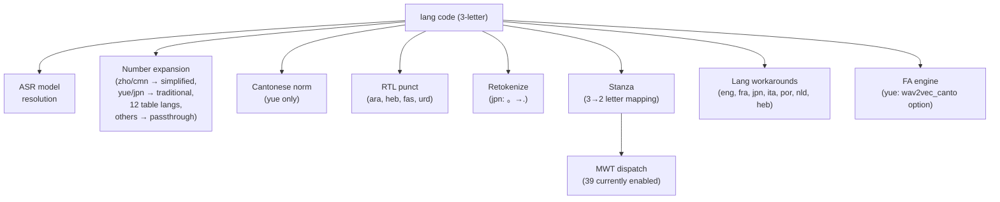

# Language Code Resolution

This page documents how batchalign3 maps language codes to models, Stanza
pipelines, and processing behavior.

## Internal Representation: ISO 639-3

batchalign3 uses **3-letter ISO 639-3 codes** everywhere internally:

- CLI: `--lang=eng`, `--lang=yue`, `--lang=heb`
- CHAT headers: `@Languages: eng`, `@Languages: yue`
- Cache keys, IPC payloads, batch items
- Worker task bootstrap: `python -m batchalign.worker --task morphosyntax --lang eng`

The 3-letter code is the source of truth. Conversion to other formats happens
only at external boundaries.

## ISO 639-3 → ISO 639-1 (Stanza)

Stanza uses 2-letter ISO 639-1 codes. The mapping lives in
`batchalign/worker/_stanza_loading.py`:

```python
{
    "eng": "en", "spa": "es", "fra": "fr", "deu": "de",
    "ita": "it", "por": "pt", "nld": "nl", "zho": "zh",
    "jpn": "ja", "kor": "ko", "ara": "ar", "heb": "he",
    "hin": "hi", "tur": "tr", "fin": "fi", "hun": "hu",
    "pol": "pl", "ces": "cs", "ron": "ro", "bul": "bg",
    "hrv": "hr", "srp": "sr", "slk": "sk", "slv": "sl",
    "ukr": "uk", "lit": "lt", "lav": "lv", "est": "et",
    "cat": "ca", "eus": "eu", "glg": "gl", "ell": "el",
    "ind": "id", "msa": "ms", "vie": "vi", "tha": "th",
    "dan": "da", "nor": "nb", "swe": "sv", "afr": "af",
    "isl": "is",
    "yue": "zh",  # Cantonese → Chinese (Stanza has no yue-specific model)
    "cmn": "zh",  # Mandarin → Chinese
}
```

### Special Mappings

| 3-letter | 2-letter | Notes |
|----------|----------|-------|
| `yue` | `zh` | Cantonese shares Stanza's Chinese model. No yue-specific Stanza model exists. |
| `cmn` | `zh` | Mandarin. Same Stanza model as yue. |
| `heb` | `he` | Hebrew. Stanza's Hebrew model supports HebBinyan/HebExistential features. |

The mapping is exhaustive for supported languages. If an unknown code reaches
the worker, `iso3_to_alpha2()` falls back to the first two characters and logs
a warning before handing that value to Stanza.

## Model Resolution (ASR)

Language-specific ASR model selection only applies to the HuggingFace Whisper
engine (`--asr-engine whisper`). The resolver maps language codes to fine-tuned
models:

| Language | Code | Model | Base/Tokenizer | Size |
|----------|------|-------|----------------|------|
| English | eng | `talkbank/CHATWhisper-en` | `openai/whisper-large-v2` | large-v2 |
| Cantonese | yue | `alvanlii/whisper-small-cantonese` | same | small |
| Hebrew | heb | `ivrit-ai/whisper-large-v3` | same | large-v3 |
| All others | * | `openai/whisper-large-v3` | same | large-v3 |

Other ASR engines ignore language for model selection:
- `--asr-engine whisper-oai`: always `whisper-turbo`
- `--asr-engine whisperx`: always `whisper-large-v2`
- Rev.AI: cloud API, handles language internally

## Model Resolution (UTR)

UTR (Utterance Timing Recovery) has its own model resolution:

| Language | Code | Model |
|----------|------|-------|
| English | eng | `talkbank/CHATWhisper-en-large-v1` |
| All others | * | `openai/whisper-large-v2` |

## Model Resolution (Utterance Segmentation)

| Language | Code | Model |
|----------|------|-------|
| English | eng | `talkbank/CHATUtterance-en` |
| Mandarin | cmn/zho | `talkbank/CHATUtterance-zh_CN` |
| Cantonese | yue | `PolyU-AngelChanLab/Cantonese-Utterance-Segmentation` |
| All others | * | None (punctuation-based fallback) |

## Pipeline Stage Dispatch

The 3-letter code drives behavior at multiple pipeline stages:



## MWT Language Dispatch

Multi-Word Token (MWT) processing is driven by an explicit allowlist in
`batchalign/worker/_stanza_loading.py`.

Current behavior:

- Languages in `MWT_LANGS` load Stanza's `mwt` processor.
- Languages not in that allowlist skip `mwt`.
- Notably, Japanese (`ja`), Korean (`ko`), and Chinese (`zh`) are excluded.
- Thai (`th`), Vietnamese (`vi`), Indonesian (`id`), and Malay (`ms`) are
  currently included because they are present in the live allowlist.

See [Non-English Workarounds](../developer/non-english-workarounds.md) §X1 for the full
dispatch table.

## Whisper Language Strings

Some engines use human-readable language names rather than ISO codes.
The mapping in the worker:

```python
special = {"yue": "Cantonese", "cmn": "chinese"}
```

For all other languages, the worker resolves the ISO-639-3 code through
`pycountry` and passes the lower-cased language name to Whisper.

## Adding a New Language

To add language-specific behavior for a new language:

1. **Stanza mapping** — Add to the ISO 639-3 → 639-1 table in `_stanza_loading.py`
2. **ASR model** — Optionally add a fine-tuned model entry in the resolver
3. **Number expansion** — Add a table to `data/num2lang.json` or handle in
   `num2text.rs`
4. **Utterance segmentation** — Optionally train a BERT boundary model
5. **Morphosyntax workarounds** — Add a `nlp/lang_XX.rs` file if Stanza
   produces systematic errors for this language
6. **MWT dispatch** — Determine if the language uses contractions
