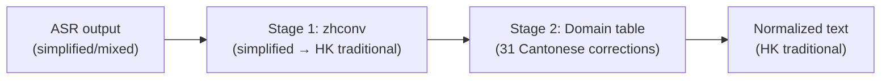
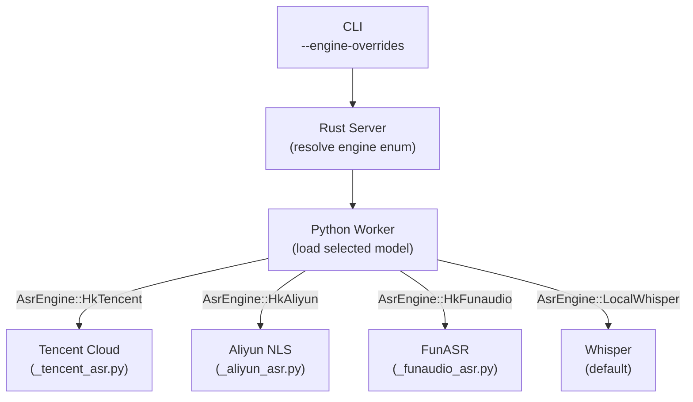

# Cantonese Language Support

**Status:** Current
**Last updated:** 2026-03-23 19:50 EDT

Cantonese (`yue`) has the most extensive language-specific processing in
batchalign3. This page is the single reference for everything Cantonese:
ASR engines, text normalization, word segmentation, forced alignment,
morphosyntax, known limitations, and future work.

## Quick Reference

| Pipeline Stage | Cantonese-Specific Behavior |
|---------------|----------------------------|
| ASR | 4 engine options: Whisper, Tencent Cloud, Aliyun NLS, FunASR/SenseVoice |
| Text normalization | Simplified → HK Traditional + 31-entry domain replacement |
| Number expansion | Traditional Chinese characters (五, 四十二, 一萬) |
| Character tokenization | Per-character splitting for timestamp alignment |
| Word segmentation | PyCantonese `segment()` via `--retokenize` |
| Utterance segmentation | PolyU BERT model (`PolyU-AngelChanLab/Cantonese-Utterance-Segmentation`) |
| Morphosyntax (POS) | PyCantonese POS override (~95% accuracy on core vocabulary) |
| Morphosyntax (depparse) | Stanza Chinese (`zh`) model + trained Cantonese model (65% LAS) |
| Forced alignment | Jyutping romanization (PyCantonese) → Wave2Vec MMS |

---

## ASR Engine Options

Cantonese supports four ASR engines. The default (Whisper) works out of the
box. The alternatives are activated via `--engine-overrides`:

| Engine | Type | Credentials | Word Segmentation | Key Strength |
|--------|------|-------------|-------------------|-------------|
| Whisper | Local | None | Per-character | General-purpose, no setup |
| Tencent Cloud | Cloud | Required | Per-character (verified 2026-03-23) | Speaker diarization |
| Aliyun NLS | Cloud | Required | Per-character | Real-time streaming |
| FunASR/SenseVoice | Local | None | Per-character | No cloud, VAD built-in, low CER |

### Usage Examples

```bash
# Default (Whisper)
batchalign3 transcribe input/ -o output/ --lang yue

# Tencent Cloud ASR (requires credentials)
batchalign3 transcribe input/ -o output/ --lang yue \
  --engine-overrides '{"asr": "tencent"}'

# FunASR local (no credentials needed)
batchalign3 transcribe input/ -o output/ --lang yue \
  --engine-overrides '{"asr": "funaudio"}'

# Cantonese forced alignment
batchalign3 align input/ -o output/ --lang yue \
  --engine-overrides '{"fa": "wav2vec_canto"}'
```

### Credential Configuration

Cloud engines (Tencent, Aliyun) require credentials in `~/.batchalign.ini`:

```ini
[asr]
# Tencent Cloud
engine.tencent.id = YOUR_SECRET_ID
engine.tencent.key = YOUR_SECRET_KEY
engine.tencent.region = ap-guangzhou
engine.tencent.bucket = YOUR_COS_BUCKET

# Aliyun NLS
engine.aliyun.ak_id = YOUR_ACCESS_KEY_ID
engine.aliyun.ak_secret = YOUR_ACCESS_KEY_SECRET
engine.aliyun.ak_appkey = YOUR_APPKEY
```

Missing or empty credentials raise `ConfigError` with a clear message.

### Engine Details

**Tencent Cloud ASR**
- Speaker diarization with configurable count
- Uploads audio to COS, submits ASR job, polls for results (10-min timeout)
- Returns pre-segmented words with per-word timestamps and speaker attribution
- Automatic COS cleanup after job completes

**Aliyun NLS ASR**
- Cantonese only (`lang=yue` required)
- WebSocket streaming with real-time callbacks
- Automatic token refresh (23-hour TTL)
- WAV format required (16 kHz mono)

**FunASR/SenseVoice**
- Local model — no cloud credentials, no network required
- Auto model selection: Paraformer or SenseVoice based on availability
- VAD built in
- Per-character timestamp alignment for Cantonese

**Cantonese Forced Alignment**
- Converts Chinese characters to jyutping romanization (via PyCantonese)
- Strips tone numbers for Wave2Vec compatibility
- Wave2Vec FA on romanized text
- Maps word-level timings back to original characters

---

## Text Normalization

All Cantonese ASR output is automatically normalized regardless of which engine
produced it. No configuration needed — runs whenever `lang=yue`.

### Two-Stage Pipeline



**Stage 1: Simplified → HK Traditional** — Uses the `zhconv` Rust crate
(pure Rust, Aho-Corasick automata from OpenCC + MediaWiki rulesets, 100-200
MB/s). Variant: `ZhHK` (Hong Kong Traditional).

**Stage 2: Domain Replacement Table** — 31 entries for Cantonese-specific
character corrections, applied via Aho-Corasick with leftmost-longest matching:

- **Multi-character (13):** 聯係→聯繫, 真系→真係, 中意→鍾意, 較剪→鉸剪, etc.
- **Single-character (18):** 系→係, 呀→啊, 松→鬆, 吵→嘈, 噶→㗎, etc.

Multi-character patterns are matched before single-character to prevent partial
matches (e.g., `真系` matches before `系` alone).

**Full example:** `你真系好吵呀` → `你真係好嘈啊`

### Origin

The domain replacement table was originally written by Chuqiao Song in
batchalign2's `replace_cantonese_words()` (Python + OpenCC C++ dependency).
Rebuilt in Rust for batchalign3 — no C++ dependency, always available, correct
overlapping pattern handling.

---

## Word Segmentation

FunASR/SenseVoice and Whisper output per-character tokens for Cantonese:
each character becomes a separate word on the main tier. This makes word
counts, MLU, and POS tagging unreliable.

### The `--retokenize` Solution

```bash
batchalign3 morphotag --retokenize corpus/ -o output/ --lang yue
```

This uses PyCantonese's `segment()` to group per-character tokens into words
before Stanza POS tagging:

**Before** (per-character):
```
*CHI:	故 事 係 好 .
%mor:	n|故 n|事 v|係 adj|好 .
```

**After** (`--retokenize`):
```
*CHI:	故事 係 好 .
%mor:	n|故事 v|係 adj|好 .
```

Without `--retokenize`, tokenization is preserved unchanged. A diagnostic
warning is emitted when Cantonese input appears per-character:

```
warn: Cantonese input appears to be per-character tokens (42/50 single-CJK words).
      Consider --retokenize for word-level analysis.
```

### Validation Across All 9 TalkBank Cantonese Corpora

Word segmentation was tested against all 9 Cantonese corpora in TalkBank
(over 737,000 utterances). Results are consistent across corpora:

| Corpus | Multi-char Preservation | Vocabulary Coverage |
|--------|------------------------|-------------------|
| MOST | 84% | 99% |
| LeeWongLeung | 89% | 100% |
| CHCC | 88% | 100% |
| EACMC | 90% | 99% |
| HKU (CHILDES) | 86% | 98% |
| MAIN | 87% | 98% |
| GlobalTales | 85% | 98% |
| Aphasia HKU | 90% | 100% |

Test: `tests/pipelines/morphosyntax/test_cantonese_all_corpora.py`

For full details on CJK word segmentation (including Mandarin), see
[Chinese/Cantonese Word Segmentation](../chinese-word-segmentation.md).

---

## Number Expansion

Cantonese uses **traditional** Chinese number characters:

| Input | Output |
|-------|--------|
| 5 | 五 |
| 42 | 四十二 |
| 10000 | 一萬 (not 一万) |

Implemented via `num2chinese(n, ChineseScript::Traditional)` in Rust.
Runs as Stage 4 of ASR post-processing, before Stage 4b (text normalization).

See [Number Expansion](../number-expansion.md) for the full language table.

---

## Utterance Segmentation

Uses the PolyU BERT model:
`PolyU-AngelChanLab/Cantonese-Utterance-Segmentation`

Falls back to punctuation-based splitting if the model is unavailable.
See [Utterance Segmentation](../utterance-segmentation.md).

---

## Morphosyntax

**Current state:** Cantonese (`yue`) maps to Stanza's Chinese (`zh`) model.
Stanza POS accuracy is ~50% on Cantonese-specific vocabulary (see Known
Limitations). A PyCantonese POS override is applied as post-processing,
which improves core vocabulary (佢哋→PRON, 唔→ADV, 嘢→NOUN) but has its
own gaps (compound nouns, some SFPs, resultative verbs — see below).
Stanza still provides dependency parsing (%gra) and lemmatization.
MWT is not loaded.

**POS-depparse inconsistency:** The PyCantonese POS override changes `upos`
in the UD word dict AFTER Stanza has already computed dependency relations
using its own (wrong) POS. This means %mor tiers have PyCantonese POS but
%gra tiers were computed with Stanza's Mandarin POS. The dependency tree
structure was not recomputed with the corrected POS.

In practice, this is still an improvement: %mor POS was wrong before (50%)
and is now better. %gra was always computed with wrong POS and has not
gotten worse. The proper fix is a Cantonese-specific Stanza model that
handles both POS and depparse jointly (see Open Questions).

---

## Architecture

### Engine Dispatch

Cantonese engines use direct enum dispatch — no plugin system. The Rust server
resolves `--engine-overrides` and passes the selected `AsrEngine`/`FaEngine`
enum to the Python worker at startup:



### Provider Output → CHAT

Each ASR provider returns different structures. The Rust bridge in
`pyo3/src/hk_asr_bridge.rs` normalizes all provider output into a common
`monologues + timed_words` format:

- **Tencent:** `ResultDetail` with pre-segmented `Words` array → absolute
  timestamps computed from segment start + word offset
- **FunASR:** Raw text + per-character timestamps → `cantonese_char_tokens()`
  splits and normalizes, timestamps interpolated
- **Aliyun:** Sentence-level results with optional per-word timing → fallback
  character tokenization when per-word timing unavailable

### Text Normalization is Rust-Only

Python `_common.py` delegates to `batchalign_core.normalize_cantonese()` and
`batchalign_core.cantonese_char_tokens()`. No OpenCC Python dependency.

---

## Known Limitations

### Word segmentation depends on PyCantonese dictionary
PyCantonese uses a dictionary-based segmenter. Words not in its dictionary
(novel compounds, baby talk, code-mixed Cantonese-English) will not be grouped.
Common Cantonese words (`佢哋`, `鍾意`, `故事`) are handled correctly —
verified with real PyCantonese in tests.

### All Cantonese ASR engines produce per-character output
Verified 2026-03-23: Tencent Cloud ASR produces 100% single-character output
for Cantonese (25 CJK words, 0 multi-character, tested on A023 aphasia clip).
This disproves the earlier report that Tencent does word segmentation for
Cantonese. All four engines (Whisper, Tencent, Aliyun, FunASR) produce
per-character tokens. `--retokenize` is needed for all Cantonese morphotag.

### POS tagging accuracy is ~50% on Cantonese vocabulary

**This is the most significant Cantonese limitation.** Stanza's `zh` model is
trained on Mandarin (Chinese Treebank) and misclassifies core Cantonese words:

| Word | Meaning | Correct | Stanza Says |
|------|---------|---------|-------------|
| 佢/佢哋 | he/they | PRON | PROPN |
| 嘢 | thing/stuff | NOUN | PUNCT |
| 唔 | not | ADV | VERB |
| 係 | is/be | AUX | VERB |

Mandarin equivalents (他們, 不, 是) are tagged correctly — the issue is
Cantonese-specific vocabulary absent from the training data.

batchalignHK used `zh-hant` (Traditional Chinese) instead of `zh-hans` but
this is also Mandarin-trained and equally wrong for Cantonese.

**PyCantonese POS override is deployed** as a post-processing step for all
Cantonese morphotag. It corrects core vocabulary (佢哋, 唔, 嘢) but has its
own dictionary gaps: compound nouns (油罐車→X), some SFPs (啦, 呢, 囉→X),
resultative verbs (踢爛→ADJ), and 故事→VERB. Overall accuracy varies by
vocabulary — strong on common Cantonese words, weak on compounds and less
frequent forms.

A Cantonese Stanza model trained on UD_Cantonese-HK achieved 93.9% on the
UD dev set but 86% on our spoken Cantonese test sentences (domain mismatch).
This is better than Stanza zh (62%) but worse than PyCantonese (96%) on core
vocabulary. The trained model may complement PyCantonese for unknown words.

### FunASR CER varies with speech clarity
FunASR/SenseVoice produces the lowest CER for clear adult Cantonese speech,
but CER increases with overlapping speech, soft/unclear speech, and child
speech (per PolyU team observations).

---

## Trained Cantonese Stanza Model

A Cantonese-specific Stanza model was trained on UD_Cantonese-HK (1,004
sentences, 13,918 tokens from City University of Hong Kong). Results on
the held-out UD test set (1,484 tokens):

| Metric | Before (Mandarin model) | After (Cantonese model) | + PyCantonese POS |
|--------|------------------------|------------------------|-------------------|
| POS | 63% | 93.5% | **95%** |
| Dependency (LAS) | 24% | 65.2% | 65% |
| Dependency (UAS) | 40% | 70.4% | 70% |

The model is trained on bilbo but not yet deployed into batchalign3.

### HKCanCor as Additional Training Data

PyCantonese's built-in HKCanCor corpus has 153,656 tokens with POS annotations
(95 Chinese-style tags, 99.6% map cleanly to UD via `hkcancor_to_ud()`). This
could augment POS training by ~10x. However, HKCanCor has **zero dependency
annotations**, so it cannot help with depparse training.

See `docs/investigations/2026-03-23-hkcancor-pos-mapping.md` for the full
mapping analysis.

## Open Questions

1. **Deploy trained Cantonese model into batchalign3** — The model exists on
   bilbo but is not yet integrated into the pipeline. Requires packaging the
   model file and updating `_stanza_loading.py`.

2. **Augment training with HKCanCor** — 153K tokens of spoken Cantonese with
   POS. Would significantly improve POS coverage on spoken vocabulary. Need to
   convert to CoNLL-U format with UD tags.

3. **Is the per-character warning threshold (80%) correct?**
   Chosen without empirical basis. Should be validated against real corpus data.

4. **Daemon warning visibility** — The `tracing::warn!` for per-character input
   fires in the daemon process, not the CLI. Users may not see it. Need to
   surface through SSE events or job results.

---

## Source Files

### Rust
| File | Role |
|------|------|
| `batchalign-chat-ops/src/asr_postprocess/cantonese.rs` | Text normalization (zhconv + domain table) |
| `batchalign-chat-ops/src/asr_postprocess/mod.rs` | Pipeline integration (Stage 4b) |
| `batchalign-chat-ops/src/asr_postprocess/num2chinese.rs` | Number expansion (traditional) |
| `pyo3/src/hk_asr_bridge.rs` | Provider output projection (Tencent, FunASR, Aliyun) |

### Python
| File | Role |
|------|------|
| `inference/hk/_common.py` | Normalization delegates to Rust |
| `inference/hk/_tencent_asr.py` | Tencent Cloud ASR provider |
| `inference/hk/_tencent_api.py` | Tencent SDK transport |
| `inference/hk/_aliyun_asr.py` | Aliyun NLS provider |
| `inference/hk/_funaudio_asr.py` | FunASR/SenseVoice provider |
| `inference/hk/_funaudio_common.py` | FunASR recognizer + model loading |
| `inference/hk/_cantonese_fa.py` | Jyutping romanization + Wave2Vec FA |
| `inference/morphosyntax.py` | `_segment_cantonese()` for word segmentation |
| `worker/_stanza_loading.py` | Stanza pipeline configuration (yue → zh) |

### Tests
| File | Count | Uses Real Models |
|------|-------|-----------------|
| `tests/hk/test_common.py` | 45 | Yes (batchalign_core) |
| `tests/hk/test_funaudio.py` | 20 | No (stubs _run_model) |
| `tests/hk/test_tencent_api.py` | 17 | No (stubs ResultDetail) |
| `tests/hk/test_cantonese_fa.py` | 14 | Yes (real PyCantonese) |
| `tests/hk/test_aliyun.py` | 11 | No (stubs WebSocket) |
| `tests/hk/test_helpers.py` | 7 | Yes (batchalign_core) |
| `tests/hk/test_integration.py` | 19 | Mixed (skips without credentials) |
| `tests/pipelines/morphosyntax/test_cjk_word_segmentation_claims.py` | 9 | Yes (PyCantonese + batchalign_core) |
