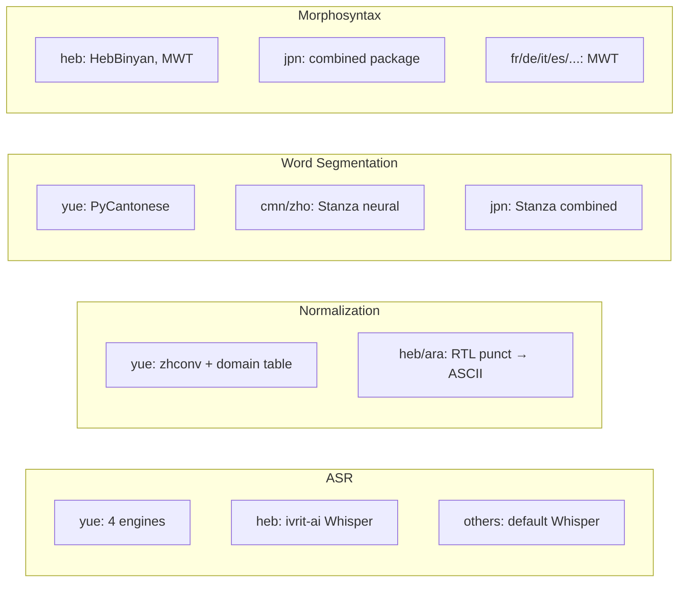

# Language-Specific Support Overview

**Status:** Current
**Last updated:** 2026-03-23 12:15 EDT

batchalign3 processes 50+ languages through Stanza, but several languages have
significant special treatment. This page indexes all language-specific behavior.

## Languages with Dedicated Pages

| Language | Code | Dedicated Page | Key Special Treatment |
|----------|------|---------------|----------------------|
| **Cantonese** | `yue` | [Cantonese](cantonese.md) | 4 ASR engines, text normalization, PyCantonese word segmentation, jyutping FA |
| **Mandarin** | `cmn`/`zho` | [Mandarin](mandarin.md) | Stanza neural word segmentation, Chinese number expansion |
| **Japanese** | `jpn` | [Japanese](japanese.md) | Stanza `combined` package, retokenize merge/split |
| **Hebrew** | `heb` | [Hebrew](hebrew.md) | Fine-tuned Whisper, RTL punctuation, HebBinyan/HebExistential features |

## Special Treatment by Pipeline Stage

## Languages with MWT (Multi-Word Token) Processing

These languages load Stanza's MWT processor for contraction expansion:

`fr`, `de`, `it`, `es`, `pt`, `ca`, `cs`, `pl`, `nl`, `ar`, `tr`, `fi`,
`lv`, `lt`, `sk`, `uk`, `sv`, `nb`, `nn`, `is`, `gl`, `cy`, `gd`, `mt`,
`ka`, `hy`, `fa`, `hi`, `ur`, `bn`, `ta`, `te`, `kn`, `ml`, `th`, `vi`,
`id`, `ms`, `tl`

## Languages Excluded from MWT

These use `tokenize_pretokenized=True` (no MWT processor):

`zh` (Chinese/Cantonese/Mandarin), `ja` (Japanese), `ko` (Korean),
`hr`, `sl`, `sr`, `bg`, `ru`, `et`, `hu`, `eu`, `el`, `he`, `af`,
`ga`, `da`

## Number Expansion Coverage

12 languages have dedicated number expansion tables in `num2lang.json`:

| Language | Format |
|----------|--------|
| English, Spanish, French, German, Italian, Portuguese, Dutch, Danish, Swedish, Norwegian, Finnish, Turkish | `num2words` library tables |
| Chinese (Simplified) | `num2chinese` (一万) |
| Chinese (Traditional) | `num2chinese` (一萬) |
| Japanese | `num2chinese` with Japanese reading |

All other languages pass digits through unexpanded.

## See Also

- [Language-Specific Processing](../language-specific-processing.md) — pipeline-stage-level overview
- [Language Code Resolution](../language-code-resolution.md) — ISO 639-3 to Stanza mapping
- [Language Data Model](../language-handling.md) — `@Languages` header and per-file language routing
