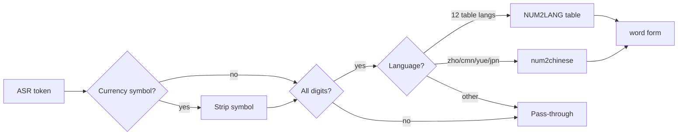

# Number Expansion

**Date:** 2026-03-10

Number expansion converts digit strings in ASR output to their language-
appropriate word forms. This runs as Stage 4 of the ASR post-processing
pipeline in Rust (`batchalign-chat-ops/src/asr_postprocess/`).

## Overview

ASR models frequently output digit strings ("5", "42", "1000") instead of
word forms. CHAT transcription convention requires word forms, so the pipeline
expands them.



## Expansion Chain

The expansion logic in `num2text.rs`:

1. If the word has a **currency symbol** (`$`, `€`, `£`, `¥`, `₹`, `₩`, `₽`)
   → strip symbol, expand digits, append currency word
2. If the word is **not all digits** → return unchanged
3. If it contains **dashes** (21-22, 5—6) → split, expand each part
4. If the language is **Chinese/Japanese/Cantonese** → `num2chinese()`
5. If the language has a **NUM2LANG table** → exact lookup, then integer
   decomposition for larger numbers
6. Otherwise → return the original digit string

## Currency Symbol Handling

**Added:** 2026-03-10 — fixes E220 validation failures on the production server.

ASR models produce tokens like `$12`, `€50`, `£5`. Before this fix, the
`is_ascii_digit()` guard rejected these (they contain non-digit characters),
so they passed through unexpanded, causing E220 ("numeric digits in word")
validation failures.

The `try_expand_currency()` function strips currency symbols, expands the
digit portion, and appends the currency name in English:

```
"$12"   → "twelve dollars"
"€50"   → "fifty euros"
"£5"    → "five pounds"
"¥1000" → "one thousand yen"
"50€"   → "fifty euros"       (suffix form)
```

### Supported Symbols

| Symbol | Currency | Position |
|--------|----------|----------|
| `$` | dollars | prefix |
| `€` | euros | prefix + suffix |
| `£` | pounds | prefix |
| `¥` | yen | prefix |
| `₹` | rupees | prefix + suffix |
| `₩` | won | prefix |
| `₽` | rubles | prefix |

Currency names are always in English regardless of the target language —
matching the behavior of ASR models that produce these tokens.

## Chinese Character Conversion (`num2chinese.rs`)

Converts integers to Chinese character representations. Supports values from
0 to 10^48.

### Script Selection

| Language | Code | Script | Example (10000) |
|----------|------|--------|-----------------|
| Mandarin | zho, cmn | Simplified | 一万 |
| Cantonese | yue | Traditional | 一萬 |
| Japanese | jpn | Traditional | 一萬 |

Simplified and Traditional share the same digits (零一二三四五六七八九) and
small units (十百千). They **only differ at 10,000 and above**:

| Unit | Simplified | Traditional |
|------|------------|-------------|
| 万 (10⁴) | 万 | 萬 |
| 亿 (10⁸) | 亿 | 億 |
| 兆 (10¹²) | 兆 | 兆 |
| 沟 (10³²) | 沟 | 溝 |
| 涧 (10³⁶) | 涧 | 澗 |
| 正 (10⁴⁰) | 正 | 正 |
| 载 (10⁴⁴) | 载 | 載 |

### Algorithm

The algorithm groups digits into 4-digit groups from the right:

1. Split number into groups of 4 digits: `12345` → `[1, 2345]`
2. Convert each group to Chinese characters with units (千百十)
3. Join groups with large-unit separators (万/萬, 亿/億, etc.)
4. Insert 零 placeholders for internal zeros: 101 → 一百零一

Special case: leading 1 in the tens position omits 一: 10 → 十 (not 一十),
but only when there are no preceding groups. 10000 → 一万 (not 万).

### Examples

| Input | Simplified | Traditional |
|-------|------------|-------------|
| 0 | 零 | 零 |
| 10 | 十 | 十 |
| 42 | 四十二 | 四十二 |
| 101 | 一百零一 | 一百零一 |
| 1001 | 一千零一 | 一千零一 |
| 10000 | 一万 | 一萬 |
| 10001 | 一万零一 | 一萬零一 |
| 99999 | 九万九千九百九十九 | 九萬九千九百九十九 |

### Interaction with Cantonese Normalization

Number expansion (Stage 4) runs **before** Cantonese normalization (Stage 4b).
For Cantonese, numbers are expanded using traditional characters, then the
normalization pass runs on the full text. Since `num2chinese` already produces
correct traditional characters, the normalization is a no-op for numerals.

## Table-Based Expansion (NUM2LANG)

For non-CJK languages, number expansion uses pre-built lookup tables loaded
from `data/num2lang.json` at compile time.

### Supported Languages (12)

| Code | Language | Example: 5 |
|------|----------|------------|
| deu | German | fünf → eins, zehn, etc. |
| ell | Greek | πέντε |
| eng | English | five |
| eus | Basque | bost |
| fra | French | cinq |
| hrv | Croatian | pet |
| ind | Indonesian | lima |
| jpn | Japanese | (handled by num2chinese, not table) |
| nld | Dutch | vijf |
| por | Portuguese | cinco |
| spa | Spanish | cinco |
| tha | Thai | ห้า |

Note: Japanese appears in both systems. For digits, `num2chinese` (traditional)
takes priority. The NUM2LANG table for Japanese is a fallback that does not
normally activate.

### Table Algorithm

The table maps number strings ("1", "10", "100", etc.) to word forms. The
algorithm uses a two-step approach:

1. **Exact table lookup** — if the digit string matches a table key exactly
   (e.g., "42" → "forty two"), return the value directly.

2. **Integer decomposition** — parse the digit string as an integer, then
   greedily decompose using the largest table entries first. For entries
   ≥ 100, compute `multiplier × base + remainder` recursively. For entries
   < 100, subtract and continue.

```
decompose(1234):
  1234 / 1000 = 1 × "thousand" → "one thousand"
  remainder 234 / 100 = 2 × "hundred" → "two hundred"
  remainder 34: exact lookup → "thirty four"
  result: "one thousand two hundred thirty four"
```

**History:** Before 2026-03-10, this used reverse-order substring replacement,
which had a critical bug: "12" would match "1" first, producing "onetwo"
instead of "twelve". The decomposition algorithm fixes this by always trying
exact lookup before breaking numbers apart.

### Dash-Separated Numbers

Numbers connected by dashes (e.g., "21-22", "5—6") are split and each part
is expanded independently:

- "21-22" → "twenty-one twenty-two"
- "5—6" → "five six" (em-dashes normalized to hyphens)

Only splits when **all parts are pure digit strings**. Mixed strings like
"quatre-vingt" (French for 80) pass through unchanged.

## Source Files

| File | Purpose |
|------|---------|
| `asr_postprocess/num2text.rs` | Entry point, table-based expansion, language dispatch |
| `asr_postprocess/num2chinese.rs` | Chinese character conversion (simplified + traditional) |
| `data/num2lang.json` | 12-language number lookup tables |

## Test Coverage

- Property tests (proptest): non-digit passthrough, idempotence, single-digit
  expansion, empty string
- Golden tests: English, Spanish, German, French, Chinese simplified,
  Japanese traditional, with-zeros
- Dash separation and em-dash normalization
- Unknown language passthrough
- All 12 NUM2LANG tables verified as present
- Currency expansion: `$5`, `$100`, `€50`, `50€`, `£5`, `¥1000`, `$13` (Spanish),
  bare `$`, `$abc` (invalid)
- Integer decomposition regression: `12`→"twelve" (not "onetwo"),
  `10000`→"ten thousand", `250`→"two hundred fifty", `1234`, `$12` Spanish
