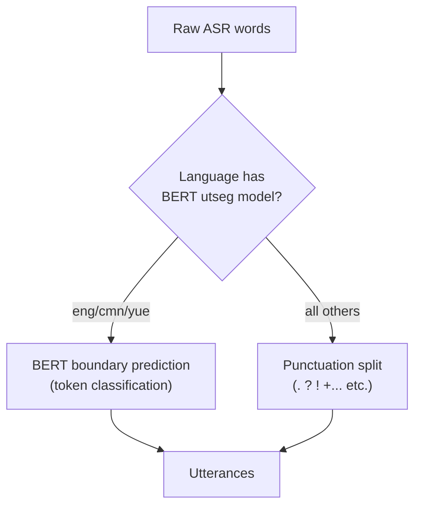

# Utterance Segmentation

**Status:** Current
**Last updated:** 2026-03-14

Utterance segmentation splits continuous ASR output into individual utterances
for CHAT transcription. This is a critical step — CHAT requires one utterance
per line, each terminated by a sentence-ending punctuation mark.

## Two Mechanisms

batchalign3 has two utterance segmentation mechanisms:

1. **BERT-based models** — trained to predict utterance boundaries in
   continuous speech. Available for 3 languages.
2. **Punctuation-based fallback** — splits on sentence-ending punctuation.
   Used for all other languages.



## BERT Utterance Models

| Language | Code | Model | Source | Architecture |
|----------|------|-------|--------|--------------|
| English | eng | `talkbank/CHATUtterance-en` | TalkBank fine-tuned | BERT token classification |
| Mandarin | cmn/zho | `talkbank/CHATUtterance-zh_CN` | TalkBank fine-tuned | BERT token classification |
| Cantonese | yue | `PolyU-AngelChanLab/Cantonese-Utterance-Segmentation` | Hong Kong Polytechnic | BERT token classification |

These models predict utterance boundaries as a token classification task:
each token receives a label indicating whether it starts a new utterance,
continues the current one, or ends with specific punctuation.

### Cantonese Model Details

The Cantonese model uses character-level tokenization (each Chinese character
is a separate token) and predicts 6 action classes:

| Class | Meaning |
|-------|---------|
| 0 | Normal (continue) |
| 1 | Capitalize next |
| 2 | Period (.) |
| 3 | Question mark (?) |
| 4 | Exclamation mark (!) |
| 5 | Comma (,) |

Before feeding text to the model, Cantonese-specific preprocessing runs:
- Strip punctuation: `.` `,` `!` `！` `？` `。` `，` `?` `（` `）` `：` `＊`
- Split on Cantonese sentence-final particles: 呀, 啦, 喎, 嘞, 㗎喇, 囉, 㗎, 啊, 嗯
- Feed each chunk to the BERT model as character-level tokens

### Memory Footprint

Each BERT utterance model is ~400 MB. It is loaded alongside the ASR model
(~3 GB for Whisper), so the total for ASR + utseg is ~3.4 GB.

## Punctuation-Based Fallback

For languages without a dedicated BERT model, utterances are split by
punctuation in Rust (`batchalign-chat-ops/src/asr_postprocess/mod.rs`).

### CHAT-Legal Sentence Terminators

```
.  ?  !  +...  +/.  +//.  +/?  +!?  +"/.  +".  +//?  +..?  +.  ...  (.)
```

### Additional Normalizations

Before splitting:
- Japanese period (。) → `.`
- Spanish inverted punctuation (¿, ¡) → removed
- RTL punctuation (؟, ۔, ،, ؛) → ASCII equivalents

### Split Rules

1. If a word **is** a terminator → flush the current utterance
2. If a word **ends with** a terminator character → split the word, flush
3. If no terminator is found → auto-append `.` at the end
4. Trailing morphological punctuation (‡, „, ,) is stripped before flush

### Long Turn Splitting

Before punctuation-based retokenization, monologues longer than 300 words are
split into chunks of 300. This prevents excessively long utterances when ASR
output lacks punctuation.

## Stanza Utterance Segmentation (morphotag pipeline)

Separately from ASR post-processing, the `utseg` NLP task uses **Stanza's
constituency parser** to predict utterance boundaries during morphosyntax
processing. On the live worker boundary, Rust freezes a prepared-text batch and
dispatches `execute_v2(task="utseg")`; `_text_v2.py` then calls the Stanza
constituency helper to return raw parse trees for Rust-side boundary
assignment.

This is a different mechanism from the BERT models above — it operates on
already-segmented text and can refine boundaries using syntactic structure.
It runs as part of the `morphotag` command, not the `transcribe` command.

## Why Only 3 Languages Have Models

Training utterance segmentation models requires large amounts of annotated
conversational data with gold-standard utterance boundaries. TalkBank has
this for English (extensive CHILDES/TalkBank corpora), Mandarin (growing
corpus), and Cantonese (PolyU research corpus).

For other languages, the punctuation-based fallback produces acceptable
results because ASR models (especially Whisper) tend to insert punctuation at
natural utterance boundaries. The main limitation is run-on speech without
clear sentence structure — the fallback will produce fewer, longer utterances.

## Adding a New Language Model

To add utterance segmentation for a new language:

1. Collect annotated conversational data with utterance boundaries
2. Fine-tune a BERT token classification model (6 classes: normal, capitalize,
   period, question, exclamation, comma)
3. Upload to HuggingFace Hub
4. Add the model-loading hook in `batchalign/worker/_stanza_loading.py`
5. Add any language-specific preprocessing (e.g., character-level tokenization
   for CJK, particle-based chunking)

## Source Files

| File | Purpose |
|------|---------|
| `batchalign-chat-ops/src/asr_postprocess/mod.rs` | Punctuation-based retokenization |
| `batchalign/worker/_stanza_loading.py` | Utseg Stanza config loading and language dispatch |
| `batchalign/inference/utseg.py` | Stanza constituency-based utseg |
