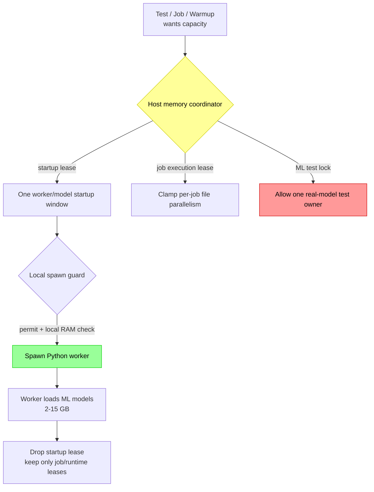
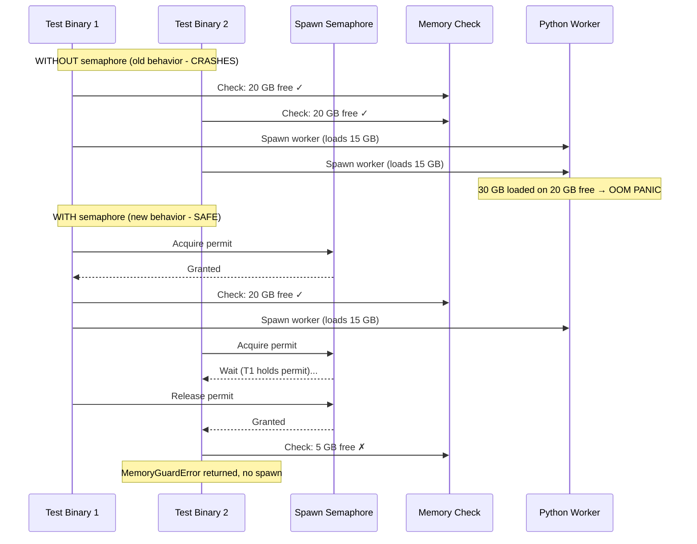

# Memory Safety: Preventing Kernel OOM Crashes

**Status:** Current
**Last updated:** 2026-03-21 13:17 EDT

## The Problem

Each Python ML worker loads 2–15 GB of models (Whisper, Stanza, etc.). When
multiple workers spawn concurrently — from parallel test binaries, warmup, or
job dispatch — they collectively exceed physical RAM and trigger a **kernel-level
OOM panic** that crashes the entire machine. This is not a process-level OOM
kill; it is a Jetsam-triggered kernel panic that requires a hard reboot.

**Crash history:**
- 2026-03-21: 5 python3.12 workers × 13-15 GB each = 71 GB on 64 GB machine
- 2026-03-19: 47-file transcription with default auto-tuner exhausted 64 GB
- Multiple earlier incidents (see `docs/postmortems/`)

## Architecture



## Defense Layers

### Layer 1: Host-wide coordinator (prevents cross-process overcommit)

A machine-local JSON ledger guarded by an exclusive file lock coordinates memory
across local `batchalign3` processes on the same host. This covers:

- multiple server ports,
- CLI auto-daemons,
- warmup vs foreground jobs,
- independent Rust test binaries.

The coordinator tracks three lease types:

- **worker startup leases** for the model-loading spike,
- **job execution leases** for in-flight file parallelism,
- **machine-wide ML test locks** so real-model test runs do not stampede the host.

The reserve/headroom policy comes from `ServerConfig.memory_gate_mb`, which now
means "keep at least this much RAM free after reservations" rather than a
standalone job gate. The default is now **8192 MB**, not 2048.

### Layer 2: Spawn semaphore (prevents in-process TOCTOU race)

A process-global `tokio::sync::Semaphore` serializes all worker spawns. This
still matters even with the host-wide coordinator because one server process can
otherwise race with itself:



**Location:** `crates/batchalign-app/src/worker/memory_guard.rs`

### Layer 3: Explicit startup reservations (before every worker spawn)

Worker startup budgets are now explicit profile-shaped constants from
`runtime_constants.toml`:

- GPU worker startup: **16000 MB**
- Stanza worker startup: **12000 MB**
- IO worker startup: **4000 MB**

These are intentionally more conservative than the per-command execution budgets.
They protect the model-loading spike where Whisper, Stanza, or related engines
can temporarily consume far more memory than steady-state request handling.

**Note:** On macOS, `sysinfo::available_memory()` undercounts because it only
reports free + purgeable pages, not inactive pages. The kernel can reclaim
inactive pages, so the real headroom is larger. We use the conservative number.

### Layer 4: Job execution reservations (before a job starts running)

The runner no longer uses a separate `memory_gate()` plus independent
memory-based auto-tune formula. Instead it:

1. computes a **requested** worker count from file count, CPU, and category caps,
2. asks the host coordinator for a **job execution plan**,
3. receives a granted worker count plus a lease held for the job lifetime,
4. re-queues the job if the host cannot safely fit that plan.

This makes worker startup and job execution share one memory story instead of
two unrelated heuristics.

### Layer 5: Machine-wide ML test lock

The live ML fixture now acquires a machine-wide test lock before preparing warm
workers. This prevents concurrent `cargo test`, IDE, or nextest runs from each
building their own model pool on the same machine.

This lock complements, rather than replaces:

- `RUST_TEST_THREADS=1`,
- the nextest ML test group,
- the single-binary `ml_golden` layout.

### Layer 6: SIGKILL Follow-Through in Drop

Both `WorkerHandle::Drop` and `SharedGpuWorker::Drop` now send SIGTERM, wait
200ms, then send SIGKILL if the worker is still alive. This prevents zombie
Python processes when the worker is stuck in a C extension (PyTorch, NumPy)
that ignores SIGTERM.

### Layer 7: Periodic Orphan Reaping

The health check background task now calls `reap_orphaned_workers()` on every
tick (default: 30s). This catches orphaned workers from server crashes without
waiting for the next server restart. Previously, orphans only got cleaned up
when a new server instance started.

### Layer 8: Test-level skip (bail out before any setup)

Every test file that spawns workers has a `require_python!()` macro that checks
available memory BEFORE attempting to spawn:

```rust
macro_rules! require_python {
    () => {{
        let available_mb = batchalign_app::worker::memory_guard::available_memory_mb();
        if available_mb < 4096 {
            eprintln!("SKIP: insufficient memory ({available_mb} MB)");
            return;
        }
        // ... resolve python path ...
    }};
}
```

### Layer 9: Test isolation (default `make test-rust` skips integration tests)

The Makefile `test-rust` target only runs `--lib` tests (pure Rust, no Python).
Integration tests that spawn workers are opt-in:

```bash
make test-rust       # SAFE: 1,273 library tests, no Python
make test-workers    # Worker tests with --test-threads=1
make test-ml         # ML model tests — net only (256 GB)
```

## Environment Variables

| Variable | Default | What it does |
|----------|---------|--------------|
| `BATCHALIGN_SPAWN_MIN_MEMORY_MB` | `4096` | Minimum free RAM (MB) to allow a worker spawn |
| `BATCHALIGN_MAX_CONCURRENT_SPAWNS` | `1` | Max concurrent worker spawns (semaphore size) |
| `BATCHALIGN_HOST_MEMORY_LEDGER` | temp-dir path | Override the shared host-memory ledger path |
| `RUST_TEST_THREADS` | `1` | Max parallel test threads (set in `.cargo/config.toml`) |

## Key config knobs

| Setting | Default | What it does |
|---------|---------|--------------|
| `memory_gate_mb` | `8192` | Host reserve/headroom preserved after reservations |
| `max_concurrent_worker_startups` | `1` | Host-wide limit for simultaneous worker/model startups |
| `gpu_thread_pool_size` | `4` | In-process GPU request concurrency, now forwarded into Python |

## How to Run Tests Safely

### On a developer machine (64 GB)

```bash
# Always safe — pure Rust, no Python, no ML
make test-rust

# Worker tests (test-echo mode, no ML models) — safe with memory guard
# These spawn real Python workers but in test-echo mode (no model loading)
make test-workers

# NEVER run ML golden tests on a 64 GB machine
# make test-ml  ← DO NOT RUN
```

### On net (256 GB, M3 Ultra)

```bash
# All tests including ML golden
make test-rust && make test-workers && make test-ml
```

### Running a specific integration test

```bash
# Single test binary, single thread, memory guard active
cargo test -p batchalign-app --test worker_integration -- --test-threads=1

# Run only ignored tests (if any)
cargo test -p batchalign-app --test worker_integration -- --ignored --test-threads=1
```

## What NOT to Do

```bash
# NEVER: runs ALL test binaries in parallel, each spawning workers
cargo test -p batchalign-app --tests

# NEVER: same problem, workspace-wide
cargo test --workspace

# NEVER: nextest runs binaries in parallel by default
cargo nextest run -p batchalign-app
```

## Implementation Files

| File | What |
|------|------|
| `crates/batchalign-app/src/host_memory.rs` | Host-wide ledger, startup leases, job execution leases, ML test lock |
| `crates/batchalign-app/src/worker/memory_guard.rs` | Local spawn semaphore plus host-memory startup reservation |
| `crates/batchalign-app/src/worker/handle.rs` | `WorkerHandle::spawn()` and `spawn_tcp_daemon()` call `acquire_spawn_permit()` |
| `crates/batchalign-app/src/runner/mod.rs` | Coordinator-backed job execution planning and requeue |
| `crates/batchalign-app/tests/common/mod.rs` | Machine-wide ML fixture lock |
| `crates/batchalign-app/tests/worker_integration.rs` | `require_python!` macro with memory check |
| `crates/batchalign-app/tests/gpu_concurrent_dispatch.rs` | Same |
| `crates/batchalign-app/tests/worker_protocol_matrix.rs` | Same |
| `.cargo/config.toml` | `RUST_TEST_THREADS = "1"` |
| `Makefile` | Tiered test targets: `test-rust`, `test-workers`, `test-ml` |
