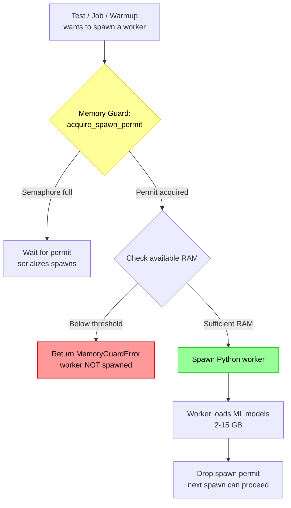
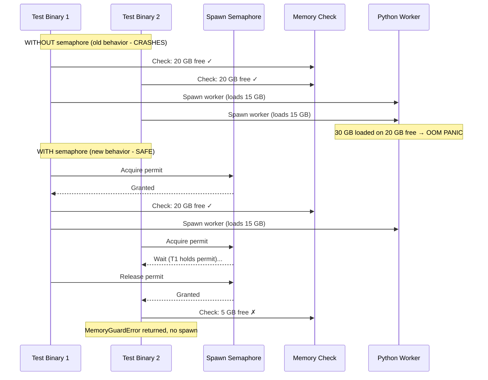

# Memory Safety: Preventing Kernel OOM Crashes

**Status:** Current
**Last updated:** 2026-03-21 12:30

## The Problem

Each Python ML worker loads 2–15 GB of models (Whisper, Stanza, etc.). When
multiple workers spawn concurrently — from parallel test binaries, warmup, or
job dispatch — they collectively exceed physical RAM and trigger a **kernel-level
OOM panic** that crashes the entire machine. This is not a process-level OOM
kill; it is a Jetsam-triggered kernel panic that requires a hard reboot.

**Crash history:**
- 2026-03-21: 5 python3.12 workers × 13-15 GB each = 71 GB on 64 GB machine
- 2026-03-19: 47-file transcription with default auto-tuner exhausted 64 GB
- Multiple earlier incidents (see `docs/postmortems/`)

## Architecture



## Defense Layers

### Layer 1: Spawn Semaphore (prevents TOCTOU race)

A process-global `tokio::sync::Semaphore` serializes all worker spawns. This
prevents the critical race condition:



**Location:** `crates/batchalign-app/src/worker/memory_guard.rs`

Default: `max_concurrent_spawns = 1` (fully serialized).
Override: `BATCHALIGN_MAX_CONCURRENT_SPAWNS=N`

### Layer 2: Memory Check (before every spawn)

After acquiring the semaphore permit, the guard queries `sysinfo::available_memory()`
and refuses the spawn if below the threshold.

**Default threshold:** 4096 MB (4 GB)
**Override:** `BATCHALIGN_SPAWN_MIN_MEMORY_MB=8192`

**Note:** On macOS, `sysinfo::available_memory()` undercounts because it only
reports free + purgeable pages, not inactive pages. The kernel can reclaim
inactive pages, so the real headroom is larger. We use the conservative number.

### Layer 3: Test-Level Skip (bail out before any setup)

Every test file that spawns workers has a `require_python!()` macro that checks
available memory BEFORE attempting to spawn:

```rust
macro_rules! require_python {
    () => {{
        let available_mb = batchalign_app::worker::memory_guard::available_memory_mb();
        if available_mb < 4096 {
            eprintln!("SKIP: insufficient memory ({available_mb} MB)");
            return;
        }
        // ... resolve python path ...
    }};
}
```

### Layer 4: Test Isolation (default `make test-rust` skips integration tests)

The Makefile `test-rust` target only runs `--lib` tests (pure Rust, no Python).
Integration tests that spawn workers are opt-in:

```bash
make test-rust       # SAFE: 1,273 library tests, no Python
make test-workers    # Worker tests with --test-threads=1
make test-ml         # ML model tests — net only (256 GB)
```

## Environment Variables

| Variable | Default | What it does |
|----------|---------|--------------|
| `BATCHALIGN_SPAWN_MIN_MEMORY_MB` | `4096` | Minimum free RAM (MB) to allow a worker spawn |
| `BATCHALIGN_MAX_CONCURRENT_SPAWNS` | `1` | Max concurrent worker spawns (semaphore size) |
| `RUST_TEST_THREADS` | `1` | Max parallel test threads (set in `.cargo/config.toml`) |

## How to Run Tests Safely

### On a developer machine (64 GB)

```bash
# Always safe — pure Rust, no Python, no ML
make test-rust

# Worker tests (test-echo mode, no ML models) — safe with memory guard
# These spawn real Python workers but in test-echo mode (no model loading)
make test-workers

# NEVER run ML golden tests on a 64 GB machine
# make test-ml  ← DO NOT RUN
```

### On net (256 GB, M3 Ultra)

```bash
# All tests including ML golden
make test-rust && make test-workers && make test-ml
```

### Running a specific integration test

```bash
# Single test binary, single thread, memory guard active
cargo test -p batchalign-app --test worker_integration -- --test-threads=1

# Run only ignored tests (if any)
cargo test -p batchalign-app --test worker_integration -- --ignored --test-threads=1
```

## What NOT to Do

```bash
# NEVER: runs ALL test binaries in parallel, each spawning workers
cargo test -p batchalign-app --tests

# NEVER: same problem, workspace-wide
cargo test --workspace

# NEVER: nextest runs binaries in parallel by default
cargo nextest run -p batchalign-app
```

## Implementation Files

| File | What |
|------|------|
| `crates/batchalign-app/src/worker/memory_guard.rs` | Spawn semaphore, memory check, `bail_if_low_memory!` macro |
| `crates/batchalign-app/src/worker/handle.rs` | `WorkerHandle::spawn()` and `spawn_tcp_daemon()` call `acquire_spawn_permit()` |
| `crates/batchalign-app/tests/worker_integration.rs` | `require_python!` macro with memory check |
| `crates/batchalign-app/tests/gpu_concurrent_dispatch.rs` | Same |
| `crates/batchalign-app/tests/worker_protocol_matrix.rs` | Same |
| `.cargo/config.toml` | `RUST_TEST_THREADS = "1"` |
| `Makefile` | Tiered test targets: `test-rust`, `test-workers`, `test-ml` |
